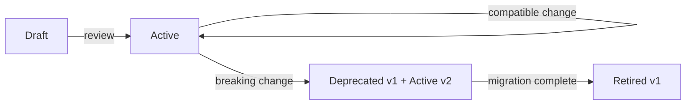

# Data Contracts

## Context & Problem

A data producer changes a column type from `integer` to `string`. Downstream consumers — dashboards, ML models, analytics queries — break silently or produce wrong results. Nobody is notified until a user reports incorrect numbers.

Data contracts formalize the agreement between data producers and consumers. Like API contracts, they define the schema, quality guarantees, and SLAs for a data interface. Breaking a contract is a deliberate, coordinated action — not an accident.

## Design Decisions

### What a Data Contract Covers

| Aspect | What It Specifies | Example |
|---|---|---|
| **Schema** | Field names, types, nullability | `price: Decimal(18,8), NOT NULL` |
| **Semantics** | What fields mean | `mid = (bid + ask) / 2` |
| **Quality** | Freshness, completeness, accuracy | `< 0.01% null values, updated within 5 min` |
| **SLA** | Availability, latency | `99.9% uptime, p99 < 100ms` |
| **Ownership** | Who is responsible | `market-data-team@company.com` |
| **Evolution** | How changes are managed | `Backward compatible only, 30-day deprecation` |

### Contract Definition

```yaml
# contracts/market-data/prices.yaml

contract:
  name: market-data-prices
  version: 2
  owner: market-data-team
  description: Real-time price quotes for all instruments

schema:
  type: record
  fields:
    - name: instrument_id
      type: string
      description: Unique instrument identifier
      constraints:
        - not_null
        - pattern: "^[A-Z0-9]{1,32}$"
    - name: bid
      type: decimal(18,8)
      constraints: [not_null, positive]
    - name: ask
      type: decimal(18,8)
      constraints: [not_null, positive, gte_field:bid]
    - name: mid
      type: decimal(18,8)
      constraints: [not_null, positive]
      semantics: "(bid + ask) / 2"
    - name: timestamp
      type: timestamp_tz
      constraints: [not_null, not_future]
    - name: source
      type: string
      constraints: [not_null, enum: [bloomberg, reuters, internal]]

quality:
  freshness:
    max_delay: 5m
    check_interval: 1m
  completeness:
    min_ratio: 0.999
    window: 1h
  uniqueness:
    keys: [instrument_id, timestamp]

sla:
  availability: 99.9%
  latency_p99: 100ms

evolution:
  compatibility: backward
  deprecation_notice: 30d
```

### Enforcement

Contracts are enforced at multiple levels:

**1. At production time — schema validation:**

```python
from pydantic import BaseModel, field_validator
from decimal import Decimal
from datetime import datetime


class PriceContract(BaseModel):
    """Enforces the price data contract at the producer."""
    instrument_id: str
    bid: Decimal
    ask: Decimal
    mid: Decimal
    timestamp: datetime
    source: str

    @field_validator("ask")
    @classmethod
    def ask_gte_bid(cls, v, info):
        if "bid" in info.data and v < info.data["bid"]:
            raise ValueError("ask must be >= bid")
        return v

    @field_validator("mid")
    @classmethod
    def mid_is_average(cls, v, info):
        if "bid" in info.data and "ask" in info.data:
            expected = (info.data["bid"] + info.data["ask"]) / 2
            if abs(v - expected) > Decimal("0.00000001"):
                raise ValueError("mid must equal (bid + ask) / 2")
        return v

    @field_validator("source")
    @classmethod
    def valid_source(cls, v):
        if v not in {"bloomberg", "reuters", "internal"}:
            raise ValueError(f"Invalid source: {v}")
        return v
```

**2. At consumption time — quality monitoring:**

```python
class ContractMonitor:
    """Runs periodic quality checks against the contract."""

    async def check_freshness(self, contract: dict) -> bool:
        max_delay = parse_duration(contract["quality"]["freshness"]["max_delay"])
        latest = await self._store.get_latest_timestamp()
        age = datetime.utcnow() - latest
        return age <= max_delay

    async def check_completeness(self, contract: dict) -> bool:
        window = parse_duration(contract["quality"]["completeness"]["window"])
        min_ratio = contract["quality"]["completeness"]["min_ratio"]
        stats = await self._store.get_completeness_stats(window)
        return stats.non_null_ratio >= min_ratio

    async def run_all_checks(self, contract: dict) -> list[CheckResult]:
        results = []
        results.append(CheckResult("freshness", await self.check_freshness(contract)))
        results.append(CheckResult("completeness", await self.check_completeness(contract)))
        return results
```

**3. In CI — contract compatibility:**

```bash
# Check that schema changes are backward compatible
python -m contract_checker \
  --old contracts/market-data/prices.yaml@main \
  --new contracts/market-data/prices.yaml \
  --mode backward
```

### Contract Testing

Producers test that they satisfy their contracts. Consumers test that they can handle the contracted schema:

```python
# Producer test
async def test_producer_satisfies_contract():
    """Verify that produced data matches the contract schema."""
    prices = await producer.get_latest_prices(["AAPL", "MSFT"])
    for price in prices:
        # This will raise if the data violates the contract
        PriceContract.model_validate(price)


# Consumer test
async def test_consumer_handles_contract_schema():
    """Verify that the consumer can process contract-compliant data."""
    sample = PriceContract(
        instrument_id="AAPL",
        bid=Decimal("150.00"),
        ask=Decimal("150.10"),
        mid=Decimal("150.05"),
        timestamp=datetime.utcnow(),
        source="bloomberg",
    )
    result = await consumer.process(sample.model_dump())
    assert result.success
```

## Contract Lifecycle



1. **Draft** — contract proposed, under review
2. **Active** — contract in production, enforced
3. **Deprecated** — contract still honored, but consumers should migrate to new version
4. **Retired** — contract no longer honored, all consumers migrated

## Failure Modes

| Failure | Cause | Mitigation |
|---|---|---|
| Contract violated silently | No enforcement, contract is just documentation | Automated enforcement at producer and consumer |
| Stale contract | Schema evolved, contract not updated | CI check that contract matches actual schema |
| Over-specified contract | Contract is too strict, blocks valid changes | Contract specifies what matters to consumers, not every detail |
| No consumers tracked | Contract broken but unclear who is affected | Consumer registry, explicit subscription to contracts |

## Related Documents

- [Data Mesh](data-mesh.md) — data products with contractual interfaces
- [Contract-First Design](../principles/contract-first-design.md) — the principle behind contracts
- [Schema Registry](../patterns/messaging/schema-registry.md) — Kafka event contracts
- [Data Quality Validation](../patterns/data-processing/data-quality-validation.md) — enforcing quality rules
