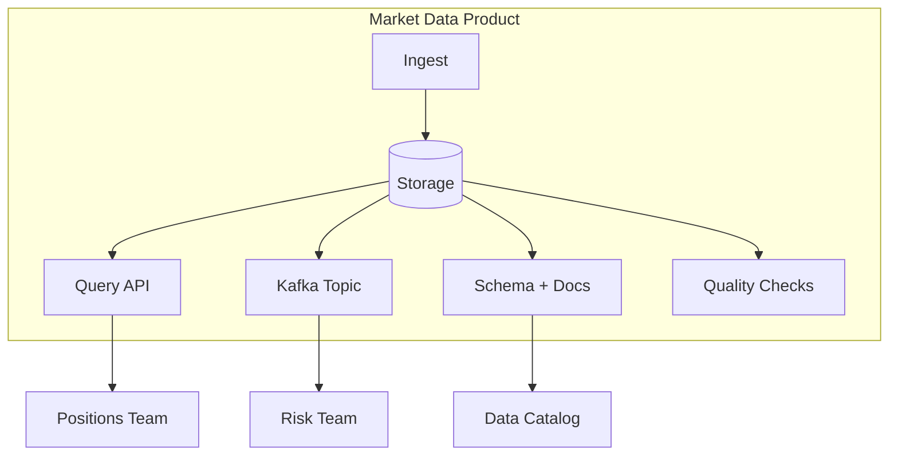
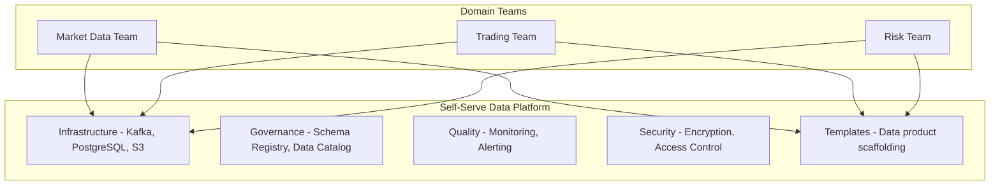

# Data Mesh

## Context & Problem

Centralized data teams create bottlenecks. Every team that needs data must request it from the data engineering team, wait for a pipeline to be built, and hope the data model fits their use case. The central team becomes the constraint on every data-driven initiative.

Data mesh is an organizational and architectural approach that decentralizes data ownership to domain teams. Each domain (market data, positions, risk) owns its data as a **product** — discoverable, addressable, self-describing, and governed.

## Design Decisions

### Four Principles

1. **Domain ownership** — the team that produces the data owns and serves it. The market data team owns the market data product, not a central data team.

2. **Data as a product** — domain data is treated as a product with consumers. It has an SLA, documentation, a schema, and a quality guarantee.

3. **Self-serve data platform** — a shared platform provides the infrastructure (storage, compute, governance tooling) so domain teams do not each build from scratch.

4. **Federated computational governance** — global policies (security, compliance, interoperability) are enforced automatically by the platform, not manually by a central team.

### Data Products

A data product is an autonomous, deployable unit that serves data to consumers:



Each data product exposes:

| Interface | Purpose |
|---|---|
| **Query API** | Synchronous access (REST/GraphQL) |
| **Event stream** | Real-time access (Kafka topic) |
| **Batch export** | Bulk access (Parquet files, database views) |
| **Schema** | Machine-readable contract |
| **Documentation** | Human-readable description, lineage, SLA |
| **Quality metrics** | Freshness, completeness, accuracy |

### Data Product Manifest

Each data product has a manifest that describes it:

```yaml
# data-products/market-data/manifest.yaml

name: market-data
domain: market-data-team
description: Real-time and historical market data (prices, OHLCV, corporate actions)
owner: market-data-team@company.com
sla:
  freshness: "< 5 seconds for real-time, < 1 hour for EOD"
  availability: "99.9%"
  quality: "< 0.01% missing data points"

interfaces:
  rest_api:
    url: /api/v1/market-data
    spec: ./openapi.yaml
  kafka_topics:
    - name: prices.updated
      schema: ./schemas/price-updated.avsc
      retention: 30d
    - name: ohlcv.daily
      schema: ./schemas/ohlcv.avsc
      retention: 365d
  batch:
    format: parquet
    location: s3://data-lake/market-data/
    partition_by: [date, instrument_id]

schema_registry:
  subjects:
    - prices.updated-value
    - ohlcv.daily-value

quality_checks:
  - type: freshness
    threshold: "5 minutes"
    alert: p2
  - type: completeness
    threshold: "99.9%"
    alert: p3
```

### Domain Boundaries for Data Products

In a hedge fund context:

| Domain | Data Products |
|---|---|
| **Market Data** | Prices, OHLCV, corporate actions, security master |
| **Trading** | Trade executions, order history, fill reports |
| **Positions** | Current holdings, historical positions, P&L |
| **Risk** | VaR snapshots, stress test results, factor exposures |
| **Compliance** | Rule evaluations, violation history, audit trail |

Each domain team builds and operates their data products. The platform team provides the infrastructure (Kafka, PostgreSQL, data catalog, quality tooling).

### Self-Serve Platform

The platform provides:



Domain teams create new data products from templates. The platform handles infrastructure, security, and governance automatically.

## When Not to Use Data Mesh

Data mesh adds organizational overhead. It is justified when:

- Multiple teams produce and consume data independently
- Centralized data team is a bottleneck
- Data products have different SLAs and freshness requirements

It is **not** justified when:
- Small team (< 10 engineers) — one person can own all data
- All data flows in one direction (one producer, many consumers)
- The organization is not ready for decentralized ownership

## Failure Modes

| Failure | Cause | Mitigation |
|---|---|---|
| Data product neglected | Team does not prioritize data quality | SLA enforcement, quality metrics in team dashboards |
| Duplicate data products | Two teams build the same thing | Data catalog for discoverability, product registry |
| Governance gaps | No global standards across products | Federated governance, platform-enforced policies |
| Interoperability issues | Products use different schemas for the same concept | Shared vocabulary (shared kernel types), canonical identifiers |
| Over-engineering | Treating every table as a data product | Only productize data that has multiple consumers |

## Related Documents

- [Data Contracts](data-contracts.md) — agreements between data producers and consumers
- [Bounded Contexts](../principles/bounded-contexts.md) — aligning data products with domain boundaries
- [Kafka Topology](../patterns/messaging/kafka-topology.md) — event streaming interface for data products
- [Schema Registry](../patterns/messaging/schema-registry.md) — schema governance across products
