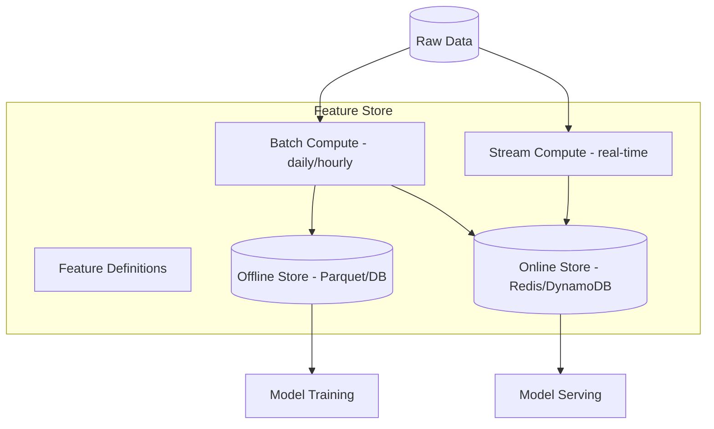

# Feature Stores

## Context & Problem

ML models consume features — derived values computed from raw data. A risk model needs rolling 30-day volatility. A fraud model needs transaction count in the last hour. An alpha model needs price momentum over multiple windows.

Without a feature store, features are computed ad-hoc: one version in the training notebook, another in the serving pipeline. Training-serving skew causes models to behave differently in production than in experiments.

A feature store is a centralized system that manages feature computation, storage, and serving — ensuring that the same feature definition produces the same value in training and inference.

## Design Decisions

### Core Components



| Store | Purpose | Backing | Access Pattern |
|---|---|---|---|
| **Offline store** | Training data, backfills, batch scoring | Parquet files, PostgreSQL, data lake | Large reads, historical ranges |
| **Online store** | Real-time serving, low-latency lookups | Redis, DynamoDB | Point lookups by entity key |

### Feature Definition

Features are defined as code — versioned, testable, and reusable:

```python
from datetime import timedelta
from decimal import Decimal
from dataclasses import dataclass


@dataclass
class FeatureDefinition:
    name: str
    entity_key: str          # e.g., "instrument_id"
    description: str
    dtype: str               # "float64", "int64", "string"
    freshness: timedelta     # max acceptable staleness
    owner: str


# Feature definitions for market data
PRICE_MOMENTUM_5D = FeatureDefinition(
    name="price_momentum_5d",
    entity_key="instrument_id",
    description="5-day price momentum: (close_today - close_5d_ago) / close_5d_ago",
    dtype="float64",
    freshness=timedelta(hours=1),
    owner="quant-team",
)

ROLLING_VOLATILITY_30D = FeatureDefinition(
    name="rolling_volatility_30d",
    entity_key="instrument_id",
    description="30-day rolling annualized volatility of daily returns",
    dtype="float64",
    freshness=timedelta(hours=1),
    owner="risk-team",
)

TRADE_COUNT_1H = FeatureDefinition(
    name="trade_count_1h",
    entity_key="instrument_id",
    description="Number of trades in the last rolling hour",
    dtype="int64",
    freshness=timedelta(minutes=5),
    owner="trading-team",
)
```

### Feature Computation

**Batch features** — computed on a schedule (hourly, daily):

```python
class BatchFeatureCompute:
    async def compute_price_momentum(
        self,
        as_of_date: date,
    ) -> dict[str, float]:
        """Compute 5-day price momentum for all instruments."""
        prices = await self._price_store.get_closes(
            start=as_of_date - timedelta(days=7),
            end=as_of_date,
        )
        results = {}
        for instrument_id, closes in prices.items():
            if len(closes) >= 6:
                today = closes[-1]
                five_days_ago = closes[-6]
                results[instrument_id] = float(
                    (today - five_days_ago) / five_days_ago
                )
        return results
```

**Streaming features** — computed in real-time from event streams:

```python
class StreamingFeatureCompute:
    """Consumes trade events, maintains rolling trade count."""

    def __init__(self, online_store: OnlineStore) -> None:
        self._online_store = online_store

    async def handle_trade_event(self, event: dict) -> None:
        instrument_id = event["instrument_id"]
        # Increment count in sliding window
        await self._online_store.increment_window(
            feature="trade_count_1h",
            entity_key=instrument_id,
            window=timedelta(hours=1),
        )
```

### Feature Serving

```python
from typing import Protocol


class FeatureServer(Protocol):
    async def get_features(
        self,
        entity_key: str,
        feature_names: list[str],
    ) -> dict[str, float | int | str | None]: ...


class RedisFeatureServer:
    """Low-latency feature serving from Redis."""

    def __init__(self, redis_client) -> None:
        self._redis = redis_client

    async def get_features(
        self,
        entity_key: str,
        feature_names: list[str],
    ) -> dict[str, float | int | str | None]:
        pipe = self._redis.pipeline()
        for name in feature_names:
            pipe.get(f"feature:{name}:{entity_key}")
        values = await pipe.execute()
        return dict(zip(feature_names, values))


# Usage in model serving
async def predict_risk(instrument_id: str) -> float:
    features = await feature_server.get_features(
        entity_key=instrument_id,
        feature_names=["rolling_volatility_30d", "price_momentum_5d", "trade_count_1h"],
    )
    return risk_model.predict(features)
```

### Point-in-Time Correctness

For training, features must be computed as of the historical timestamp — not using future data (data leakage):

```python
class OfflineFeatureStore:
    async def get_training_features(
        self,
        entity_keys: list[str],
        feature_names: list[str],
        timestamps: list[datetime],
    ) -> pd.DataFrame:
        """Point-in-time correct feature retrieval for training.
        
        For each (entity, timestamp), returns the feature values
        that would have been available AT that timestamp.
        """
        # Uses as-of joins: for each timestamp, find the most recent
        # feature value that was computed BEFORE that timestamp
        ...
```

## Failure Modes

| Failure | Cause | Mitigation |
|---|---|---|
| Training-serving skew | Different computation logic in notebook vs pipeline | Single feature definition used for both |
| Stale features | Batch job delayed, online store not refreshed | Freshness monitoring, alert if feature age > threshold |
| Data leakage | Training uses features computed with future data | Point-in-time joins, strict temporal ordering |
| Feature store down | Redis/online store unavailable | Fallback to cached features, circuit breaker |
| Feature drift | Underlying data distribution changes | Monitor feature distributions, alert on drift |

## Related Documents

- [Model Serving](../patterns/ai-ml/model-serving.md) — consuming features for inference
- [Batch vs Streaming](../patterns/data-processing/batch-vs-streaming.md) — feature computation patterns
- [TimescaleDB Hypertables](../patterns/data-access/timescaledb-hypertables.md) — time-series storage for raw feature data
