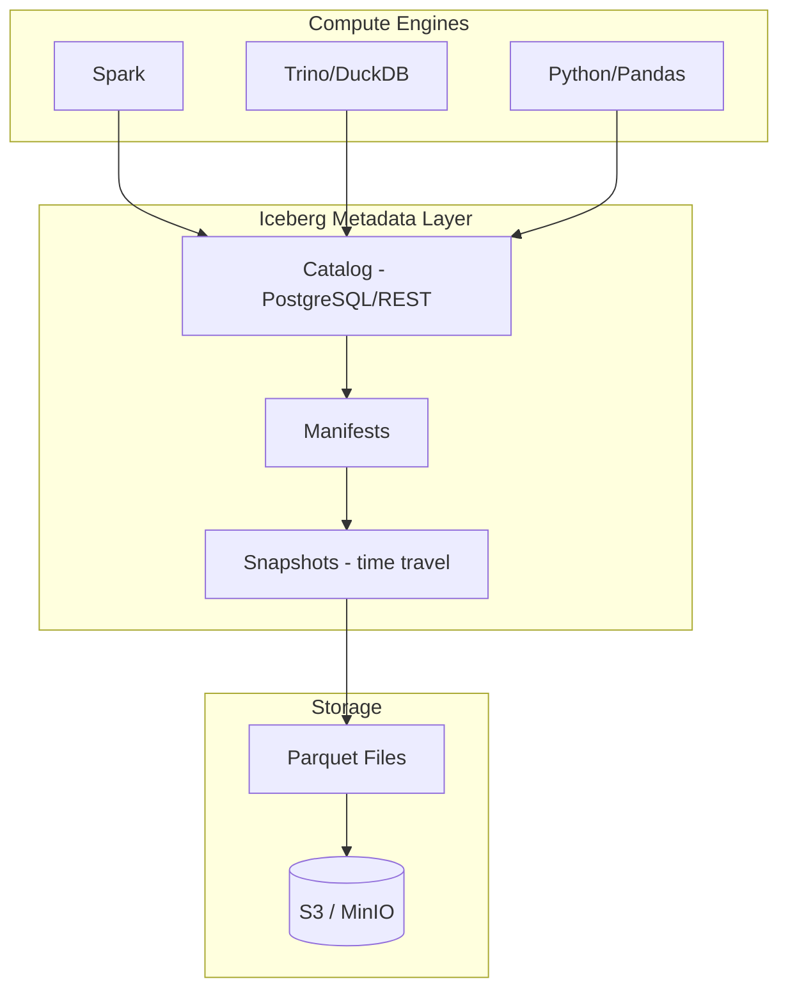
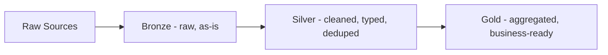

# Lakehouse

## Context & Problem

Data warehouses are great for structured, curated data and fast SQL queries. Data lakes are great for storing everything cheaply (structured, semi-structured, raw). But running both creates a "two-tier" architecture: ETL into the lake, then ETL again into the warehouse. Double the pipelines, double the cost, double the staleness.

The lakehouse pattern combines the best of both: open file formats (Parquet) on cheap object storage (S3/MinIO), with a metadata layer (Delta Lake, Apache Iceberg) that adds ACID transactions, schema enforcement, and time travel.

## Design Decisions

### When to Use a Lakehouse

| Scenario | Lakehouse | Data Warehouse | Data Lake |
|---|---|---|---|
| Structured analytics (SQL) | Good | Best | Poor |
| Semi-structured data (JSON, logs) | Good | Poor | Best |
| ML training data | Best | Poor (export needed) | Good |
| ACID transactions on files | Yes (metadata layer) | Yes (built-in) | No |
| Cost at scale (PBs) | Lowest | Highest | Low |
| Schema enforcement | Yes (metadata layer) | Yes | No |
| Time travel / auditing | Yes | Some | No |

Use a lakehouse when you need both analytics and ML on the same data, or when data volume makes a warehouse too expensive.

### Table Format: Apache Iceberg

Iceberg (or Delta Lake) sits between the compute engine and the file storage, adding database-like capabilities to files:



### Medallion Architecture

Data flows through quality tiers:



| Layer | Purpose | Example |
|---|---|---|
| **Bronze** | Raw data as received, no transformation | Raw Bloomberg API responses, CSV uploads |
| **Silver** | Cleaned, validated, typed, deduplicated | Normalized price records, validated trades |
| **Gold** | Business-level aggregations and metrics | Daily portfolio P&L, monthly risk reports |

```python
# Bronze: raw ingestion — keep everything, transform nothing
class BronzeIngester:
    async def ingest(self, source: str, data: bytes, metadata: dict) -> None:
        path = f"s3://data-lake/bronze/{source}/{date.today()}/{uuid4()}.parquet"
        await self._storage.write(path, data, metadata=metadata)


# Silver: cleaned and typed
class SilverTransformer:
    async def transform_prices(self, bronze_path: str) -> None:
        raw = await self._storage.read_parquet(bronze_path)
        cleaned = (
            raw
            .dropna(subset=["instrument_id", "price"])
            .drop_duplicates(subset=["instrument_id", "timestamp"])
            .assign(
                price=lambda df: df["price"].astype("decimal"),
                timestamp=lambda df: pd.to_datetime(df["timestamp"], utc=True),
            )
        )
        silver_path = f"s3://data-lake/silver/prices/{date.today()}"
        await self._iceberg.write(silver_path, cleaned, mode="append")


# Gold: business aggregations
class GoldAggregator:
    async def build_daily_ohlcv(self, trade_date: date) -> None:
        prices = await self._iceberg.read(
            "silver.prices",
            filter=f"date = '{trade_date}'",
        )
        ohlcv = (
            prices
            .groupby("instrument_id")
            .agg(
                open=("price", "first"),
                high=("price", "max"),
                low=("price", "min"),
                close=("price", "last"),
                volume=("volume", "sum"),
            )
        )
        await self._iceberg.write("gold.daily_ohlcv", ohlcv, mode="overwrite_partition")
```

### Time Travel and Auditing

Iceberg maintains snapshots. You can query data as of any previous state:

```sql
-- Current data
SELECT * FROM gold.daily_ohlcv WHERE instrument_id = 'AAPL';

-- Data as of yesterday (before today's refresh)
SELECT * FROM gold.daily_ohlcv
FOR SYSTEM_TIME AS OF TIMESTAMP '2025-03-14 23:59:59'
WHERE instrument_id = 'AAPL';

-- Diff between two snapshots
SELECT * FROM gold.daily_ohlcv.history
WHERE made_current_at BETWEEN '2025-03-14' AND '2025-03-15';
```

This is critical for financial systems where auditors need to reproduce historical states.

### Local Development

```yaml
services:
  minio:
    image: minio/minio:latest
    ports: ["9000:9000", "9001:9001"]
    command: server /data --console-address ":9001"
    environment:
      MINIO_ROOT_USER: minioadmin
      MINIO_ROOT_PASSWORD: minioadmin

  iceberg-rest:
    image: tabulario/iceberg-rest:latest
    ports: ["8181:8181"]
    environment:
      CATALOG_WAREHOUSE: s3://warehouse/
      CATALOG_IO__IMPL: org.apache.iceberg.aws.s3.S3FileIO
      CATALOG_S3_ENDPOINT: http://minio:9000
```

Use DuckDB for local SQL queries against Iceberg tables — no Spark cluster needed for development.

## Failure Modes

| Failure | Cause | Mitigation |
|---|---|---|
| Small file problem | Too many small Parquet files | Compaction jobs, merge on write |
| Schema evolution breaks consumers | Column renamed or type changed | Iceberg schema evolution with compatibility rules |
| Stale gold tables | Batch job failed, gold not refreshed | Freshness monitoring, alert on staleness |
| Storage costs | Too many snapshots retained | Snapshot expiration policy, archive old snapshots |
| Query performance | No partition pruning, full scan | Partition by date, sort by frequently filtered columns |

## Related Documents

- [ETL vs ELT](../patterns/data-processing/etl-vs-elt.md) — transformation patterns for lakehouse
- [Data Contracts](data-contracts.md) — contracts between lakehouse layers
- [Data Mesh](data-mesh.md) — domain-owned data products stored in the lakehouse
- [Polyglot Persistence](../principles/polyglot-persistence.md) — the lakehouse as one storage tier
