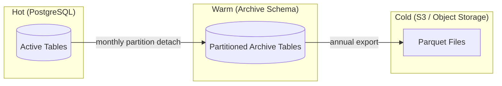
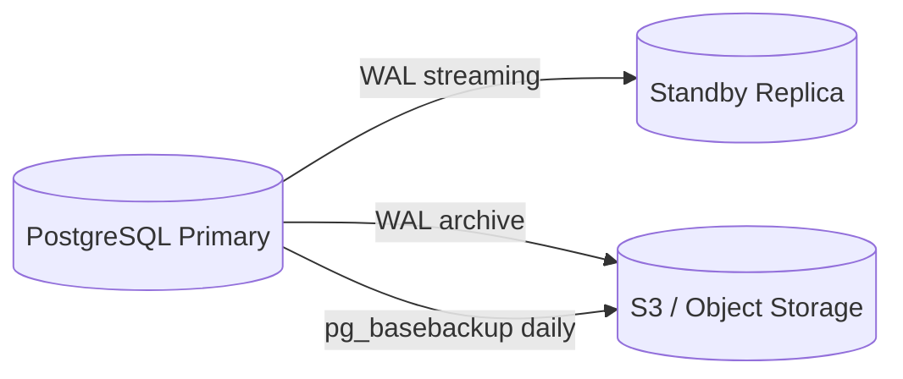

# Disaster Recovery & Data Retention

## Context & Problem

A hedge fund's position-keeping system is not a stateless web application you can rebuild from a container image. It holds irreplaceable state: the event store is the legal record of every trade. The audit trail is a regulatory artifact. If the database is lost and there is no backup, the fund cannot prove what it owns, what it traded, or whether it was compliant. The regulatory consequences range from fines to fund closure.

Most teams treat backup and recovery as an ops task to configure later. In financial systems, the retention policy and recovery strategy are architectural decisions that affect schema design, storage choices, and the event model itself. They must be designed alongside the system, not bolted on after launch.

## Design Decisions

### Recovery Objectives

| Metric | Target | Rationale |
|---|---|---|
| **RPO** (Recovery Point Objective) | ≤ 5 minutes | Maximum acceptable data loss. Continuous WAL archiving achieves this. |
| **RTO** (Recovery Time Objective) | ≤ 30 minutes | Maximum acceptable downtime. Standby replica promotion achieves this. |
| **Backup frequency** | Continuous WAL + daily base backup | WAL streaming provides point-in-time recovery. Daily base backup limits replay time. |
| **Backup retention** | 30 days of point-in-time recovery | Covers month-end reconciliation, audit investigations, delayed break resolution. |

### Data Retention Policy

Financial regulators (SEC Rule 17a-4, MiFID II Article 25) require trade records to be retained for 5–7 years. The retention policy must distinguish between hot, warm, and cold data.

| Data Category | Hot (PostgreSQL) | Warm (Archive DB) | Cold (Object Storage) | Total Retention |
|---|---|---|---|---|
| **Position events** (event store) | Current year | 2 years | 5 years | 7 years |
| **Trade records** | Current year | 2 years | 5 years | 7 years |
| **Audit trail** | 90 days | 2 years | 5 years | 7 years |
| **Market data (ticks)** | 30 days (hypertable) | 1 year (downsampled) | 5 years (OHLCV only) | 7 years |
| **Risk snapshots** | 90 days | 1 year | — | ~15 months |
| **Compliance evaluations** | 1 year | 2 years | 5 years | 7 years |
| **Instrument reference data** | Current | — | — | Forever (immutable history via SCD2) |

### Hot → Warm → Cold Pipeline

**Hot → Warm:** PostgreSQL table partitioning by month. When a partition ages out of the hot window, it is detached from the active table and attached to an archive table in a separate schema. Queries against archived data use the archive schema explicitly — they are slower but the data remains accessible via SQL.

**Warm → Cold:** Annual export to Parquet files in object storage (S3, MinIO). Parquet preserves schema, compresses well, and is queryable via tools like DuckDB or Athena for ad-hoc regulatory queries. Once exported and verified, the warm partition is dropped.

### Event Store Archival

The event store is append-only and grows indefinitely. Archival must preserve the ability to replay events:

1. **Partition by month** — each month's events are in a separate partition
2. **Snapshot before archive** — generate aggregate snapshots at the partition boundary so future replays start from the snapshot, not from the beginning of time
3. **Export partition to Parquet** — includes event data, metadata, and sequence numbers
4. **Verify export** — compare row counts and checksums between PostgreSQL and Parquet
5. **Detach partition** — the partition is removed from the active event store but the Parquet file is the permanent record

Replaying from archived events: load the Parquet file, insert into a temporary table, replay through the aggregate. This is an offline operation — not part of normal system operation, but available for audit investigations and regulatory requests.

## Backup Strategy

### PostgreSQL Continuous Archiving

| Component | Tool | Frequency | Retention |
|---|---|---|---|
| WAL archiving | `archive_command` or pgBackRest | Continuous | 30 days |
| Base backup | `pg_basebackup` or pgBackRest | Daily at 02:00 UTC | 30 days |
| Standby replica | Streaming replication | Continuous | Always current |

**Point-in-time recovery (PITR):** Restore a base backup + replay WAL segments up to any timestamp within the retention window. This is the primary recovery mechanism for data corruption or accidental deletion.

### Fund-Aware Backup Strategy

In a multi-fund deployment with schema-per-fund isolation, the backup strategy must account for fund-level granularity:

- **Full database backup** (daily base backup + WAL) covers all fund schemas and shared schemas. This is the primary recovery mechanism.
- **Per-fund export** (on demand): For regulatory requests, fund offboarding, or data portability, export a single fund's schemas to Parquet. This requires iterating all fund-specific schemas (`fund_alpha_positions`, `fund_alpha_orders`, etc.) and exporting each.
- **Fund offboarding retention**: When a fund is offboarded, its schemas are dropped (see [Multi-Tenancy — Fund Offboarding](../patterns/data-access/multi-tenancy.md#fund-onboarding--offboarding)). Before dropping, the offboarding pipeline exports all fund data to cold storage and verifies checksums. The exported data is retained for 7 years per the Data Retention Policy above. The `platform.funds` table retains a record with `status = 'offboarded'` and `offboarded_at` timestamp.
- **Fund-scoped Kafka topics**: Fund-specific topics (`fund-alpha.positions.changed`, etc.) are mirrored to S3 per the Kafka backup policy below. On offboarding, the S3 mirror is retained but the Kafka topics are deleted.

### Kafka Backup

Kafka topics have built-in retention (7–90 days depending on topic). For long-term retention:

- **Critical topics** (`trades.executed`, `positions.changed`, `compliance.violations`): Mirror to S3 via Kafka Connect S3 Sink Connector. Retain for 7 years.
- **High-volume topics** (`prices.normalized`): Kafka retention only (7 days). Historical prices are in TimescaleDB, which has its own backup.
- **Operational topics** (`market-data.status`): Kafka retention only (7 days). No long-term archival needed.

### Redis

Redis is a cache — it holds no authoritative data. On failure, it is rebuilt from PostgreSQL. No backup required.

## Recovery Procedures

### Scenario 1: Primary Database Failure

| Step | Action | Time |
|---|---|---|
| 1 | Detect failure (health check, replication lag) | < 1 min |
| 2 | Promote standby replica to primary | 1–2 min |
| 3 | Update connection string (via DNS or config) | 1 min |
| 4 | Application reconnects | Automatic (pool reconnect) |
| 5 | Provision new standby from promoted primary | Background |

**Total RTO: 2–5 minutes** with streaming replication.

### Scenario 2: Data Corruption (Bad Deployment, Application Bug)

| Step | Action | Time |
|---|---|---|
| 1 | Identify corruption scope (which tables, which time range) | Investigation |
| 2 | Stop writes to affected tables | Immediate |
| 3 | Restore base backup + replay WAL to point before corruption | 10–30 min |
| 4 | Verify restored data against audit trail | 5–10 min |
| 5 | Rebuild read models from event store | 5–15 min |

**Total RTO: 30–60 minutes** depending on database size and corruption scope.

### Scenario 3: Complete Infrastructure Loss

| Step | Action | Time |
|---|---|---|
| 1 | Provision new infrastructure (Docker Compose or IaC) | 5–10 min |
| 2 | Restore PostgreSQL from latest S3 base backup + WAL | 15–30 min |
| 3 | Rebuild Kafka topics from S3 mirror (critical topics only) | 10–20 min |
| 4 | Warm Redis cache from PostgreSQL | Automatic on first query |
| 5 | Verify system health, run reconciliation | 10 min |

**Total RTO: 45–75 minutes.**

### Scenario 4: Single Fund Data Recovery

When a bug or accidental deletion affects only one fund's data, the recovery must be scoped to that fund without disrupting other funds:

| Step | Action | Time |
|---|---|---|
| 1 | Identify affected fund schemas | Investigation |
| 2 | Stop writes to affected fund (disable fund in platform.funds) | Immediate |
| 3 | Restore affected fund's schemas from base backup + WAL replay to a temporary database | 10–20 min |
| 4 | Copy restored fund schemas into the production database, replacing the corrupted versions | 5–10 min |
| 5 | Re-enable fund, rebuild read models for affected fund | 5–10 min |

**Total RTO: 20–45 minutes.** Other funds are unaffected because schema-per-fund provides physical isolation.

## Testing Recovery

A backup that has never been restored is not a backup — it is a hope. Recovery procedures must be tested regularly:

| Test | Frequency | What It Validates |
|---|---|---|
| Restore from base backup + WAL replay | Monthly | PITR works, backups are not corrupted |
| Failover to standby replica | Quarterly | Promotion works, application reconnects |
| Rebuild read models from event store | Monthly (in CI) | Projections are rebuildable, event store is consistent |
| Restore from cold storage (Parquet) | Annually | Archived data is queryable, format is stable |
| Full infrastructure rebuild | Annually | IaC is complete, nothing depends on undocumented state |
| Single fund schema restore | Quarterly | Per-fund recovery works without affecting other funds |
| Fund offboarding export + verify | Annually | Offboarded data is complete and queryable from cold storage |

## Failure Modes

| Failure | Cause | Mitigation |
|---|---|---|
| Backup corruption | Storage failure, interrupted transfer | Checksums on every backup, verify restorability monthly |
| WAL gap | Archive process crashes, S3 write failure | Monitor `archive_command` success rate, alert on gaps |
| Standby lag | Network issues, heavy write load | Monitor replication lag, alert if > 1 min |
| Cold storage inaccessible | S3 outage, credential expiry | Multi-region replication, credential rotation automation |
| Recovery takes too long | Database larger than expected, slow restore | Regular timing tests, keep base backups recent |
| Archived data unreadable | Schema evolved, Parquet format incompatible | Include schema metadata in export, validate with read test |

## Related Documents

- [CQRS & Event Sourcing](../principles/cqrs-event-sourcing.md) — event store archival and snapshot strategy
- [Audit Trails](../systems/hedge-fund-desk/audit-trails.md) — 7-year retention, tamper-evident storage
- [EOD Processing](../systems/hedge-fund-desk/eod-processing.md) — EOD batch includes backup verification
- [TimescaleDB Hypertables](../patterns/data-access/timescaledb-hypertables.md) — time-series data retention and compression
- [Secret Management](secret-management.md) — backup encryption keys, S3 credentials
