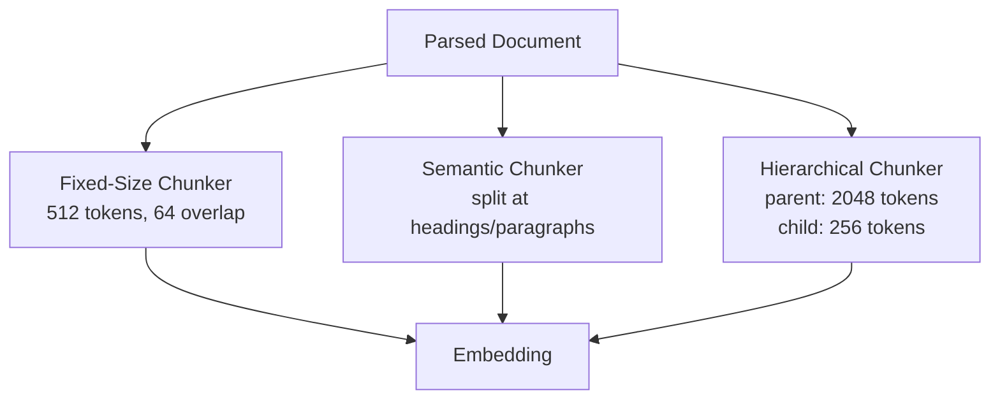
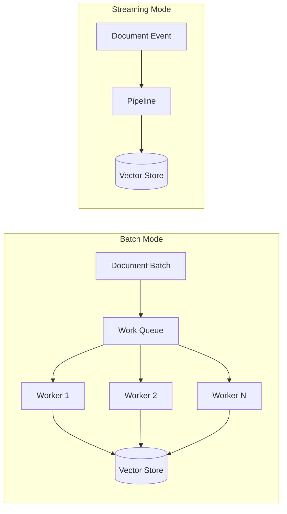
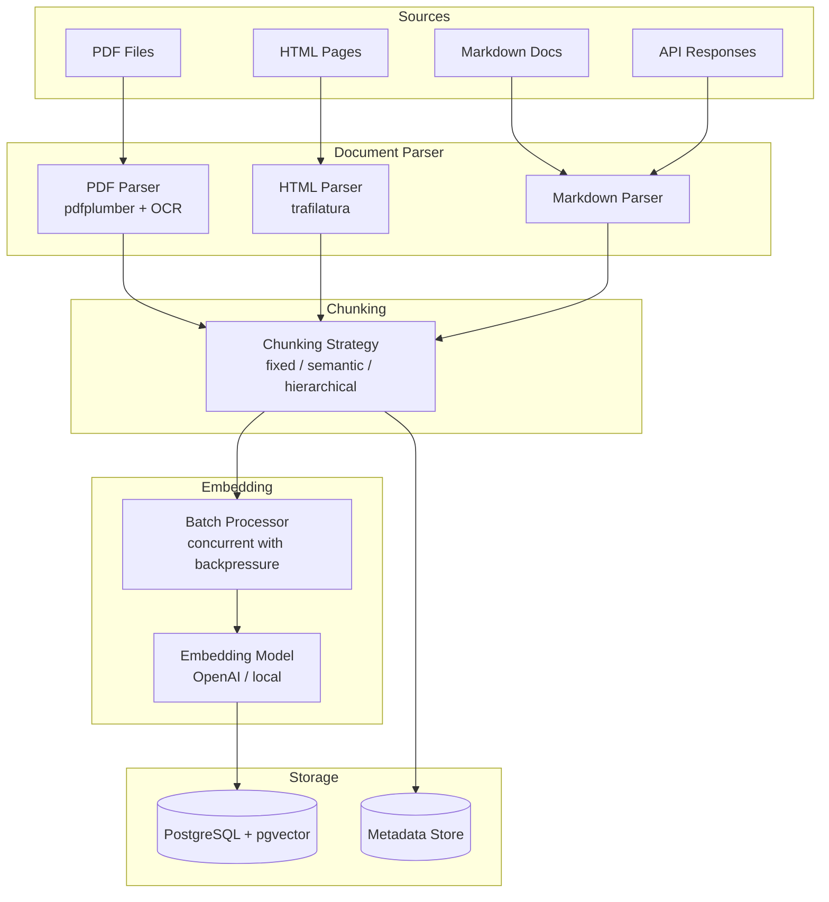

# Embedding Pipelines

## Context & Problem

A RAG system is only as good as its embeddings. Before any retrieval can happen, documents must be parsed from their source format, split into meaningful chunks, run through an embedding model, and indexed in a vector store. This ingestion pipeline runs offline but its design decisions directly affect online retrieval quality.

The challenges are practical: PDFs have headers, footers, and tables that break naive text extraction. HTML has boilerplate navigation. Markdown has code blocks that should not be split mid-block. Embedding models have token limits. Vector stores need tuned indexes to be fast at query time. And all of this must work at scale — thousands of documents, millions of chunks.

## Design Decisions

### Document Parsing

Each source format needs a dedicated parser. "Just extract text" loses structure that matters for chunking.

- **PDF** — Use `pdfplumber` for text with layout awareness. Fall back to OCR (`pytesseract`) for scanned documents. Extract tables separately and serialize them as markdown tables.
- **HTML** — Strip boilerplate with `trafilatura` or `readability-lxml`. Preserve heading hierarchy for semantic chunking.
- **Markdown** — Parse with heading structure intact. Treat code blocks as atomic units (never split mid-block).

### Chunking Strategies



**Fixed-size** is the default. It is predictable, easy to reason about, and works for most homogeneous text. The overlap prevents information loss at boundaries.

**Semantic chunking** is better for structured documents (documentation, reports). Split at the largest heading boundary that keeps chunks under the max size.

**Hierarchical chunking** stores two levels: large parent chunks for context and small child chunks for precise retrieval. At query time, retrieve on child embeddings but expand to the parent chunk for the LLM context.

### Embedding Model Selection

| Model | Dimensions | Max Tokens | Tradeoff |
|---|---|---|---|
| `text-embedding-3-small` (OpenAI) | 1536 | 8191 | Good quality, low cost, API dependency |
| `text-embedding-3-large` (OpenAI) | 3072 | 8191 | Higher quality, higher cost and storage |
| `nomic-embed-text` (local) | 768 | 8192 | No API dependency, runs on GPU, lower quality |
| `BGE-M3` (local) | 1024 | 8192 | Multilingual, hybrid dense+sparse |

For most use cases, `text-embedding-3-small` is the right starting point. Switch to local models when data cannot leave the network or when API costs at scale become prohibitive.

### Batch vs Streaming Embedding

**Batch** — Process all documents in bulk. Use when bootstrapping a new collection or doing a full re-index. Allows parallelism and retry at the batch level.

**Streaming** — Process documents as they arrive (uploaded, updated). Use for incremental ingestion. Each document goes through the pipeline independently.

Both modes share the same pipeline stages; the difference is orchestration.



### Vector Store Indexing with pgvector

pgvector is the right choice when you are already running PostgreSQL and your collection is under ~10M vectors. It avoids introducing a separate vector database.

```sql
-- Enable the extension
CREATE EXTENSION IF NOT EXISTS vector;

-- Chunks table with embedding column
CREATE TABLE chunks (
    id UUID PRIMARY KEY DEFAULT gen_random_uuid(),
    document_id UUID NOT NULL REFERENCES documents(id) ON DELETE CASCADE,
    content TEXT NOT NULL,
    token_count INTEGER NOT NULL,
    metadata JSONB NOT NULL DEFAULT '{}',
    embedding vector(1536) NOT NULL,
    created_at TIMESTAMPTZ NOT NULL DEFAULT now()
);

-- HNSW index for approximate nearest neighbor search
-- m=16 and ef_construction=64 are good defaults
CREATE INDEX ON chunks
    USING hnsw (embedding vector_cosine_ops)
    WITH (m = 16, ef_construction = 64);

-- Metadata index for pre-filtering
CREATE INDEX ON chunks USING gin (metadata);
```

HNSW index parameters matter:
- **m** — Number of connections per node. Higher = better recall, more memory. 16 is a good default.
- **ef_construction** — Build-time search breadth. Higher = better index quality, slower build. 64 is reasonable.
- **ef_search** — Query-time search breadth. Set via `SET hnsw.ef_search = 100` per session.

## Architecture



## Code Skeleton

### Document Parser Protocol and Implementations

```python
# embedding_pipeline/parsers.py

from typing import Protocol, runtime_checkable
from pathlib import Path

from pydantic import BaseModel


class ParsedDocument(BaseModel):
    content: str
    metadata: dict[str, str]
    sections: list["DocumentSection"]


class DocumentSection(BaseModel):
    heading: str
    content: str
    level: int  # heading level: 1, 2, 3...


@runtime_checkable
class DocumentParser(Protocol):
    def parse(self, source: Path | str) -> ParsedDocument: ...


class PDFParser:
    def parse(self, source: Path | str) -> ParsedDocument:
        import pdfplumber

        path = Path(source)
        sections: list[DocumentSection] = []
        full_text_parts: list[str] = []

        with pdfplumber.open(path) as pdf:
            for page_num, page in enumerate(pdf.pages):
                text = page.extract_text() or ""
                full_text_parts.append(text)

                # Extract tables as markdown
                for table in page.extract_tables():
                    if table:
                        md_table = self._table_to_markdown(table)
                        full_text_parts.append(md_table)

        return ParsedDocument(
            content="\n\n".join(full_text_parts),
            metadata={
                "source": path.name,
                "type": "pdf",
                "pages": str(len(pdf.pages)),
            },
            sections=sections,
        )

    def _table_to_markdown(self, table: list[list[str | None]]) -> str:
        if not table:
            return ""
        headers = [cell or "" for cell in table[0]]
        rows = table[1:]
        md = "| " + " | ".join(headers) + " |\n"
        md += "| " + " | ".join("---" for _ in headers) + " |\n"
        for row in rows:
            md += "| " + " | ".join(cell or "" for cell in row) + " |\n"
        return md


class MarkdownParser:
    def parse(self, source: Path | str) -> ParsedDocument:
        import re

        path = Path(source)
        text = path.read_text(encoding="utf-8")

        sections: list[DocumentSection] = []
        heading_pattern = re.compile(r"^(#{1,6})\s+(.+)$", re.MULTILINE)

        for match in heading_pattern.finditer(text):
            level = len(match.group(1))
            heading = match.group(2)
            sections.append(DocumentSection(heading=heading, content="", level=level))

        return ParsedDocument(
            content=text,
            metadata={"source": path.name, "type": "markdown"},
            sections=sections,
        )


class HTMLParser:
    def parse(self, source: Path | str) -> ParsedDocument:
        import trafilatura

        path = Path(source)
        html = path.read_text(encoding="utf-8")
        text = trafilatura.extract(html) or ""

        return ParsedDocument(
            content=text,
            metadata={"source": path.name, "type": "html"},
            sections=[],
        )
```

### Chunking

```python
# embedding_pipeline/chunking.py

from typing import Protocol, runtime_checkable

import tiktoken

from embedding_pipeline.parsers import ParsedDocument


class ChunkResult:
    def __init__(self, content: str, token_count: int, metadata: dict[str, str]):
        self.content = content
        self.token_count = token_count
        self.metadata = metadata


@runtime_checkable
class ChunkingStrategy(Protocol):
    def chunk(self, document: ParsedDocument) -> list[ChunkResult]: ...


class FixedSizeChunker:
    """Split text into fixed-size token chunks with overlap."""

    def __init__(
        self,
        chunk_size: int = 512,
        chunk_overlap: int = 64,
        encoding_name: str = "cl100k_base",
    ) -> None:
        self._chunk_size = chunk_size
        self._overlap = chunk_overlap
        self._enc = tiktoken.get_encoding(encoding_name)

    def chunk(self, document: ParsedDocument) -> list[ChunkResult]:
        tokens = self._enc.encode(document.content)
        chunks: list[ChunkResult] = []

        start = 0
        while start < len(tokens):
            end = start + self._chunk_size
            chunk_tokens = tokens[start:end]
            text = self._enc.decode(chunk_tokens)

            chunks.append(ChunkResult(
                content=text,
                token_count=len(chunk_tokens),
                metadata=document.metadata,
            ))

            start += self._chunk_size - self._overlap

        return chunks


class SemanticChunker:
    """Split at heading boundaries, respecting document structure."""

    def __init__(
        self,
        max_chunk_tokens: int = 1024,
        encoding_name: str = "cl100k_base",
    ) -> None:
        self._max_tokens = max_chunk_tokens
        self._enc = tiktoken.get_encoding(encoding_name)

    def chunk(self, document: ParsedDocument) -> list[ChunkResult]:
        import re

        # Split on headings
        parts = re.split(r"(?=^#{1,3}\s)", document.content, flags=re.MULTILINE)
        chunks: list[ChunkResult] = []
        buffer = ""

        for part in parts:
            combined = buffer + part
            token_count = len(self._enc.encode(combined))

            if token_count > self._max_tokens and buffer:
                # Flush buffer as a chunk
                buf_tokens = len(self._enc.encode(buffer))
                chunks.append(ChunkResult(
                    content=buffer.strip(),
                    token_count=buf_tokens,
                    metadata=document.metadata,
                ))
                buffer = part
            else:
                buffer = combined

        if buffer.strip():
            buf_tokens = len(self._enc.encode(buffer))
            chunks.append(ChunkResult(
                content=buffer.strip(),
                token_count=buf_tokens,
                metadata=document.metadata,
            ))

        return chunks
```

### Embedding Pipeline

```python
# embedding_pipeline/pipeline.py

import asyncio
import logging
import uuid
from typing import Protocol, runtime_checkable

from pydantic import BaseModel

from embedding_pipeline.parsers import DocumentParser, ParsedDocument
from embedding_pipeline.chunking import ChunkingStrategy, ChunkResult

logger = logging.getLogger(__name__)


@runtime_checkable
class EmbeddingModel(Protocol):
    async def embed_batch(self, texts: list[str]) -> list[list[float]]: ...


class IndexedChunk(BaseModel):
    id: str
    document_id: str
    content: str
    token_count: int
    embedding: list[float]
    metadata: dict[str, str]


@runtime_checkable
class VectorStore(Protocol):
    async def upsert(self, chunks: list[IndexedChunk]) -> None: ...
    async def delete_by_document(self, document_id: str) -> None: ...


class EmbeddingPipeline:
    """End-to-end pipeline: parse -> chunk -> embed -> index."""

    def __init__(
        self,
        parser: DocumentParser,
        chunker: ChunkingStrategy,
        embedding_model: EmbeddingModel,
        vector_store: VectorStore,
        batch_size: int = 64,
        max_concurrent_batches: int = 4,
    ) -> None:
        self._parser = parser
        self._chunker = chunker
        self._embedding = embedding_model
        self._store = vector_store
        self._batch_size = batch_size
        self._semaphore = asyncio.Semaphore(max_concurrent_batches)

    async def ingest_document(
        self,
        source: str,
        document_id: str | None = None,
    ) -> int:
        """Parse, chunk, embed, and index a single document. Returns chunk count."""
        doc_id = document_id or str(uuid.uuid4())

        # Parse
        parsed: ParsedDocument = self._parser.parse(source)
        logger.info(f"Parsed document {doc_id}: {len(parsed.content)} chars")

        # Chunk
        chunk_results: list[ChunkResult] = self._chunker.chunk(parsed)
        logger.info(f"Chunked into {len(chunk_results)} chunks")

        # Delete old chunks for this document (idempotent re-index)
        await self._store.delete_by_document(doc_id)

        # Embed in batches with concurrency control
        indexed_chunks: list[IndexedChunk] = []
        batches = [
            chunk_results[i : i + self._batch_size]
            for i in range(0, len(chunk_results), self._batch_size)
        ]

        async def embed_batch(batch: list[ChunkResult]) -> list[IndexedChunk]:
            async with self._semaphore:
                texts = [c.content for c in batch]
                embeddings = await self._embedding.embed_batch(texts)
                return [
                    IndexedChunk(
                        id=str(uuid.uuid4()),
                        document_id=doc_id,
                        content=c.content,
                        token_count=c.token_count,
                        embedding=emb,
                        metadata=c.metadata,
                    )
                    for c, emb in zip(batch, embeddings)
                ]

        results = await asyncio.gather(*[embed_batch(b) for b in batches])
        for batch_result in results:
            indexed_chunks.extend(batch_result)

        # Index
        await self._store.upsert(indexed_chunks)
        logger.info(f"Indexed {len(indexed_chunks)} chunks for document {doc_id}")

        return len(indexed_chunks)

    async def ingest_batch(
        self,
        sources: list[tuple[str, str]],  # (source_path, document_id)
    ) -> dict[str, int]:
        """Ingest multiple documents. Returns {document_id: chunk_count}."""
        results: dict[str, int] = {}
        for source_path, doc_id in sources:
            try:
                count = await self.ingest_document(source_path, doc_id)
                results[doc_id] = count
            except Exception:
                logger.exception(f"Failed to ingest document {doc_id}")
                results[doc_id] = 0
        return results
```

### pgvector Store Implementation

```python
# embedding_pipeline/stores/pgvector_store.py

from sqlalchemy import text
from sqlalchemy.ext.asyncio import AsyncSession, async_sessionmaker

from embedding_pipeline.pipeline import IndexedChunk, VectorStore


class PgVectorStore:
    """Vector store backed by PostgreSQL + pgvector."""

    def __init__(self, session_factory: async_sessionmaker[AsyncSession]) -> None:
        self._session_factory = session_factory

    async def upsert(self, chunks: list[IndexedChunk]) -> None:
        async with self._session_factory() as session:
            for chunk in chunks:
                await session.execute(
                    text("""
                        INSERT INTO chunks (id, document_id, content, token_count, metadata, embedding)
                        VALUES (:id, :doc_id, :content, :token_count, :metadata::jsonb, :embedding::vector)
                        ON CONFLICT (id) DO UPDATE SET
                            content = EXCLUDED.content,
                            embedding = EXCLUDED.embedding,
                            token_count = EXCLUDED.token_count,
                            metadata = EXCLUDED.metadata
                    """),
                    {
                        "id": chunk.id,
                        "doc_id": chunk.document_id,
                        "content": chunk.content,
                        "token_count": chunk.token_count,
                        "metadata": chunk.metadata,
                        "embedding": str(chunk.embedding),
                    },
                )
            await session.commit()

    async def delete_by_document(self, document_id: str) -> None:
        async with self._session_factory() as session:
            await session.execute(
                text("DELETE FROM chunks WHERE document_id = :doc_id"),
                {"doc_id": document_id},
            )
            await session.commit()

    async def similarity_search(
        self,
        query_embedding: list[float],
        top_k: int = 10,
    ) -> list[dict]:
        async with self._session_factory() as session:
            result = await session.execute(
                text("""
                    SELECT id, document_id, content, token_count, metadata,
                           1 - (embedding <=> :query::vector) AS score
                    FROM chunks
                    ORDER BY embedding <=> :query::vector
                    LIMIT :top_k
                """),
                {"query": str(query_embedding), "top_k": top_k},
            )
            return [dict(row._mapping) for row in result.fetchall()]
```

## Failure Modes

| Failure | Cause | Mitigation |
|---|---|---|
| Garbage chunks | PDF parser extracts headers/footers/watermarks as text | Pre-processing to strip repeated page artifacts, validate chunk quality |
| Lost table data | Tables extracted as garbled text | Dedicated table extraction with `pdfplumber`, serialize as markdown |
| Embedding API rate limit | Too many concurrent embed requests | Semaphore-based concurrency control, exponential backoff |
| Stale embeddings | Document updated but embeddings not re-generated | Delete-and-reindex on document update (idempotent pipeline) |
| Index degradation | HNSW index not rebuilt after large bulk inserts | Run `REINDEX INDEX` after large batch ingestion |
| Token limit exceeded | Chunk exceeds embedding model max tokens | Enforce max chunk size in chunking strategy, truncate if needed |
| Dimension mismatch | Embedding model changed but old embeddings remain | Track embedding model version in metadata, re-index on model change |
| OOM on large documents | Entire PDF loaded into memory | Stream pages one at a time, process and discard |

## Related Documents

- [RAG Architecture](rag-architecture.md) — the retrieval pipeline that queries these embeddings
- [LLM Gateway](llm-gateway.md) — embedding API calls can route through the gateway
- [Connection Pooling](../data-access/connection-pooling.md) — pgvector uses the same PostgreSQL connection pool
- [OpenFGA LLM Permissions](../authorization/openfga-llm-permissions.md) — document-level permissions stored alongside embeddings
- [Dependency Inversion](../../principles/dependency-inversion.md) — parser, chunker, and embedding model as protocol dependencies
