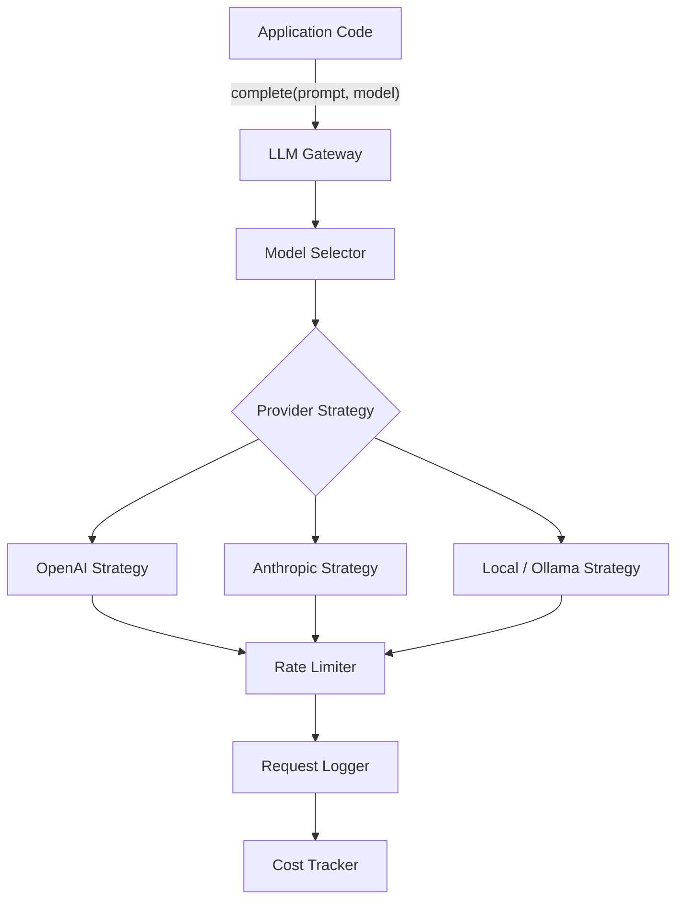
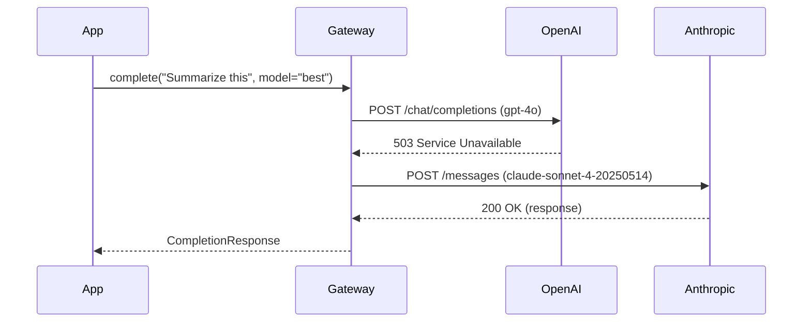
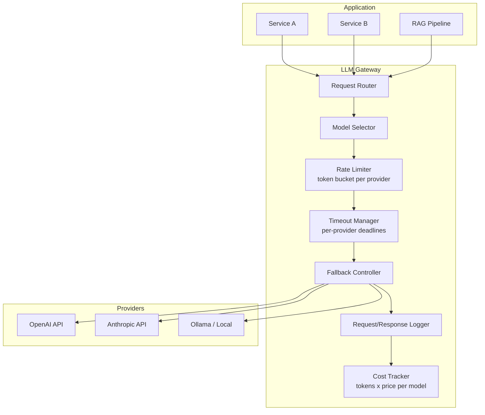

# LLM Gateway

## Context & Problem

Applications that call LLM providers directly end up with provider-specific code scattered across services. When OpenAI has an outage, there is no fallback. When Anthropic changes their API, every call site needs updating. Cost tracking is impossible because requests are made from dozens of places with no central accounting.

An LLM gateway is a proxy layer between the application and LLM providers. All LLM requests flow through a single gateway that handles model selection, provider fallback, rate limiting, cost tracking, and observability. The application code never imports `openai` or `anthropic` directly — it talks to the gateway.

## Design Decisions

### Gateway as Internal Service, Not External Proxy

The gateway is a Python module within the application, not a separate network hop. It exposes a uniform `complete()` interface. Provider-specific details (auth, request format, response parsing) are encapsulated behind a strategy pattern.

This avoids the latency and operational overhead of a separate proxy service while still centralizing all LLM interaction logic.

### Provider Abstraction via Strategy Pattern

Each provider implements a `ProviderStrategy` protocol. The gateway selects a strategy based on the requested model, or falls back to alternatives when the primary provider fails.



### Fallback Chain

When a provider returns a 5xx error or times out, the gateway retries with the next provider in a configured fallback chain. The fallback chain is per-model-capability, not per-provider:



### Rate Limiting and Cost Tracking

Rate limiting uses a token bucket per provider, enforced before the request is sent. Cost is calculated from token counts in the response and logged to a structured cost ledger.

## Architecture



## Code Skeleton

### Models and Configuration

```python
# llm_gateway/models.py

from enum import StrEnum
from decimal import Decimal

from pydantic import BaseModel, ConfigDict


class ModelCapability(StrEnum):
    BEST = "best"
    FAST = "fast"
    CODING = "coding"
    EMBEDDING = "embedding"


class Message(BaseModel):
    role: str  # "system" | "user" | "assistant"
    content: str


class CompletionRequest(BaseModel):
    messages: list[Message]
    model: str | ModelCapability = ModelCapability.BEST
    max_tokens: int = 4096
    temperature: float = 0.7
    metadata: dict[str, str] = {}


class TokenUsage(BaseModel):
    prompt_tokens: int
    completion_tokens: int
    total_tokens: int


class CompletionResponse(BaseModel):
    model_config = ConfigDict(frozen=True)

    content: str
    model: str
    provider: str
    usage: TokenUsage
    latency_ms: float
    cost_usd: Decimal


class ProviderConfig(BaseModel):
    name: str
    api_key: str
    base_url: str
    timeout_seconds: float = 30.0
    max_requests_per_minute: int = 500
    cost_per_1k_input_tokens: Decimal
    cost_per_1k_output_tokens: Decimal
    models: dict[ModelCapability, str]
    # e.g. {"best": "gpt-4o", "fast": "gpt-4o-mini"}
```

### Provider Strategy Protocol

```python
# llm_gateway/providers.py

import time
from typing import Protocol, runtime_checkable
from decimal import Decimal

import httpx

from llm_gateway.models import (
    CompletionRequest,
    CompletionResponse,
    ProviderConfig,
    TokenUsage,
)


@runtime_checkable
class ProviderStrategy(Protocol):
    """Each LLM provider implements this protocol."""

    @property
    def name(self) -> str: ...

    async def complete(
        self,
        request: CompletionRequest,
        model: str,
    ) -> CompletionResponse: ...


class OpenAIStrategy:
    def __init__(self, config: ProviderConfig) -> None:
        self._config = config
        self._client = httpx.AsyncClient(
            base_url=config.base_url,
            headers={"Authorization": f"Bearer {config.api_key}"},
            timeout=httpx.Timeout(config.timeout_seconds),
        )

    @property
    def name(self) -> str:
        return "openai"

    async def complete(
        self,
        request: CompletionRequest,
        model: str,
    ) -> CompletionResponse:
        start = time.monotonic()
        response = await self._client.post(
            "/v1/chat/completions",
            json={
                "model": model,
                "messages": [m.model_dump() for m in request.messages],
                "max_tokens": request.max_tokens,
                "temperature": request.temperature,
            },
        )
        response.raise_for_status()
        data = response.json()
        elapsed_ms = (time.monotonic() - start) * 1000

        usage = TokenUsage(
            prompt_tokens=data["usage"]["prompt_tokens"],
            completion_tokens=data["usage"]["completion_tokens"],
            total_tokens=data["usage"]["total_tokens"],
        )

        cost = (
            usage.prompt_tokens / 1000 * self._config.cost_per_1k_input_tokens
            + usage.completion_tokens / 1000 * self._config.cost_per_1k_output_tokens
        )

        return CompletionResponse(
            content=data["choices"][0]["message"]["content"],
            model=model,
            provider=self.name,
            usage=usage,
            latency_ms=elapsed_ms,
            cost_usd=Decimal(str(cost)),
        )


class AnthropicStrategy:
    def __init__(self, config: ProviderConfig) -> None:
        self._config = config
        self._client = httpx.AsyncClient(
            base_url=config.base_url,
            headers={
                "x-api-key": config.api_key,
                "anthropic-version": "2023-06-01",
            },
            timeout=httpx.Timeout(config.timeout_seconds),
        )

    @property
    def name(self) -> str:
        return "anthropic"

    async def complete(
        self,
        request: CompletionRequest,
        model: str,
    ) -> CompletionResponse:
        start = time.monotonic()

        # Separate system message from conversation
        system = next(
            (m.content for m in request.messages if m.role == "system"), None
        )
        messages = [
            m.model_dump() for m in request.messages if m.role != "system"
        ]

        body: dict = {
            "model": model,
            "messages": messages,
            "max_tokens": request.max_tokens,
            "temperature": request.temperature,
        }
        if system:
            body["system"] = system

        response = await self._client.post("/v1/messages", json=body)
        response.raise_for_status()
        data = response.json()
        elapsed_ms = (time.monotonic() - start) * 1000

        usage = TokenUsage(
            prompt_tokens=data["usage"]["input_tokens"],
            completion_tokens=data["usage"]["output_tokens"],
            total_tokens=data["usage"]["input_tokens"] + data["usage"]["output_tokens"],
        )

        cost = (
            usage.prompt_tokens / 1000 * self._config.cost_per_1k_input_tokens
            + usage.completion_tokens / 1000 * self._config.cost_per_1k_output_tokens
        )

        return CompletionResponse(
            content=data["content"][0]["text"],
            model=model,
            provider=self.name,
            usage=usage,
            latency_ms=elapsed_ms,
            cost_usd=Decimal(str(cost)),
        )
```

### Gateway Core

```python
# llm_gateway/gateway.py

import logging
import asyncio
from datetime import datetime, UTC

import httpx

from llm_gateway.models import (
    CompletionRequest,
    CompletionResponse,
    ModelCapability,
    ProviderConfig,
)
from llm_gateway.providers import ProviderStrategy

logger = logging.getLogger(__name__)


class RateLimiter:
    """Token bucket rate limiter per provider."""

    def __init__(self, max_per_minute: int) -> None:
        self._semaphore = asyncio.Semaphore(max_per_minute)
        self._max = max_per_minute

    async def acquire(self) -> None:
        await self._semaphore.acquire()

    def release(self) -> None:
        self._semaphore.release()


class CostLedger:
    """Accumulates cost per provider and model for reporting."""

    def __init__(self) -> None:
        self._entries: list[dict] = []

    def record(self, response: CompletionResponse, metadata: dict[str, str]) -> None:
        self._entries.append({
            "timestamp": datetime.now(UTC).isoformat(),
            "provider": response.provider,
            "model": response.model,
            "tokens": response.usage.total_tokens,
            "cost_usd": str(response.cost_usd),
            "latency_ms": response.latency_ms,
            **metadata,
        })

    def total_cost_usd(self) -> float:
        return sum(float(e["cost_usd"]) for e in self._entries)


class LLMGateway:
    """Central gateway for all LLM requests."""

    def __init__(
        self,
        providers: dict[str, tuple[ProviderStrategy, ProviderConfig]],
        fallback_order: list[str],
    ) -> None:
        self._providers = providers
        self._fallback_order = fallback_order
        self._rate_limiters: dict[str, RateLimiter] = {
            name: RateLimiter(config.max_requests_per_minute)
            for name, (_, config) in providers.items()
        }
        self._cost_ledger = CostLedger()

    async def complete(self, request: CompletionRequest) -> CompletionResponse:
        """Route a completion request through the fallback chain."""
        errors: list[tuple[str, Exception]] = []

        for provider_name in self._fallback_order:
            strategy, config = self._providers[provider_name]

            # Resolve model name from capability
            if isinstance(request.model, ModelCapability):
                model = config.models.get(request.model)
                if model is None:
                    continue  # This provider doesn't support this capability
            else:
                model = request.model

            try:
                await self._rate_limiters[provider_name].acquire()
                try:
                    response = await strategy.complete(request, model)
                finally:
                    self._rate_limiters[provider_name].release()

                # Log cost
                self._cost_ledger.record(response, request.metadata)

                logger.info(
                    "LLM request completed",
                    extra={
                        "provider": provider_name,
                        "model": model,
                        "tokens": response.usage.total_tokens,
                        "latency_ms": response.latency_ms,
                        "cost_usd": str(response.cost_usd),
                    },
                )
                return response

            except httpx.TimeoutException as exc:
                logger.warning(f"Timeout from {provider_name}/{model}: {exc}")
                errors.append((provider_name, exc))
            except httpx.HTTPStatusError as exc:
                if exc.response.status_code >= 500:
                    logger.warning(f"Server error from {provider_name}/{model}: {exc}")
                    errors.append((provider_name, exc))
                else:
                    # 4xx errors are not retryable — propagate immediately
                    raise

        raise RuntimeError(
            f"All providers failed: {[(name, str(e)) for name, e in errors]}"
        )

    @property
    def cost_ledger(self) -> CostLedger:
        return self._cost_ledger
```

### Wiring the Gateway

```python
# llm_gateway/factory.py

from decimal import Decimal

from llm_gateway.models import ModelCapability, ProviderConfig
from llm_gateway.providers import OpenAIStrategy, AnthropicStrategy
from llm_gateway.gateway import LLMGateway


def create_gateway(settings: dict) -> LLMGateway:
    openai_config = ProviderConfig(
        name="openai",
        api_key=settings["OPENAI_API_KEY"],
        base_url="https://api.openai.com",
        timeout_seconds=30.0,
        max_requests_per_minute=500,
        cost_per_1k_input_tokens=Decimal("0.0025"),
        cost_per_1k_output_tokens=Decimal("0.01"),
        models={
            ModelCapability.BEST: "gpt-4o",
            ModelCapability.FAST: "gpt-4o-mini",
            ModelCapability.CODING: "gpt-4o",
        },
    )

    anthropic_config = ProviderConfig(
        name="anthropic",
        api_key=settings["ANTHROPIC_API_KEY"],
        base_url="https://api.anthropic.com",
        timeout_seconds=60.0,
        max_requests_per_minute=300,
        cost_per_1k_input_tokens=Decimal("0.003"),
        cost_per_1k_output_tokens=Decimal("0.015"),
        models={
            ModelCapability.BEST: "claude-sonnet-4-20250514",
            ModelCapability.FAST: "claude-haiku-4-20250414",
            ModelCapability.CODING: "claude-sonnet-4-20250514",
        },
    )

    providers = {
        "openai": (OpenAIStrategy(openai_config), openai_config),
        "anthropic": (AnthropicStrategy(anthropic_config), anthropic_config),
    }

    return LLMGateway(
        providers=providers,
        fallback_order=["anthropic", "openai"],
    )
```

## Failure Modes

| Failure | Cause | Mitigation |
|---|---|---|
| All providers down | Simultaneous outages or network issue | Circuit breaker per provider, degrade gracefully (queue requests or return cached response) |
| Cost runaway | Bug causing infinite retry loops or high token usage | Per-request max token cap, daily cost budget with hard stop |
| Rate limit exceeded | Burst traffic beyond provider quota | Token bucket with rejection (fail fast) rather than unbounded queuing |
| Response format mismatch | Provider API changes response schema | Validate response structure before parsing, version-pin API versions |
| Timeout cascade | Slow provider holds connection while fallback also slow | Per-provider timeout, total request deadline across all retries |
| Credential leak in logs | API key logged in request headers | Never log headers, redact authorization fields in structured logs |

## Related Documents

- [RAG Architecture](rag-architecture.md) — uses the gateway for generation step
- [Prompt Management](prompt-management.md) — templates rendered before sending through gateway
- [OpenFGA LLM Permissions](../authorization/openfga-llm-permissions.md) — authorization for LLM-accessed resources
- [Dependency Inversion](../../principles/dependency-inversion.md) — provider strategies as inverted dependencies
- [FastAPI Modular Layout](../api/fastapi-modular-layout.md) — exposing the gateway as an API module
