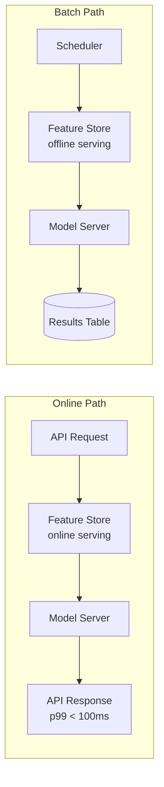
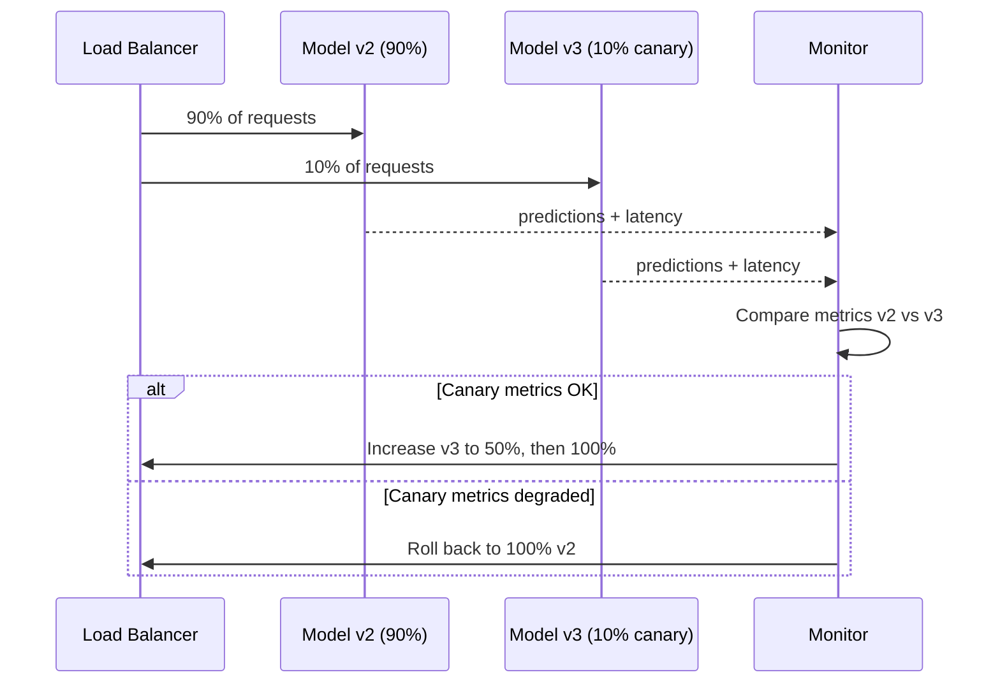
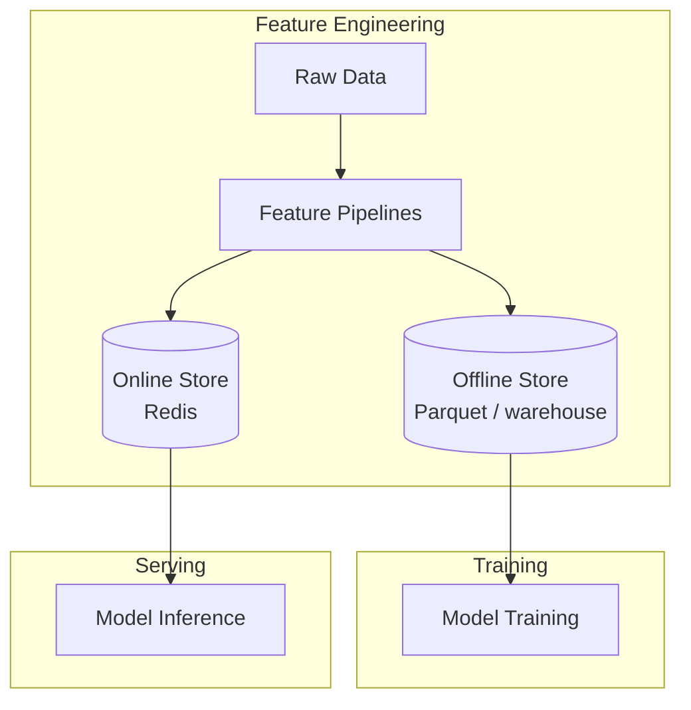
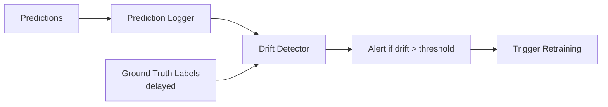
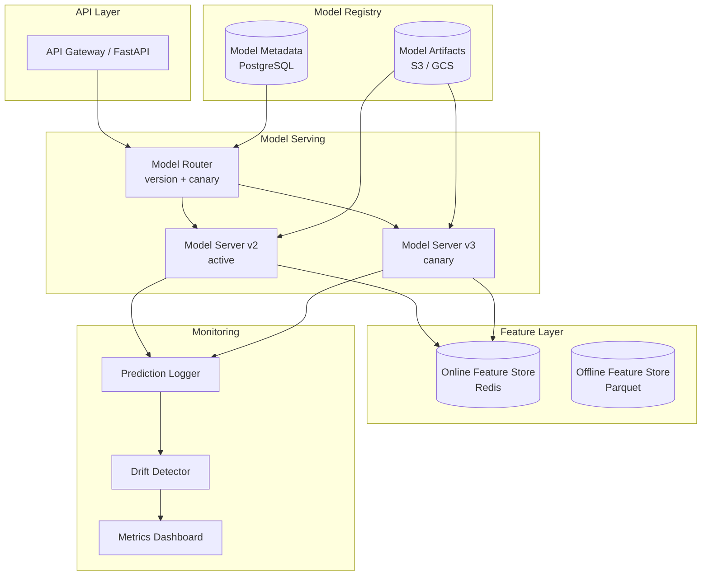

# Model Serving

## Context & Problem

A trained ML model sitting in a notebook is not useful. It needs to serve predictions — either in real-time (online inference) or on schedules (batch inference). Getting this right means solving model versioning, deployment safety (canary rollouts), input preparation (feature stores), and ongoing monitoring (drift detection).

The hard part is not making one prediction. It is making millions of predictions reliably while knowing when the model's performance has degraded and it is time to retrain or roll back.

## Design Decisions

### Online vs Batch Inference

**Online inference** — A request arrives, features are assembled, the model predicts, and the response is returned. Latency matters (p99 < 100ms for many use cases). Use when decisions are real-time: fraud detection, recommendations, search ranking.

**Batch inference** — Predictions are computed over a dataset on a schedule (hourly, daily). Results are written to a table or cache for later consumption. Use when latency is not critical: credit scoring overnight, weekly churn predictions, report generation.

Many systems need both: batch for bulk scoring, online for real-time overrides.



### Model Versioning

Every model artifact is versioned with a unique identifier that includes the model name, version number, and training metadata. The serving layer maps a logical model name to a specific version, allowing rollback without redeployment.

```
models/
├── fraud-detector/
│   ├── v1/
│   │   ├── model.onnx
│   │   ├── metadata.json   # training date, metrics, features used
│   │   └── config.json     # preprocessing params, thresholds
│   ├── v2/
│   │   ├── model.onnx
│   │   ├── metadata.json
│   │   └── config.json
│   └── serving.json         # {"active": "v2", "canary": "v3", "canary_pct": 0.1}
```

### Canary Deployments

New model versions are deployed to a fraction of traffic first. If metrics degrade, the canary is rolled back automatically. If metrics hold, traffic is gradually increased until the new version is fully promoted.



### Feature Stores

Feature stores decouple feature engineering from model serving. Features are computed once and served consistently to both training and inference, avoiding training-serving skew.

**Online store** — Low-latency key-value lookups for real-time inference. Backed by Redis or DynamoDB.

**Offline store** — Historical feature values for training. Backed by a data warehouse or Parquet files.



### Model Monitoring and Drift Detection

Models degrade over time as the real world drifts from the training data. Monitoring catches this before business metrics suffer.

**Data drift** — Input feature distributions shift. Detected by comparing recent feature statistics against a training baseline (KL divergence, PSI, Kolmogorov-Smirnov test).

**Prediction drift** — Output distribution shifts even if inputs look similar. Detected by monitoring prediction histograms.

**Performance drift** — Actual outcomes (when available) diverge from predictions. Detected by tracking accuracy, precision, recall on labeled samples.



## Architecture



## Code Skeleton

### Model Server Protocol

```python
# model_serving/protocol.py

from typing import Any, Protocol, runtime_checkable

from pydantic import BaseModel, ConfigDict


class PredictionRequest(BaseModel):
    model_name: str
    features: dict[str, Any]
    metadata: dict[str, str] = {}


class PredictionResponse(BaseModel):
    model_config = ConfigDict(frozen=True)

    prediction: Any
    model_name: str
    model_version: str
    latency_ms: float
    metadata: dict[str, str] = {}


@runtime_checkable
class ModelServer(Protocol):
    """Protocol for serving predictions from a model."""

    @property
    def model_name(self) -> str: ...

    @property
    def model_version(self) -> str: ...

    async def predict(self, features: dict[str, Any]) -> Any: ...

    async def health_check(self) -> bool: ...
```

### ONNX Model Server Implementation

```python
# model_serving/onnx_server.py

import time
from typing import Any
from pathlib import Path

import numpy as np
import onnxruntime as ort

from model_serving.protocol import ModelServer


class ONNXModelServer:
    """Serves predictions from an ONNX model."""

    def __init__(
        self,
        model_path: Path,
        model_name: str,
        model_version: str,
        preprocessing_config: dict[str, Any] | None = None,
    ) -> None:
        self._model_name = model_name
        self._model_version = model_version
        self._config = preprocessing_config or {}
        self._session = ort.InferenceSession(
            str(model_path),
            providers=["CPUExecutionProvider"],
        )
        self._input_name = self._session.get_inputs()[0].name

    @property
    def model_name(self) -> str:
        return self._model_name

    @property
    def model_version(self) -> str:
        return self._model_version

    async def predict(self, features: dict[str, Any]) -> Any:
        # Prepare input array from feature dict
        input_array = self._prepare_input(features)
        outputs = self._session.run(None, {self._input_name: input_array})
        return outputs[0].tolist()

    async def health_check(self) -> bool:
        try:
            dummy = np.zeros(
                (1, len(self._session.get_inputs()[0].shape) or 1),
                dtype=np.float32,
            )
            self._session.run(None, {self._input_name: dummy})
            return True
        except Exception:
            return False

    def _prepare_input(self, features: dict[str, Any]) -> np.ndarray:
        """Convert feature dict to numpy array in expected order."""
        feature_order = self._config.get("feature_order", sorted(features.keys()))
        values = [float(features[f]) for f in feature_order]
        return np.array([values], dtype=np.float32)
```

### Model Router with Canary Support

```python
# model_serving/router.py

import random
import logging
from typing import Any

from pydantic import BaseModel

from model_serving.protocol import ModelServer, PredictionRequest, PredictionResponse

logger = logging.getLogger(__name__)


class CanaryConfig(BaseModel):
    canary_version: str
    canary_percentage: float  # 0.0 to 1.0


class ModelRouter:
    """Routes prediction requests to the correct model version, with canary support."""

    def __init__(self) -> None:
        self._models: dict[str, dict[str, ModelServer]] = {}
        # model_name -> version -> server
        self._active_versions: dict[str, str] = {}
        self._canaries: dict[str, CanaryConfig] = {}

    def register(self, server: ModelServer) -> None:
        if server.model_name not in self._models:
            self._models[server.model_name] = {}
        self._models[server.model_name][server.model_version] = server

    def set_active(self, model_name: str, version: str) -> None:
        if model_name not in self._models or version not in self._models[model_name]:
            raise ValueError(f"Model {model_name} v{version} not registered")
        self._active_versions[model_name] = version

    def set_canary(self, model_name: str, config: CanaryConfig) -> None:
        self._canaries[model_name] = config
        logger.info(
            f"Canary set for {model_name}: "
            f"v{config.canary_version} at {config.canary_percentage:.0%}"
        )

    def remove_canary(self, model_name: str) -> None:
        self._canaries.pop(model_name, None)

    async def predict(self, request: PredictionRequest) -> PredictionResponse:
        import time

        server = self._resolve(request.model_name)
        start = time.monotonic()
        prediction = await server.predict(request.features)
        latency_ms = (time.monotonic() - start) * 1000

        return PredictionResponse(
            prediction=prediction,
            model_name=server.model_name,
            model_version=server.model_version,
            latency_ms=latency_ms,
            metadata=request.metadata,
        )

    def _resolve(self, model_name: str) -> ModelServer:
        if model_name not in self._models:
            raise KeyError(f"Unknown model: {model_name}")

        # Check canary
        canary = self._canaries.get(model_name)
        if canary and random.random() < canary.canary_percentage:
            return self._models[model_name][canary.canary_version]

        version = self._active_versions.get(model_name)
        if version is None:
            raise KeyError(f"No active version for model: {model_name}")
        return self._models[model_name][version]
```

### Drift Detector

```python
# model_serving/monitoring.py

import logging
from collections import deque

import numpy as np
from pydantic import BaseModel

logger = logging.getLogger(__name__)


class DriftReport(BaseModel):
    feature_name: str
    psi_score: float
    is_drifted: bool
    baseline_mean: float
    current_mean: float


class DriftDetector:
    """Monitors feature and prediction distributions for drift."""

    def __init__(
        self,
        baseline_stats: dict[str, dict[str, float]],
        # {"feature_name": {"mean": ..., "std": ..., "hist": [...]}}
        psi_threshold: float = 0.2,
        window_size: int = 1000,
    ) -> None:
        self._baseline = baseline_stats
        self._threshold = psi_threshold
        self._window_size = window_size
        self._buffers: dict[str, deque[float]] = {
            name: deque(maxlen=window_size) for name in baseline_stats
        }

    def record(self, features: dict[str, float]) -> None:
        """Record a set of feature values for drift monitoring."""
        for name, value in features.items():
            if name in self._buffers:
                self._buffers[name].append(value)

    def check_drift(self) -> list[DriftReport]:
        """Check all features for drift. Returns reports for drifted features."""
        reports: list[DriftReport] = []

        for name, buffer in self._buffers.items():
            if len(buffer) < self._window_size // 2:
                continue  # Not enough data

            baseline = self._baseline[name]
            current_values = list(buffer)
            current_mean = float(np.mean(current_values))

            psi = self._calculate_psi(
                baseline_mean=baseline["mean"],
                baseline_std=baseline["std"],
                current_values=current_values,
            )

            report = DriftReport(
                feature_name=name,
                psi_score=psi,
                is_drifted=psi > self._threshold,
                baseline_mean=baseline["mean"],
                current_mean=current_mean,
            )

            if report.is_drifted:
                logger.warning(
                    f"Drift detected for '{name}': PSI={psi:.3f} > {self._threshold}"
                )

            reports.append(report)

        return reports

    def _calculate_psi(
        self,
        baseline_mean: float,
        baseline_std: float,
        current_values: list[float],
        n_bins: int = 10,
    ) -> float:
        """Population Stability Index between baseline and current distributions."""
        current = np.array(current_values)

        # Create bins from baseline distribution
        bin_edges = np.linspace(
            baseline_mean - 3 * baseline_std,
            baseline_mean + 3 * baseline_std,
            n_bins + 1,
        )

        # Baseline expected proportions (assume normal)
        from scipy import stats

        baseline_dist = stats.norm(loc=baseline_mean, scale=baseline_std)
        expected = np.diff(baseline_dist.cdf(bin_edges))
        expected = np.clip(expected, 1e-6, None)
        expected = expected / expected.sum()

        # Current actual proportions
        actual, _ = np.histogram(current, bins=bin_edges)
        actual = actual / max(actual.sum(), 1)
        actual = np.clip(actual, 1e-6, None)

        # PSI
        psi = float(np.sum((actual - expected) * np.log(actual / expected)))
        return psi
```

### FastAPI Serving Layer

```python
# model_serving/api.py

from contextlib import asynccontextmanager
from collections.abc import AsyncGenerator
from pathlib import Path

from fastapi import FastAPI, HTTPException

from model_serving.protocol import PredictionRequest, PredictionResponse
from model_serving.router import ModelRouter, CanaryConfig
from model_serving.onnx_server import ONNXModelServer
from model_serving.monitoring import DriftDetector

router = ModelRouter()
drift_detector: DriftDetector | None = None


@asynccontextmanager
async def lifespan(app: FastAPI) -> AsyncGenerator[None]:
    global drift_detector

    # Load models on startup
    fraud_v2 = ONNXModelServer(
        model_path=Path("models/fraud-detector/v2/model.onnx"),
        model_name="fraud-detector",
        model_version="v2",
        preprocessing_config={"feature_order": ["amount", "hour", "country_risk"]},
    )
    fraud_v3 = ONNXModelServer(
        model_path=Path("models/fraud-detector/v3/model.onnx"),
        model_name="fraud-detector",
        model_version="v3",
        preprocessing_config={"feature_order": ["amount", "hour", "country_risk"]},
    )

    router.register(fraud_v2)
    router.register(fraud_v3)
    router.set_active("fraud-detector", "v2")
    router.set_canary("fraud-detector", CanaryConfig(
        canary_version="v3",
        canary_percentage=0.1,
    ))

    drift_detector = DriftDetector(
        baseline_stats={
            "amount": {"mean": 150.0, "std": 200.0},
            "hour": {"mean": 12.0, "std": 6.0},
            "country_risk": {"mean": 0.3, "std": 0.2},
        },
        psi_threshold=0.2,
    )

    yield


app = FastAPI(title="Model Serving API", lifespan=lifespan)


@app.post("/predict", response_model=PredictionResponse)
async def predict(request: PredictionRequest) -> PredictionResponse:
    try:
        response = await router.predict(request)
    except KeyError as e:
        raise HTTPException(status_code=404, detail=str(e))

    # Record features for drift monitoring
    if drift_detector is not None:
        numeric_features = {
            k: float(v) for k, v in request.features.items()
            if isinstance(v, (int, float))
        }
        drift_detector.record(numeric_features)

    return response


@app.get("/models/{model_name}/health")
async def model_health(model_name: str) -> dict:
    if model_name not in router._models:
        raise HTTPException(status_code=404, detail=f"Unknown model: {model_name}")

    health = {}
    for version, server in router._models[model_name].items():
        health[version] = await server.health_check()
    return {"model": model_name, "versions": health}


@app.get("/models/{model_name}/drift")
async def check_drift(model_name: str) -> dict:
    if drift_detector is None:
        raise HTTPException(status_code=503, detail="Drift detector not initialized")

    reports = drift_detector.check_drift()
    return {
        "model": model_name,
        "features": [r.model_dump() for r in reports],
        "any_drift": any(r.is_drifted for r in reports),
    }
```

## Failure Modes

| Failure | Cause | Mitigation |
|---|---|---|
| Training-serving skew | Features computed differently at training vs inference time | Feature store ensures consistent feature computation |
| Silent model degradation | Model accuracy drops but no alerts fire | Monitor prediction distribution + ground truth labels when available |
| Canary not caught | Bad model deployed, canary window too short or metrics too coarse | Statistical significance tests before promotion, automated rollback triggers |
| Cold start latency | Model loaded on first request instead of at startup | Pre-load models during application startup (lifespan handler) |
| Feature store unavailable | Redis/cache down, cannot assemble features | Fallback to computed features from request data, degrade gracefully |
| Model version conflict | Two deployments promote different versions simultaneously | Optimistic locking on serving config, single writer for promotions |
| Memory exhaustion | Multiple model versions loaded simultaneously | Limit concurrent loaded versions, unload old versions after canary completes |
| Stale predictions in batch | Batch job uses features from hours ago | Timestamp features, alert if feature freshness exceeds SLA |

## Related Documents

- [LLM Gateway](llm-gateway.md) — similar routing and fallback patterns for LLM providers
- [FastAPI Modular Layout](../api/fastapi-modular-layout.md) — structuring the serving API
- [Dependency Inversion](../../principles/dependency-inversion.md) — ModelServer protocol as an inverted dependency
- [Embedding Pipelines](embedding-pipelines.md) — embedding models are a special case of model serving
- [Kafka Topology](../messaging/kafka-topology.md) — streaming predictions via event-driven serving
