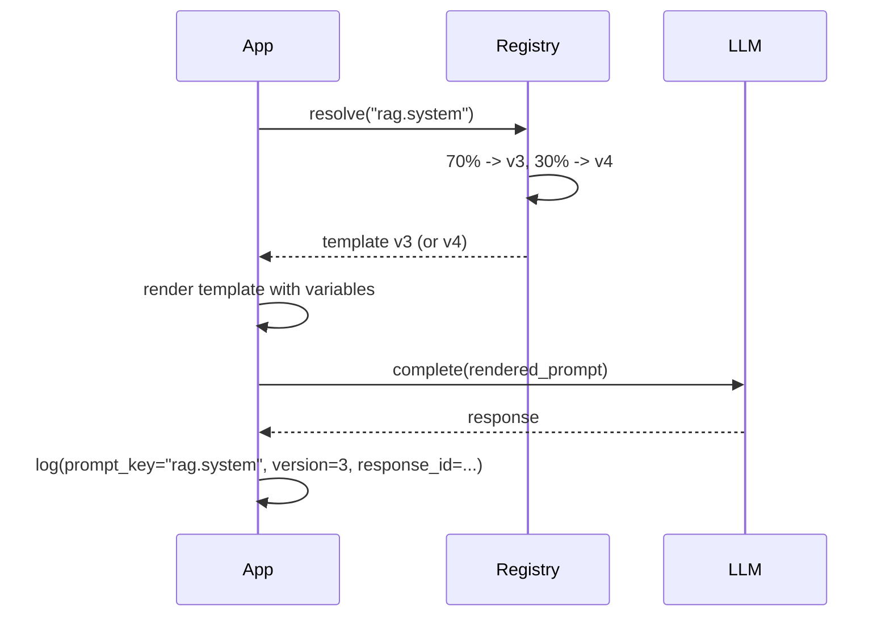
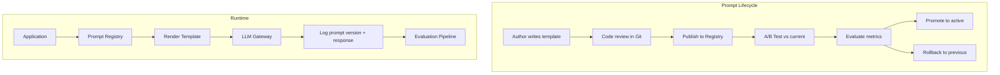

# Prompt Management

## Context & Problem

Prompts start as hardcoded strings in application code. Someone changes a word, redeploys the entire service, and retrieval quality drops because no one tested the new wording. There is no history of what the prompt said last week, no way to compare two versions, and no metrics on whether the current prompt is actually better than the previous one.

Prompts are not code — they are configuration that changes at a different cadence than code and needs its own versioning, testing, and evaluation lifecycle. Treating prompts as first-class artifacts means they can be versioned, A/B tested, evaluated against quality metrics, and rolled back without a code deploy.

## Design Decisions

### Prompts as Versioned Templates

A prompt is a Jinja2-style template with named variables. Each prompt has a unique key (e.g., `rag.system`, `summarize.email`) and a version history. The active version is resolved at runtime.

```mermaid
graph TD
    REG[Prompt Registry] --> |resolve key + version| TPL[Prompt Template]
    TPL --> |render with variables| RENDERED[Rendered Prompt]
    RENDERED --> GW[LLM Gateway]

    subgraph Version History
        V1[v1 - initial]
        V2[v2 - added citations]
        V3[v3 - reduced hallucination]
    end

    REG --> Version History
```

### Storage and Version Control

Prompts are stored in a database table with immutable versions. Each version records who created it, when, and why. Prompts can also be stored as files in a Git repository for code review workflows — the database is the runtime source of truth, Git is the review mechanism.

```sql
CREATE TABLE prompts (
    id UUID PRIMARY KEY DEFAULT gen_random_uuid(),
    key TEXT NOT NULL,           -- e.g. "rag.system"
    version INTEGER NOT NULL,
    template TEXT NOT NULL,
    variables TEXT[] NOT NULL,   -- expected variable names
    description TEXT,
    created_by TEXT NOT NULL,
    created_at TIMESTAMPTZ NOT NULL DEFAULT now(),
    is_active BOOLEAN NOT NULL DEFAULT false,
    UNIQUE (key, version)
);

CREATE INDEX ON prompts (key, is_active) WHERE is_active = true;
```

### A/B Testing

When two prompt versions need comparison, the registry supports traffic splitting. A percentage of requests get version A, the rest get version B. Each response is tagged with the prompt version for downstream evaluation.



### Evaluation Metrics

Prompt quality is measured on multiple dimensions. Each evaluation produces a score that is stored alongside the prompt version and response.

| Metric | What It Measures | How |
|---|---|---|
| **Relevance** | Does the answer address the question? | LLM-as-judge: "Rate 1-5 how well this answer addresses the question" |
| **Faithfulness** | Is the answer grounded in the provided context? | Compare claims in the answer against source chunks |
| **Toxicity** | Does the output contain harmful content? | Classifier model or keyword filter |
| **Format compliance** | Does the output follow the requested format? | Regex or schema validation |
| **Latency** | Time to generate the response | Measured at the gateway |

Evaluation can run online (sample of production traffic) or offline (against a curated test set).

## Architecture



## Code Skeleton

### Prompt Models

```python
# prompt_management/models.py

from datetime import datetime

from pydantic import BaseModel, ConfigDict


class PromptVersion(BaseModel):
    model_config = ConfigDict(frozen=True)

    key: str
    version: int
    template: str
    variables: list[str]
    description: str
    created_by: str
    created_at: datetime
    is_active: bool


class ABTestConfig(BaseModel):
    key: str
    control_version: int
    treatment_version: int
    treatment_percentage: float  # 0.0 to 1.0


class EvaluationResult(BaseModel):
    prompt_key: str
    prompt_version: int
    response_id: str
    relevance_score: float | None = None
    faithfulness_score: float | None = None
    toxicity_score: float | None = None
    format_valid: bool | None = None
```

### Prompt Registry

```python
# prompt_management/registry.py

import random
import logging
from typing import Protocol, runtime_checkable

import jinja2

from prompt_management.models import ABTestConfig, PromptVersion

logger = logging.getLogger(__name__)


@runtime_checkable
class PromptStore(Protocol):
    """Storage backend for prompt versions."""

    async def get_active(self, key: str) -> PromptVersion | None: ...
    async def get_version(self, key: str, version: int) -> PromptVersion | None: ...
    async def save(self, prompt: PromptVersion) -> None: ...
    async def set_active(self, key: str, version: int) -> None: ...
    async def list_versions(self, key: str) -> list[PromptVersion]: ...


class PromptRegistry:
    """Resolves, renders, and manages prompt templates."""

    def __init__(self, store: PromptStore) -> None:
        self._store = store
        self._ab_tests: dict[str, ABTestConfig] = {}
        self._env = jinja2.Environment(
            undefined=jinja2.StrictUndefined,
            autoescape=False,
        )

    async def render(
        self,
        key: str,
        variables: dict[str, str],
        version: int | None = None,
    ) -> tuple[str, int]:
        """Render a prompt template. Returns (rendered_text, version_used)."""
        prompt = await self._resolve(key, version)
        if prompt is None:
            raise KeyError(f"No prompt found for key '{key}'")

        # Validate that all required variables are provided
        missing = set(prompt.variables) - set(variables.keys())
        if missing:
            raise ValueError(f"Missing variables for prompt '{key}': {missing}")

        template = self._env.from_string(prompt.template)
        rendered = template.render(**variables)
        return rendered, prompt.version

    async def _resolve(
        self,
        key: str,
        version: int | None = None,
    ) -> PromptVersion | None:
        """Resolve which prompt version to use, considering A/B tests."""
        if version is not None:
            return await self._store.get_version(key, version)

        # Check for active A/B test
        ab = self._ab_tests.get(key)
        if ab is not None:
            if random.random() < ab.treatment_percentage:
                return await self._store.get_version(key, ab.treatment_version)
            else:
                return await self._store.get_version(key, ab.control_version)

        return await self._store.get_active(key)

    async def publish(
        self,
        key: str,
        template: str,
        variables: list[str],
        description: str,
        created_by: str,
    ) -> PromptVersion:
        """Publish a new version of a prompt (does not activate it)."""
        from datetime import datetime, UTC

        existing = await self._store.list_versions(key)
        next_version = max((p.version for p in existing), default=0) + 1

        prompt = PromptVersion(
            key=key,
            version=next_version,
            template=template,
            variables=variables,
            description=description,
            created_by=created_by,
            created_at=datetime.now(UTC),
            is_active=False,
        )

        await self._store.save(prompt)
        logger.info(f"Published prompt '{key}' v{next_version}")
        return prompt

    async def activate(self, key: str, version: int) -> None:
        """Set a prompt version as the active version."""
        await self._store.set_active(key, version)
        logger.info(f"Activated prompt '{key}' v{version}")

    async def rollback(self, key: str) -> PromptVersion | None:
        """Roll back to the previous active version."""
        versions = await self._store.list_versions(key)
        active_versions = sorted(
            [v for v in versions if v.is_active],
            key=lambda v: v.version,
            reverse=True,
        )

        if len(active_versions) < 1:
            return None

        current = active_versions[0]
        # Find the version before current
        all_sorted = sorted(versions, key=lambda v: v.version, reverse=True)
        previous = next(
            (v for v in all_sorted if v.version < current.version), None
        )

        if previous is None:
            return None

        await self._store.set_active(key, previous.version)
        logger.info(
            f"Rolled back prompt '{key}' from v{current.version} to v{previous.version}"
        )
        return previous

    def start_ab_test(self, config: ABTestConfig) -> None:
        """Start an A/B test for a prompt key."""
        self._ab_tests[config.key] = config
        logger.info(
            f"A/B test started for '{config.key}': "
            f"v{config.control_version} vs v{config.treatment_version} "
            f"({config.treatment_percentage:.0%} treatment)"
        )

    def stop_ab_test(self, key: str) -> None:
        """Stop an A/B test, reverting to the active version."""
        self._ab_tests.pop(key, None)
        logger.info(f"A/B test stopped for '{key}'")
```

### Prompt Evaluator

```python
# prompt_management/evaluator.py

from typing import Protocol, runtime_checkable

from prompt_management.models import EvaluationResult


@runtime_checkable
class LLMJudge(Protocol):
    """Uses an LLM to evaluate response quality."""

    async def score_relevance(self, question: str, answer: str) -> float: ...
    async def score_faithfulness(
        self, answer: str, context: str
    ) -> float: ...


class PromptEvaluator:
    """Evaluates prompt quality across multiple dimensions."""

    def __init__(
        self,
        judge: LLMJudge,
        toxicity_keywords: set[str] | None = None,
    ) -> None:
        self._judge = judge
        self._toxic_words = toxicity_keywords or set()

    async def evaluate(
        self,
        prompt_key: str,
        prompt_version: int,
        response_id: str,
        question: str,
        answer: str,
        context: str = "",
    ) -> EvaluationResult:
        relevance = await self._judge.score_relevance(question, answer)
        faithfulness = (
            await self._judge.score_faithfulness(answer, context)
            if context
            else None
        )
        toxicity = self._check_toxicity(answer)

        return EvaluationResult(
            prompt_key=prompt_key,
            prompt_version=prompt_version,
            response_id=response_id,
            relevance_score=relevance,
            faithfulness_score=faithfulness,
            toxicity_score=toxicity,
        )

    def _check_toxicity(self, text: str) -> float:
        """Simple keyword-based toxicity check. Replace with a classifier in production."""
        words = text.lower().split()
        toxic_count = sum(1 for w in words if w in self._toxic_words)
        return min(toxic_count / max(len(words), 1), 1.0)
```

### Usage Example

```python
# Example: using the prompt registry in a RAG pipeline

async def rag_with_managed_prompts(
    registry: PromptRegistry,
    query: str,
    context: str,
    llm_client: LLMClient,
) -> dict:
    rendered_prompt, version = await registry.render(
        key="rag.system",
        variables={"context": context},
    )

    response = await llm_client.complete(
        system=rendered_prompt,
        user=query,
    )

    # Tag response with prompt version for evaluation
    return {
        "answer": response["content"],
        "prompt_version": version,
        "model": response["model"],
    }
```

## Failure Modes

| Failure | Cause | Mitigation |
|---|---|---|
| Missing variable | Template references `{{context}}` but caller passes `{context_text}` | `StrictUndefined` in Jinja2 raises immediately, validated variable list |
| Prompt injection | User input rendered into template without escaping | Never render user input into system prompts, keep user content in user messages |
| A/B test bias | Non-random assignment (e.g., by user ID hash colliding) | Use cryptographic randomness, verify distribution in metrics |
| Registry unavailable | Database down, cannot resolve prompt | Cache the last-known active prompt in memory, serve from cache on failure |
| Version conflict | Two authors publish the same key simultaneously | Database unique constraint on (key, version), optimistic concurrency |
| Rollback to broken version | Previous version was also bad | Maintain a known-good baseline version that can always be restored |

## Related Documents

- [LLM Gateway](llm-gateway.md) — rendered prompts are sent through the gateway
- [RAG Architecture](rag-architecture.md) — RAG system prompts managed here
- [Contract-First Design](../../principles/contract-first-design.md) — prompt templates as contracts between application and LLM
- [Event Schema Evolution](../messaging/event-schema-evolution.md) — similar versioning concerns for prompt schemas
- [Dependency Inversion](../../principles/dependency-inversion.md) — PromptStore as an inverted dependency
