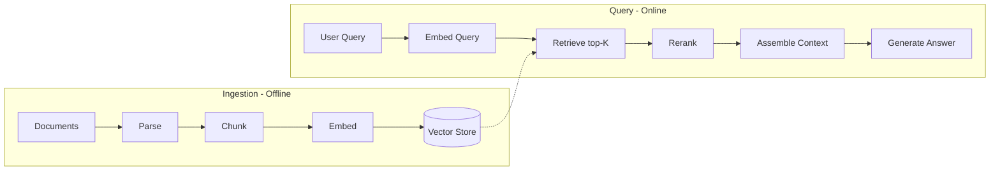
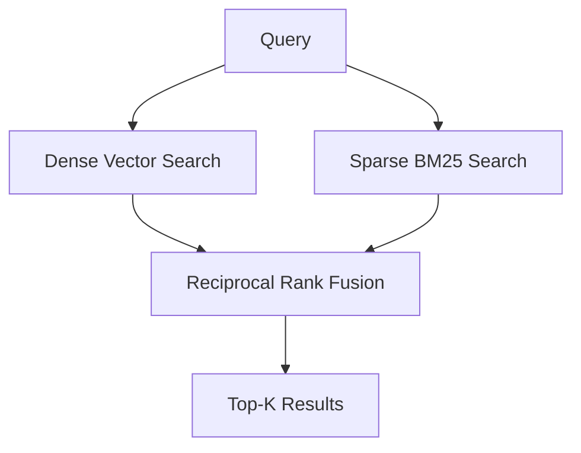
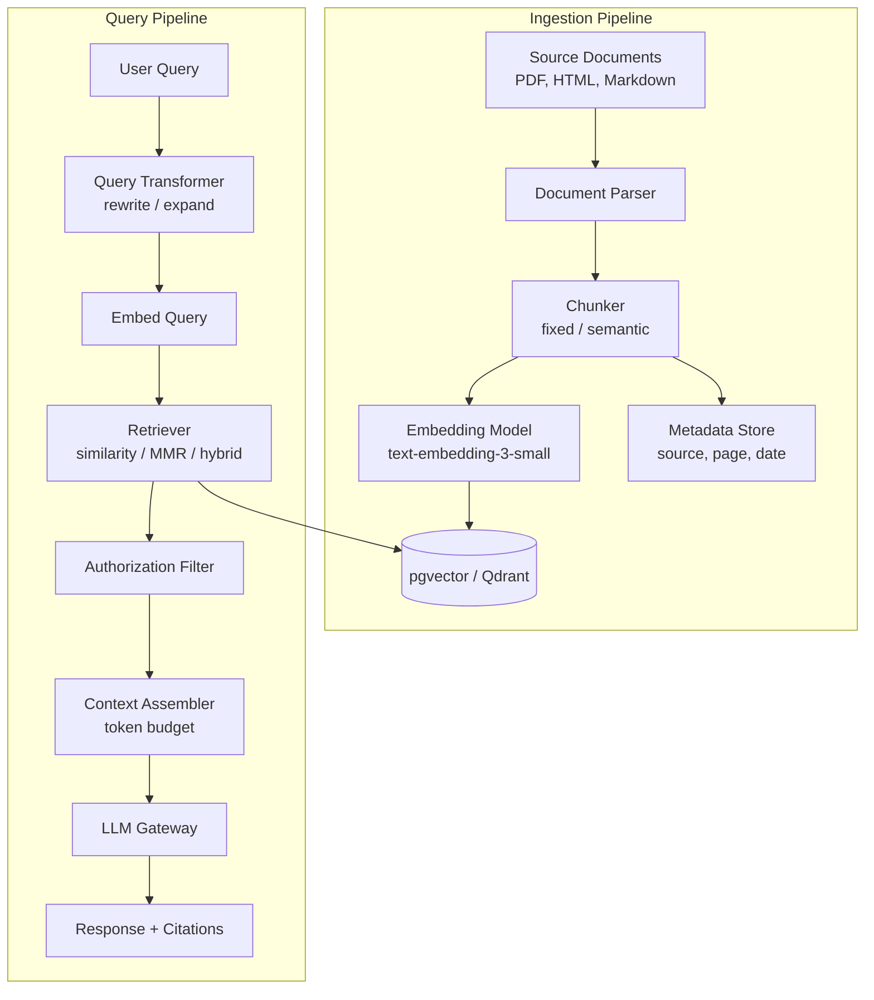

# RAG Architecture

## Context & Problem

LLMs have a knowledge cutoff and no access to private data. Asking "What was our Q4 revenue?" gets a hallucinated answer or a refusal. Fine-tuning is expensive, slow, and still cannot handle frequently changing data.

Retrieval-Augmented Generation (RAG) solves this by retrieving relevant documents at query time and injecting them into the LLM's context window. The LLM generates answers grounded in actual data rather than parametric memory. This works for private knowledge bases, documentation, support tickets, and any corpus that changes faster than a model can be retrained.

The challenge is not retrieval or generation in isolation — it is the end-to-end pipeline: how documents are chunked, how queries are transformed, how context is assembled within token limits, and how the system degrades when retrieval returns poor results.

## Design Decisions

### End-to-End Pipeline



The pipeline splits into two phases. Ingestion runs offline (or on document upload). Query runs per-request and must be fast.

### Chunking Strategies

Chunks are the atomic unit of retrieval. Chunking wrong means either retrieving irrelevant fragments or missing relevant content entirely.

**Fixed-size chunking** — Split by token count (e.g., 512 tokens) with overlap (e.g., 64 tokens). Simple, predictable, works well for homogeneous text.

**Semantic chunking** — Split at paragraph or section boundaries. Respects document structure. Produces variable-size chunks that may need post-filtering by size.

**Hierarchical chunking** — Store both large parent chunks (for context) and small child chunks (for precise retrieval). Retrieve on child chunks, expand to parent chunks for the LLM.

The right strategy depends on the corpus. Technical documentation benefits from semantic chunking at heading boundaries. Transcripts and logs work fine with fixed-size.

### Retrieval Strategies

**Similarity search** — Cosine similarity between query embedding and stored embeddings. Returns the K nearest neighbors. Simple and fast but can return redundant results.

**Maximal Marginal Relevance (MMR)** — Balances relevance to the query with diversity among results. Reduces redundancy when multiple chunks say similar things.

**Hybrid search** — Combines dense vector search with sparse keyword search (BM25). Catches exact-match terms that embedding similarity might miss.



### Context Window Management

The context window is finite. A 128K-token window sounds large until you realize that 50 retrieved chunks of 512 tokens each consume 25K tokens, plus the system prompt, conversation history, and output tokens.

Rules:
1. **Budget tokens explicitly** — reserve space for system prompt, history, and generation before allocating retrieval tokens.
2. **Truncate chunks to fit** — if the total exceeds budget, drop the least-relevant chunks first (they are already sorted by relevance).
3. **Compress when needed** — for long chunks, summarize them before injection (adds latency but fits more information).

## Architecture



## Code Skeleton

### Core Types

```python
# rag/models.py

from pydantic import BaseModel, ConfigDict


class Chunk(BaseModel):
    model_config = ConfigDict(frozen=True)

    id: str
    content: str
    document_id: str
    metadata: dict[str, str]
    token_count: int


class RetrievedChunk(BaseModel):
    chunk: Chunk
    score: float


class RAGResponse(BaseModel):
    answer: str
    chunks_used: list[RetrievedChunk]
    model: str
    total_tokens: int
```

### Retriever Protocol and Implementations

```python
# rag/retriever.py

from typing import Protocol, runtime_checkable

import numpy as np

from rag.models import Chunk, RetrievedChunk


@runtime_checkable
class Retriever(Protocol):
    """Retrieval strategy for finding relevant chunks."""

    async def retrieve(
        self,
        query_embedding: list[float],
        top_k: int = 10,
    ) -> list[RetrievedChunk]: ...


class SimilarityRetriever:
    """Cosine similarity retrieval against a vector store."""

    def __init__(self, vector_store: "VectorStore") -> None:
        self._store = vector_store

    async def retrieve(
        self,
        query_embedding: list[float],
        top_k: int = 10,
    ) -> list[RetrievedChunk]:
        return await self._store.similarity_search(query_embedding, top_k)


class MMRRetriever:
    """Maximal Marginal Relevance — balances relevance with diversity."""

    def __init__(
        self,
        vector_store: "VectorStore",
        lambda_mult: float = 0.5,
    ) -> None:
        self._store = vector_store
        self._lambda = lambda_mult

    async def retrieve(
        self,
        query_embedding: list[float],
        top_k: int = 10,
    ) -> list[RetrievedChunk]:
        # Fetch more candidates than needed
        candidates = await self._store.similarity_search(
            query_embedding, top_k=top_k * 3
        )

        if not candidates:
            return []

        selected: list[RetrievedChunk] = []
        candidate_list = list(candidates)
        query_vec = np.array(query_embedding)

        while len(selected) < top_k and candidate_list:
            best_score = -float("inf")
            best_idx = 0

            for i, candidate in enumerate(candidate_list):
                # Relevance to query
                relevance = candidate.score

                # Max similarity to already-selected chunks
                if selected:
                    redundancy = max(
                        self._cosine_sim(candidate, s) for s in selected
                    )
                else:
                    redundancy = 0.0

                # MMR score
                mmr = self._lambda * relevance - (1 - self._lambda) * redundancy
                if mmr > best_score:
                    best_score = mmr
                    best_idx = i

            selected.append(candidate_list.pop(best_idx))

        return selected

    def _cosine_sim(self, a: RetrievedChunk, b: RetrievedChunk) -> float:
        """Approximate similarity from scores (in practice, use stored embeddings)."""
        return abs(a.score - b.score)


class HybridRetriever:
    """Combines dense vector search with sparse BM25 search."""

    def __init__(
        self,
        vector_store: "VectorStore",
        keyword_store: "KeywordStore",
        dense_weight: float = 0.7,
    ) -> None:
        self._vector_store = vector_store
        self._keyword_store = keyword_store
        self._dense_weight = dense_weight

    async def retrieve(
        self,
        query_embedding: list[float],
        top_k: int = 10,
        query_text: str = "",
    ) -> list[RetrievedChunk]:
        import asyncio

        dense_results, sparse_results = await asyncio.gather(
            self._vector_store.similarity_search(query_embedding, top_k=top_k * 2),
            self._keyword_store.bm25_search(query_text, top_k=top_k * 2),
        )

        # Reciprocal rank fusion
        scores: dict[str, float] = {}
        chunk_map: dict[str, RetrievedChunk] = {}

        for rank, result in enumerate(dense_results):
            rrf = self._dense_weight / (60 + rank)
            scores[result.chunk.id] = scores.get(result.chunk.id, 0) + rrf
            chunk_map[result.chunk.id] = result

        for rank, result in enumerate(sparse_results):
            rrf = (1 - self._dense_weight) / (60 + rank)
            scores[result.chunk.id] = scores.get(result.chunk.id, 0) + rrf
            if result.chunk.id not in chunk_map:
                chunk_map[result.chunk.id] = result

        sorted_ids = sorted(scores, key=lambda cid: scores[cid], reverse=True)
        return [chunk_map[cid] for cid in sorted_ids[:top_k]]
```

### Context Assembler

```python
# rag/context.py

from rag.models import RetrievedChunk


class ContextAssembler:
    """Assembles retrieved chunks into an LLM context within a token budget."""

    def __init__(
        self,
        max_context_tokens: int = 8000,
        system_prompt_tokens: int = 500,
        history_tokens: int = 1000,
        generation_tokens: int = 2000,
    ) -> None:
        self._budget = (
            max_context_tokens
            - system_prompt_tokens
            - history_tokens
            - generation_tokens
        )

    def assemble(self, chunks: list[RetrievedChunk]) -> str:
        """Pack chunks into context string, dropping lowest-relevance if over budget."""
        context_parts: list[str] = []
        tokens_used = 0

        for rc in chunks:  # Already sorted by relevance
            if tokens_used + rc.chunk.token_count > self._budget:
                break  # Drop remaining chunks
            context_parts.append(
                f"[Source: {rc.chunk.metadata.get('source', 'unknown')}]\n"
                f"{rc.chunk.content}"
            )
            tokens_used += rc.chunk.token_count

        return "\n\n---\n\n".join(context_parts)
```

### RAG Pipeline

```python
# rag/pipeline.py

from typing import Protocol, runtime_checkable

from rag.models import RAGResponse, RetrievedChunk
from rag.retriever import Retriever
from rag.context import ContextAssembler


@runtime_checkable
class EmbeddingModel(Protocol):
    async def embed(self, text: str) -> list[float]: ...


@runtime_checkable
class LLMClient(Protocol):
    async def complete(self, system: str, user: str) -> dict: ...


SYSTEM_PROMPT = """You are a helpful assistant. Answer the user's question using ONLY the provided context. If the context does not contain enough information, say so. Cite sources using [Source: ...] references.

Context:
{context}"""


class RAGPipeline:
    """End-to-end retrieval-augmented generation."""

    def __init__(
        self,
        embedding_model: EmbeddingModel,
        retriever: Retriever,
        context_assembler: ContextAssembler,
        llm_client: LLMClient,
        top_k: int = 10,
    ) -> None:
        self._embedding = embedding_model
        self._retriever = retriever
        self._assembler = context_assembler
        self._llm = llm_client
        self._top_k = top_k

    async def query(self, user_query: str) -> RAGResponse:
        # 1. Embed the query
        query_embedding = await self._embedding.embed(user_query)

        # 2. Retrieve relevant chunks
        chunks: list[RetrievedChunk] = await self._retriever.retrieve(
            query_embedding, top_k=self._top_k
        )

        # 3. Assemble context within token budget
        context = self._assembler.assemble(chunks)

        # 4. Generate answer
        system = SYSTEM_PROMPT.format(context=context)
        result = await self._llm.complete(system=system, user=user_query)

        return RAGResponse(
            answer=result["content"],
            chunks_used=chunks,
            model=result["model"],
            total_tokens=result["total_tokens"],
        )
```

## Failure Modes

| Failure | Cause | Mitigation |
|---|---|---|
| Hallucination despite retrieval | Retrieved chunks are irrelevant or the LLM ignores them | Set a relevance score threshold, discard chunks below it. Prompt engineering: "only use provided context" |
| Empty retrieval | Query is too vague or domain mismatch with embeddings | Query expansion (rewrite query, add synonyms), fallback to keyword search |
| Context overflow | Too many chunks exceed the token budget | Strict token budgeting in ContextAssembler, summarize long chunks |
| Stale answers | Documents updated but embeddings not re-indexed | Incremental re-indexing on document update, TTL on chunks |
| Redundant chunks | Multiple similar passages retrieved, wasting context space | Use MMR retrieval or deduplication before assembly |
| Wrong chunk boundaries | Important information split across two chunks | Overlapping chunks (64-128 token overlap), hierarchical chunking |
| Slow retrieval | Vector store query latency on large collections | ANN index tuning (HNSW parameters), pre-filtering by metadata |
| Data leakage | User sees chunks from documents they should not access | Authorization filter between retrieval and context assembly |

## Related Documents

- [Embedding Pipelines](embedding-pipelines.md) — ingestion side of this pipeline
- [LLM Gateway](llm-gateway.md) — the generation step routes through the gateway
- [Prompt Management](prompt-management.md) — managing the RAG system prompt
- [OpenFGA LLM Permissions](../authorization/openfga-llm-permissions.md) — authorization filter in the retrieval pipeline
- [Dependency Inversion](../../principles/dependency-inversion.md) — retriever and embedding model as protocol-based dependencies
