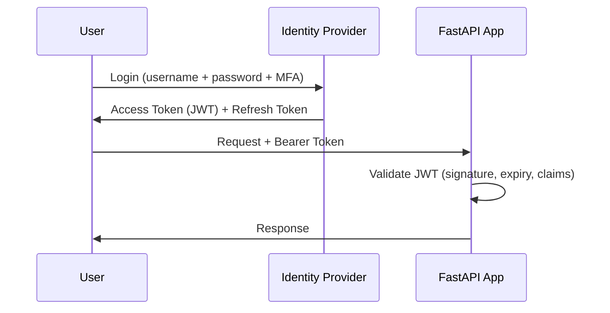

# Authentication & MFA

## Context & Problem

Authentication verifies identity — confirming that a user is who they claim to be. In financial systems and enterprise platforms, single-factor authentication (password only) is insufficient. Regulators and security policies require multi-factor authentication (MFA).

The application layer should not implement authentication from scratch. Use a proven identity provider (IdP) — Auth0, Keycloak, or AWS Cognito — and integrate via standard protocols (OAuth 2.0 / OIDC). The application validates tokens, not credentials.

## Design Decisions

### JWT-Based Authentication Flow



The API never sees the user's password. It receives a signed JWT from the IdP and validates it locally (no round-trip to the IdP on every request).

### Token Validation

```python
# shared/auth.py

from datetime import datetime
from typing import Annotated

import jwt
from fastapi import Depends, HTTPException, status
from fastapi.security import HTTPAuthorizationCredentials, HTTPBearer
from pydantic import BaseModel


class TokenClaims(BaseModel):
    sub: str             # user ID
    email: str
    tenant_id: str       # multi-tenant context
    roles: list[str]     # for RBAC
    exp: datetime
    iss: str             # expected issuer


security = HTTPBearer()


class TokenValidator:
    def __init__(self, public_key: str, issuer: str, audience: str) -> None:
        self._public_key = public_key
        self._issuer = issuer
        self._audience = audience

    def validate(self, token: str) -> TokenClaims:
        try:
            payload = jwt.decode(
                token,
                self._public_key,
                algorithms=["RS256"],
                issuer=self._issuer,
                audience=self._audience,
            )
            return TokenClaims(**payload)
        except jwt.ExpiredSignatureError:
            raise HTTPException(status_code=status.HTTP_401_UNAUTHORIZED, detail="Token expired")
        except jwt.InvalidTokenError:
            raise HTTPException(status_code=status.HTTP_401_UNAUTHORIZED, detail="Invalid token")


async def get_current_user(
    credentials: Annotated[HTTPAuthorizationCredentials, Depends(security)],
    validator: Annotated[TokenValidator, Depends(get_token_validator)],
) -> TokenClaims:
    return validator.validate(credentials.credentials)


# Use in routes
CurrentUser = Annotated[TokenClaims, Depends(get_current_user)]
```

### MFA Enforcement

MFA is enforced at the IdP level, not in the application. The IdP requires a second factor (TOTP, WebAuthn, SMS) during login. The resulting JWT contains an `amr` (Authentication Methods Reference) claim indicating which factors were used:

```python
class TokenClaims(BaseModel):
    # ... existing fields
    amr: list[str] = []  # ["pwd", "otp"] means password + TOTP

    @property
    def mfa_verified(self) -> bool:
        return len(self.amr) >= 2
```

For sensitive operations, the application can check `mfa_verified`:

```python
@router.post("/trades")
async def create_trade(request: TradeRequest, user: CurrentUser):
    if not user.mfa_verified:
        raise HTTPException(status_code=403, detail="MFA required for trade execution")
    ...
```

### Token Refresh

Access tokens are short-lived (5-15 minutes). Refresh tokens are long-lived (hours to days) and stored securely by the client. The client uses the refresh token to obtain new access tokens without re-authenticating:

```
Access Token:  short TTL (15 min), used for every API call
Refresh Token: long TTL (7 days), used only to get new access tokens
```

## Failure Modes

| Failure | Cause | Mitigation |
|---|---|---|
| Token expired mid-session | Short TTL, client does not refresh | Client-side token refresh logic, 401 → automatic refresh → retry |
| Key rotation breaks validation | IdP rotates signing keys | Fetch JWKS (JSON Web Key Set) dynamically, cache with TTL |
| Token leakage | Token in URL, logs, or insecure storage | Bearer tokens in headers only, scrub tokens from logs |
| MFA bypass | Application does not check `amr` claims | Enforce MFA check for sensitive operations |
| Clock skew | Server time differs from IdP | Allow small `leeway` in JWT validation (30 seconds) |

## Related Documents

- [Authorization RBAC](authorization-rbac.md) — what the authenticated user is allowed to do
- [OAuth2 Flows](oauth2-flows.md) — OAuth 2.0 grant types for different clients
- [FastAPI Modular Layout](fastapi-modular-layout.md) — where auth middleware lives
