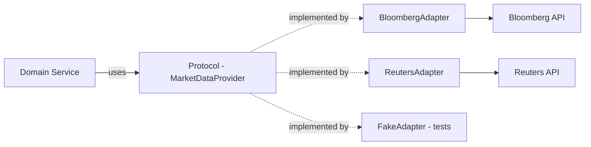

# External API Adapters

## Context & Problem

Applications integrate with external services — market data vendors (Bloomberg, Reuters), identity providers, payment processors, LLM APIs. Each has its own authentication scheme, data format, rate limits, error codes, and uptime characteristics.

Letting vendor-specific types and behaviors leak into the application creates coupling: a vendor change forces changes across the codebase. The adapter pattern wraps external APIs behind a stable internal interface (anti-corruption layer).

## Design Decisions

### Adapter Structure



The domain defines what it needs via a Protocol. Each vendor gets an adapter that translates between the vendor's API and the internal contract.

### Implementation

```python
# interface.py — what the domain needs
from typing import Protocol
from datetime import datetime
from decimal import Decimal

from pydantic import BaseModel


class PriceQuote(BaseModel):
    """Internal canonical format — vendor-agnostic."""
    instrument_id: str
    bid: Decimal
    ask: Decimal
    mid: Decimal
    timestamp: datetime
    source: str


class MarketDataProvider(Protocol):
    async def get_quote(self, instrument_id: str) -> PriceQuote: ...
    async def get_quotes(self, instrument_ids: list[str]) -> list[PriceQuote]: ...
    async def subscribe(self, instrument_ids: list[str]) -> AsyncIterator[PriceQuote]: ...
```

```python
# adapters/bloomberg.py
import httpx


class BloombergAdapter:
    """Translates Bloomberg API responses into canonical PriceQuote."""

    def __init__(self, base_url: str, api_key: str) -> None:
        self._client = httpx.AsyncClient(
            base_url=base_url,
            headers={"Authorization": f"Bearer {api_key}"},
            timeout=httpx.Timeout(10.0, connect=5.0),
        )

    async def get_quote(self, instrument_id: str) -> PriceQuote:
        # Bloomberg uses different field names
        response = await self._client.get(
            f"/market/securities/{instrument_id}/quote"
        )
        response.raise_for_status()
        data = response.json()

        # Translate vendor-specific format to canonical
        return PriceQuote(
            instrument_id=instrument_id,
            bid=Decimal(str(data["BID"])),
            ask=Decimal(str(data["ASK"])),
            mid=Decimal(str(data["MID"])),
            timestamp=datetime.fromisoformat(data["LAST_UPDATE_TIME"]),
            source="bloomberg",
        )

    async def get_quotes(self, instrument_ids: list[str]) -> list[PriceQuote]:
        # Bloomberg supports batch requests
        response = await self._client.post(
            "/market/securities/quotes",
            json={"securities": instrument_ids},
        )
        response.raise_for_status()
        return [self._to_quote(item) for item in response.json()["results"]]

    def _to_quote(self, data: dict) -> PriceQuote:
        return PriceQuote(
            instrument_id=data["SECURITY_ID"],
            bid=Decimal(str(data["BID"])),
            ask=Decimal(str(data["ASK"])),
            mid=Decimal(str(data["MID"])),
            timestamp=datetime.fromisoformat(data["LAST_UPDATE_TIME"]),
            source="bloomberg",
        )
```

### Resilience in Adapters

External APIs fail. The adapter is the right place to handle retries, timeouts, and circuit breaking:

```python
from tenacity import retry, stop_after_attempt, wait_exponential


class BloombergAdapter:
    @retry(
        stop=stop_after_attempt(3),
        wait=wait_exponential(multiplier=1, min=1, max=10),
        reraise=True,
    )
    async def get_quote(self, instrument_id: str) -> PriceQuote:
        ...
```

### Rate Limiting

External APIs enforce rate limits. The adapter should respect them:

```python
import asyncio


class RateLimiter:
    def __init__(self, max_per_second: int) -> None:
        self._semaphore = asyncio.Semaphore(max_per_second)

    async def acquire(self) -> None:
        await self._semaphore.acquire()
        asyncio.get_event_loop().call_later(1.0, self._semaphore.release)


class BloombergAdapter:
    def __init__(self, ..., rate_limit: int = 50) -> None:
        self._limiter = RateLimiter(rate_limit)

    async def get_quote(self, instrument_id: str) -> PriceQuote:
        await self._limiter.acquire()
        ...
```

## Failure Modes

| Failure | Cause | Mitigation |
|---|---|---|
| Vendor API down | Outage, maintenance | Circuit breaker, fallback to cached data |
| Rate limit exceeded | Too many requests | Rate limiter in adapter, batch requests |
| Schema change | Vendor changes response format | Adapter isolates the change, only adapter code updates |
| Authentication failure | Expired API key, rotated credentials | Monitor auth failures, alert on 401s |
| Slow responses | Vendor latency spike | Timeout config, circuit breaker opens |

## Related Documents

- [Circuit Breakers](../resilience/circuit-breakers.md) — protecting against failing externals
- [Retry Strategies](../resilience/retry-strategies.md) — retry patterns for transient failures
- [Bounded Contexts](../../principles/bounded-contexts.md) — anti-corruption layer concept
