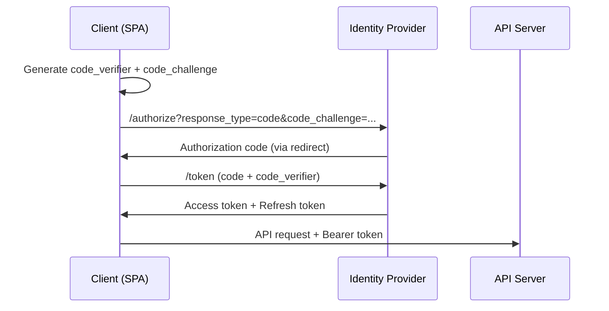

# OAuth 2.0 Flows

## Context & Problem

Different clients (web apps, mobile apps, CLIs, service-to-service) have different security characteristics. A browser-based SPA cannot securely store a client secret. A backend service has no user to redirect. OAuth 2.0 defines specific grant types for each scenario.

## Design Decisions

### Flow Selection

| Client Type | Grant Type | Use Case |
|---|---|---|
| SPA / web app | Authorization Code + PKCE | User-facing web applications |
| Mobile app | Authorization Code + PKCE | User-facing mobile applications |
| Backend service | Client Credentials | Service-to-service, no user context |
| CLI tool | Device Authorization | User authenticates via browser |
| Legacy (avoid) | Resource Owner Password | Only for migrating legacy systems |

### Authorization Code + PKCE (Primary Flow)

Used by all user-facing clients. PKCE (Proof Key for Code Exchange) eliminates the need for a client secret, making it safe for SPAs and mobile apps.



### Client Credentials (Service-to-Service)

Used when a backend service calls another service without a user context. The service authenticates with its own credentials.

```python
import httpx


class ServiceClient:
    """Authenticates as a service, not as a user."""

    def __init__(self, token_url: str, client_id: str, client_secret: str) -> None:
        self._token_url = token_url
        self._client_id = client_id
        self._client_secret = client_secret
        self._token: str | None = None

    async def _get_token(self) -> str:
        async with httpx.AsyncClient() as client:
            response = await client.post(
                self._token_url,
                data={
                    "grant_type": "client_credentials",
                    "client_id": self._client_id,
                    "client_secret": self._client_secret,
                    "scope": "read:market-data",
                },
            )
            response.raise_for_status()
            self._token = response.json()["access_token"]
            return self._token

    async def get_headers(self) -> dict[str, str]:
        token = self._token or await self._get_token()
        return {"Authorization": f"Bearer {token}"}
```

### Scopes

Scopes limit what an access token can do. They are requested during the OAuth flow and enforced by the API:

```python
# The token carries scopes
# {"scope": "read:positions write:trades"}

def require_scope(*scopes: str):
    async def check(user: CurrentUser) -> CurrentUser:
        token_scopes = set(user.scope.split())
        if not set(scopes).issubset(token_scopes):
            raise HTTPException(status_code=403, detail="Insufficient scope")
        return user
    return Depends(check)


@router.post("/trades")
async def create_trade(
    request: TradeRequest,
    user: CurrentUser = require_scope("write:trades"),
):
    ...
```

## Failure Modes

| Failure | Cause | Mitigation |
|---|---|---|
| Token theft | Token stored insecurely (localStorage, URL) | Use httpOnly cookies for web, secure storage for mobile |
| Client secret leak | Secret in client-side code or version control | Use PKCE (no secret needed), never commit secrets |
| Redirect URI attack | Open redirect allows code interception | Strict redirect URI validation at IdP |
| Token reuse after revocation | Token is valid until expiry | Short-lived access tokens, check revocation for sensitive ops |

## Related Documents

- [Authentication MFA](authentication-mfa.md) — the authentication that produces these tokens
- [Authorization RBAC](authorization-rbac.md) — what tokens authorize
- [External API Adapters](external-api-adapters.md) — using OAuth to call third-party APIs
