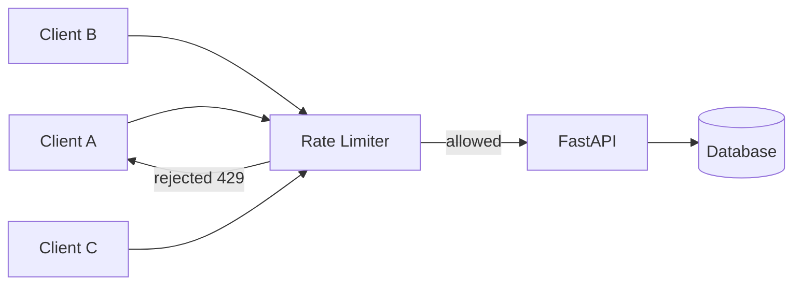

# Rate Limiting

## Context & Problem

APIs need protection from abuse, runaway clients, and accidental self-DDoS. A single misconfigured client polling in a tight loop can saturate a database connection pool and take down the entire service. A burst of retries after a deployment can produce the same effect.

Rate limiting is distinct from circuit breakers. Circuit breakers protect *outbound* calls (your service calling dependencies). Rate limiting protects *inbound* calls (clients calling your service). Both are necessary; neither replaces the other.



The challenge is choosing the right algorithm and the right granularity. Per-IP limiting is too coarse (shared NATs). Per-user limiting requires authentication to happen before rate checking. Distributed systems need a shared counter — local counters are trivially bypassed by round-robin load balancers.

## Design Decisions

### Algorithm Selection

| Algorithm | How It Works | Pros | Cons |
|---|---|---|---|
| Token bucket | Tokens refill at a fixed rate; each request costs one token | Allows bursts, smooth average rate | Slightly more complex state |
| Sliding window counter | Count requests in a rolling time window using Redis | Accurate, predictable | More Redis operations |
| Fixed window counter | Count requests in fixed time intervals | Simplest | Allows 2x burst at window boundaries |

**Token bucket is the recommended default.** It allows short bursts (good UX for legitimate users) while enforcing a sustained average rate.

### Token Bucket — In-Process Implementation

For single-instance services or per-route local limiting:

```python
# ratelimit/token_bucket.py
import time
import asyncio
from dataclasses import dataclass, field


@dataclass
class TokenBucket:
    """
    Token bucket rate limiter.

    capacity: maximum burst size
    refill_rate: tokens added per second
    """

    capacity: float
    refill_rate: float
    _tokens: float = field(init=False)
    _last_refill: float = field(init=False)
    _lock: asyncio.Lock = field(init=False, default_factory=asyncio.Lock)

    def __post_init__(self) -> None:
        self._tokens = self.capacity
        self._last_refill = time.monotonic()

    async def acquire(self, tokens: float = 1.0) -> bool:
        """Try to consume tokens. Returns True if allowed."""
        async with self._lock:
            now = time.monotonic()
            elapsed = now - self._last_refill
            self._tokens = min(
                self.capacity,
                self._tokens + elapsed * self.refill_rate,
            )
            self._last_refill = now

            if self._tokens >= tokens:
                self._tokens -= tokens
                return True
            return False

    @property
    def retry_after(self) -> float:
        """Seconds until one token is available."""
        if self._tokens >= 1.0:
            return 0.0
        deficit = 1.0 - self._tokens
        return deficit / self.refill_rate
```

### Sliding Window Counter — Redis (Distributed)

For multi-instance deployments, use Redis as the shared counter. The sliding window approach uses a sorted set where each request is a member scored by its timestamp.

```python
# ratelimit/redis_sliding_window.py
# redis >= 5.0.0

import time
from dataclasses import dataclass

import redis.asyncio as redis


@dataclass
class RedisSlidingWindow:
    """
    Distributed sliding window rate limiter using Redis sorted sets.

    window_seconds: size of the sliding window
    max_requests: maximum requests allowed within the window
    """

    client: redis.Redis
    window_seconds: int
    max_requests: int
    key_prefix: str = "ratelimit"

    async def check(self, identifier: str) -> tuple[bool, int, float]:
        """
        Check rate limit for an identifier (user ID, API key, IP).

        Returns:
            (allowed, remaining, retry_after_seconds)
        """
        key = f"{self.key_prefix}:{identifier}"
        now = time.time()
        window_start = now - self.window_seconds

        pipe = self.client.pipeline(transaction=True)

        # Remove expired entries
        pipe.zremrangebyscore(key, 0, window_start)
        # Count current window
        pipe.zcard(key)
        # Add current request (speculatively)
        pipe.zadd(key, {f"{now}": now})
        # Set TTL so keys don't leak
        pipe.expire(key, self.window_seconds)

        results = await pipe.execute()
        current_count = results[1]  # zcard result (before adding current)

        if current_count >= self.max_requests:
            # Over limit — remove the speculatively added entry
            await self.client.zrem(key, f"{now}")

            # Calculate retry_after from oldest entry in the window
            oldest = await self.client.zrange(key, 0, 0, withscores=True)
            if oldest:
                retry_after = oldest[0][1] + self.window_seconds - now
            else:
                retry_after = float(self.window_seconds)

            return False, 0, max(0.0, retry_after)

        remaining = self.max_requests - current_count - 1
        return True, remaining, 0.0
```

### FastAPI Middleware

```python
# middleware/rate_limit.py
from fastapi import FastAPI, Request, Response
from starlette.middleware.base import BaseHTTPMiddleware
from starlette.responses import JSONResponse

from ratelimit.redis_sliding_window import RedisSlidingWindow


class RateLimitMiddleware(BaseHTTPMiddleware):
    """
    Per-API-key rate limiting middleware.

    Extracts the API key from the X-API-Key header or falls back to
    client IP. Adds standard rate limit headers to every response.
    """

    def __init__(
        self,
        app: FastAPI,
        limiter: RedisSlidingWindow,
    ) -> None:
        super().__init__(app)
        self._limiter = limiter

    def _get_identifier(self, request: Request) -> str:
        """Extract rate limit key: prefer API key, fall back to IP."""
        api_key = request.headers.get("X-API-Key")
        if api_key:
            return f"key:{api_key}"
        forwarded = request.headers.get("X-Forwarded-For")
        if forwarded:
            return f"ip:{forwarded.split(',')[0].strip()}"
        return f"ip:{request.client.host}" if request.client else "ip:unknown"

    async def dispatch(self, request: Request, call_next) -> Response:
        # Skip health checks
        if request.url.path in ("/health", "/ready"):
            return await call_next(request)

        identifier = self._get_identifier(request)
        allowed, remaining, retry_after = await self._limiter.check(identifier)

        if not allowed:
            return JSONResponse(
                status_code=429,
                content={
                    "detail": "Rate limit exceeded",
                    "retry_after": round(retry_after, 1),
                },
                headers={
                    "X-RateLimit-Limit": str(self._limiter.max_requests),
                    "X-RateLimit-Remaining": "0",
                    "X-RateLimit-Reset": str(int(retry_after)),
                    "Retry-After": str(int(retry_after) + 1),
                },
            )

        response = await call_next(request)

        # Always include rate limit headers, even on success
        response.headers["X-RateLimit-Limit"] = str(self._limiter.max_requests)
        response.headers["X-RateLimit-Remaining"] = str(remaining)
        return response
```

### Wiring It Up

```python
# main.py
import redis.asyncio as redis
from fastapi import FastAPI

from middleware.rate_limit import RateLimitMiddleware
from ratelimit.redis_sliding_window import RedisSlidingWindow


app = FastAPI()

redis_client = redis.Redis(host="localhost", port=6379, decode_responses=False)

# Global rate limit: 100 requests per 60 seconds per identifier
limiter = RedisSlidingWindow(
    client=redis_client,
    window_seconds=60,
    max_requests=100,
)

app.add_middleware(RateLimitMiddleware, limiter=limiter)
```

### Per-Tenant Rate Limiting

Different tenants often need different limits. Store per-tenant configuration and look it up at request time:

```python
# ratelimit/tiered.py
from pydantic import BaseModel


class TenantRateLimit(BaseModel):
    requests_per_minute: int
    burst_size: int


# Loaded from DB or config at startup
TENANT_LIMITS: dict[str, TenantRateLimit] = {
    "free": TenantRateLimit(requests_per_minute=30, burst_size=10),
    "pro": TenantRateLimit(requests_per_minute=300, burst_size=50),
    "enterprise": TenantRateLimit(requests_per_minute=3000, burst_size=500),
}


def get_tenant_limit(api_key: str) -> TenantRateLimit:
    """Look up the rate limit tier for a given API key."""
    tier = lookup_tier_for_key(api_key)  # from DB or cache
    return TENANT_LIMITS.get(tier, TENANT_LIMITS["free"])
```

### Fail-Open vs. Fail-Closed

When Redis is down, the rate limiter must decide: reject all requests (fail closed) or allow all requests (fail open)?

```python
async def check_with_fallback(
    limiter: RedisSlidingWindow,
    identifier: str,
    fail_open: bool = True,
) -> tuple[bool, int, float]:
    """Rate limit check with Redis failure handling."""
    try:
        return await limiter.check(identifier)
    except Exception:
        if fail_open:
            # Allow request — better to serve than to reject everyone
            return True, -1, 0.0
        else:
            # Reject request — safer for payment/trading endpoints
            return False, 0, 60.0
```

**Default to fail-open for read endpoints.** A few extra requests during a Redis outage are acceptable. **Fail-closed for write endpoints that involve money** — trades, payments, transfers.

## Failure Modes

| Failure | Cause | Mitigation |
|---|---|---|
| Redis down — all requests rejected | Network partition, Redis crash, fail-closed default | Fail open for non-critical paths; fall back to in-memory limiter |
| Redis down — no rate limiting | Fail-open default | Acceptable for reads; use in-memory fallback for sustained outages |
| Clock skew across instances | Different servers have different system clocks | Use Redis `TIME` command instead of local `time.time()` for window boundaries |
| Key leakage (memory growth) | Missing `EXPIRE` on rate limit keys | Always set TTL equal to window size on every key |
| Rate limit bypass via header spoofing | Client sends fake `X-Forwarded-For` | Trust `X-Forwarded-For` only from known load balancers; prefer API key identification |
| Sorted set grows unbounded | Very high request rate, large window | Use fixed window counters for very high throughput (>10k req/s per key) |
| Legitimate burst rejected | User sends batch of valid requests | Token bucket with adequate burst capacity; communicate limits in docs |

## Related Documents

- [External API Adapters](external-api-adapters.md) — rate limiting your outbound calls to third-party APIs
- [Authentication & MFA](authentication-mfa.md) — API key validation that feeds into per-tenant limiting
- [Circuit Breakers](../resilience/circuit-breakers.md) — protecting outbound calls (complement to inbound rate limiting)
