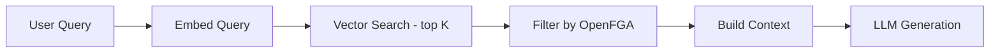

# OpenFGA for LLM Permissions

## Context & Problem

LLM-powered applications retrieve documents, query databases, and call tools on behalf of users. The fundamental question: **should this LLM query be allowed to access this piece of data?**

A user asking "summarize Q3 earnings" should only see documents they have access to. If the RAG pipeline retrieves a confidential board memo that the user should not see, it is an authorization failure — even though the user never directly requested that document.

Traditional RAG systems treat all indexed documents as accessible. This is incorrect for any multi-user or multi-tenant system. Authorization must be enforced at retrieval time, not just at the UI.

## Design Decisions

### Authorization in the RAG Pipeline



The key step is between vector search and context building: every retrieved document is checked against OpenFGA to verify the user has `can_view` access. Documents the user cannot see are filtered out before they reach the LLM.

### Document Authorization Model

```dsl
model
  schema 1.1

type user

type group
  relations
    define member: [user]

type folder
  relations
    define owner: [user, group]
    define viewer: [user, group, group#member]
    define can_view: viewer or owner

type document
  relations
    define parent_folder: [folder]
    define owner: [user]
    define viewer: [user, group, group#member]
    define can_view: viewer or owner or can_view from parent_folder
```

The `can_view from parent_folder` line is key: a user can view a document if they can view its parent folder. This enables hierarchical permissions — grant access to a folder and all documents within inherit it.

### Filtering Retrieved Documents

```python
class AuthorizedRetriever:
    """Wraps a vector store retriever with OpenFGA authorization."""

    def __init__(
        self,
        vector_store: VectorStore,
        auth_service: AuthorizationService,
    ) -> None:
        self._vector_store = vector_store
        self._auth = auth_service

    async def retrieve(
        self,
        query: str,
        user_id: str,
        top_k: int = 10,
    ) -> list[Document]:
        # Retrieve more than needed to account for filtered results
        candidates = await self._vector_store.similarity_search(query, k=top_k * 3)

        # Batch authorization check
        authorized = await self._auth.batch_check(
            user_id=user_id,
            checks=[
                ("can_view", f"document:{doc.metadata['document_id']}")
                for doc in candidates
            ],
        )

        # Return only authorized documents, up to top_k
        return [
            doc for doc, allowed in zip(candidates, authorized)
            if allowed
        ][:top_k]
```

### Batch Authorization Checks

Checking documents one-by-one is slow. OpenFGA supports batch checks:

```python
class AuthorizationService:
    async def batch_check(
        self,
        user_id: str,
        checks: list[tuple[str, str]],  # (relation, object)
    ) -> list[bool]:
        """Check multiple authorization tuples in one call."""
        from openfga_sdk import ClientBatchCheckItem, ClientBatchCheckRequest

        items = [
            ClientBatchCheckItem(
                user=f"user:{user_id}",
                relation=relation,
                object=object_ref,
            )
            for relation, object_ref in checks
        ]

        response = await self._fga.batch_check(ClientBatchCheckRequest(checks=items))
        return [result.allowed for result in response.results]
```

### Tool-Level Authorization

Beyond documents, LLMs may call tools (functions) that access data. Each tool invocation should be authorized:

```python
class AuthorizedToolExecutor:
    """Wraps tool execution with authorization checks."""

    async def execute(
        self,
        tool_name: str,
        args: dict,
        user_id: str,
    ) -> Any:
        # Check if user can use this tool on the specified resource
        resource = self._extract_resource(tool_name, args)
        if resource:
            allowed = await self._auth.check(
                user_id=user_id,
                relation="can_use",
                object=resource,
            )
            if not allowed:
                return {"error": "Access denied to this resource"}

        return await self._tools[tool_name].execute(args)
```

### Keeping Permissions in Sync

Document permissions must stay in sync between the source system and OpenFGA:

1. **On document upload** — write OpenFGA tuple: `user:X` → `owner` → `document:Y`
2. **On folder sharing** — write tuple: `group:engineering` → `viewer` → `folder:Z`
3. **On permission revocation** — delete the tuple
4. **On document deletion** — delete all tuples for that document

```python
class DocumentService:
    async def upload_document(
        self,
        file: UploadFile,
        folder_id: str,
        user_id: str,
    ) -> Document:
        # Store document
        doc = await self._store.save(file, folder_id)

        # Set up authorization relationships
        await self._auth.write_tuples([
            (f"user:{user_id}", "owner", f"document:{doc.id}"),
            (f"folder:{folder_id}", "parent_folder", f"document:{doc.id}"),
        ])

        # Index for vector search
        await self._vector_store.index(doc)

        return doc
```

## Failure Modes

| Failure | Cause | Mitigation |
|---|---|---|
| Data leakage in RAG | Authorization check skipped or results not filtered | Authorization is mandatory, never optional. Fail-closed |
| Permission sync drift | Document deleted but tuple remains | Reconciliation job, delete tuples on document deletion |
| Slow retrieval | Per-document auth checks on large result sets | Batch checks, pre-filter by accessible folder list, cache |
| Over-retrieval compensation | Retrieving 3x candidates to account for filtering | Monitor filter ratio, adjust retrieval strategy |
| Inherited permission confusion | User does not understand why they can/cannot see something | Provide "why" explanation via OpenFGA's expand API |

## Related Documents

- [OpenFGA Modeling](openfga-modeling.md) — general OpenFGA patterns
- [RAG Architecture](../ai-ml/rag-architecture.md) — the retrieval pipeline
- [Embedding Pipelines](../ai-ml/embedding-pipelines.md) — document vectorization
