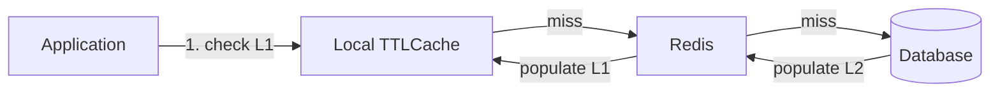

# Caching Strategies

## Context & Problem

Every production system needs caching. Database queries that run in 50ms become 1ms with a cache hit. External API calls that cost money and add latency disappear entirely on repeated reads. The problem is not *whether* to cache — it is *how*.

Without a deliberate caching strategy, teams add ad-hoc caches that become stale, inconsistent, or unbounded. Common failure patterns:

- A developer adds `@lru_cache` to a function that reads from the database. The process serves stale data until it restarts.
- Redis is introduced as a cache, but no TTL is set. Memory grows until Redis evicts keys unpredictably.
- Two services cache the same entity. One invalidates its cache, the other does not. Users see different data depending on which service handles the request.
- A cache key is deleted, and 500 concurrent requests all hit the database at once (thundering herd).

This document covers the core caching patterns, when to use each, and how to combine them for a two-level caching strategy that is both fast and consistent.

## Design Decisions

### Pattern Selection

Three fundamental write strategies exist. Choose based on your consistency and latency requirements:

| Pattern | Write Path | Read Path | Consistency | Latency |
|---|---|---|---|---|
| Cache-aside (lazy loading) | Write to DB only, invalidate cache | Read cache, miss → read DB → populate cache | Eventual (TTL-bounded) | Low on hit, higher on miss |
| Write-through | Write to cache and DB together | Read cache (always populated) | Strong (if atomic) | Higher writes, low reads |
| Write-behind | Write to cache, async flush to DB | Read cache (always populated) | Weak (risk of data loss) | Lowest writes, low reads |

**Cache-aside is the default choice.** It is the simplest, safest, and most widely applicable. Use write-through only when read-after-write consistency is critical. Avoid write-behind unless you accept data loss risk (e.g., view counters, analytics).

### Cache-Aside Implementation

```python
# cache/redis_cache.py
# redis >= 5.0.0
# pydantic >= 2.0

import json
import logging
from typing import TypeVar, Protocol
from datetime import timedelta

import redis.asyncio as redis
from pydantic import BaseModel

logger = logging.getLogger(__name__)

T = TypeVar("T", bound=BaseModel)


class CacheBackend(Protocol):
    """Interface for any cache backend."""

    async def get(self, key: str) -> bytes | None: ...
    async def set(self, key: str, value: bytes, ttl: timedelta) -> None: ...
    async def delete(self, key: str) -> None: ...


class RedisCacheBackend:
    """Redis cache backend using redis.asyncio."""

    def __init__(self, client: redis.Redis) -> None:
        self._client = client

    async def get(self, key: str) -> bytes | None:
        return await self._client.get(key)

    async def set(self, key: str, value: bytes, ttl: timedelta) -> None:
        await self._client.set(key, value, ex=int(ttl.total_seconds()))

    async def delete(self, key: str) -> None:
        await self._client.delete(key)


class CacheAside:
    """
    Cache-aside pattern for Pydantic models.

    Read: check cache → miss → load from source → populate cache.
    Write: write to source → invalidate cache.
    """

    def __init__(
        self,
        backend: CacheBackend,
        prefix: str,
        default_ttl: timedelta = timedelta(minutes=5),
    ) -> None:
        self._backend = backend
        self._prefix = prefix
        self._default_ttl = default_ttl

    def _key(self, identifier: str) -> str:
        return f"{self._prefix}:{identifier}"

    async def get(self, identifier: str, model_type: type[T]) -> T | None:
        """Return cached model or None on miss."""
        raw = await self._backend.get(self._key(identifier))
        if raw is None:
            return None
        try:
            return model_type.model_validate_json(raw)
        except Exception:
            logger.warning(f"Cache deserialization failed for {self._key(identifier)}")
            await self._backend.delete(self._key(identifier))
            return None

    async def set(
        self,
        identifier: str,
        model: BaseModel,
        ttl: timedelta | None = None,
    ) -> None:
        """Populate cache after a source read."""
        await self._backend.set(
            self._key(identifier),
            model.model_dump_json().encode(),
            ttl or self._default_ttl,
        )

    async def invalidate(self, identifier: str) -> None:
        """Delete cache entry after a source write."""
        await self._backend.delete(self._key(identifier))
```

### Using Cache-Aside in a Repository

```python
# repositories/instrument.py
from cache.redis_cache import CacheAside
from models.instrument import Instrument


class InstrumentRepository:
    def __init__(self, session_factory, cache: CacheAside) -> None:
        self._session_factory = session_factory
        self._cache = cache

    async def get_by_id(self, instrument_id: str) -> Instrument | None:
        # 1. Check cache
        cached = await self._cache.get(instrument_id, Instrument)
        if cached is not None:
            return cached

        # 2. Cache miss — query database
        async with self._session_factory() as session:
            row = await session.get(InstrumentModel, instrument_id)
            if row is None:
                return None
            instrument = Instrument.model_validate(row)

        # 3. Populate cache
        await self._cache.set(instrument_id, instrument)
        return instrument

    async def update(self, instrument_id: str, updates: InstrumentUpdate) -> Instrument:
        async with self._session_factory() as session:
            row = await session.get(InstrumentModel, instrument_id)
            for field, value in updates.model_dump(exclude_unset=True).items():
                setattr(row, field, value)
            await session.commit()
            instrument = Instrument.model_validate(row)

        # Invalidate — do not update the cache (let next read repopulate)
        await self._cache.invalidate(instrument_id)
        return instrument
```

### Cache Invalidation Strategies

Invalidation is the hard part. Three approaches, in increasing order of complexity:

**TTL-based (simplest).** Set a TTL on every key. Data is eventually consistent within the TTL window. Good for data that changes infrequently or where staleness is acceptable.

**Event-driven invalidation.** When a write occurs, publish an event. Cache consumers listen and invalidate. Gives near-real-time consistency across services but adds coupling to the event bus.

**Versioned keys.** Embed a version in the cache key: `instrument:v3:AAPL`. When the schema or data semantics change, increment the version. Old keys expire naturally via TTL. Useful for cache-busting during deployments.

```python
# Versioned key example
CACHE_VERSION = "v2"  # bump on schema changes

def cache_key(entity: str, identifier: str) -> str:
    return f"{entity}:{CACHE_VERSION}:{identifier}"
```

### Local In-Memory Cache (L1)

For extremely hot data, a local in-memory cache avoids the network round-trip to Redis entirely. Use `cachetools.TTLCache` for a bounded, time-expiring local cache.

```python
# cache/local_cache.py
# cachetools >= 5.3.0

from datetime import timedelta
from cachetools import TTLCache


class LocalCache:
    """In-process TTL cache. No serialization overhead, no network."""

    def __init__(
        self,
        maxsize: int = 1024,
        ttl: timedelta = timedelta(seconds=30),
    ) -> None:
        self._cache: TTLCache[str, object] = TTLCache(
            maxsize=maxsize,
            ttl=ttl.total_seconds(),
        )

    def get(self, key: str) -> object | None:
        return self._cache.get(key)

    def set(self, key: str, value: object) -> None:
        self._cache[key] = value

    def delete(self, key: str) -> None:
        self._cache.pop(key, None)
```

### Two-Level Caching (L1 + L2)

Combine local and Redis caches. The local cache (L1) absorbs the hottest reads; Redis (L2) handles the long tail. This is critical for data that is read thousands of times per second per process.



```python
# cache/two_level.py
from datetime import timedelta
from pydantic import BaseModel
from typing import TypeVar

from cache.local_cache import LocalCache
from cache.redis_cache import CacheAside

T = TypeVar("T", bound=BaseModel)


class TwoLevelCache:
    """L1 (local in-memory) + L2 (Redis) cache."""

    def __init__(
        self,
        local: LocalCache,
        remote: CacheAside,
    ) -> None:
        self._local = local
        self._remote = remote

    async def get(self, identifier: str, model_type: type[T]) -> T | None:
        # L1 check (no await — synchronous, sub-microsecond)
        local_hit = self._local.get(identifier)
        if local_hit is not None:
            return local_hit  # type: ignore[return-value]

        # L2 check (network round-trip, ~0.5ms)
        remote_hit = await self._remote.get(identifier, model_type)
        if remote_hit is not None:
            self._local.set(identifier, remote_hit)
            return remote_hit

        return None

    async def set(self, identifier: str, model: BaseModel, ttl: timedelta | None = None) -> None:
        self._local.set(identifier, model)
        await self._remote.set(identifier, model, ttl)

    async def invalidate(self, identifier: str) -> None:
        self._local.delete(identifier)
        await self._remote.invalidate(identifier)
```

**Important tradeoff:** L1 caches are per-process. In a multi-instance deployment, one instance may invalidate its L1 while others still serve stale data. Keep L1 TTLs short (10-30 seconds) to bound this inconsistency.

### Cache Stampede Prevention

When a popular cache key expires, many concurrent requests can miss simultaneously and all hit the database — the thundering herd problem. Two mitigations:

**Probabilistic early expiration.** Each reader has a small chance of refreshing the cache *before* the TTL expires. The hotter the key, the more likely an early refresh occurs before expiration.

```python
# cache/stampede.py
import random
import time
from datetime import timedelta

from cache.redis_cache import CacheBackend


async def get_with_early_expiry(
    backend: CacheBackend,
    key: str,
    ttl: timedelta,
    beta: float = 1.0,
) -> tuple[bytes | None, bool]:
    """
    XFetch algorithm: probabilistically refresh before TTL expires.

    Returns (cached_value, should_recompute).
    beta controls eagerness — higher beta = earlier recomputation.
    """
    raw = await backend.get(key)
    if raw is None:
        return None, True

    # Stored format: expiry_timestamp | actual_data
    expiry_str, _, data = raw.partition(b"|")
    expiry = float(expiry_str)
    remaining = expiry - time.time()

    # Probabilistic early recomputation
    if remaining > 0:
        jitter = beta * random.random()
        if remaining - jitter > 0:
            return data, False

    return data, True
```

**Locking (mutex).** On cache miss, acquire a short-lived lock. Only the lock holder recomputes; other requests wait or serve stale data.

```python
# cache/lock.py
import redis.asyncio as redis


class CacheLock:
    """Redis-based lock to prevent cache stampede."""

    def __init__(self, client: redis.Redis, ttl_seconds: int = 5) -> None:
        self._client = client
        self._ttl = ttl_seconds

    async def acquire(self, key: str) -> bool:
        """Try to acquire lock. Returns True if acquired."""
        lock_key = f"lock:{key}"
        return await self._client.set(lock_key, "1", nx=True, ex=self._ttl)

    async def release(self, key: str) -> None:
        lock_key = f"lock:{key}"
        await self._client.delete(lock_key)
```

Use locking for expensive computations where you cannot tolerate duplicate work. Use probabilistic early expiration for most other cases — it requires no coordination.

## Failure Modes

| Failure | Cause | Mitigation |
|---|---|---|
| Thundering herd / cache stampede | Popular key expires, N requests hit DB simultaneously | Probabilistic early expiry, locking on recompute |
| Stale data served indefinitely | TTL too long, invalidation missed, event lost | Cap TTLs (max 1 hour), pair TTL with event-driven invalidation |
| Cache poisoning | Bad data written to cache (serialization bug, partial response cached) | Validate on read (deserialization), never cache error responses |
| Memory exhaustion (Redis) | No maxmemory policy, unbounded key growth | Set `maxmemory-policy allkeys-lru`, monitor memory usage, set TTLs on all keys |
| Memory exhaustion (local) | Unbounded local cache | Use `TTLCache` with `maxsize`, never use bare `dict` as cache |
| Redis down — reads fail | Network partition, Redis crash | Degrade gracefully: fall through to DB, do not raise on cache miss errors |
| L1/L2 inconsistency | L1 not invalidated across processes | Keep L1 TTL short (10-30s), accept bounded staleness |
| Hot key bottleneck | Single key accessed by many clients overwhelms one Redis shard | Use local L1 cache to absorb reads, or replicate hot keys across shards |

## Related Documents

- [Connection Pooling](connection-pooling.md) — Redis connection pool configuration
- [Graceful Degradation](../resilience/graceful-degradation.md) — what to do when the cache layer is unavailable
- [Kafka Topology](../messaging/kafka-topology.md) — event-driven cache invalidation via Kafka consumers
