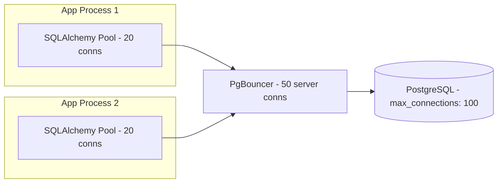

# Connection Pooling

## Context & Problem

Every database query requires a TCP connection. Opening a new connection for every request involves DNS resolution, TCP handshake, TLS negotiation, and PostgreSQL authentication — 20-50ms overhead per connection. Under load, this also exhausts PostgreSQL's `max_connections` (default: 100).

Connection pooling maintains a set of pre-established connections that are reused across requests. This eliminates per-request connection overhead and bounds the number of connections to the database.

## Design Decisions

### Two Levels of Pooling

**Application-level pooling (SQLAlchemy):**
- Built into SQLAlchemy via `create_engine(pool_size=...)`
- One pool per application process
- Sufficient for single-process or low-concurrency deployments

**External pooler (PgBouncer):**
- Sits between application and PostgreSQL as a separate process
- Multiplexes connections from many application processes onto fewer PostgreSQL connections
- Essential when running multiple application instances (e.g., multiple Gunicorn workers, multiple containers)



Without PgBouncer, 4 workers × 20 pool connections = 80 PostgreSQL connections. With PgBouncer, those 80 client connections are multiplexed onto ~30 server connections.

### Pool Sizing

**SQLAlchemy pool:**

```python
engine = create_async_engine(
    database_url,
    pool_size=20,          # steady-state connections
    max_overflow=10,       # burst capacity (total max = 30)
    pool_timeout=30,       # wait for connection before raising error
    pool_pre_ping=True,    # test connection health before use
    pool_recycle=3600,     # replace connections older than 1 hour
)
```

**Sizing heuristic:**
- `pool_size` = expected concurrent queries per process
- `max_overflow` = headroom for traffic spikes (20-50% of pool_size)
- Total connections across all processes must not exceed `max_connections - 10` (reserve some for admin/monitoring)

**PgBouncer config (pgbouncer.ini):**

```ini
[databases]
app = host=localhost port=5432 dbname=app

[pgbouncer]
listen_port = 6432
pool_mode = transaction        # release connection after transaction ends
default_pool_size = 30
max_client_conn = 200
max_db_connections = 50        # never exceed PostgreSQL max_connections
server_idle_timeout = 600
```

`pool_mode = transaction` is the standard choice for web applications: a PgBouncer connection is assigned for the duration of a transaction, then returned to the pool. This maximizes multiplexing.

## Monitoring

Key metrics to watch:

| Metric | Source | Alert Threshold |
|---|---|---|
| Pool checkout time | SQLAlchemy events | >100ms (pool exhaustion) |
| Active connections | `pg_stat_activity` | >80% of `max_connections` |
| Waiting connections | PgBouncer `SHOW POOLS` | >0 sustained |
| Connection errors | Application logs | Any |
| Idle connections | `pg_stat_activity` | >50% (pool too large) |

## Failure Modes

| Failure | Cause | Mitigation |
|---|---|---|
| Pool exhaustion | All connections checked out, new request blocked | Tune pool_size, add max_overflow, check for connection leaks |
| Connection leak | Code path does not return connection to pool | Always use context managers (`async with session`) |
| Stale connections | PostgreSQL restarts, network blip | `pool_pre_ping=True` detects stale connections |
| max_connections exceeded | Too many processes, each with large pools | PgBouncer to multiplex, reduce per-process pool_size |
| PgBouncer bottleneck | PgBouncer itself saturated | Monitor PgBouncer metrics, scale horizontally or increase limits |

## Related Documents

- [SQLAlchemy Repository](sqlalchemy-repository.md) — using the pooled engine
- [Docker Compose Patterns](../../infrastructure/docker-compose-patterns.md) — running PgBouncer locally
