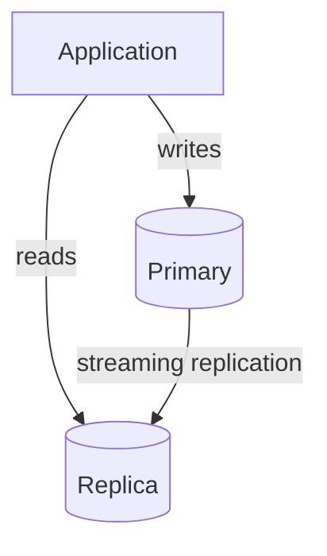

# Read Replicas

## Context & Problem

As query load grows, a single PostgreSQL instance becomes the bottleneck. Writes and reads compete for the same resources — CPU, I/O, connections. Heavy analytical queries (risk calculations, reporting) slow down transactional writes (trade execution, position updates).

Read replicas solve this by directing write traffic to a primary and read traffic to one or more replicas. PostgreSQL's streaming replication keeps replicas in near-real-time sync with the primary.

## Design Decisions

### When to Introduce Read Replicas

Read replicas add operational complexity. Introduce them only when:

1. Read load is measurably impacting write performance
2. Analytical/reporting queries are competing with transactional queries
3. You need geographic distribution for read latency

Do **not** introduce them preemptively. A single PostgreSQL instance with proper indexes and connection pooling handles far more load than most teams expect.

### Routing Strategy



**Option 1 — Application-level routing (recommended for modular monolith):**

```python
from sqlalchemy.ext.asyncio import create_async_engine, async_sessionmaker


class DatabaseSessions:
    def __init__(self, write_url: str, read_url: str) -> None:
        write_engine = create_async_engine(write_url, pool_size=10)
        read_engine = create_async_engine(read_url, pool_size=30)

        self.write = async_sessionmaker(write_engine, expire_on_commit=False)
        self.read = async_sessionmaker(read_engine, expire_on_commit=False)
```

Services explicitly choose `db.write` for mutations and `db.read` for queries. This is transparent and easy to reason about.

**Option 2 — Proxy-level routing (PgBouncer + HAProxy):**

A proxy routes queries based on whether they are read-only. This is transparent to the application but harder to debug when replication lag causes issues.

### Replication Lag

Replicas are eventually consistent. A write to the primary may take 1-100ms to appear on a replica. This means:

- **Write-then-read in the same request** — must read from primary, not replica
- **Dashboard queries** — replica is fine, slight staleness is acceptable
- **Compliance checks** — depends on the rule. Real-time pre-trade checks must read from primary

## Failure Modes

| Failure | Cause | Mitigation |
|---|---|---|
| Stale read | Read from replica before write replicates | Read-after-write from primary, or wait for replication confirmation |
| Replica lag spikes | Heavy write load, slow replica hardware | Monitor `pg_stat_replication`, alert on lag >1s |
| Replica promoted accidentally | Failover triggered incorrectly | Use proper HA tooling (Patroni), test failover procedures |
| Connection routing error | Write sent to replica | Replica should be configured as `hot_standby` (read-only), writes will fail safely |

## Related Documents

- [Connection Pooling](connection-pooling.md) — pooling across primary and replicas
- [SQLAlchemy Repository](sqlalchemy-repository.md) — repository pattern adapted for read/write routing
