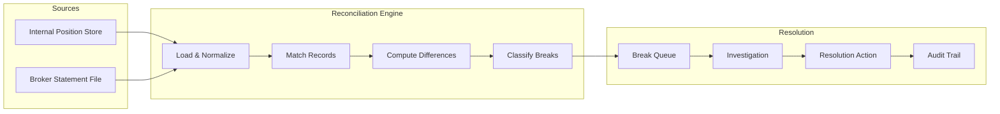

# Reconciliation

## Context & Problem

In financial systems, the internal record of what you own rarely matches the external record perfectly. Your position-keeping system says you hold 1,000 shares of AAPL. Your prime broker says 998. The discrepancy might be a missed fill, a late corporate action, a settlement failure, or a bug. Until you find and resolve it, neither number is trustworthy.

Reconciliation is the process of comparing two sources of truth, identifying discrepancies (breaks), and resolving them. It is not a feature you bolt on later — it is foundational infrastructure for any system that handles real money. Without it, errors compound silently until someone notices a P&L number that makes no sense.

The challenge is not the comparison itself — that is straightforward. The challenge is building a system that surfaces breaks early, provides enough context to investigate them quickly, and tracks their resolution so nothing falls through the cracks.

## Design Decisions

### What Gets Reconciled

| Internal Source | External Source | Frequency | Priority |
|---|---|---|---|
| Position quantities | Prime broker position statement | Daily (EOD) | P1 — cannot trust P&L without this |
| Trade fills | Broker execution reports | Intraday + EOD | P1 — missed fills corrupt positions |
| Cash balances | Custodian cash statement | Daily (EOD) | P1 — settlement failures, margin calls |
| Settlement entries | Broker settlement confirmations | T+1/T+2 | P2 — confirms trades actually settled |
| Instrument reference data | Vendor feeds (Bloomberg, LSEG) | Weekly | P3 — corporate actions, identifier changes |

### Fund-Scoped Reconciliation

In a multi-fund deployment, reconciliation runs **per fund**. Each fund has its own prime broker relationship, its own position statements, and its own breaks. The reconciliation engine receives a `fund_id` parameter and operates within that fund's schema:

- **External reconciliation** compares each fund's positions against that fund's prime broker statement
- **Internal reconciliation** (event store vs. read model) runs per fund schema
- **Break queues** are fund-scoped — a break in Fund Alpha is invisible to Fund Beta's ops team
- **Reconciliation reports** are generated per fund for regulatory compliance

### Asset-Class-Specific Matching

Different asset classes require different matching strategies and tolerances:

| Asset Class | Match Key | Quantity Match | Value Tolerance | Special Considerations |
|---|---|---|---|---|
| **Equities** | instrument_id + portfolio_id | Exact shares | $0.01 (rounding) | Corporate actions may cause temporary breaks |
| **Fixed Income** | instrument_id + portfolio_id | Exact par value | $1.00 (accrued interest timing) | Accrued interest calculation differences between systems |
| **Options** | instrument_id + portfolio_id + expiry + strike | Exact contracts | $0.01 | Exercise/assignment creates temporary breaks until T+1 |
| **Futures** | instrument_id + portfolio_id + expiry | Exact contracts | N/A (mark-to-market) | Variation margin reconciliation is cash-based |
| **FX** | currency_pair + portfolio_id + value_date | Exact notional | $0.01 | Forward points may differ between systems |
| **Swaps** | swap_id (OTC unique) | Exact notional | Per reset schedule | Resets may be valued differently between counterparties |

The tolerance rules (see below) are parameterized by asset class to reflect these differences.

### Internal Reconciliation

Not all reconciliation is against external parties. The system must also reconcile internally:

| Source A | Source B | What it Catches |
|---|---|---|
| Event store (positions) | Read model (current_positions) | Projection drift, missed events |
| Sum of lots | Position quantity | Aggregate invariant violations |
| Realized + unrealized P&L | Total P&L | Calculation errors in lot matching |
| Cash settlement ladder | Sum of trade settlements | Missing or duplicate settlement entries |

Internal reconciliation runs continuously (as part of health checks or scheduled jobs), not just at EOD.

## Architecture

### Reconciliation Pipeline



### Matching Strategy

Records are matched by a composite key — typically `(instrument_id, portfolio_id, date)` for position reconciliation, or `(trade_id, execution_id)` for fill reconciliation.

Matching produces three categories:

| Category | Meaning | Example |
|---|---|---|
| **Matched** | Both sides agree within tolerance | Internal: 1000 shares, Broker: 1000 shares |
| **Matched with tolerance** | Both sides present, values differ within acceptable range | Internal: $150.0023, Broker: $150.00 (rounding) |
| **Break** | Mismatch beyond tolerance, or record exists on only one side | Internal: 1000 shares, Broker: 998 shares |

### Break Classification

```python
from enum import StrEnum
from decimal import Decimal
from pydantic import BaseModel


class BreakType(StrEnum):
    QUANTITY_MISMATCH = "quantity_mismatch"
    PRICE_MISMATCH = "price_mismatch"
    MISSING_INTERNAL = "missing_internal"     # broker has it, we don't
    MISSING_EXTERNAL = "missing_external"     # we have it, broker doesn't
    SETTLEMENT_FAILURE = "settlement_failure"
    CORPORATE_ACTION = "corporate_action"


class BreakSeverity(StrEnum):
    INFO = "info"          # within tolerance, auto-resolved
    WARNING = "warning"    # small discrepancy, needs review
    CRITICAL = "critical"  # large discrepancy or missing record


class ReconciliationBreak(BaseModel):
    """A discrepancy between internal and external records."""
    break_id: str
    recon_run_id: str
    date: str
    portfolio_id: str
    instrument_id: str
    break_type: BreakType
    severity: BreakSeverity
    internal_value: Decimal | None
    external_value: Decimal | None
    difference: Decimal
    status: str  # "open", "investigating", "resolved", "accepted"
    resolution_notes: str | None = None
    resolved_by: str | None = None
    resolved_at: str | None = None
```

### Tolerance Rules

Not every difference is a break. Define tolerances per field and per instrument type:

```python
TOLERANCE_RULES = {
    "quantity": {
        "equity": Decimal("0"),       # exact match required
        "fixed_income": Decimal("0"), # exact match required
    },
    "market_value": {
        "equity": Decimal("0.01"),    # 1 cent rounding tolerance
        "fixed_income": Decimal("1"), # $1 tolerance (accrued interest timing)
    },
    "cash_balance": {
        "default": Decimal("0.01"),   # 1 cent tolerance
    },
}
```

Quantity breaks are always exact — you either hold 1,000 shares or you don't. Value breaks allow small tolerances for rounding, FX timing, and accrued interest.

## Break Resolution Workflow

```mermaid
statechart-v2
    [*] --> Open
    Open --> Investigating : Ops assigns
    Investigating --> Resolved : Root cause found, corrected
    Investigating --> Accepted : Known timing difference, will self-correct
    Investigating --> Escalated : Cannot resolve, needs PM or broker action
    Escalated --> Resolved : External party responds
    Resolved --> [*]
    Accepted --> [*]
```

Resolution actions:

| Action | When | Example |
|---|---|---|
| **Adjust position** | Internal error confirmed | Missed fill discovered, apply correction event |
| **Contact broker** | External error suspected | Broker statement shows wrong quantity, raise ticket |
| **Wait for settlement** | Timing difference | Trade executed today, broker reflects T+1 |
| **Accept variance** | Known, immaterial | $0.003 rounding difference |

Every resolution action is recorded in the audit trail — who resolved it, what they did, and why.

## Failure Modes

| Failure | Cause | Mitigation |
|---|---|---|
| Broker file not received | FTP/SFTP failure, broker delay | Alert if file not received by expected time, retry, manual upload fallback |
| File format change | Broker changes CSV/XML schema | Schema validation on load, reject malformed files with clear error |
| Stale internal data | Event processing lag, projection drift | Run internal reconciliation first, rebuild projections if stale |
| False breaks from timing | Trade executed after broker snapshot cutoff | T+0 vs T+1 awareness, exclude trades after cutoff from comparison |
| Break storm | System bug creates hundreds of breaks simultaneously | Group related breaks, alert on break count threshold, prioritize by dollar impact |
| Unresolved breaks accumulate | Ops team overwhelmed | Aging alerts (break open > 24h → escalate), dashboard showing break aging |

## Observability

| Metric | Alert |
|---|---|
| `recon.break_count{severity="critical"}` | Any critical break → P2 |
| `recon.break_age_hours{status="open"}` | Open break > 24h → P3 |
| `recon.run_duration_seconds` | Run > 10 min → P3 |
| `recon.file_received` (boolean) | Not received by T+30min after expected → P2 |
| `recon.match_rate` | < 99% match rate → P2 |

## Related Documents

- [Position Keeping](../../systems/hedge-fund-desk/position-keeping.md) — the primary reconciliation target
- [Cash Management](../../systems/hedge-fund-desk/cash-management.md) — cash reconciliation
- [EOD Processing](../../systems/hedge-fund-desk/eod-processing.md) — reconciliation runs as part of the EOD batch
- [CQRS & Event Sourcing](../../principles/cqrs-event-sourcing.md) — internal reconciliation between event store and read models
- [Audit Trails](../../systems/hedge-fund-desk/audit-trails.md) — break resolution audit trail
- [Multi-Tenancy](multi-tenancy.md) — fund-scoped schema isolation that scopes reconciliation per fund
- [System Overview — Multi-Asset Strategy](../../systems/hedge-fund-desk/overview.md#multi-asset-class-strategy) — asset class phasing and matching requirements
