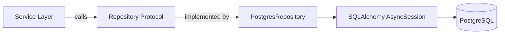

# SQLAlchemy Repository Pattern

## Context & Problem

Direct SQLAlchemy usage scattered across service code creates tight coupling between business logic and database access. Queries appear in route handlers, domain services call `session.execute()` directly, and testing requires a live database for everything.

The repository pattern encapsulates data access behind a domain-oriented interface. The service layer calls `repository.get_by_id()`, not `session.execute(select(Trade).where(...))`. This keeps SQL out of business logic and makes the data layer independently testable and replaceable.

## Design Decisions

### SQLAlchemy 2.0 Style

All code uses SQLAlchemy 2.0's `mapped_column` and type-annotated mappings. The 1.x `Column()` style is legacy.

### Async by Default

FastAPI is async. The repository uses `AsyncSession` with `asyncpg` as the driver. For CPU-bound batch operations where async adds no value, a sync session is acceptable.

### One Repository Per Aggregate

Each aggregate root gets its own repository. If `Position` is the aggregate root containing `PositionLot` entries, there is a `PositionRepository` — not a `PositionLotRepository`. Child entities are loaded through the aggregate.

## Architecture



## Interface Contract

```python
# repository protocol — the domain defines what it needs

from typing import Protocol, TypeVar, Generic
from uuid import UUID

from pydantic import BaseModel

T = TypeVar("T")


class Repository(Protocol[T]):
    async def get_by_id(self, id: UUID) -> T | None: ...
    async def get_all(self, *, limit: int = 100, offset: int = 0) -> list[T]: ...
    async def add(self, entity: T) -> T: ...
    async def update(self, entity: T) -> T: ...
    async def delete(self, id: UUID) -> None: ...
```

## Code Skeleton

### Model Definition

```python
# models.py

from datetime import datetime, timezone
from decimal import Decimal
from uuid import UUID, uuid4

from sqlalchemy import ForeignKey, Numeric, String
from sqlalchemy.orm import DeclarativeBase, Mapped, mapped_column, relationship


class Base(DeclarativeBase):
    pass


class TradeRecord(Base):
    __tablename__ = "trades"
    __table_args__ = {"schema": "positions"}

    id: Mapped[UUID] = mapped_column(primary_key=True, default=uuid4)
    portfolio_id: Mapped[UUID] = mapped_column(index=True)
    instrument_id: Mapped[str] = mapped_column(String(32), index=True)
    side: Mapped[str] = mapped_column(String(4))  # "buy" | "sell"
    quantity: Mapped[Decimal] = mapped_column(Numeric(18, 8))
    price: Mapped[Decimal] = mapped_column(Numeric(18, 8))
    currency: Mapped[str] = mapped_column(String(3))
    executed_at: Mapped[datetime]
    created_at: Mapped[datetime] = mapped_column(default=lambda: datetime.now(timezone.utc))
```

### Repository Implementation

```python
# repository.py

from uuid import UUID

from sqlalchemy import select
from sqlalchemy.ext.asyncio import AsyncSession, async_sessionmaker


class PostgresTradeRepository:
    def __init__(self, session_factory: async_sessionmaker[AsyncSession]) -> None:
        self._session_factory = session_factory

    async def get_by_id(self, id: UUID) -> TradeRecord | None:
        async with self._session_factory() as session:
            return await session.get(TradeRecord, id)

    async def get_all(self, *, limit: int = 100, offset: int = 0) -> list[TradeRecord]:
        async with self._session_factory() as session:
            result = await session.execute(
                select(TradeRecord)
                .order_by(TradeRecord.executed_at.desc())
                .limit(limit)
                .offset(offset)
            )
            return list(result.scalars().all())

    async def get_by_portfolio(
        self,
        portfolio_id: UUID,
        *,
        limit: int = 100,
    ) -> list[TradeRecord]:
        async with self._session_factory() as session:
            result = await session.execute(
                select(TradeRecord)
                .where(TradeRecord.portfolio_id == portfolio_id)
                .order_by(TradeRecord.executed_at.desc())
                .limit(limit)
            )
            return list(result.scalars().all())

    async def add(self, trade: TradeRecord) -> TradeRecord:
        async with self._session_factory() as session:
            session.add(trade)
            await session.commit()
            await session.refresh(trade)
            return trade

    async def add_many(self, trades: list[TradeRecord]) -> list[TradeRecord]:
        async with self._session_factory() as session:
            session.add_all(trades)
            await session.commit()
            return trades

    async def delete(self, id: UUID) -> None:
        async with self._session_factory() as session:
            trade = await session.get(TradeRecord, id)
            if trade:
                await session.delete(trade)
                await session.commit()
```

### Session Factory Setup

```python
# database.py — shared infrastructure

from sqlalchemy.ext.asyncio import create_async_engine, async_sessionmaker, AsyncSession


def create_session_factory(database_url: str) -> async_sessionmaker[AsyncSession]:
    engine = create_async_engine(
        database_url,
        pool_size=20,
        max_overflow=10,
        pool_pre_ping=True,     # detect stale connections
        pool_recycle=3600,       # recycle connections every hour
    )
    return async_sessionmaker(engine, expire_on_commit=False)
```

### Unit of Work (When Needed)

When multiple repositories must participate in a single transaction:

```python
class UnitOfWork:
    def __init__(self, session_factory: async_sessionmaker[AsyncSession]) -> None:
        self._session_factory = session_factory

    async def __aenter__(self) -> "UnitOfWork":
        self._session = self._session_factory()
        # Wrap the session in a lambda so repositories receive a factory
        # that always returns this transaction's session.
        scoped_factory = lambda: self._session  # noqa: E731
        self.trades = PostgresTradeRepository(scoped_factory)
        self.positions = PostgresPositionRepository(scoped_factory)
        return self

    async def __aexit__(self, exc_type, exc_val, exc_tb) -> None:
        if exc_type:
            await self._session.rollback()
        await self._session.close()

    async def commit(self) -> None:
        await self._session.commit()
```

## Testing Approach

```python
class InMemoryTradeRepository:
    """In-memory implementation for unit tests."""

    def __init__(self) -> None:
        self._trades: dict[UUID, TradeRecord] = {}

    async def get_by_id(self, id: UUID) -> TradeRecord | None:
        return self._trades.get(id)

    async def add(self, trade: TradeRecord) -> TradeRecord:
        self._trades[trade.id] = trade
        return trade

    # ... remaining methods
```

For integration tests, use a real PostgreSQL via testcontainers (see [Test Containers](../testing/test-containers.md)).

## Failure Modes

| Failure | Cause | Mitigation |
|---|---|---|
| Connection exhaustion | Pool too small for load | Monitor pool usage, tune `pool_size` and `max_overflow` |
| Stale connections | DB restart, network blip | `pool_pre_ping=True` detects and discards stale connections |
| N+1 queries | Lazy loading relationships in loops | Use `selectinload()` or `joinedload()` explicitly |
| Long transactions | Session held open during slow operations | Keep transactions short, move heavy computation outside the session |

## Related Documents

- [Connection Pooling](connection-pooling.md) — pool sizing and PgBouncer
- [Alembic Migrations](alembic-migrations.md) — schema versioning
- [Dependency Inversion](../../principles/dependency-inversion.md) — Protocol-based repositories
- [Test Containers](../testing/test-containers.md) — integration testing with real PostgreSQL
