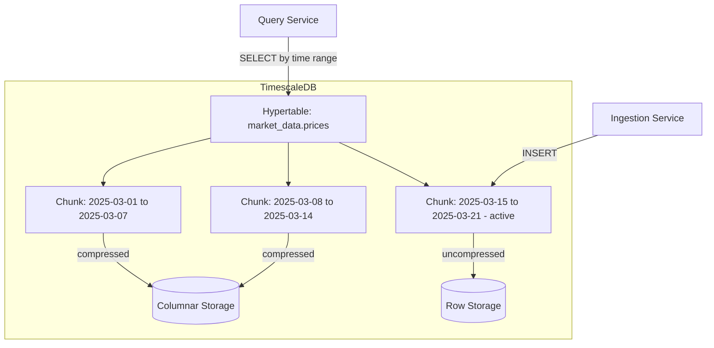

# TimescaleDB Hypertables

## Context & Problem

Market data, metrics, logs, and sensor readings share a common profile: high-volume writes, time-ordered, rarely updated, queried by time range. PostgreSQL can handle this at moderate scale, but performance degrades as tables grow into billions of rows — queries scan too much data, `VACUUM` struggles, and index maintenance becomes expensive.

TimescaleDB is a PostgreSQL extension that transparently partitions tables by time into "chunks." Queries only scan relevant chunks, inserts target the latest chunk, and old data can be compressed or dropped without touching recent data. Because it is a PostgreSQL extension — not a separate database — it uses the same connection, the same SQL, the same tooling.

## Design Decisions

### When to Use Hypertables

**Use hypertables for:**
- Time-series data with high insert volume (>1K rows/sec sustained)
- Data queried primarily by time range
- Data that benefits from automatic partitioning and retention policies

**Stick with regular PostgreSQL tables for:**
- Low-volume reference data (instrument master, portfolios)
- Data queried primarily by non-time dimensions
- Tables under 10M rows where PostgreSQL performs fine

### Chunk Interval

The chunk interval determines partition granularity. Default is 7 days. Guidelines:

| Data Volume | Chunk Interval | Rationale |
|---|---|---|
| <100K rows/day | 1 month | Few chunks, less overhead |
| 100K–10M rows/day | 1 week | Default, good balance |
| >10M rows/day | 1 day | Keeps chunks manageable |

Each chunk should fit in ~25% of available memory for optimal query performance.

### Compression

TimescaleDB's native compression converts chunks from row-oriented to columnar format, achieving 10-20x compression on typical time-series data. Compressed chunks are still queryable via standard SQL.

## Architecture



## Code Skeleton

### Table Definition

```python
# models.py

from datetime import datetime
from decimal import Decimal
from uuid import UUID

from sqlalchemy import Index, Numeric, String, text
from sqlalchemy.orm import Mapped, mapped_column

from shared.database import Base


class PriceRecord(Base):
    """Tick-level price data stored in a TimescaleDB hypertable."""
    __tablename__ = "prices"
    __table_args__ = (
        Index("ix_prices_instrument_time", "instrument_id", "timestamp"),
        {"schema": "market_data"},
    )

    # TimescaleDB hypertables require time as part of the primary key
    timestamp: Mapped[datetime] = mapped_column(primary_key=True)
    instrument_id: Mapped[str] = mapped_column(String(32), primary_key=True)
    bid: Mapped[Decimal] = mapped_column(Numeric(18, 8))
    ask: Mapped[Decimal] = mapped_column(Numeric(18, 8))
    mid: Mapped[Decimal] = mapped_column(Numeric(18, 8))
    volume: Mapped[Decimal] = mapped_column(Numeric(18, 2), nullable=True)
    source: Mapped[str] = mapped_column(String(32))  # "bloomberg", "reuters"


class OHLCVRecord(Base):
    """Aggregated OHLCV bars."""
    __tablename__ = "ohlcv"
    __table_args__ = (
        Index("ix_ohlcv_instrument_time", "instrument_id", "timestamp"),
        {"schema": "market_data"},
    )

    timestamp: Mapped[datetime] = mapped_column(primary_key=True)
    instrument_id: Mapped[str] = mapped_column(String(32), primary_key=True)
    interval: Mapped[str] = mapped_column(String(4), primary_key=True)  # "1m", "5m", "1h", "1d"
    open: Mapped[Decimal] = mapped_column(Numeric(18, 8))
    high: Mapped[Decimal] = mapped_column(Numeric(18, 8))
    low: Mapped[Decimal] = mapped_column(Numeric(18, 8))
    close: Mapped[Decimal] = mapped_column(Numeric(18, 8))
    volume: Mapped[Decimal] = mapped_column(Numeric(18, 2))
```

### Alembic Migration: Create Hypertable

```python
"""Create market_data.prices hypertable.

Revision ID: 001
"""
from alembic import op


def upgrade() -> None:
    op.execute("CREATE SCHEMA IF NOT EXISTS market_data")
    
    op.execute("""
        CREATE TABLE market_data.prices (
            timestamp    TIMESTAMPTZ      NOT NULL,
            instrument_id VARCHAR(32)     NOT NULL,
            bid          NUMERIC(18,8)    NOT NULL,
            ask          NUMERIC(18,8)    NOT NULL,
            mid          NUMERIC(18,8)    NOT NULL,
            volume       NUMERIC(18,2),
            source       VARCHAR(32)      NOT NULL,
            PRIMARY KEY (timestamp, instrument_id)
        )
    """)

    # Convert to hypertable — chunk by 1 week
    op.execute("""
        SELECT create_hypertable(
            'market_data.prices',
            by_range('timestamp', INTERVAL '7 days')
        )
    """)

    # Enable compression on chunks older than 7 days
    op.execute("""
        ALTER TABLE market_data.prices SET (
            timescaledb.compress,
            timescaledb.compress_segmentby = 'instrument_id',
            timescaledb.compress_orderby = 'timestamp DESC'
        )
    """)

    op.execute("""
        SELECT add_compression_policy(
            'market_data.prices',
            compress_after => INTERVAL '7 days'
        )
    """)

    # Drop chunks older than 1 year
    op.execute("""
        SELECT add_retention_policy(
            'market_data.prices',
            drop_after => INTERVAL '1 year'
        )
    """)

    op.execute("""
        CREATE INDEX ix_prices_instrument_time
        ON market_data.prices (instrument_id, timestamp DESC)
    """)


def downgrade() -> None:
    op.execute("DROP TABLE market_data.prices")
```

### Continuous Aggregates

TimescaleDB can automatically maintain materialized aggregations that update as new data arrives:

```sql
-- Automatically maintained 1-minute OHLCV bars
CREATE MATERIALIZED VIEW market_data.ohlcv_1m
WITH (timescaledb.continuous) AS
SELECT
    time_bucket('1 minute', timestamp) AS bucket,
    instrument_id,
    first(mid, timestamp)  AS open,
    max(mid)               AS high,
    min(mid)               AS low,
    last(mid, timestamp)   AS close,
    sum(volume)            AS volume
FROM market_data.prices
GROUP BY bucket, instrument_id
WITH NO DATA;

-- Refresh policy: materialize data older than 5 minutes, refresh every minute
SELECT add_continuous_aggregate_policy('market_data.ohlcv_1m',
    start_offset    => INTERVAL '1 hour',
    end_offset      => INTERVAL '5 minutes',
    schedule_interval => INTERVAL '1 minute'
);
```

### Batch Insert for Ingestion

```python
from sqlalchemy.dialects.postgresql import insert as pg_insert


class PostgresPriceRepository:
    async def insert_batch(self, prices: list[dict]) -> int:
        """Bulk insert prices. Uses ON CONFLICT to handle duplicates."""
        async with self._session_factory() as session:
            stmt = pg_insert(PriceRecord).values(prices)
            stmt = stmt.on_conflict_do_nothing(
                index_elements=["timestamp", "instrument_id"]
            )
            result = await session.execute(stmt)
            await session.commit()
            return result.rowcount
```

## Performance Profile

| Operation | Expected Performance |
|---|---|
| Single row insert | <1ms |
| Batch insert (1000 rows) | 5-15ms |
| Batch insert (100K rows) | 200-500ms |
| Time range query (1 day, 1 instrument) | <10ms |
| Time range query (1 month, 1 instrument) | 10-50ms (compressed chunks) |
| Continuous aggregate query | <5ms (pre-materialized) |

## Failure Modes

| Failure | Cause | Mitigation |
|---|---|---|
| Chunk bloat | Chunk interval too small → thousands of chunks | Use appropriate interval for data volume |
| Compression lag | Compression policy not keeping up | Monitor chunk count, adjust policy interval |
| Insert contention | Many writers to the same chunk | Batch inserts, use COPY for very high throughput |
| Query scans too many chunks | Query without time predicate | Always include time range in WHERE clause |
| Retention deletes needed data | Policy too aggressive | Archive to cold storage (S3) before retention drops chunks |

## Related Documents

- [SQLAlchemy Repository](sqlalchemy-repository.md) — repository pattern over these tables
- [Alembic Migrations](alembic-migrations.md) — managing schema changes
- [Polyglot Persistence](../../principles/polyglot-persistence.md) — why TimescaleDB for time-series
- [Ingestion Pipelines](../data-processing/ingestion-pipelines.md) — feeding data into hypertables
