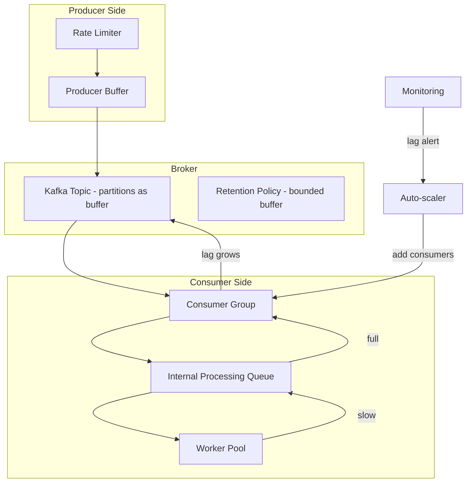
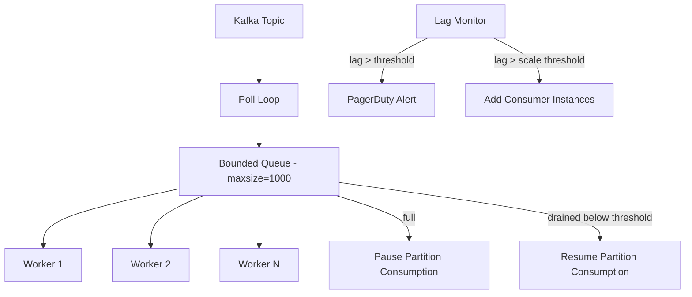

# Backpressure

## Context & Problem

In any pipeline where producers and consumers are decoupled, throughput mismatches are inevitable. Producers may burst during peak periods (market open, batch job completion, user activity spikes), while consumers have finite processing capacity bounded by CPU, I/O, or downstream dependencies.

Without flow control, the system either runs out of memory (unbounded buffering), drops data silently, or cascades failures downstream. Backpressure is the mechanism by which a slow consumer signals upstream to slow down, buffer, or shed load.

## Design Decisions

### Backpressure Strategies

There is no single correct strategy. The choice depends on the data's value and the system's tolerance for latency vs data loss.

| Strategy | Behavior | Data Loss | Latency Impact | When to Use |
|---|---|---|---|---|
| **Buffering** | Queue messages until consumer catches up | None | Increases with buffer depth | Data cannot be lost; temporary bursts |
| **Dropping** | Discard excess messages | Yes | None | Stale data has no value (latest-price updates) |
| **Rate limiting** | Throttle producers to match consumer capacity | None | Producers block or queue | Producer can tolerate being slowed |
| **Dynamic scaling** | Add consumer instances to increase throughput | None | Brief during scale-up | Elastic infrastructure available |
| **Load shedding** | Reject lower-priority work during overload | Selective | None for accepted work | Work has clear priority tiers |

### Kafka Consumer Lag as Backpressure Signal

In Kafka-based systems, **consumer lag** (the offset difference between the latest produced message and the consumer's committed offset) is the primary backpressure indicator.

```
Consumer Lag = Latest Offset (producer) - Committed Offset (consumer)
```

Lag is not inherently bad. A consumer that processes events in 5ms will always have some lag. The concern is **growing lag** — lag that increases over time indicates the consumer cannot keep up.

### Layered Backpressure

Backpressure should be applied at multiple levels:



Each layer has its own overflow behavior:

1. **Producer buffer** — `buffer.memory` in Kafka producer config. When full, `produce()` blocks or raises.
2. **Kafka topic** — retention policy bounds total buffered data. Oldest messages are dropped when retention is exceeded.
3. **Consumer internal queue** — bounded in-memory queue between poll loop and processing workers.
4. **Worker pool** — fixed concurrency limit prevents resource exhaustion.

## Architecture

### Adaptive Consumer with Backpressure



## Code Skeleton

### Backpressure-Aware Kafka Consumer

```python
# consumers/backpressure_consumer.py

import asyncio
import logging
from collections.abc import Callable, Coroutine
from typing import Any

from confluent_kafka import Consumer, KafkaError, TopicPartition

logger = logging.getLogger(__name__)


class BackpressureConsumer:
    """Kafka consumer with internal queue-based backpressure.

    When the processing queue fills up, the consumer pauses partition
    consumption. When the queue drains below the resume threshold,
    consumption resumes. This prevents unbounded memory growth.
    """

    def __init__(
        self,
        bootstrap_servers: str,
        group_id: str,
        topics: list[str],
        queue_size: int = 1000,
        resume_threshold: float = 0.5,
        worker_count: int = 4,
    ) -> None:
        self._consumer = Consumer({
            "bootstrap.servers": bootstrap_servers,
            "group.id": group_id,
            "auto.offset.reset": "earliest",
            "enable.auto.commit": False,
            "max.poll.interval.ms": 300000,
        })
        self._consumer.subscribe(topics)

        self._queue: asyncio.Queue = asyncio.Queue(maxsize=queue_size)
        self._queue_size = queue_size
        self._resume_at = int(queue_size * resume_threshold)
        self._worker_count = worker_count
        self._paused_partitions: set[tuple[str, int]] = set()
        self._running = False

    async def run(self, handler: Callable[[dict], Coroutine[Any, Any, None]]) -> None:
        """Start the poll loop and worker pool."""
        self._running = True
        workers = [
            asyncio.create_task(self._worker(handler))
            for _ in range(self._worker_count)
        ]
        poll_task = asyncio.create_task(self._poll_loop())

        try:
            await asyncio.gather(poll_task, *workers)
        finally:
            self._running = False
            self._consumer.close()

    async def _poll_loop(self) -> None:
        """Poll Kafka and manage partition pause/resume based on queue depth."""
        while self._running:
            # Check if we should pause consumption
            if self._queue.qsize() >= self._queue_size - 1:
                self._pause_all()
                await asyncio.sleep(0.1)
                continue

            # Check if we should resume paused partitions
            if self._paused_partitions and self._queue.qsize() <= self._resume_at:
                self._resume_all()

            msg = self._consumer.poll(timeout=0.1)
            if msg is None:
                await asyncio.sleep(0.01)
                continue
            if msg.error():
                if msg.error().code() != KafkaError._PARTITION_EOF:
                    logger.error(f"Consumer error: {msg.error()}")
                continue

            await self._queue.put(msg)

    async def _worker(self, handler: Callable) -> None:
        """Process messages from the internal queue."""
        while self._running:
            try:
                msg = await asyncio.wait_for(self._queue.get(), timeout=1.0)
            except asyncio.TimeoutError:
                continue

            try:
                import json
                event = json.loads(msg.value().decode("utf-8"))
                await handler(event)
                self._consumer.commit(msg)
            except Exception:
                logger.exception(f"Failed to process offset {msg.offset()}")

    def _pause_all(self) -> None:
        assignment = self._consumer.assignment()
        to_pause = [
            tp for tp in assignment
            if (tp.topic, tp.partition) not in self._paused_partitions
        ]
        if to_pause:
            self._consumer.pause(to_pause)
            for tp in to_pause:
                self._paused_partitions.add((tp.topic, tp.partition))
            logger.warning(f"Paused {len(to_pause)} partitions (queue full)")

    def _resume_all(self) -> None:
        to_resume = [
            TopicPartition(t, p) for t, p in self._paused_partitions
        ]
        if to_resume:
            self._consumer.resume(to_resume)
            self._paused_partitions.clear()
            logger.info(f"Resumed {len(to_resume)} partitions (queue drained)")
```

### Rate Limiter for Producers

```python
# infrastructure/rate_limiter.py

import asyncio
import time


class TokenBucketRateLimiter:
    """Token bucket rate limiter for producer-side backpressure."""

    def __init__(self, rate: float, burst: int) -> None:
        self._rate = rate          # tokens per second
        self._burst = burst        # max tokens
        self._tokens = float(burst)
        self._last_refill = time.monotonic()
        self._lock = asyncio.Lock()

    async def acquire(self) -> None:
        async with self._lock:
            self._refill()
            while self._tokens < 1:
                wait = (1 - self._tokens) / self._rate
                await asyncio.sleep(wait)
                self._refill()
            self._tokens -= 1

    def _refill(self) -> None:
        now = time.monotonic()
        elapsed = now - self._last_refill
        self._tokens = min(self._burst, self._tokens + elapsed * self._rate)
        self._last_refill = now
```

## Monitoring Approach

### Key Metrics

| Metric | Source | Alert Threshold |
|---|---|---|
| `kafka_consumer_group_lag` | Kafka broker / Burrow | Lag growing for > 5 minutes |
| `consumer_queue_depth` | Application metric | > 80% of queue capacity |
| `consumer_processing_rate` | Application metric | Drops below 50% of normal |
| `consumer_pause_events` | Application metric | Any pause event |
| `producer_buffer_available_bytes` | Kafka producer metric | < 20% of `buffer.memory` |

### Grafana Dashboard Layout

```
Row 1: Consumer Lag
  - Panel: Lag per partition (time series)
  - Panel: Total lag per consumer group (stat)

Row 2: Processing Throughput
  - Panel: Messages consumed/sec (time series)
  - Panel: Messages produced/sec (time series)
  - Panel: Production rate vs consumption rate (overlay)

Row 3: Backpressure Indicators
  - Panel: Internal queue depth (gauge)
  - Panel: Partition pause/resume events (event timeline)
  - Panel: Rate limiter wait time (histogram)
```

### Alerting Rules

```yaml
# prometheus/alerts/backpressure.yml
groups:
  - name: backpressure
    rules:
      - alert: ConsumerLagGrowing
        expr: |
          delta(kafka_consumer_group_lag[10m]) > 0
          and kafka_consumer_group_lag > 10000
        for: 5m
        labels:
          severity: warning
        annotations:
          summary: "Consumer group {{ $labels.group }} lag is growing"

      - alert: ConsumerLagCritical
        expr: kafka_consumer_group_lag > 100000
        for: 2m
        labels:
          severity: critical
        annotations:
          summary: "Consumer group {{ $labels.group }} lag exceeds 100k"
```

## Failure Modes

| Failure | Cause | Mitigation |
|---|---|---|
| Unbounded memory growth | No queue size limit, consumer buffers everything | Bounded queues, pause partitions when full |
| Silent data loss | Drop strategy without logging or metrics | Always meter dropped messages; alert on drop rate |
| Producer blocked indefinitely | Rate limiter too aggressive, consumer down | Timeout on rate limiter acquire; circuit breaker |
| Cascade failure | Backpressure propagates to unrelated producers | Isolate topic-level backpressure; per-topic consumer groups |
| Stale data served | Large buffer delay means consumers process old data | Monitor end-to-end latency (event timestamp vs processing time) |
| Rebalance storm under load | Consumers pause too long, exceed `max.poll.interval.ms` | Tune poll interval, keep processing in separate async tasks |

## Related Documents

- [Kafka Topology](../messaging/kafka-topology.md) — partition design affects backpressure characteristics
- [Batch vs Streaming](batch-vs-streaming.md) — batch processing as a backpressure escape valve
- [Ingestion Pipelines](ingestion-pipelines.md) — backpressure at the ingestion boundary
- [Dead Letter Queues](../messaging/dead-letter-queues.md) — handling messages that cannot be processed
- [Event-Driven Architecture](../../principles/event-driven-architecture.md) — async communication and flow control
