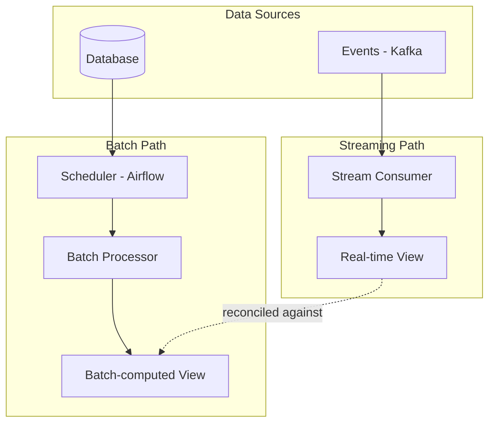
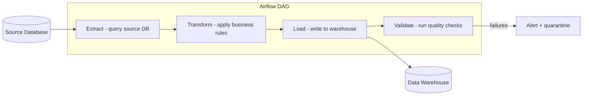
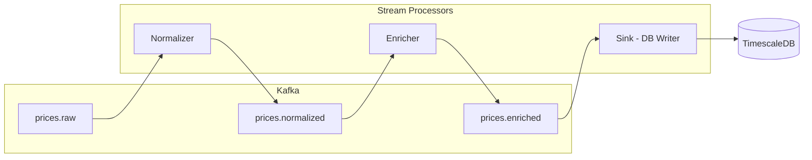

# Batch vs Streaming

## Context & Problem

Data processing workloads fall on a spectrum between batch (process accumulated data at intervals) and streaming (process each record as it arrives). Choosing the wrong model creates either unnecessary latency or unnecessary infrastructure complexity.

The decision is not binary. Many systems combine both: streaming for operational real-time paths and batch for analytical, reconciliation, or reprocessing workloads. The challenge is knowing where each fits and avoiding the trap of streaming everything when batch would suffice.

## Design Decisions

### Decision Framework

| Factor | Batch | Streaming |
|---|---|---|
| **Latency requirement** | Minutes to hours acceptable | Seconds or sub-second required |
| **Data completeness** | Need the full dataset for processing | Can process partial/incremental data |
| **Processing complexity** | Complex joins, aggregations, ML training | Filtering, enrichment, simple transforms |
| **Error handling** | Rerun the entire batch | Per-record error handling, DLQ |
| **State management** | Stateless or external state (database) | Stateful stream processing (windows, aggregations) |
| **Volume** | Large volumes processed efficiently in bulk | Continuous flow, variable throughput |
| **Ordering** | Natural ordering within batch file/query | Must be managed explicitly (partitions, watermarks) |

### When to Use Batch

- **End-of-day reconciliation.** Compare positions across systems after markets close. Requires the complete dataset for the day.
- **Report generation.** Daily P&L, monthly compliance reports. No value in producing these incrementally.
- **ML model training.** Needs the full historical dataset. Periodic retraining on a schedule.
- **Large-scale backfills.** Reprocessing historical data after a schema change or bug fix.
- **ETL to data warehouse.** Loading transformed data into analytical stores on a schedule.

### When to Use Streaming

- **Real-time pricing.** Market data feeds that must update positions and risk calculations immediately.
- **Fraud/compliance alerts.** Detecting violations within seconds of a triggering event.
- **User-facing notifications.** Sending alerts, emails, or push notifications in response to events.
- **Event-driven workflows.** Triggering downstream processing as soon as upstream events occur.
- **Change data capture.** Propagating database changes to search indexes or caches in near real-time.

### When to Use Both (Lambda/Kappa Patterns)

Some domains need real-time results and periodic reconciliation against a batch-computed "source of truth."



**Prefer the Kappa pattern** (streaming only, with replay capability) when the stream processor can handle reprocessing by replaying from Kafka. This avoids maintaining two separate codepaths.

## Architecture

### Batch Architecture (Airflow)



### Streaming Architecture (Kafka Consumers)



## Code Skeleton

### Batch Processing with Airflow

```python
# dags/daily_reconciliation.py

from datetime import datetime, timedelta

from airflow import DAG
from airflow.operators.python import PythonOperator

default_args = {
    "owner": "data-engineering",
    "retries": 2,
    "retry_delay": timedelta(minutes=5),
    "depends_on_past": False,
}

dag = DAG(
    dag_id="daily_position_reconciliation",
    default_args=default_args,
    schedule_interval="0 2 * * *",  # 2 AM daily
    start_date=datetime(2025, 1, 1),
    catchup=False,
    tags=["reconciliation", "batch"],
)


def extract_positions(**context) -> None:
    """Extract position snapshots from source systems."""
    execution_date = context["ds"]
    # Query source databases for position data as of execution_date
    # Write intermediate results to object storage or temp table
    ...


def reconcile(**context) -> None:
    """Compare positions across systems and flag discrepancies."""
    # Read extracted data, apply reconciliation logic
    # Write discrepancy report
    ...


def notify_discrepancies(**context) -> None:
    """Send alerts for unresolved discrepancies."""
    ...


extract = PythonOperator(task_id="extract_positions", python_callable=extract_positions, dag=dag)
reconcile_task = PythonOperator(task_id="reconcile", python_callable=reconcile, dag=dag)
notify = PythonOperator(task_id="notify", python_callable=notify_discrepancies, dag=dag)

extract >> reconcile_task >> notify
```

### Stream Processing with Faust

```python
# stream_processors/price_normalizer.py

import faust
from datetime import datetime
from decimal import Decimal


app = faust.App(
    "price-normalizer",
    broker="kafka://localhost:9092",
    store="rocksdb://",
    topic_partitions=6,
)


class RawPrice(faust.Record):
    instrument_id: str
    bid: str
    ask: str
    timestamp: str
    source: str


class NormalizedPrice(faust.Record):
    instrument_id: str
    bid: Decimal
    ask: Decimal
    mid: Decimal
    timestamp: datetime
    source: str


raw_topic = app.topic("prices.raw", value_type=RawPrice)
normalized_topic = app.topic("prices.normalized", value_type=NormalizedPrice)


@app.agent(raw_topic)
async def normalize(stream) -> None:
    """Normalize raw vendor prices into canonical format."""
    async for event in stream:
        try:
            bid = Decimal(event.bid)
            ask = Decimal(event.ask)
            normalized = NormalizedPrice(
                instrument_id=event.instrument_id,
                bid=bid,
                ask=ask,
                mid=(bid + ask) / 2,
                timestamp=datetime.fromisoformat(event.timestamp),
                source=event.source,
            )
            await normalized_topic.send(
                key=event.instrument_id,
                value=normalized,
            )
        except Exception as exc:
            logger.error(f"Failed to normalize {event.instrument_id}: {exc}")
            # Route to DLQ
```

## Tradeoffs Table

| Dimension | Batch | Streaming |
|---|---|---|
| **Infrastructure cost** | Lower — compute spins up on schedule, then shuts down | Higher — consumers run continuously |
| **Operational complexity** | DAG management, scheduling, backfill orchestration | Consumer group management, partition rebalancing, state stores |
| **Debugging** | Easier — rerun the batch, inspect intermediate files | Harder — distributed state, event replay, ordering issues |
| **Data freshness** | Stale by design (hours) | Near real-time (seconds) |
| **Exactly-once** | Natural — rerun replaces previous output | Requires transactional consumers or idempotent sinks |
| **Scalability** | Vertical (bigger machines) or horizontal (partition by batch segment) | Horizontal (add consumers up to partition count) |
| **Recovery** | Rerun from last successful checkpoint | Rewind consumer offset and replay |
| **Testing** | Straightforward — feed test data, check output | Integration tests need embedded Kafka or test harness |

## Failure Modes

| Failure | Cause | Mitigation |
|---|---|---|
| Batch job timeout | Data volume spike, slow source query | Set execution timeouts, alert on SLA breach, optimize queries |
| Batch data staleness | Upstream batch delayed, dependency not met | DAG sensors wait for upstream completion, alert on delay |
| Consumer lag (streaming) | Processing slower than production rate | Monitor lag, auto-scale consumers, apply backpressure |
| Stateful processor crash | Node failure loses local state | Use changelog topics to rebuild state, use RocksDB with persistent storage |
| Out-of-order events | Network delays, partition rebalance | Use event timestamps with watermarks, not processing time |
| Reprocessing storm | Offset reset to earliest on large topic | Use consumer group reset tooling carefully, limit replay window |

## Related Documents

- [Kafka Topology](../messaging/kafka-topology.md) — topic design for streaming pipelines
- [Ingestion Pipelines](ingestion-pipelines.md) — how data enters the system
- [Backpressure](backpressure.md) — flow control in streaming architectures
- [ETL vs ELT](etl-vs-elt.md) — batch processing paradigm comparison
- [Event-Driven Architecture](../../principles/event-driven-architecture.md) — streaming as an architectural principle
- [Change Data Capture](change-data-capture.md) — streaming changes from databases
