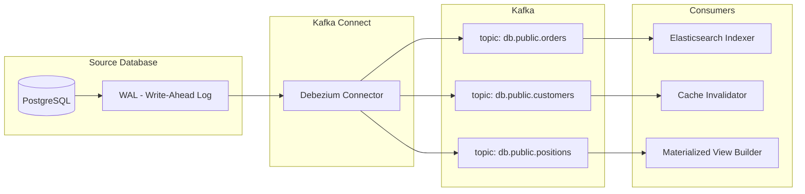
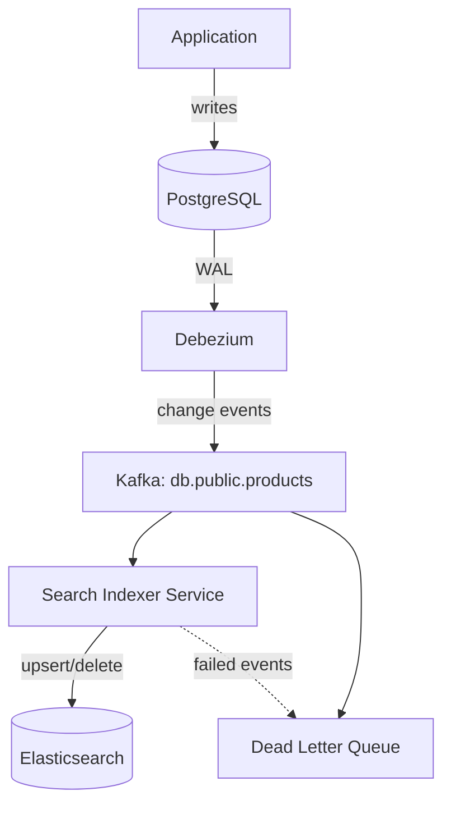
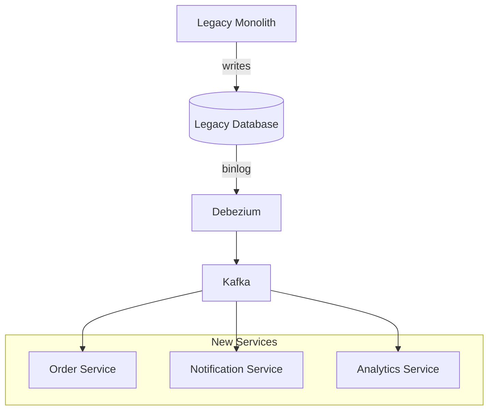

# Change Data Capture

## Context & Problem

Legacy databases often serve as the system of record, but other services need to react to changes in that data: search indexes must be updated, caches invalidated, event streams populated, materialized views refreshed. Polling the database for changes is inefficient, error-prone, and adds load to the source.

Change Data Capture (CDC) reads the database's transaction log (WAL in PostgreSQL, binlog in MySQL) and emits a stream of row-level change events. This gives downstream consumers a reliable, ordered, near-real-time feed of every insert, update, and delete without modifying the source application.

## Design Decisions

### Why CDC over Application-Level Events

| Approach | Pros | Cons |
|---|---|---|
| **Application publishes events** | Explicit, controlled schema | Dual-write problem (DB + Kafka can diverge), requires code changes in every writer |
| **CDC from transaction log** | Captures all changes including direct SQL, no application changes needed | Schema tightly coupled to DB schema, requires log access permissions |

CDC is particularly valuable when:

- The source is a legacy system that cannot be easily modified to publish events.
- Multiple applications write to the same database (direct SQL, ORMs, stored procedures).
- You need a complete, gap-free history of all changes.
- You are migrating from a monolith and need to feed events to new services without changing the monolith.

### Debezium Architecture

Debezium runs as a Kafka Connect source connector. It reads the database's transaction log and publishes change events to Kafka topics (one topic per captured table).



### Event Structure

Each Debezium change event contains:

```json
{
  "before": { "id": 1, "status": "pending", "amount": "100.00" },
  "after":  { "id": 1, "status": "filled", "amount": "100.00" },
  "source": {
    "version": "2.5.0",
    "connector": "postgresql",
    "db": "trading",
    "schema": "public",
    "table": "orders",
    "txId": 12345,
    "lsn": 98765432,
    "ts_ms": 1710510600000
  },
  "op": "u",
  "ts_ms": 1710510600123
}
```

- `op`: Operation type — `c` (create), `u` (update), `d` (delete), `r` (snapshot read)
- `before`/`after`: Row state before and after the change (null for creates/deletes respectively)
- `source`: Metadata about the database, transaction, and log position

### Snapshot + Streaming

When a connector starts for the first time, it takes a **consistent snapshot** of the current table state (emitted as `op: r` events), then switches to streaming incremental changes from the transaction log. This ensures consumers get the full dataset without gaps.

## Architecture

### CDC for Search Index Sync



### CDC for Event Sourcing from Legacy DB



## Code Skeleton

### Debezium Connector Configuration

```json
{
  "name": "trading-db-connector",
  "config": {
    "connector.class": "io.debezium.connector.postgresql.PostgresConnector",
    "database.hostname": "postgres.internal",
    "database.port": "5432",
    "database.user": "debezium_replication",
    "database.password": "${secrets:db/debezium-password}",
    "database.dbname": "trading",

    "topic.prefix": "cdc.trading",
    "schema.include.list": "public",
    "table.include.list": "public.orders,public.positions,public.customers",

    "plugin.name": "pgoutput",
    "publication.name": "debezium_publication",
    "slot.name": "debezium_slot",

    "snapshot.mode": "initial",

    "key.converter": "io.confluent.connect.avro.AvroConverter",
    "key.converter.schema.registry.url": "http://schema-registry:8081",
    "value.converter": "io.confluent.connect.avro.AvroConverter",
    "value.converter.schema.registry.url": "http://schema-registry:8081",

    "transforms": "route",
    "transforms.route.type": "org.apache.kafka.connect.transforms.RegexRouter",
    "transforms.route.regex": "cdc\\.trading\\.public\\.(.*)",
    "transforms.route.replacement": "cdc.$1",

    "heartbeat.interval.ms": "10000",
    "tombstones.on.delete": "true",

    "errors.tolerance": "all",
    "errors.deadletterqueue.topic.name": "cdc.dlq",
    "errors.deadletterqueue.context.headers.enable": "true"
  }
}
```

### PostgreSQL Replication Setup

```sql
-- Create a dedicated replication user
CREATE ROLE debezium_replication WITH REPLICATION LOGIN PASSWORD 'secure_password';

-- Grant access to the database and tables
GRANT CONNECT ON DATABASE trading TO debezium_replication;
GRANT USAGE ON SCHEMA public TO debezium_replication;
GRANT SELECT ON ALL TABLES IN SCHEMA public TO debezium_replication;

-- Create a publication for the tables to capture
CREATE PUBLICATION debezium_publication FOR TABLE
    public.orders,
    public.positions,
    public.customers;

-- Verify WAL level (must be 'logical')
SHOW wal_level;  -- Should return 'logical'
```

### CDC Event Consumer

```python
# consumers/cdc_search_indexer.py

import json
import logging
from typing import Any

from confluent_kafka import Consumer, KafkaError
from elasticsearch import AsyncElasticsearch

logger = logging.getLogger(__name__)


class CdcSearchIndexer:
    """Consumes Debezium CDC events and syncs to Elasticsearch."""

    def __init__(
        self,
        bootstrap_servers: str,
        group_id: str,
        topics: list[str],
        es_client: AsyncElasticsearch,
        index_name: str,
    ) -> None:
        self._consumer = Consumer({
            "bootstrap.servers": bootstrap_servers,
            "group.id": group_id,
            "auto.offset.reset": "earliest",
            "enable.auto.commit": False,
        })
        self._consumer.subscribe(topics)
        self._es = es_client
        self._index = index_name

    async def run(self) -> None:
        """Main consumption loop."""
        while True:
            msg = self._consumer.poll(timeout=1.0)
            if msg is None:
                continue
            if msg.error():
                if msg.error().code() != KafkaError._PARTITION_EOF:
                    logger.error(f"Consumer error: {msg.error()}")
                continue

            try:
                event = json.loads(msg.value().decode("utf-8"))
                await self._handle_event(event)
                self._consumer.commit(msg)
            except Exception:
                logger.exception(f"Failed to process CDC event at offset {msg.offset()}")

    async def _handle_event(self, event: dict[str, Any]) -> None:
        op = event.get("op")
        key = event.get("after", {}).get("id") or event.get("before", {}).get("id")

        if key is None:
            logger.warning(f"CDC event missing key, skipping: op={op}")
            return

        if op in ("c", "r", "u"):
            # Create, read (snapshot), or update — index the document
            document = self._transform_to_search_doc(event["after"])
            await self._es.index(
                index=self._index,
                id=str(key),
                document=document,
            )
            logger.debug(f"Indexed document {key} (op={op})")

        elif op == "d":
            # Delete — remove from index
            await self._es.delete(
                index=self._index,
                id=str(key),
                ignore=[404],
            )
            logger.debug(f"Deleted document {key}")

    def _transform_to_search_doc(self, row: dict) -> dict:
        """Transform a database row into a search-optimized document."""
        return {
            "id": row["id"],
            "status": row.get("status"),
            "amount": float(row["amount"]) if row.get("amount") else None,
            "updated_at": row.get("updated_at"),
        }
```

### Deploying the Connector

```python
# infrastructure/debezium_deploy.py

import httpx
import logging

logger = logging.getLogger(__name__)


async def deploy_connector(
    connect_url: str,
    connector_config: dict,
) -> None:
    """Deploy or update a Debezium connector via the Kafka Connect REST API."""
    connector_name = connector_config["name"]
    async with httpx.AsyncClient(base_url=connect_url) as client:
        # Check if connector already exists
        response = await client.get(f"/connectors/{connector_name}")

        if response.status_code == 200:
            # Update existing connector
            await client.put(
                f"/connectors/{connector_name}/config",
                json=connector_config["config"],
            )
            logger.info(f"Updated connector: {connector_name}")
        else:
            # Create new connector
            await client.post(
                "/connectors",
                json=connector_config,
            )
            logger.info(f"Created connector: {connector_name}")


async def check_connector_status(connect_url: str, name: str) -> dict:
    """Check the health of a running connector."""
    async with httpx.AsyncClient(base_url=connect_url) as client:
        response = await client.get(f"/connectors/{name}/status")
        response.raise_for_status()
        return response.json()
```

## Failure Modes

| Failure | Cause | Mitigation |
|---|---|---|
| Replication slot bloat | Connector down for extended period; WAL segments accumulate | Monitor `pg_replication_slots`, set `slot.drop.on.stop` cautiously, alert on slot lag |
| Snapshot too large | Initial snapshot of a large table exhausts memory or takes hours | Use `snapshot.mode=schema_only` and backfill via batch, or snapshot specific tables |
| Schema change breaks connector | Column added/removed/renamed | Use schema registry with compatibility checks; Debezium handles most additive changes |
| Out-of-order events | Multiple connectors, network delays | Use LSN (log sequence number) for ordering; consumers should be idempotent |
| Connector task failure | OOM, network partition to DB | Monitor connector status via REST API, configure `errors.tolerance` and DLQ |
| Duplicate events | Connector restart replays from last committed offset | Consumers must be idempotent (upsert to Elasticsearch, not insert) |

## Related Documents

- [Kafka Topology](../messaging/kafka-topology.md) — topic design for CDC event streams
- [Kafka Connect](../messaging/kafka-connect.md) — connector framework that Debezium runs on
- [Schema Registry](../messaging/schema-registry.md) — governing CDC event schemas
- [Event-Driven Architecture](../../principles/event-driven-architecture.md) — CDC as a bridge from data-at-rest to events
- [Data Normalization](data-normalization.md) — normalizing CDC events into canonical models
- [Batch vs Streaming](batch-vs-streaming.md) — CDC enables streaming from batch-oriented databases
- [Dead Letter Queues](../messaging/dead-letter-queues.md) — handling failed CDC events
