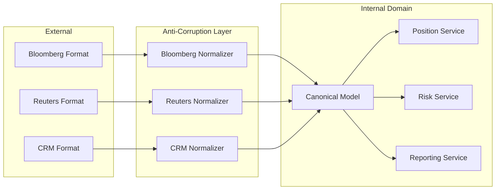
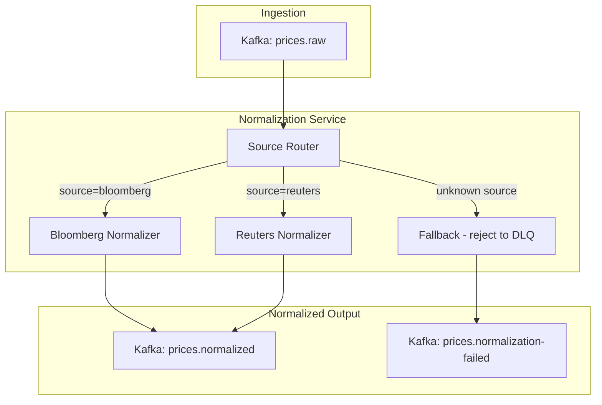

# Data Normalization

## Context & Problem

External vendors represent the same concepts differently. Bloomberg uses `BID`, `ASK`, and `LAST_UPDATE_TIME` with prices as strings. Reuters uses `BidPrice`, `AskPrice`, and `UpdateTimestamp` with prices as floats. A CRM system returns customer names as `first_name` / `last_name`, while another uses a single `full_name` field.

Letting vendor-specific representations propagate through the system creates coupling: every consumer must understand every vendor's format, field names change meaning across contexts, and adding a new vendor requires changes throughout the codebase. The normalization layer translates vendor-specific data into canonical internal models at the system boundary.

This is the **anti-corruption layer** from Domain-Driven Design, applied to data formats.

## Design Decisions

### Normalize at the Boundary

Normalization happens once, as early as possible in the pipeline. After normalization, all downstream consumers work exclusively with canonical models.



### Canonical Model Principles

1. **Vendor-agnostic.** Field names reflect domain concepts, not vendor terminology.
2. **Strict types.** Use `Decimal` for financial amounts, `datetime` with timezone for timestamps, enums for categorical values.
3. **Source tracking.** Always preserve which vendor the data came from and when it was normalized.
4. **Lossless where possible.** Store the original raw payload alongside the normalized version for debugging and re-normalization.

### Normalizer as a Protocol

Each vendor gets a normalizer that implements the same interface. This makes it straightforward to add vendors and to test normalizers in isolation.

```python
from typing import Protocol

class PriceNormalizer(Protocol):
    def normalize(self, raw: dict) -> "NormalizedPrice": ...
    def supports(self, source: str) -> bool: ...
```

## Architecture



## Code Skeleton

### Canonical Models (Pydantic)

```python
# domain/models/market_data.py

from datetime import datetime
from decimal import Decimal
from enum import StrEnum

from pydantic import BaseModel, Field, field_validator


class PriceSource(StrEnum):
    BLOOMBERG = "bloomberg"
    REUTERS = "reuters"
    INTERNAL = "internal"


class NormalizedPrice(BaseModel):
    """Canonical price representation used throughout the system."""

    instrument_id: str = Field(
        ..., description="Internal instrument identifier"
    )
    bid: Decimal = Field(..., ge=0, description="Best bid price")
    ask: Decimal = Field(..., ge=0, description="Best ask price")
    mid: Decimal = Field(..., ge=0, description="Mid price")
    spread: Decimal = Field(..., ge=0, description="Bid-ask spread")
    currency: str = Field(..., min_length=3, max_length=3)
    timestamp: datetime = Field(..., description="Price observation time (UTC)")
    source: PriceSource
    normalized_at: datetime = Field(
        default_factory=lambda: datetime.now(tz=__import__("zoneinfo").ZoneInfo("UTC"))
    )

    @field_validator("ask")
    @classmethod
    def ask_gte_bid(cls, v: Decimal, info) -> Decimal:
        if "bid" in info.data and v < info.data["bid"]:
            raise ValueError(f"Ask ({v}) must be >= bid ({info.data['bid']})")
        return v

    @field_validator("currency")
    @classmethod
    def currency_uppercase(cls, v: str) -> str:
        return v.upper()


class NormalizedCustomer(BaseModel):
    """Canonical customer representation."""

    customer_id: str
    first_name: str
    last_name: str
    email: str
    phone: str | None = None
    country_code: str = Field(..., min_length=2, max_length=2)
    source: str
    normalized_at: datetime = Field(
        default_factory=lambda: datetime.now(tz=__import__("zoneinfo").ZoneInfo("UTC"))
    )
```

### Vendor-Specific Normalizers

```python
# normalization/price_normalizers.py

from datetime import datetime, timezone
from decimal import Decimal

from domain.models.market_data import NormalizedPrice, PriceSource


class BloombergPriceNormalizer:
    """Translates Bloomberg-specific price format to canonical model.

    Bloomberg returns:
        {"SECURITY_ID": "AAPL US Equity", "BID": "150.25", "ASK": "150.30",
         "LAST_UPDATE_TIME": "2025-03-15T14:30:00Z", "CURRENCY": "USD"}
    """

    BLOOMBERG_TO_INTERNAL_INSTRUMENT: dict[str, str] = {
        "AAPL US Equity": "AAPL",
        "MSFT US Equity": "MSFT",
        # In practice, this mapping lives in a reference data service
    }

    def supports(self, source: str) -> bool:
        return source == "bloomberg"

    def normalize(self, raw: dict) -> NormalizedPrice:
        bid = Decimal(str(raw["BID"]))
        ask = Decimal(str(raw["ASK"]))
        instrument_id = self.BLOOMBERG_TO_INTERNAL_INSTRUMENT.get(
            raw["SECURITY_ID"], raw["SECURITY_ID"]
        )

        return NormalizedPrice(
            instrument_id=instrument_id,
            bid=bid,
            ask=ask,
            mid=(bid + ask) / 2,
            spread=ask - bid,
            currency=raw["CURRENCY"],
            timestamp=datetime.fromisoformat(raw["LAST_UPDATE_TIME"]),
            source=PriceSource.BLOOMBERG,
        )


class ReutersPriceNormalizer:
    """Translates Reuters-specific price format to canonical model.

    Reuters returns:
        {"RIC": "AAPL.OQ", "BidPrice": 150.25, "AskPrice": 150.30,
         "UpdateTimestamp": 1710510600, "Currency": "USD"}
    """

    RIC_TO_INTERNAL_INSTRUMENT: dict[str, str] = {
        "AAPL.OQ": "AAPL",
        "MSFT.OQ": "MSFT",
    }

    def supports(self, source: str) -> bool:
        return source == "reuters"

    def normalize(self, raw: dict) -> NormalizedPrice:
        bid = Decimal(str(raw["BidPrice"]))
        ask = Decimal(str(raw["AskPrice"]))
        instrument_id = self.RIC_TO_INTERNAL_INSTRUMENT.get(
            raw["RIC"], raw["RIC"]
        )

        return NormalizedPrice(
            instrument_id=instrument_id,
            bid=bid,
            ask=ask,
            mid=(bid + ask) / 2,
            spread=ask - bid,
            currency=raw["Currency"],
            timestamp=datetime.fromtimestamp(raw["UpdateTimestamp"], tz=timezone.utc),
            source=PriceSource.REUTERS,
        )
```

### Normalization Router

```python
# normalization/router.py

import logging

from domain.models.market_data import NormalizedPrice

logger = logging.getLogger(__name__)


class NormalizationRouter:
    """Routes raw records to the appropriate vendor normalizer."""

    def __init__(self, normalizers: list) -> None:
        self._normalizers = normalizers

    def normalize_price(self, raw: dict, source: str) -> NormalizedPrice:
        for normalizer in self._normalizers:
            if normalizer.supports(source):
                return normalizer.normalize(raw)

        raise ValueError(f"No normalizer registered for source: {source}")


# Usage
router = NormalizationRouter([
    BloombergPriceNormalizer(),
    ReutersPriceNormalizer(),
])

# Normalize a Bloomberg record
normalized = router.normalize_price(raw_data, source="bloomberg")
```

### Customer Normalization Example

```python
# normalization/customer_normalizers.py

from domain.models.market_data import NormalizedCustomer


class CrmAlphaNormalizer:
    """CRM Alpha sends: {"first_name": "Jane", "last_name": "Doe", ...}"""

    def normalize(self, raw: dict) -> NormalizedCustomer:
        return NormalizedCustomer(
            customer_id=raw["id"],
            first_name=raw["first_name"].strip(),
            last_name=raw["last_name"].strip(),
            email=raw["email"].lower().strip(),
            phone=raw.get("phone"),
            country_code=raw["country"],
            source="crm_alpha",
        )


class CrmBetaNormalizer:
    """CRM Beta sends: {"full_name": "Jane Doe", ...}"""

    def normalize(self, raw: dict) -> NormalizedCustomer:
        parts = raw["full_name"].strip().rsplit(" ", maxsplit=1)
        first_name = parts[0] if len(parts) > 1 else parts[0]
        last_name = parts[1] if len(parts) > 1 else ""

        return NormalizedCustomer(
            customer_id=raw["customer_ref"],
            first_name=first_name,
            last_name=last_name,
            email=raw["contact_email"].lower().strip(),
            phone=raw.get("telephone"),
            country_code=raw["country_iso2"],
            source="crm_beta",
        )
```

## Failure Modes

| Failure | Cause | Mitigation |
|---|---|---|
| Normalization error | Vendor changed field names or format | Route to DLQ with raw payload, alert, fix normalizer |
| Data loss during normalization | Vendor field has no canonical equivalent | Store raw payload alongside normalized record for lossless audit |
| Incorrect mapping | Instrument ID mapping table stale | Reference data service with versioned mappings, periodic reconciliation |
| Precision loss | Float-to-Decimal conversion from vendor data | Always convert via `Decimal(str(value))`, never `Decimal(float_value)` |
| Unknown source | New vendor not yet registered | Router rejects to DLQ with clear "no normalizer for source" error |
| Stale normalized data | Normalizer logic updated but historical data not re-normalized | Maintain normalizer version; re-normalize on version bump via batch backfill |

## Related Documents

- [External API Adapters](../api/external-api-adapters.md) — adapter pattern at the API layer
- [Bounded Contexts](../../principles/bounded-contexts.md) — anti-corruption layer concept
- [Ingestion Pipelines](ingestion-pipelines.md) — normalization as part of ingestion
- [Schema Registry](../messaging/schema-registry.md) — governing canonical model schemas
- [Event Schema Evolution](../messaging/event-schema-evolution.md) — evolving canonical models over time
- [Data Quality Validation](data-quality-validation.md) — validating data after normalization
