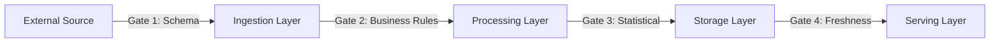
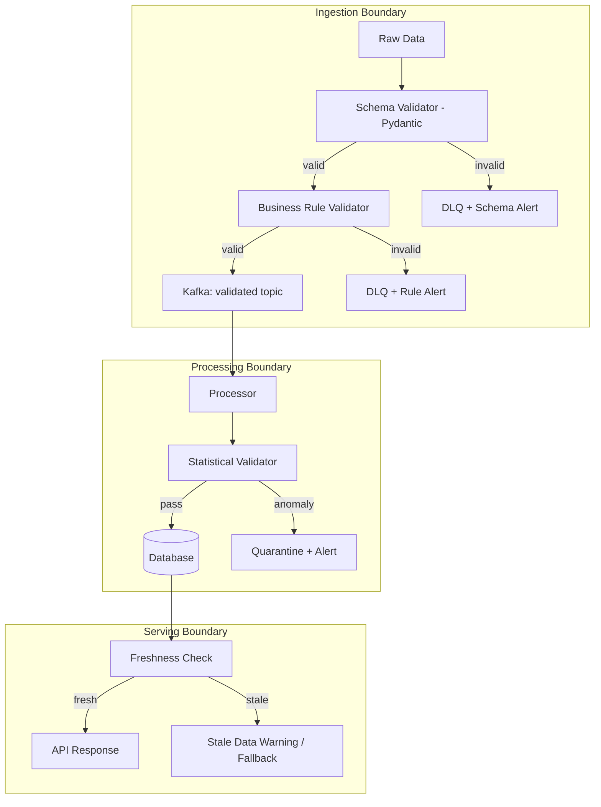

# Data Quality Validation

## Context & Problem

Bad data propagates. A malformed price record that passes ingestion unchecked becomes a wrong position calculation, which becomes an incorrect risk report, which triggers a false compliance alert. Each hop through the pipeline amplifies the cost of the original error.

Data quality must be enforced at every boundary: ingestion, transformation, and before serving to consumers. This requires multiple validation strategies — structural validation (does the data match the expected schema?), semantic validation (are the values reasonable?), and statistical validation (does the distribution look normal compared to historical patterns?).

## Design Decisions

### Validation at Boundaries, Not Everywhere

Validate at pipeline stage boundaries, not inside every function. Each boundary acts as a quality gate:



- **Gate 1 (Schema):** Does the data match the expected structure and types?
- **Gate 2 (Business Rules):** Are values within valid ranges? Do required relationships hold?
- **Gate 3 (Statistical):** Does the data distribution match expectations? Any anomalies?
- **Gate 4 (Freshness):** Is the data recent enough to serve?

### Three Layers of Validation

| Layer | Tool | What It Catches | When to Run |
|---|---|---|---|
| **Schema validation** | Pydantic, JSON Schema | Wrong types, missing fields, format violations | Every record at ingestion |
| **Business rule validation** | Custom Python, Pydantic validators | Out-of-range values, violated invariants, invalid state transitions | Every record at processing |
| **Statistical validation** | Great Expectations, custom checks | Distribution shifts, volume anomalies, outliers | Per-batch or periodic |

### Data Contracts

A data contract is an explicit agreement between a producer and consumer about the data's schema, quality expectations, and SLAs. It shifts quality responsibility to the producer.

```yaml
# contracts/market-data-prices.yml
contract:
  name: market-data-prices
  version: "2.0"
  owner: market-data-team
  
  schema:
    type: object
    properties:
      instrument_id: { type: string, pattern: "^[A-Z]{1,5}$" }
      bid: { type: number, minimum: 0 }
      ask: { type: number, minimum: 0 }
      timestamp: { type: string, format: date-time }
    required: [instrument_id, bid, ask, timestamp]

  quality:
    - metric: completeness
      column: instrument_id
      threshold: 1.0  # no nulls allowed
    - metric: freshness
      max_delay_seconds: 60
    - metric: volume
      min_records_per_hour: 1000
      max_records_per_hour: 100000
    
  sla:
    availability: 99.9%
    latency_p99_ms: 500
```

## Architecture



## Code Skeleton

### Schema Validation with Pydantic

```python
# validation/schema_validators.py

from datetime import datetime
from decimal import Decimal
from typing import Annotated

from pydantic import BaseModel, Field, field_validator, model_validator


class PriceRecord(BaseModel):
    """Schema validation for incoming price data.
    
    Rejects records with wrong types, missing fields, or obviously
    invalid values at the ingestion boundary.
    """

    instrument_id: Annotated[str, Field(min_length=1, max_length=20)]
    bid: Annotated[Decimal, Field(ge=0, max_digits=18, decimal_places=8)]
    ask: Annotated[Decimal, Field(ge=0, max_digits=18, decimal_places=8)]
    timestamp: datetime
    source: str
    currency: Annotated[str, Field(min_length=3, max_length=3)]

    @field_validator("currency")
    @classmethod
    def currency_uppercase(cls, v: str) -> str:
        return v.upper()

    @model_validator(mode="after")
    def ask_gte_bid(self) -> "PriceRecord":
        if self.ask < self.bid:
            raise ValueError(
                f"Ask ({self.ask}) must be >= bid ({self.bid}) "
                f"for {self.instrument_id}"
            )
        return self

    @model_validator(mode="after")
    def spread_within_bounds(self) -> "PriceRecord":
        if self.bid > 0:
            spread_pct = (self.ask - self.bid) / self.bid * 100
            if spread_pct > 10:
                raise ValueError(
                    f"Spread {spread_pct:.2f}% exceeds 10% threshold "
                    f"for {self.instrument_id}"
                )
        return self
```

### Validation Pipeline

```python
# validation/pipeline.py

import logging
from dataclasses import dataclass, field
from pydantic import ValidationError

logger = logging.getLogger(__name__)


@dataclass
class ValidationResult:
    valid: list[dict] = field(default_factory=list)
    rejected: list[dict] = field(default_factory=list)
    error_counts: dict[str, int] = field(default_factory=dict)

    @property
    def rejection_rate(self) -> float:
        total = len(self.valid) + len(self.rejected)
        return len(self.rejected) / total if total > 0 else 0.0


class ValidationPipeline:
    """Runs a batch of records through schema validation and collects results."""

    def __init__(
        self,
        model_class: type,
        rejection_rate_threshold: float = 0.05,
    ) -> None:
        self._model_class = model_class
        self._rejection_rate_threshold = rejection_rate_threshold

    def validate_batch(self, records: list[dict]) -> ValidationResult:
        result = ValidationResult()

        for record in records:
            try:
                validated = self._model_class.model_validate(record)
                result.valid.append(validated.model_dump())
            except ValidationError as exc:
                for error in exc.errors():
                    error_type = error["type"]
                    result.error_counts[error_type] = (
                        result.error_counts.get(error_type, 0) + 1
                    )
                result.rejected.append({
                    "record": record,
                    "errors": exc.errors(),
                })

        # Alert if rejection rate exceeds threshold
        if result.rejection_rate > self._rejection_rate_threshold:
            logger.error(
                f"Rejection rate {result.rejection_rate:.1%} exceeds "
                f"threshold {self._rejection_rate_threshold:.1%}. "
                f"Error distribution: {result.error_counts}"
            )

        return result
```

### Statistical Validation with Great Expectations

```python
# validation/statistical_validators.py

import great_expectations as gx


def build_price_expectation_suite(context: gx.DataContext) -> gx.ExpectationSuite:
    """Define statistical expectations for price data."""
    suite = context.add_expectation_suite("price_data_quality")

    # Volume expectations
    suite.add_expectation(
        gx.expectations.ExpectTableRowCountToBeBetween(
            min_value=1000,
            max_value=500000,
        )
    )

    # Completeness expectations
    suite.add_expectation(
        gx.expectations.ExpectColumnValuesToNotBeNull(column="instrument_id")
    )
    suite.add_expectation(
        gx.expectations.ExpectColumnValuesToNotBeNull(column="bid")
    )
    suite.add_expectation(
        gx.expectations.ExpectColumnValuesToNotBeNull(column="ask")
    )

    # Range expectations
    suite.add_expectation(
        gx.expectations.ExpectColumnValuesToBeBetween(
            column="bid", min_value=0, max_value=1_000_000,
        )
    )

    # Uniqueness expectations
    suite.add_expectation(
        gx.expectations.ExpectCompoundColumnsToBeUnique(
            column_list=["instrument_id", "timestamp", "source"]
        )
    )

    # Distribution expectations
    suite.add_expectation(
        gx.expectations.ExpectColumnMeanToBeBetween(
            column="bid", min_value=1, max_value=10000,
        )
    )

    return suite


def validate_price_batch(df, context: gx.DataContext) -> dict:
    """Run statistical validation on a batch of price data."""
    datasource = context.sources.add_pandas("price_batch")
    data_asset = datasource.add_dataframe_asset("prices")
    batch_request = data_asset.build_batch_request(dataframe=df)

    checkpoint = context.add_or_update_checkpoint(
        name="price_quality_check",
        validations=[{
            "batch_request": batch_request,
            "expectation_suite_name": "price_data_quality",
        }],
    )

    result = checkpoint.run()
    return {
        "success": result.success,
        "statistics": result.statistics,
        "failed_expectations": [
            r.expectation_config.expectation_type
            for r in result.results
            if not r.success
        ],
    }
```

### Freshness Check at Serving Boundary

```python
# validation/freshness.py

from datetime import datetime, timedelta, timezone
from typing import Any


class FreshnessChecker:
    """Validates that data is fresh enough to serve."""

    def __init__(self, max_age: timedelta) -> None:
        self._max_age = max_age

    def check(self, data: dict, timestamp_field: str = "updated_at") -> dict[str, Any]:
        updated_at = datetime.fromisoformat(data[timestamp_field])
        age = datetime.now(timezone.utc) - updated_at
        is_fresh = age <= self._max_age

        return {
            "is_fresh": is_fresh,
            "age_seconds": age.total_seconds(),
            "max_age_seconds": self._max_age.total_seconds(),
            "data": data if is_fresh else None,
            "warning": None if is_fresh else f"Data is {age} old (max: {self._max_age})",
        }


# Usage
checker = FreshnessChecker(max_age=timedelta(minutes=5))
result = checker.check(price_data, timestamp_field="timestamp")

if not result["is_fresh"]:
    # Return stale data with warning header, or return cached fallback
    ...
```

### Data Contract Enforcement

```python
# validation/contracts.py

import yaml
import logging
from datetime import datetime, timedelta, timezone
from pathlib import Path

logger = logging.getLogger(__name__)


class DataContractEnforcer:
    """Enforces data contracts between producers and consumers."""

    def __init__(self, contract_path: str | Path) -> None:
        with open(contract_path) as f:
            self._contract = yaml.safe_load(f)["contract"]

    def check_volume(self, record_count: int, window_hours: int = 1) -> bool:
        """Check if record volume is within contracted bounds."""
        quality_rules = {r["metric"]: r for r in self._contract["quality"]}
        volume_rule = quality_rules.get("volume")

        if not volume_rule:
            return True

        min_records = volume_rule.get("min_records_per_hour", 0) * window_hours
        max_records = volume_rule.get("max_records_per_hour", float("inf")) * window_hours

        if not (min_records <= record_count <= max_records):
            logger.error(
                f"Contract violation: {record_count} records in {window_hours}h "
                f"(expected {min_records}-{max_records})"
            )
            return False
        return True

    def check_freshness(self, latest_timestamp: datetime) -> bool:
        """Check if data freshness meets the contract SLA."""
        quality_rules = {r["metric"]: r for r in self._contract["quality"]}
        freshness_rule = quality_rules.get("freshness")

        if not freshness_rule:
            return True

        max_delay = timedelta(seconds=freshness_rule["max_delay_seconds"])
        actual_delay = datetime.now(timezone.utc) - latest_timestamp

        if actual_delay > max_delay:
            logger.error(
                f"Contract violation: data is {actual_delay} old "
                f"(max: {max_delay})"
            )
            return False
        return True
```

## Failure Modes

| Failure | Cause | Mitigation |
|---|---|---|
| Validation too strict | Rejects valid data due to overly tight rules | Start with loose thresholds, tighten based on observed distributions |
| Validation too loose | Invalid data passes through | Layered validation; statistical checks catch what schema checks miss |
| Validation performance bottleneck | Per-record validation on high-throughput stream | Batch validation, sample-based statistical checks, async validation |
| Schema drift undetected | Producer changes format without updating contract | Automated contract tests in CI; schema registry compatibility checks |
| False positive anomaly alerts | Statistical check triggers on legitimate data shift | Use adaptive baselines, suppress during known events (market holidays, launches) |
| DLQ overflow | Spike in bad data overwhelms dead letter processing | Monitor DLQ depth, alert on growth rate, automated triage |
| Stale validation rules | Business rules change but validators are not updated | Version validators alongside contracts, review in code review |

## Related Documents

- [Ingestion Pipelines](ingestion-pipelines.md) — validation at the ingestion boundary
- [Data Normalization](data-normalization.md) — canonical models enforce structural quality
- [Schema Registry](../messaging/schema-registry.md) — schema-level validation for events
- [Event Schema Evolution](../messaging/event-schema-evolution.md) — evolving validation rules over time
- [Dead Letter Queues](../messaging/dead-letter-queues.md) — routing rejected records
- [Contract-First Design](../../principles/contract-first-design.md) — data contracts as a design principle
- [ETL vs ELT](etl-vs-elt.md) — validation at each pipeline stage
