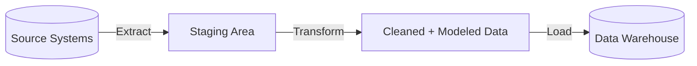
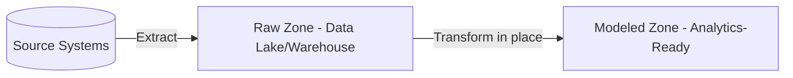
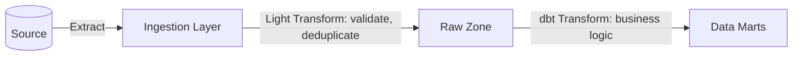
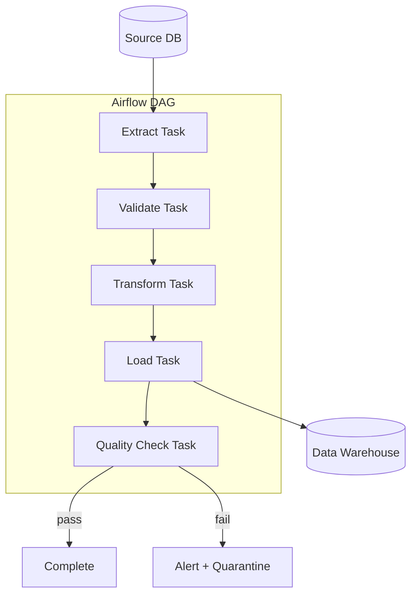
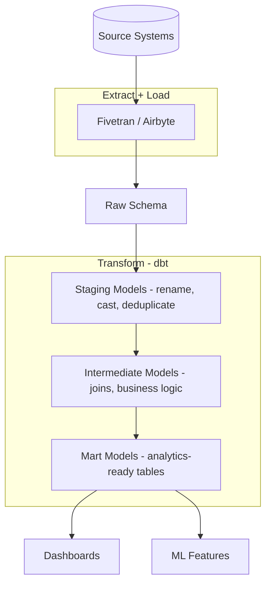

# ETL vs ELT

## Context & Problem

Data must move from source systems into analytical stores (data warehouses, data lakes) for reporting, analytics, and machine learning. The two dominant paradigms are:

- **ETL (Extract-Transform-Load):** Transform data in a staging area before loading it into the target.
- **ELT (Extract-Load-Transform):** Load raw data into the target first, then transform it in place using the target's compute engine.

The choice affects pipeline complexity, latency, cost, and how easily the system adapts to changing requirements. Neither is universally better — the right choice depends on where compute is cheapest, how structured the source data is, and how frequently transformation logic changes.

## Design Decisions

### ETL: Transform Before Loading



The transformation happens outside the warehouse, typically in Python, Spark, or Airflow tasks. Only clean, schema-conforming data reaches the warehouse.

**When ETL fits:**

- Source data is messy and needs significant cleansing before it has value.
- Warehouse compute is expensive (e.g., billed per query on Snowflake/BigQuery) and you want to minimize what lands there.
- Compliance requires that raw PII never enters the warehouse — transformation includes masking/anonymization.
- Transformation logic is complex and better expressed in Python than SQL.

### ELT: Load Then Transform



Raw data lands in the target system first. Transformation is done using the warehouse's own compute (SQL, dbt, stored procedures). The raw data remains available for re-transformation when logic changes.

**When ELT fits:**

- The warehouse has powerful, scalable compute (Snowflake, BigQuery, Databricks).
- Transformation logic is primarily SQL-expressible (joins, aggregations, window functions).
- You want to preserve raw data for ad hoc exploration and future use cases not yet defined.
- Schema changes are frequent and you want to re-transform without re-extracting.

### Hybrid Approach

Most production systems use a hybrid: light ETL for cleansing and schema validation at ingestion, then ELT for complex business logic transformations inside the warehouse.



## Comparison Table

| Dimension | ETL | ELT |
|---|---|---|
| **Transform location** | External (Python, Spark, Airflow) | In-warehouse (SQL, dbt) |
| **Raw data availability** | Only transformed data in target | Raw data preserved in target |
| **Compute cost** | Uses pipeline compute (cheaper for heavy transforms) | Uses warehouse compute (charged per query) |
| **Latency** | Higher — transform is a blocking step before load | Lower — load is fast, transform runs after |
| **Flexibility** | Must re-extract to re-transform | Re-transform from raw data at any time |
| **Complexity** | Pipeline code maintains transform logic | SQL/dbt maintains transform logic |
| **Data governance** | PII filtered before warehouse | PII lands in raw zone — needs access controls |
| **Debugging** | Intermediate staging data may be ephemeral | Raw data always available for comparison |
| **Schema evolution** | Pipeline code must be updated for source schema changes | Raw zone absorbs schema changes; transform layer adapts |
| **Tooling** | Airflow, Luigi, Prefect, custom Python | dbt, Dataform, warehouse-native SQL |

## Architecture

### ETL Pipeline (Airflow + Python)



### ELT Pipeline (Fivetran + dbt)



## Code Skeleton

### ETL: Airflow DAG with Python Transform

```python
# dags/etl_customer_pipeline.py

from datetime import datetime, timedelta

from airflow import DAG
from airflow.operators.python import PythonOperator

default_args = {
    "owner": "data-engineering",
    "retries": 2,
    "retry_delay": timedelta(minutes=5),
}

dag = DAG(
    dag_id="etl_customer_sync",
    default_args=default_args,
    schedule_interval="@hourly",
    start_date=datetime(2025, 1, 1),
    catchup=False,
    tags=["etl", "customers"],
)


def extract(**context) -> str:
    """Extract customer records from source API."""
    import httpx

    response = httpx.get(
        "https://crm.internal/api/customers",
        params={"updated_since": context["ds"]},
        headers={"Authorization": f"Bearer {Variable.get('crm_api_key')}"},
    )
    response.raise_for_status()

    # Write to intermediate storage
    output_path = f"/tmp/customers_raw_{context['ds_nodash']}.json"
    with open(output_path, "w") as f:
        json.dump(response.json(), f)

    return output_path


def transform(**context) -> str:
    """Clean, validate, and reshape customer data."""
    import json
    from pydantic import ValidationError

    input_path = context["ti"].xcom_pull(task_ids="extract")
    with open(input_path) as f:
        raw_records = json.load(f)

    clean_records = []
    rejected = []

    for record in raw_records:
        try:
            clean = {
                "customer_id": record["id"],
                "first_name": record["first_name"].strip(),
                "last_name": record["last_name"].strip(),
                "email": record["email"].lower().strip(),
                "country_code": record["country"][:2].upper(),
                "created_at": record["created_at"],
                "updated_at": record["updated_at"],
            }
            clean_records.append(clean)
        except (KeyError, AttributeError) as exc:
            rejected.append({"record": record, "error": str(exc)})

    if rejected:
        logger.warning(f"Rejected {len(rejected)} records")

    output_path = f"/tmp/customers_clean_{context['ds_nodash']}.json"
    with open(output_path, "w") as f:
        json.dump(clean_records, f)

    return output_path


def load(**context) -> None:
    """Load transformed data into the warehouse."""
    import json
    from sqlalchemy import create_engine, text

    input_path = context["ti"].xcom_pull(task_ids="transform")
    with open(input_path) as f:
        records = json.load(f)

    engine = create_engine(Variable.get("warehouse_connection_string"))
    with engine.begin() as conn:
        for record in records:
            conn.execute(
                text("""
                    INSERT INTO dim_customers (customer_id, first_name, last_name, email, country_code, updated_at)
                    VALUES (:customer_id, :first_name, :last_name, :email, :country_code, :updated_at)
                    ON CONFLICT (customer_id) DO UPDATE SET
                        first_name = EXCLUDED.first_name,
                        last_name = EXCLUDED.last_name,
                        email = EXCLUDED.email,
                        country_code = EXCLUDED.country_code,
                        updated_at = EXCLUDED.updated_at
                """),
                record,
            )


extract_task = PythonOperator(task_id="extract", python_callable=extract, dag=dag)
transform_task = PythonOperator(task_id="transform", python_callable=transform, dag=dag)
load_task = PythonOperator(task_id="load", python_callable=load, dag=dag)

extract_task >> transform_task >> load_task
```

### ELT: dbt Transform Layer

```sql
-- models/staging/stg_customers.sql
-- Light transformation: rename, cast, deduplicate

with source as (
    select * from {{ source('raw', 'customers') }}
),

deduplicated as (
    select
        *,
        row_number() over (
            partition by id
            order by _fivetran_synced desc
        ) as row_num
    from source
),

renamed as (
    select
        id as customer_id,
        trim(first_name) as first_name,
        trim(last_name) as last_name,
        lower(trim(email)) as email,
        upper(left(country, 2)) as country_code,
        created_at,
        updated_at
    from deduplicated
    where row_num = 1
)

select * from renamed
```

```sql
-- models/marts/dim_customers.sql
-- Business logic: enrich with aggregated order data

with customers as (
    select * from {{ ref('stg_customers') }}
),

order_summary as (
    select
        customer_id,
        count(*) as total_orders,
        sum(amount) as lifetime_value,
        max(order_date) as last_order_date
    from {{ ref('stg_orders') }}
    group by customer_id
),

final as (
    select
        c.customer_id,
        c.first_name,
        c.last_name,
        c.email,
        c.country_code,
        coalesce(o.total_orders, 0) as total_orders,
        coalesce(o.lifetime_value, 0) as lifetime_value,
        o.last_order_date,
        c.created_at,
        c.updated_at
    from customers c
    left join order_summary o on c.customer_id = o.customer_id
)

select * from final
```

```yaml
# models/marts/dim_customers.yml
version: 2

models:
  - name: dim_customers
    description: "Customer dimension with lifetime metrics"
    columns:
      - name: customer_id
        tests:
          - unique
          - not_null
      - name: email
        tests:
          - unique
          - not_null
      - name: total_orders
        tests:
          - not_null
```

## Failure Modes

| Failure | Cause | Mitigation |
|---|---|---|
| ETL transform bug corrupts data | Logic error in Python transform code | Validate output before load; keep raw data for re-extraction |
| ELT raw zone grows unbounded | No retention policy on raw data | Partition by ingestion date, apply lifecycle policies |
| Warehouse cost spike (ELT) | Expensive transform queries run too frequently | Monitor query costs, schedule heavy transforms off-peak |
| Schema drift | Source system changes column names or types | Schema validation at extraction; alerting on drift; raw zone absorbs changes |
| Partial load | Pipeline fails mid-load | Use transactions or staging tables; load atomically |
| Stale data in marts | Transform job failed silently | dbt test suite, freshness checks, alerting on missing runs |

## Related Documents

- [Ingestion Pipelines](ingestion-pipelines.md) — how data enters the system before ETL/ELT
- [Batch vs Streaming](batch-vs-streaming.md) — ETL/ELT are typically batch patterns
- [Data Quality Validation](data-quality-validation.md) — validating data at each pipeline stage
- [Data Normalization](data-normalization.md) — transformation patterns for vendor data
- [Change Data Capture](change-data-capture.md) — CDC as an extraction method for both ETL and ELT
