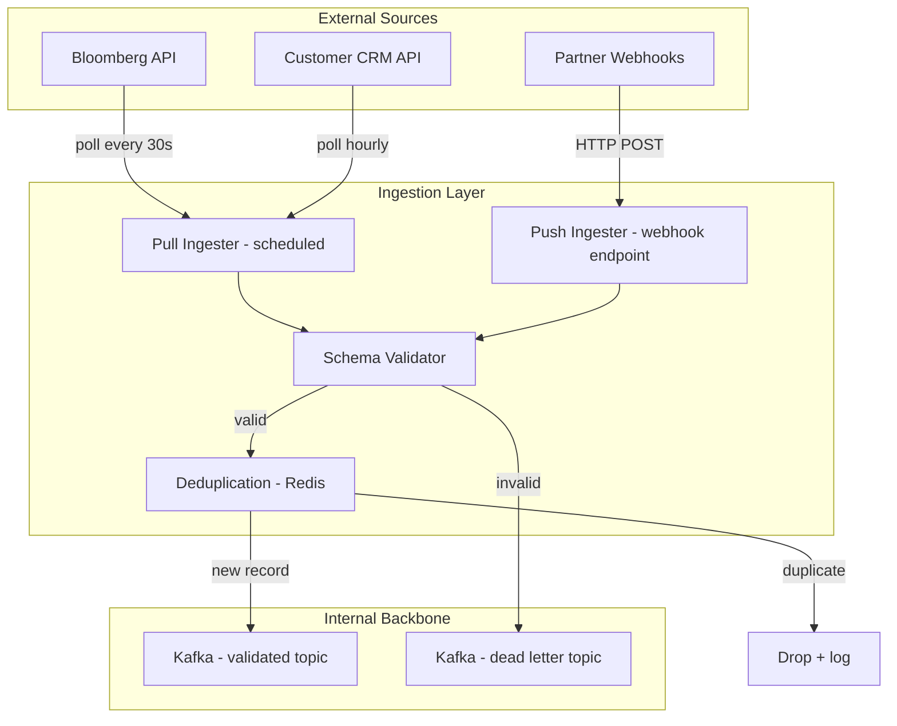

# Ingestion Pipelines

## Context & Problem

Data enters the system from external sources: market data vendors (Bloomberg, Reuters), customer-facing APIs, partner file drops, third-party SaaS webhooks. Each source has different reliability characteristics, data formats, delivery semantics, and volume profiles.

Without a deliberate ingestion strategy, external data enters the system through ad hoc paths — some validated, some not, some idempotent, some producing duplicates on retry. The ingestion layer is the system's front door: it must be resilient to upstream failures, validate data before it propagates, and guarantee that downstream consumers receive clean, deduplicated records.

## Design Decisions

### Pull vs Push Ingestion

| Aspect | Pull (polling) | Push (webhook/streaming) |
|---|---|---|
| **Control** | Consumer controls pace and timing | Producer controls when data arrives |
| **Latency** | Bounded by polling interval | Near real-time |
| **Reliability** | Consumer retries on its own schedule | Requires acknowledgment protocol |
| **Backpressure** | Natural — consumer only pulls when ready | Must be managed explicitly |
| **Complexity** | Simpler; consumer is the only moving part | Requires endpoint, auth, idempotency |

**Guideline:** Use pull for batch/scheduled ingestion where latency tolerance is minutes or more. Use push for real-time feeds and event-driven integrations.

### Batch vs Micro-Batch

Batch ingestion processes data in scheduled windows (hourly, daily). Micro-batch processes in small, frequent intervals (every 30 seconds to 5 minutes), offering a middle ground between true streaming and large batch.

- **Batch:** Suitable for end-of-day reconciliation, daily reporting feeds, large file drops.
- **Micro-batch:** Suitable for near-real-time dashboards, market data snapshots, incremental sync from APIs with rate limits.

### Schema Validation at Ingestion

Validate incoming data **before** publishing to internal topics. Malformed data that enters the pipeline poisons downstream consumers and is expensive to remediate.

```
External Source → Ingestion Service → [Schema Validation] → Kafka Topic
                                            ↓ (invalid)
                                    Dead Letter Topic + Alert
```

Use Pydantic models at the ingestion boundary to enforce structure, types, and value constraints. Reject invalid records to a dead letter topic with the original payload and validation error attached.

### Idempotent Ingestion

External sources may deliver duplicates — webhook retries, overlapping polling windows, at-least-once delivery guarantees. The ingestion layer must deduplicate.

**Strategies:**

1. **Source-provided ID:** Use the external record's unique identifier (e.g., Bloomberg's `FIGI`, a webhook's `event_id`) as the deduplication key.
2. **Content hash:** Hash the payload to detect duplicates when no stable ID exists.
3. **Kafka idempotent producer:** Prevents duplicate writes at the Kafka level for the same producer session.
4. **Deduplication store:** Redis or database lookup to check if a record has already been ingested within a time window.

## Architecture



## Code Skeleton

### Pull Ingester with httpx + Kafka Producer

```python
# ingestion/market_data_ingester.py

import hashlib
import json
import logging
from datetime import datetime, timezone

import httpx
from confluent_kafka import Producer
from pydantic import BaseModel, ValidationError
from redis.asyncio import Redis

logger = logging.getLogger(__name__)


class MarketDataRecord(BaseModel):
    """Schema for validated market data at ingestion boundary."""
    instrument_id: str
    bid: float
    ask: float
    timestamp: datetime
    source: str


class MarketDataIngester:
    """Pulls market data from an external API, validates, deduplicates,
    and publishes to Kafka."""

    def __init__(
        self,
        api_base_url: str,
        api_key: str,
        kafka_bootstrap_servers: str,
        redis: Redis,
        topic: str = "market-data.ingested",
        dedup_ttl_seconds: int = 300,
    ) -> None:
        self._client = httpx.AsyncClient(
            base_url=api_base_url,
            headers={"Authorization": f"Bearer {api_key}"},
            timeout=httpx.Timeout(15.0, connect=5.0),
        )
        self._producer = Producer({
            "bootstrap.servers": kafka_bootstrap_servers,
            "acks": "all",
            "enable.idempotence": True,
            "retries": 5,
        })
        self._redis = redis
        self._topic = topic
        self._dedup_ttl = dedup_ttl_seconds

    async def ingest(self, instrument_ids: list[str]) -> None:
        """Fetch quotes for a batch of instruments and publish valid records."""
        response = await self._client.post(
            "/market/securities/quotes",
            json={"securities": instrument_ids},
        )
        response.raise_for_status()

        for raw_record in response.json()["results"]:
            await self._process_record(raw_record)

        self._producer.flush()

    async def _process_record(self, raw: dict) -> None:
        # Step 1: Validate against schema
        try:
            record = MarketDataRecord(
                instrument_id=raw["SECURITY_ID"],
                bid=raw["BID"],
                ask=raw["ASK"],
                timestamp=raw["LAST_UPDATE_TIME"],
                source="bloomberg",
            )
        except (ValidationError, KeyError) as exc:
            logger.warning(f"Invalid record rejected: {exc}")
            self._publish_to_dlq(raw, str(exc))
            return

        # Step 2: Deduplicate
        dedup_key = self._dedup_key(record)
        if await self._redis.set(dedup_key, "1", nx=True, ex=self._dedup_ttl):
            # New record — publish
            self._producer.produce(
                topic=self._topic,
                key=record.instrument_id.encode("utf-8"),
                value=record.model_dump_json().encode("utf-8"),
                callback=self._on_delivery,
            )
            self._producer.poll(0)
        else:
            logger.debug(f"Duplicate skipped: {record.instrument_id}")

    def _dedup_key(self, record: MarketDataRecord) -> str:
        payload_hash = hashlib.sha256(
            record.model_dump_json().encode("utf-8")
        ).hexdigest()[:16]
        return f"ingest:dedup:{record.instrument_id}:{payload_hash}"

    def _publish_to_dlq(self, raw: dict, error: str) -> None:
        envelope = {"original": raw, "error": error, "rejected_at": datetime.now(timezone.utc).isoformat()}
        self._producer.produce(
            topic=f"{self._topic}.dlq",
            value=json.dumps(envelope).encode("utf-8"),
        )

    def _on_delivery(self, err, msg) -> None:
        if err:
            logger.error(f"Delivery failed: {err}")
        else:
            logger.debug(f"Delivered to {msg.topic()}[{msg.partition()}]@{msg.offset()}")
```

### Push Ingester (Webhook Endpoint)

```python
# ingestion/webhook_receiver.py

from fastapi import FastAPI, Header, HTTPException, Request

app = FastAPI()


@app.post("/webhooks/partner-data")
async def receive_partner_data(
    request: Request,
    x_event_id: str = Header(...),
    x_signature: str = Header(...),
) -> dict:
    """Webhook endpoint for partner push ingestion."""
    body = await request.body()

    # Verify signature to authenticate the source
    if not verify_hmac_signature(body, x_signature):
        raise HTTPException(status_code=401, detail="Invalid signature")

    # Idempotency check using the source-provided event ID
    if await redis.exists(f"webhook:seen:{x_event_id}"):
        return {"status": "duplicate", "event_id": x_event_id}

    payload = await request.json()
    validated = validate_and_transform(payload)

    await publish_to_kafka("partner-data.ingested", x_event_id, validated)
    await redis.set(f"webhook:seen:{x_event_id}", "1", ex=86400)

    return {"status": "accepted", "event_id": x_event_id}
```

## Failure Modes

| Failure | Cause | Mitigation |
|---|---|---|
| External API timeout | Vendor latency spike, network issue | Retry with exponential backoff; circuit breaker after repeated failures |
| Schema validation failure | Vendor changed response format | Route to DLQ, alert on spike in rejection rate, update adapter |
| Duplicate ingestion | Webhook retry, overlapping poll windows | Deduplication via Redis or source-provided event ID |
| Kafka producer failure | Broker down, buffer full | Idempotent producer config, monitor `queue.buffering.max.messages` |
| Redis dedup store unavailable | Redis outage | Fail open (allow potential duplicates) — downstream consumers must be idempotent anyway |
| Rate limit exceeded on source | Polling too aggressively | Respect `Retry-After` headers, adaptive polling interval |

## Related Documents

- [Kafka Topology](../messaging/kafka-topology.md) — topic design and partitioning for ingested data
- [Dead Letter Queues](../messaging/dead-letter-queues.md) — handling rejected records
- [External API Adapters](../api/external-api-adapters.md) — adapter pattern for vendor APIs
- [Schema Registry](../messaging/schema-registry.md) — schema governance for ingested events
- [Data Normalization](data-normalization.md) — transforming vendor data into canonical models
- [Backpressure](backpressure.md) — flow control when ingestion outpaces processing
- [Data Quality Validation](data-quality-validation.md) — validation patterns beyond schema checks
