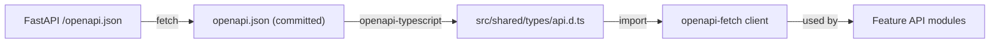

# API Client Codegen — OpenAPI Types, BFF Proxy, and TanStack Query

## Context & Problem

A frontend calling a typed FastAPI backend without type safety at the boundary is fragile. Endpoint paths, request bodies, and response shapes are defined in Python Pydantic models — the TypeScript side either manually mirrors them (drift-prone) or uses `any` (bug-prone).

FastAPI auto-generates an OpenAPI 3.1 spec at `/openapi.json`. This spec is the contract. The frontend should consume it mechanically — generating TypeScript types and a typed fetch client — so changes to the backend API surface are caught at compile time.

## Design Decisions

### openapi-typescript + openapi-fetch

**`openapi-typescript`** generates TypeScript type definitions from an OpenAPI spec. No runtime code — just types.

**`openapi-fetch`** is a tiny fetch wrapper (< 6KB) that uses those types to provide path-level autocomplete, typed request params, and typed response bodies. It does not generate per-endpoint functions — it's a single `client.GET("/path", { params })` interface.

**Why not full codegen (openapi-generator, orval)?** Full codegen generates one function per endpoint — `getInstruments()`, `getInstrumentById()`, `createTrade()`. This seems convenient but creates problems:
- Generated code must be committed or regenerated on every build
- Generated function signatures don't compose well with TanStack Query
- Customization (retry logic, header injection) requires codegen templates
- The generated client is a black box that's hard to debug

`openapi-fetch` is transparent — you write the fetch calls, the types constrain them. You control the code, the types control you.

### Decimal Fields as Strings

Financial applications cannot use JavaScript `number` for monetary values — IEEE 754 doubles lose precision (`0.1 + 0.2 !== 0.3`). The FastAPI backend uses Python `Decimal` for prices, quantities, and P&L.

**The API contract:** Decimal fields are serialized as JSON strings in the OpenAPI spec. The generated TypeScript types map them to `string`. The frontend formats them for display using `Intl.NumberFormat` — it never performs arithmetic on them.

If client-side arithmetic is unavoidable (summing a column in a data table), use `decimal.js` for that specific calculation, not `Number`.

```typescript
// src/shared/lib/formatters.ts

const priceFormatter = new Intl.NumberFormat("en-US", {
  minimumFractionDigits: 2,
  maximumFractionDigits: 8,
});

const pnlFormatter = new Intl.NumberFormat("en-US", {
  style: "currency",
  currency: "USD",
  minimumFractionDigits: 2,
  signDisplay: "exceptZero",
});

const quantityFormatter = new Intl.NumberFormat("en-US", {
  minimumFractionDigits: 0,
  maximumFractionDigits: 8,
});

const percentFormatter = new Intl.NumberFormat("en-US", {
  style: "percent",
  minimumFractionDigits: 2,
  signDisplay: "exceptZero",
});

export function formatPrice(value: string): string {
  return priceFormatter.format(Number(value));
}

export function formatPnL(value: string): string {
  return pnlFormatter.format(Number(value));
}

export function formatQuantity(value: string): string {
  return quantityFormatter.format(Number(value));
}

export function formatPercent(value: string): string {
  return percentFormatter.format(Number(value));
}

export function formatTimestamp(iso: string, timezone?: string): string {
  return new Intl.DateTimeFormat("en-US", {
    timeZone: timezone ?? Intl.DateTimeFormat().resolvedOptions().timeZone,
    hour: "2-digit",
    minute: "2-digit",
    second: "2-digit",
    hour12: false,
  }).format(new Date(iso));
}

export function formatDate(iso: string): string {
  return new Intl.DateTimeFormat("en-US", {
    year: "numeric",
    month: "short",
    day: "numeric",
  }).format(new Date(iso));
}

/** CSS class for P&L coloring */
export function pnlColorClass(value: string): string {
  const n = Number(value);
  if (n > 0) return "text-green-600";
  if (n < 0) return "text-red-600";
  return "text-muted-foreground";
}
```

## Architecture

### Type Generation Pipeline



```json
// package.json scripts
{
  "scripts": {
    "generate:api-types": "curl -s http://localhost:8000/openapi.json -o openapi.json && openapi-typescript openapi.json -o src/shared/types/api.d.ts",
    "check:api-types": "openapi-typescript openapi.json -o /dev/stdout | diff - src/shared/types/api.d.ts"
  }
}
```

**The spec is committed.** `openapi.json` is checked into the frontend repo (or monorepo). Type generation runs as a dev script, not a build step. CI runs `check:api-types` to verify the committed types match the current spec. If they drift, the CI check fails and the developer regenerates.

### Typed API Client

```typescript
// src/shared/lib/api-client.ts

import createClient from "openapi-fetch";
import type { paths } from "@/shared/types/api";

/**
 * Server-side API client — used in Server Components and Route Handlers.
 * Requires an access token (from Auth.js session).
 */
export function createServerClient(accessToken: string, fundSlug?: string) {
  const headers: Record<string, string> = {
    Authorization: `Bearer ${accessToken}`,
  };
  if (fundSlug) {
    headers["X-Fund-Slug"] = fundSlug;
  }

  return createClient<paths>({
    baseUrl: process.env.API_URL ?? "http://localhost:8000",
    headers,
  });
}

/**
 * Client-side API client — calls the BFF proxy (same-origin).
 * No access token needed — the proxy extracts it from the session cookie.
 * Fund slug is sent via a custom header that the proxy forwards.
 */
export function createBrowserClient(fundSlug?: string) {
  const headers: Record<string, string> = {};
  if (fundSlug) {
    headers["X-Fund-Slug"] = fundSlug;
  }

  return createClient<paths>({
    baseUrl: "/api/proxy",
    headers,
  });
}
```

### Feature API Modules with TanStack Query

Each feature defines its TanStack Query options as factories. This keeps query keys, fetch logic, and types co-located:

```typescript
// src/features/instruments/api.ts

import { queryOptions } from "@tanstack/react-query";
import { createBrowserClient } from "@/shared/lib/api-client";

export function instrumentsQueryOptions(fundSlug: string, assetClass?: string) {
  return queryOptions({
    queryKey: ["instruments", fundSlug, { assetClass }],
    queryFn: async () => {
      const client = createBrowserClient(fundSlug);
      const { data, error } = await client.GET("/instruments", {
        params: { query: { asset_class: assetClass } },
      });
      if (error) throw new Error("Failed to fetch instruments");
      return data;
    },
  });
}

export function instrumentSearchQueryOptions(
  fundSlug: string,
  query: string,
) {
  return queryOptions({
    queryKey: ["instruments", "search", fundSlug, query],
    queryFn: async () => {
      const client = createBrowserClient(fundSlug);
      const { data, error } = await client.GET("/instruments/search", {
        params: { query: { q: query } },
      });
      if (error) throw new Error("Failed to search instruments");
      return data;
    },
    enabled: query.length >= 1,
  });
}
```

```typescript
// src/features/portfolio/api.ts

import { queryOptions, useMutation, useQueryClient } from "@tanstack/react-query";
import { createBrowserClient } from "@/shared/lib/api-client";

export function positionsQueryOptions(fundSlug: string, portfolioId: string) {
  return queryOptions({
    queryKey: ["positions", fundSlug, portfolioId],
    queryFn: async () => {
      const client = createBrowserClient(fundSlug);
      const { data, error } = await client.GET(
        "/portfolios/{portfolio_id}/positions",
        { params: { path: { portfolio_id: portfolioId } } },
      );
      if (error) throw new Error("Failed to fetch positions");
      return data;
    },
    // Refetch every 5 seconds for near-real-time position updates
    refetchInterval: 5_000,
  });
}

export function useExecuteTrade(fundSlug: string) {
  const queryClient = useQueryClient();

  return useMutation({
    mutationFn: async (trade: {
      portfolio_id: string;
      instrument_id: string;
      side: "buy" | "sell";
      quantity: string;
      price: string;
      currency: string;
    }) => {
      const client = createBrowserClient(fundSlug);
      const { data, error } = await client.POST("/portfolios/trades", {
        body: trade,
      });
      if (error) throw new Error("Trade execution failed");
      return data;
    },
    onSuccess: (_data, variables) => {
      // Invalidate the positions query so it refetches
      queryClient.invalidateQueries({
        queryKey: ["positions", fundSlug, variables.portfolio_id],
      });
    },
  });
}
```

### Using Query Options in Components

```tsx
// src/features/instruments/components/instrument-list.tsx
"use client";

import { useQuery } from "@tanstack/react-query";
import { useFundContext } from "@/shared/hooks/use-fund-context";
import { instrumentsQueryOptions } from "../api";

export function InstrumentList() {
  const { fundSlug } = useFundContext();
  const { data: instruments, isLoading } = useQuery(
    instrumentsQueryOptions(fundSlug),
  );

  if (isLoading) return <Skeleton />;

  return (
    <DataTable
      columns={columns}
      data={instruments ?? []}
    />
  );
}
```

### Server Component Data Fetching

For initial page loads in Server Components, call the FastAPI backend directly (bypassing the BFF proxy — the Server Component is already server-side):

```typescript
// src/features/portfolio/api.ts (server-side variant)

import { createServerClient } from "@/shared/lib/api-client";

export async function getPositions(
  accessToken: string,
  fundSlug: string,
  portfolioId: string,
) {
  const client = createServerClient(accessToken, fundSlug);
  const { data, error } = await client.GET(
    "/portfolios/{portfolio_id}/positions",
    { params: { path: { portfolio_id: portfolioId } } },
  );
  if (error) throw new Error("Failed to fetch positions");
  return data;
}
```

```tsx
// app/(dashboard)/[fundSlug]/portfolio/[portfolioId]/page.tsx
import { auth } from "@/shared/lib/auth";
import { getPositions } from "@/features/portfolio/api";
import { PositionTable } from "@/features/portfolio/components/position-table";

export default async function PortfolioPage({
  params,
}: {
  params: Promise<{ fundSlug: string; portfolioId: string }>;
}) {
  const { fundSlug, portfolioId } = await params;
  const session = await auth();
  if (!session) redirect("/login");

  const positions = await getPositions(
    session.accessToken,
    fundSlug,
    portfolioId,
  );

  // Pass server-fetched data as initialData to client component
  return (
    <PositionTable
      initialData={positions}
      fundSlug={fundSlug}
      portfolioId={portfolioId}
    />
  );
}
```

This gives the fastest possible initial render (no client-side fetch waterfall), then TanStack Query takes over for polling and cache management.

### Query Key Conventions

Fund slug is included in every query key to prevent cross-fund cache pollution:

```typescript
// Query key structure:
// [domain, fundSlug, ...resourceIdentifiers, ...filters]

["instruments", fundSlug]
["instruments", fundSlug, { assetClass: "equity" }]
["instruments", "search", fundSlug, "AAPL"]
["positions", fundSlug, portfolioId]
["prices", "latest", fundSlug, instrumentId]
["prices", "history", fundSlug, instrumentId, { start, end }]
["me", "funds"]  // Not fund-scoped — user-level
```

When the user navigates from `/fund-alpha/...` to `/fund-beta/...`, React re-renders with new URL params, TanStack Query sees different keys, and fetches fresh data (or serves from cache if previously visited).

## Error Handling

### API Error Structure

FastAPI returns errors as `{ "detail": "..." }`. The BFF proxy passes these through. Client-side error handling:

```typescript
// src/shared/lib/api-error.ts

export class ApiError extends Error {
  constructor(
    public status: number,
    public detail: string,
  ) {
    super(detail);
    this.name = "ApiError";
  }
}

/** Wrap openapi-fetch error responses into thrown ApiError */
export function throwOnError<T>(result: {
  data?: T;
  error?: { detail?: string };
  response: Response;
}): T {
  if (result.error || !result.data) {
    throw new ApiError(
      result.response.status,
      result.error?.detail ?? `API error: ${result.response.status}`,
    );
  }
  return result.data;
}
```

### Global Error Toast

```typescript
// In the QueryClient configuration:
import { toast } from "sonner";

const queryClient = new QueryClient({
  defaultOptions: {
    mutations: {
      onError: (error) => {
        if (error instanceof ApiError) {
          if (error.status === 401) {
            window.location.href = "/login";
            return;
          }
          if (error.status === 403) {
            toast.error("You don't have permission for this action");
            return;
          }
        }
        toast.error(error.message);
      },
    },
  },
});
```

## Performance Profile

| Metric | Target | How |
|---|---|---|
| Initial page load | < 1s TTFB | Server Component data fetching — no client waterfall |
| Subsequent navigation | < 200ms | TanStack Query cache hit for previously visited pages |
| Position refresh | 5s polling | `refetchInterval: 5_000` on positions query |
| Type generation | < 2s | `openapi-typescript` is fast — single-file output |
| Bundle impact | < 6KB | `openapi-fetch` is minimal; types are compile-time only |

## Related Documents

- [OIDC Auth Flow](./oidc-auth-flow.md) — BFF proxy auth, token injection
- [Next.js App Router](./nextjs-app-router.md) — feature-based structure where API modules live
- [OpenAPI Contracts](../api/openapi-contracts.md) — backend spec generation
- [Frontend Dashboard](../../systems/hedge-fund-desk/frontend-dashboard.md) — how features compose into the UI
