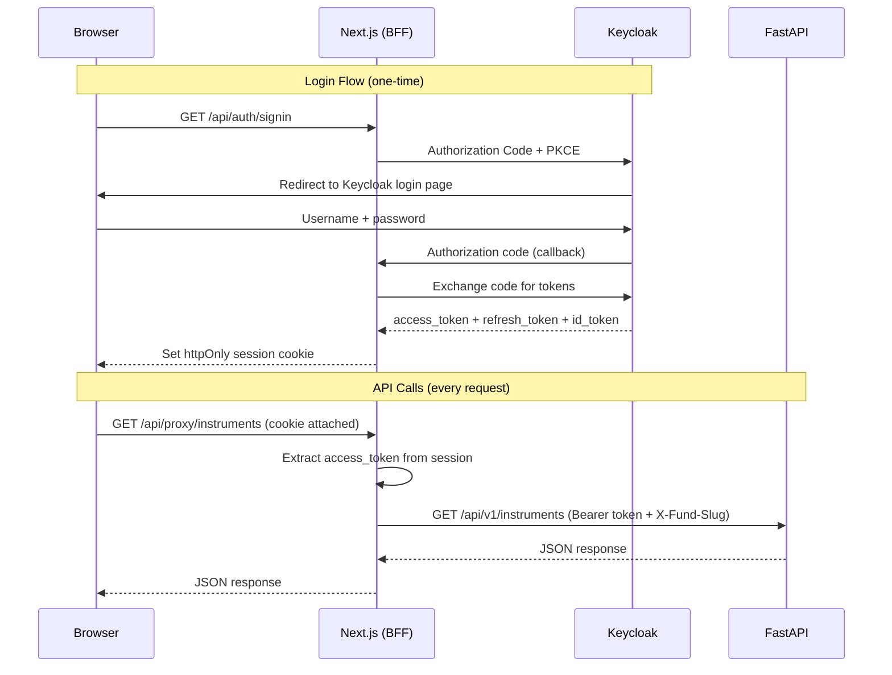
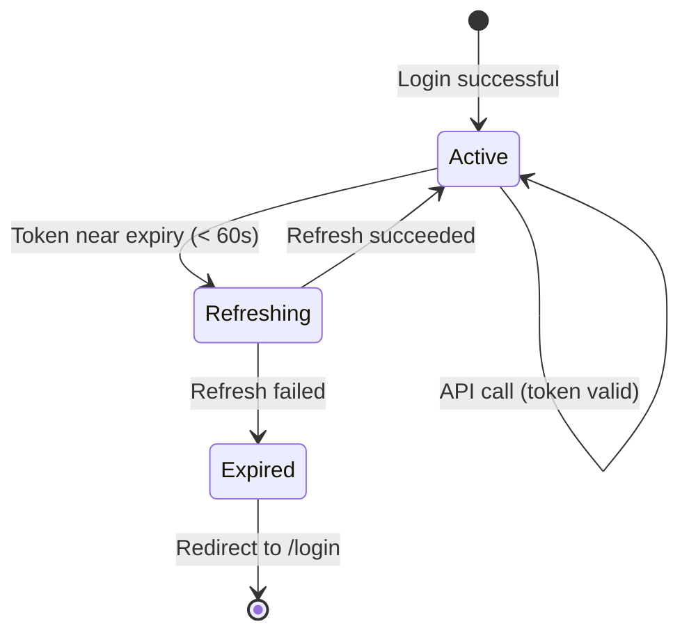

# OIDC Auth Flow — Auth.js + Keycloak with BFF Proxy

## Context & Problem

A financial application requires authentication that never exposes tokens to client-side JavaScript. An XSS vulnerability in a hedge fund dashboard is catastrophic — an attacker with a valid access token can execute trades, read positions, and exfiltrate fund data.

The browser must authenticate users through Keycloak (OIDC), but the access token must stay server-side. The frontend needs a way to make authenticated API calls to FastAPI without the browser ever seeing or handling the JWT.

## Design Decisions

### Auth.js v5 (next-auth) with Keycloak Provider

Auth.js v5 is the standard authentication library for Next.js App Router. It handles Authorization Code + PKCE natively, stores sessions in httpOnly cookies, and integrates with Server Components via `auth()`.

**Why not keycloak-js?** keycloak-js stores tokens in browser memory (or localStorage), making them accessible to any script on the page. It's designed for SPAs without a backend. We have a backend — use it.

**Why not a custom OIDC implementation?** Auth.js handles token refresh, session management, CSRF protection, and cookie encryption. Reimplementing this correctly is error-prone and unnecessary.

### BFF (Backend-For-Frontend) Pattern

The browser never communicates directly with FastAPI. All API calls go through Next.js Route Handlers, which extract the access token from the Auth.js session and forward it:



**Security properties:**
- Access token is never in browser memory, localStorage, or sessionStorage
- Session cookie is httpOnly, Secure, SameSite=Lax
- CSRF protection via Auth.js's built-in double-submit cookie
- No CORS configuration needed on FastAPI for browser requests (same-origin)

### Token Lifecycle



Keycloak's default `accessTokenLifespan` is 900 seconds (15 minutes). Refresh tokens have a longer lifetime controlled by `ssoSessionIdleTimeout` (30 minutes) and `ssoSessionMaxLifespan` (10 hours).

## Architecture

### Auth.js Configuration

```typescript
// src/shared/lib/auth.ts

import NextAuth from "next-auth";
import Keycloak from "next-auth/providers/keycloak";

declare module "next-auth" {
  interface Session {
    accessToken: string;
    error?: "RefreshTokenError";
  }
}

declare module "next-auth/jwt" {
  interface JWT {
    accessToken: string;
    refreshToken: string;
    expiresAt: number;
    error?: "RefreshTokenError";
  }
}

export const { handlers, auth, signIn, signOut } = NextAuth({
  providers: [
    Keycloak({
      clientId: process.env.AUTH_KEYCLOAK_ID!,
      issuer: process.env.AUTH_KEYCLOAK_ISSUER!,
      // No clientSecret — public client with PKCE
    }),
  ],
  session: { strategy: "jwt" },
  callbacks: {
    async jwt({ token, account }) {
      // Initial sign-in: persist tokens from Keycloak
      if (account) {
        return {
          ...token,
          accessToken: account.access_token!,
          refreshToken: account.refresh_token!,
          expiresAt: account.expires_at!,
        };
      }

      // Token still valid
      if (Date.now() < token.expiresAt * 1000 - 60_000) {
        return token;
      }

      // Token expired — attempt refresh
      return refreshAccessToken(token);
    },
    async session({ session, token }) {
      session.accessToken = token.accessToken;
      session.error = token.error;
      return session;
    },
  },
});

async function refreshAccessToken(
  token: import("next-auth/jwt").JWT,
): Promise<import("next-auth/jwt").JWT> {
  const issuer = process.env.AUTH_KEYCLOAK_ISSUER!;
  const tokenUrl = `${issuer}/protocol/openid-connect/token`;

  const response = await fetch(tokenUrl, {
    method: "POST",
    headers: { "Content-Type": "application/x-www-form-urlencoded" },
    body: new URLSearchParams({
      client_id: process.env.AUTH_KEYCLOAK_ID!,
      grant_type: "refresh_token",
      refresh_token: token.refreshToken,
    }),
  });

  if (!response.ok) {
    return { ...token, error: "RefreshTokenError" };
  }

  const data = await response.json();
  return {
    ...token,
    accessToken: data.access_token,
    refreshToken: data.refresh_token ?? token.refreshToken,
    expiresAt: Math.floor(Date.now() / 1000) + data.expires_in,
  };
}
```

### BFF Proxy Route Handler

```typescript
// src/app/api/proxy/[...path]/route.ts

import { auth } from "@/shared/lib/auth";
import { NextRequest, NextResponse } from "next/server";

const API_URL = process.env.API_URL ?? "http://localhost:8000";

async function proxyRequest(
  req: NextRequest,
  { params }: { params: Promise<{ path: string[] }> },
) {
  const session = await auth();
  if (!session?.accessToken) {
    return NextResponse.json({ detail: "Unauthorized" }, { status: 401 });
  }

  if (session.error === "RefreshTokenError") {
    return NextResponse.json(
      { detail: "Session expired" },
      { status: 401 },
    );
  }

  const { path } = await params;
  const targetPath = `/api/v1/${path.join("/")}`;
  const url = new URL(targetPath, API_URL);

  // Forward query params
  req.nextUrl.searchParams.forEach((value, key) => {
    url.searchParams.set(key, value);
  });

  // Extract fund slug from cookie or custom header
  const fundSlug =
    req.headers.get("x-fund-slug") ??
    req.cookies.get("fund-slug")?.value;

  const headers: Record<string, string> = {
    Authorization: `Bearer ${session.accessToken}`,
    "Content-Type": req.headers.get("content-type") ?? "application/json",
  };
  if (fundSlug) {
    headers["X-Fund-Slug"] = fundSlug;
  }

  const response = await fetch(url.toString(), {
    method: req.method,
    headers,
    body: req.method !== "GET" ? await req.text() : undefined,
  });

  const data = await response.text();
  return new NextResponse(data, {
    status: response.status,
    headers: { "Content-Type": response.headers.get("content-type") ?? "application/json" },
  });
}

export const GET = proxyRequest;
export const POST = proxyRequest;
export const PUT = proxyRequest;
export const DELETE = proxyRequest;
export const PATCH = proxyRequest;
```

### Logout: RP-Initiated OIDC Logout

Clearing the Auth.js session alone is insufficient — the Keycloak SSO session remains alive. The user must be redirected to Keycloak's end-session endpoint:

```typescript
// src/features/platform/components/logout-button.tsx
"use client";

import { signOut } from "next-auth/react";

export function LogoutButton() {
  const handleLogout = async () => {
    // Auth.js clears the local session, then redirects to Keycloak logout
    const issuer = process.env.NEXT_PUBLIC_KEYCLOAK_ISSUER!;
    const logoutUrl = `${issuer}/protocol/openid-connect/logout`;
    const redirectUri = encodeURIComponent(window.location.origin);

    await signOut({ redirect: false });
    window.location.href = `${logoutUrl}?post_logout_redirect_uri=${redirectUri}&client_id=${process.env.NEXT_PUBLIC_KEYCLOAK_CLIENT_ID}`;
  };

  return <button onClick={handleLogout}>Sign out</button>;
}
```

**Multi-tab logout:** Use `BroadcastChannel` to notify other tabs when logout happens:

```typescript
// In the logout handler:
const channel = new BroadcastChannel("auth");
channel.postMessage({ type: "logout" });

// In the root layout (listener):
const channel = new BroadcastChannel("auth");
channel.onmessage = (event) => {
  if (event.data.type === "logout") {
    window.location.href = "/login";
  }
};
```

### Client-Side Session Error Handling

When the refresh token expires (user inactive for 30+ minutes), the session enters an error state. Client Components should detect this and redirect:

```typescript
// src/shared/hooks/use-auth-guard.ts
"use client";

import { useSession } from "next-auth/react";
import { useRouter } from "next/navigation";
import { useEffect } from "react";

export function useAuthGuard() {
  const { data: session, status } = useSession();
  const router = useRouter();

  useEffect(() => {
    if (session?.error === "RefreshTokenError") {
      router.push("/login");
    }
  }, [session, router]);

  return { session, status };
}
```

## Keycloak Configuration

### Realm Export Additions

The Keycloak client needs a protocol mapper to include realm roles in the `realm_access` claim (default behavior, but should be explicitly verified) and ensure the `audience` claim includes the client ID for backend token validation:

```json
{
  "clients": [
    {
      "clientId": "mini-hedge-ui",
      "publicClient": true,
      "standardFlowEnabled": true,
      "directAccessGrantsEnabled": true,
      "attributes": {
        "pkce.code.challenge.method": "S256",
        "post.logout.redirect.uris": "http://localhost:3000/*"
      },
      "protocolMappers": [
        {
          "name": "audience-mapper",
          "protocol": "openid-connect",
          "protocolMapper": "oidc-audience-mapper",
          "config": {
            "included.client.audience": "mini-hedge-ui",
            "id.token.claim": "false",
            "access.token.claim": "true"
          }
        }
      ]
    }
  ]
}
```

The `audience-mapper` ensures the access token's `aud` claim contains `mini-hedge-ui`, which the FastAPI backend validates in `decode_keycloak_token()`.

### Docker Network vs Browser URLs

| Context | Keycloak URL | Why |
|---|---|---|
| Browser (OIDC redirect) | `http://localhost:8180` | User's browser navigates here |
| Next.js server (token validation) | `http://keycloak:8180` | Docker internal network |
| FastAPI (JWKS fetch) | `http://keycloak:8180` or `http://localhost:8180` | Depends on whether running in Docker or locally |

Auth.js handles this by separating the `issuer` (server-side token validation) from the authorization URL (browser-facing). When running Next.js inside Docker, `AUTH_KEYCLOAK_ISSUER` should use the Docker hostname. When running locally, it should use `localhost:8180`.

**Common pitfall:** If `issuer` in Auth.js config doesn't match the `iss` claim in the token, validation fails silently. The `iss` claim uses whatever URL the browser used to reach Keycloak (always `localhost:8180` in dev). Set `AUTH_KEYCLOAK_ISSUER=http://localhost:8180/realms/minihedge` when running Next.js locally.

## Failure Modes

| Scenario | Symptom | Recovery |
|---|---|---|
| Keycloak down | Login redirects fail, token refresh fails | Auth.js returns error, UI shows "Authentication service unavailable". Health check should surface this. |
| Access token expired, refresh succeeds | Invisible to user — Auth.js refreshes in `jwt` callback | Automatic — no user action needed |
| Access token expired, refresh fails | `session.error === "RefreshTokenError"` | Redirect to `/login`. User re-authenticates. |
| JWKS endpoint unreachable (from FastAPI) | FastAPI returns 401 for valid Keycloak tokens | PyJWKClient caches keys — survives brief outages. Extended outage blocks all Keycloak-authenticated requests. |
| Cookie size limit (4KB) | Auth.js session cookie rejected by browser | Auth.js splits large cookies automatically. If this is still exceeded, reduce claims stored in the JWT callback. |
| SSO session max lifespan exceeded | Keycloak rejects refresh token | Same as refresh failure — redirect to login. |

## Security Considerations

| Concern | Mitigation |
|---|---|
| XSS token theft | Tokens never in browser JS — httpOnly cookies only |
| CSRF | Auth.js uses double-submit cookie pattern |
| Session fixation | Auth.js rotates session IDs on login |
| Token replay | Short-lived access tokens (15 min), refresh rotation if enabled |
| Open redirect on logout | Keycloak validates `post_logout_redirect_uri` against client config |

## Environment Variables

```bash
# Auth.js core
NEXTAUTH_URL=http://localhost:3000
NEXTAUTH_SECRET=dev-secret-change-in-production    # Encrypts the session cookie

# Keycloak
AUTH_KEYCLOAK_ID=mini-hedge-ui
AUTH_KEYCLOAK_ISSUER=http://localhost:8180/realms/minihedge

# Backend (server-side only — never NEXT_PUBLIC_)
API_URL=http://localhost:8000

# Browser-facing Keycloak URL (for logout redirect)
NEXT_PUBLIC_KEYCLOAK_ISSUER=http://localhost:8180/realms/minihedge
NEXT_PUBLIC_KEYCLOAK_CLIENT_ID=mini-hedge-ui
```

**Critical:** `API_URL` and `NEXTAUTH_SECRET` must never be prefixed with `NEXT_PUBLIC_` — they are server-only.

## Related Documents

- [Next.js App Router](./nextjs-app-router.md) — project structure and Server/Client boundaries
- [Frontend RBAC](./rbac-frontend.md) — how roles from Keycloak drive UI permissions
- [API Client Codegen](./api-client-codegen.md) — typed API calls through the BFF proxy
- [OAuth2 Flows](../api/oauth2-flows.md) — backend OIDC patterns
- [Authentication & RBAC](../api/authorization-rbac.md) — backend actor context model
