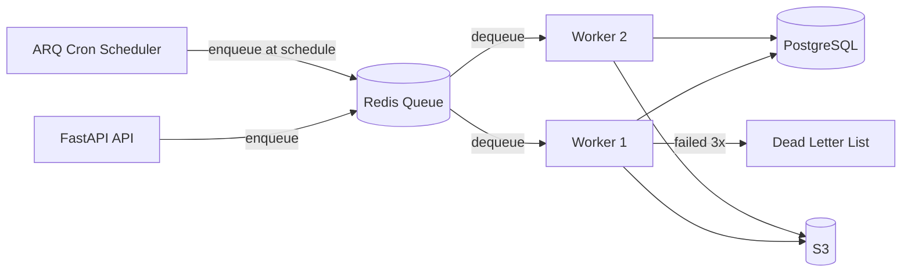

# Background Jobs

## Context & Problem

Not everything belongs in the request-response cycle. Report generation, email sending, periodic reconciliation, data exports, and EOD batch processing all share a trait: they take too long or are too unreliable to run synchronously in an API handler.

The question is *which async execution model* to use:

| Mechanism | Best For | Drawbacks |
|---|---|---|
| `asyncio.create_task()` | Fire-and-forget within a request (<100ms) | No persistence, lost on process crash, no retry |
| Kafka consumer | High-throughput event streams, multi-consumer fan-out | Heavy infrastructure, not designed for one-off tasks |
| Job queue (Redis-backed) | Discrete tasks with retries, scheduling, dead-letter handling | Additional worker process, Redis dependency |

**A job queue is the right tool when you need:** persistence across restarts, automatic retries with backoff, scheduled/cron execution, or dead-letter handling for failed jobs. This document uses [ARQ](https://arq-docs.helpmanual.io/) — a lightweight, async-native Redis job queue built on `redis.asyncio`.

Why ARQ over Celery:
- Async-native (no thread pool hacks for async code)
- Minimal API surface — a single `WorkerSettings` class configures everything
- Built-in cron job support
- Type-hinted, modern Python
- Celery's broader feature set (canvas, multi-broker) is unnecessary for most services

## Design Decisions

### Job Definition

Jobs are plain async functions. The first argument is always an ARQ `ctx` dict containing the Redis connection and any startup resources.

```python
# jobs/reports.py
# arq >= 0.26.0
# pydantic >= 2.0

import logging
from datetime import date
from arq.connections import ArqRedis

logger = logging.getLogger(__name__)


async def generate_portfolio_report(
    ctx: dict,
    portfolio_id: str,
    report_date: date,
) -> str:
    """Generate a PDF portfolio report and upload to S3."""
    redis: ArqRedis = ctx["redis"]
    db = ctx["db"]

    logger.info(
        "Generating portfolio report",
        extra={"portfolio_id": portfolio_id, "report_date": str(report_date)},
    )

    # Fetch positions from DB
    positions = await db.get_positions(portfolio_id, report_date)

    # Generate PDF (CPU-bound — could offload to process pool)
    pdf_bytes = build_report_pdf(portfolio_id, positions, report_date)

    # Upload to S3
    s3_key = f"reports/{portfolio_id}/{report_date}.pdf"
    await upload_to_s3(pdf_bytes, s3_key)

    logger.info(
        "Portfolio report generated",
        extra={"portfolio_id": portfolio_id, "s3_key": s3_key},
    )
    return s3_key
```

### Enqueuing Jobs from the API

```python
# api/routes/reports.py
from datetime import date

from fastapi import APIRouter, Depends
from arq.connections import ArqRedis
from pydantic import BaseModel

router = APIRouter(prefix="/reports", tags=["reports"])


class ReportRequest(BaseModel):
    portfolio_id: str
    report_date: date


class ReportResponse(BaseModel):
    job_id: str
    status: str


@router.post("", response_model=ReportResponse, status_code=202)
async def request_report(
    body: ReportRequest,
    redis: ArqRedis = Depends(get_arq_redis),
) -> ReportResponse:
    """Enqueue a report generation job. Returns immediately with job ID."""
    job = await redis.enqueue_job(
        "generate_portfolio_report",
        body.portfolio_id,
        body.report_date,
        _job_id=f"report:{body.portfolio_id}:{body.report_date}",
    )
    return ReportResponse(job_id=job.job_id, status="queued")
```

Return HTTP 202 Accepted — not 200. The work is not done yet.

Note the explicit `_job_id`: by encoding the business key into the job ID, ARQ deduplicates automatically. Enqueueing the same report twice is a no-op.

### Worker Configuration

```python
# worker.py
from arq.connections import RedisSettings
from arq.cron import cron

from jobs.reports import generate_portfolio_report
from jobs.reconciliation import run_daily_reconciliation
from jobs.notifications import send_trade_confirmation
from db import create_session_factory


async def startup(ctx: dict) -> None:
    """Called once when the worker starts. Initialize shared resources."""
    ctx["db"] = await create_session_factory()


async def shutdown(ctx: dict) -> None:
    """Called when the worker stops. Clean up resources."""
    await ctx["db"].dispose()


class WorkerSettings:
    """ARQ worker configuration."""

    functions = [
        generate_portfolio_report,
        send_trade_confirmation,
    ]

    cron_jobs = [
        cron(
            run_daily_reconciliation,
            hour=17, minute=30,  # 5:30 PM ET — after market close
            run_at_startup=False,
            unique=True,  # skip if previous run still active
        ),
    ]

    on_startup = startup
    on_shutdown = shutdown

    redis_settings = RedisSettings(
        host="localhost",
        port=6379,
        database=1,  # separate from cache DB
    )

    # Retry configuration
    max_jobs = 10              # max concurrent jobs per worker
    job_timeout = 600          # 10 min max per job
    max_tries = 3              # retry failed jobs up to 3 times
    retry_delay = 30           # 30s between retries (ARQ uses exponential backoff)
    health_check_interval = 30 # seconds between health pings
```

### Running the Worker

```bash
# Start the worker (single process, async concurrency)
arq worker.WorkerSettings

# Or with multiple workers for parallelism
arq worker.WorkerSettings --watch  # auto-reload in dev
```

### Retry and Dead-Letter Handling

ARQ retries jobs automatically up to `max_tries`. After exhausting retries, the job is marked as failed. ARQ does not have a built-in dead-letter queue, so implement one:

```python
# jobs/dead_letter.py
import json
import logging
from datetime import datetime, timezone

from arq.connections import ArqRedis

logger = logging.getLogger(__name__)

DEAD_LETTER_KEY = "arq:dead_letter"


async def on_job_failed(
    ctx: dict,
    job_id: str,
    function_name: str,
    args: tuple,
    kwargs: dict,
    error: BaseException,
) -> None:
    """Push failed job details to a Redis list for manual inspection."""
    redis: ArqRedis = ctx["redis"]
    entry = {
        "job_id": job_id,
        "function": function_name,
        "args": [str(a) for a in args],
        "kwargs": {k: str(v) for k, v in kwargs.items()},
        "error": f"{type(error).__name__}: {error}",
        "failed_at": datetime.now(timezone.utc).isoformat(),
    }
    await redis.lpush(DEAD_LETTER_KEY, json.dumps(entry))
    logger.error(
        "Job moved to dead letter queue",
        extra={"job_id": job_id, "function": function_name, "error": str(error)},
    )
```

### Job Monitoring and Observability

```python
# jobs/monitoring.py
from arq.connections import ArqRedis
from pydantic import BaseModel


class JobStatus(BaseModel):
    job_id: str
    status: str  # "queued" | "in_progress" | "complete" | "failed" | "not_found"
    result: str | None = None


async def get_job_status(redis: ArqRedis, job_id: str) -> JobStatus:
    """Check the status of a previously enqueued job."""
    job = await redis.job(job_id)
    if job is None:
        return JobStatus(job_id=job_id, status="not_found")

    info = await job.info()
    if info is None:
        return JobStatus(job_id=job_id, status="not_found")

    return JobStatus(
        job_id=job_id,
        status=info.status,
        result=str(info.result) if info.result else None,
    )
```

Expose a status endpoint so callers can poll:

```python
@router.get("/{job_id}/status", response_model=JobStatus)
async def check_report_status(
    job_id: str,
    redis: ArqRedis = Depends(get_arq_redis),
) -> JobStatus:
    return await get_job_status(redis, job_id)
```

### Architecture Overview



### Docker Compose Setup

```yaml
# docker-compose.yml (relevant services)
services:
  redis:
    image: redis:7-alpine
    ports:
      - "6379:6379"
    volumes:
      - redis-data:/data
    healthcheck:
      test: ["CMD", "redis-cli", "ping"]
      interval: 10s
      timeout: 5s
      retries: 3

  worker:
    build: .
    command: arq worker.WorkerSettings
    environment:
      - REDIS_HOST=redis
      - DATABASE_URL=postgresql+asyncpg://user:pass@db:5432/app
    depends_on:
      redis:
        condition: service_healthy
      db:
        condition: service_healthy
    deploy:
      replicas: 2  # scale workers independently of API

volumes:
  redis-data:
```

### Idempotency

Jobs may be retried. Every job must be idempotent — running the same job twice with the same arguments must produce the same result without side effects. Strategies:

- **Natural idempotency:** `generate_portfolio_report` overwrites the same S3 key. Running it twice produces the same file.
- **Idempotency key:** For jobs with side effects (sending email, creating trades), check whether the operation already completed before executing.
- **Deduplication via job ID:** ARQ skips enqueueing if a job with the same `_job_id` already exists and is not complete.

## Failure Modes

| Failure | Cause | Mitigation |
|---|---|---|
| Job stuck / never completes | Deadlock, infinite loop, waiting on unavailable resource | Set `job_timeout`, monitor job duration, alert on timeout |
| Worker crash mid-job | OOM, unhandled exception, host failure | ARQ re-enqueues jobs that were in progress; ensure idempotency |
| Duplicate execution | Retry after transient failure, worker crash before ack | Design all jobs to be idempotent |
| Redis down | Network partition, Redis OOM | Workers retry Redis connection; API returns 503 if cannot enqueue |
| Job queue grows unboundedly | Workers too slow, burst of enqueues | Monitor queue depth, auto-scale workers, set max queue size |
| Cron job overlap | Previous run still active when next scheduled run triggers | Set `unique=True` on cron jobs to skip if previous is still running |
| Poison message | Job always fails regardless of retries | Dead-letter handling after `max_tries`, alert on DLQ growth |

## Related Documents

- [Kafka Topology](kafka-topology.md) — when event streaming is more appropriate than job queues
- [Exactly-Once Semantics](exactly-once-semantics.md) — idempotency patterns that apply to job execution
- [Dead Letter Queues](dead-letter-queues.md) — DLQ patterns for Kafka (similar principles apply)
- [Retry Strategies](../resilience/retry-strategies.md) — retry patterns shared between HTTP calls and job execution
