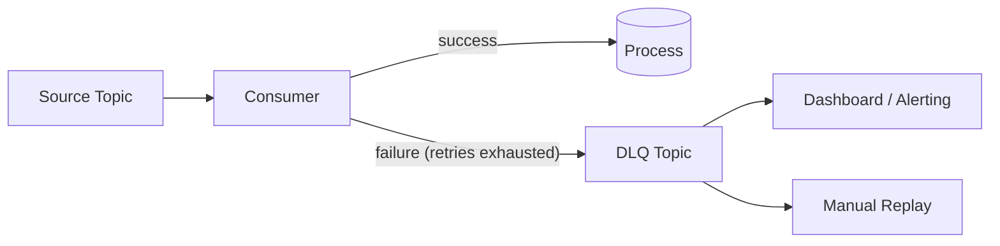

# Dead Letter Queues

## Context & Problem

Consumers fail. A malformed event, an unexpected null, a schema version the consumer does not understand — these "poison messages" block the consumer. Without handling, the consumer retries the same message forever, halting all processing for that partition.

A dead letter queue (DLQ) captures messages that cannot be processed after a configurable number of retries. The consumer moves forward, and the failed messages are available for inspection and reprocessing.

## Design Decisions

### DLQ Strategy



### When to DLQ vs. Retry

| Failure Type | Action |
|---|---|
| Transient (timeout, connection error) | Retry with backoff |
| Permanent (malformed data, missing required field) | DLQ immediately |
| Unknown | Retry N times, then DLQ |

### Implementation

```python
import json
import logging

from confluent_kafka import Consumer, Producer

logger = logging.getLogger(__name__)

MAX_RETRIES = 3


class ResilientConsumer:
    def __init__(
        self,
        consumer: Consumer,
        dlq_producer: Producer,
        dlq_topic: str,
    ) -> None:
        self._consumer = consumer
        self._dlq_producer = dlq_producer
        self._dlq_topic = dlq_topic

    async def consume(self, handler) -> None:
        while True:
            msg = self._consumer.poll(timeout=1.0)
            if msg is None or msg.error():
                continue

            retries = int(msg.headers().get("x-retry-count", b"0")) if msg.headers() else 0

            try:
                event = json.loads(msg.value().decode("utf-8"))
                await handler(event)
                self._consumer.commit(msg)
            except PermanentError:
                # Unrecoverable — DLQ immediately
                self._send_to_dlq(msg, retries, "permanent_error")
                self._consumer.commit(msg)
            except Exception as e:
                if retries >= MAX_RETRIES:
                    logger.error(f"Max retries exceeded, sending to DLQ: {e}")
                    self._send_to_dlq(msg, retries, str(e))
                    self._consumer.commit(msg)
                else:
                    # Re-publish with incremented retry count
                    self._retry(msg, retries + 1)
                    self._consumer.commit(msg)

    def _send_to_dlq(self, msg, retries: int, reason: str) -> None:
        headers = [
            ("x-original-topic", msg.topic().encode()),
            ("x-original-partition", str(msg.partition()).encode()),
            ("x-original-offset", str(msg.offset()).encode()),
            ("x-retry-count", str(retries).encode()),
            ("x-failure-reason", reason.encode()),
            ("x-failed-at", datetime.utcnow().isoformat().encode()),
        ]
        self._dlq_producer.produce(
            topic=self._dlq_topic,
            key=msg.key(),
            value=msg.value(),
            headers=headers,
        )

    def _retry(self, msg, retry_count: int) -> None:
        headers = [("x-retry-count", str(retry_count).encode())]
        self._dlq_producer.produce(
            topic=msg.topic(),  # re-publish to same topic
            key=msg.key(),
            value=msg.value(),
            headers=headers,
        )
```

### DLQ Topic Naming

```
<original-topic>.dlq
```

Examples:
```
trades.executed.dlq
prices.updated.dlq
```

### DLQ Monitoring

DLQ topics should be monitored. Any message in a DLQ is a processing failure that needs attention:

- Alert when DLQ consumer lag > 0
- Dashboard showing DLQ message count, failure reasons, and age
- Tooling to replay individual messages or batches back to the source topic

## Failure Modes

| Failure | Cause | Mitigation |
|---|---|---|
| DLQ itself fails | DLQ topic unavailable | DLQ producer retries, log locally as fallback |
| DLQ ignored | No monitoring, messages accumulate | Alert on DLQ size, assign owner for DLQ triage |
| Replay causes re-failure | Root cause not fixed before replay | Fix the bug first, then replay |
| Retry storm | Transient errors cause mass republishing | Exponential backoff between retries, rate limit republishing |

## Related Documents

- [Kafka Topology](kafka-topology.md) — topic design for DLQs
- [Retry Strategies](../resilience/retry-strategies.md) — backoff patterns
- [Exactly-Once Semantics](exactly-once-semantics.md) — avoiding duplicates during retries
