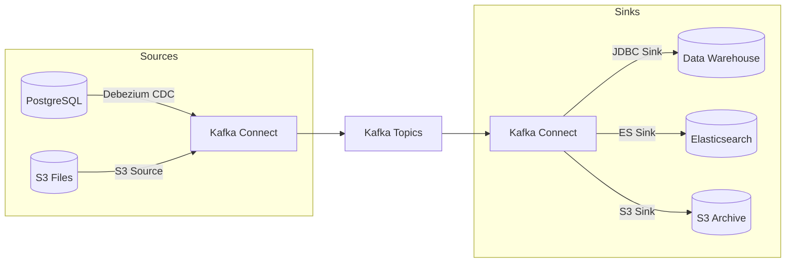

# Kafka Connect

## Context & Problem

Many integrations follow the same pattern: read data from system A, write it to Kafka (source connector), or read from Kafka and write to system B (sink connector). Building these pipelines as custom code means reimplementing offset tracking, error handling, parallelism, and exactly-once delivery for every integration.

Kafka Connect is a framework for scalable, reliable data pipelines between Kafka and external systems. It handles the plumbing — you configure the connector.

## Design Decisions

### Source vs. Sink Connectors



**Common source connectors:**
- **Debezium (CDC)** — captures row-level changes from PostgreSQL WAL
- **JDBC Source** — polls tables for new/changed rows
- **File/S3 Source** — ingests files as events

**Common sink connectors:**
- **JDBC Sink** — writes events to relational databases
- **Elasticsearch Sink** — indexes events for search
- **S3 Sink** — archives events to object storage

### Debezium CDC (Primary Use Case)

Change Data Capture from PostgreSQL's write-ahead log. Every INSERT, UPDATE, DELETE becomes a Kafka event — no application code changes required:

```json
{
  "name": "positions-cdc",
  "config": {
    "connector.class": "io.debezium.connector.postgresql.PostgresConnector",
    "database.hostname": "postgres",
    "database.port": "5432",
    "database.user": "debezium",
    "database.password": "dev",
    "database.dbname": "app",
    "database.server.name": "app",
    "schema.include.list": "positions",
    "table.include.list": "positions.trades,positions.holdings",
    "topic.prefix": "cdc",
    "plugin.name": "pgoutput",
    "slot.name": "debezium_positions",
    "publication.name": "positions_publication",
    "transforms": "route",
    "transforms.route.type": "org.apache.kafka.connect.transforms.RegexRouter",
    "transforms.route.regex": "cdc\\.positions\\.(.*)",
    "transforms.route.replacement": "positions.$1.changes"
  }
}
```

This produces events on topics like `positions.trades.changes` with before/after snapshots of each row change.

### Single Message Transforms (SMTs)

Lightweight transformations applied inline — no separate processing step:

```json
{
  "transforms": "extractKey,flatten",
  "transforms.extractKey.type": "org.apache.kafka.connect.transforms.ExtractField$Key",
  "transforms.extractKey.field": "id",
  "transforms.flatten.type": "org.apache.kafka.connect.transforms.Flatten$Value",
  "transforms.flatten.delimiter": "_"
}
```

For complex transformations, use a stream processing step (Kafka Streams, Faust) instead of overloading SMTs.

## Local Development

```yaml
services:
  kafka-connect:
    image: confluentinc/cp-kafka-connect:7.6.0
    ports: ["8083:8083"]
    environment:
      CONNECT_BOOTSTRAP_SERVERS: kafka:9092
      CONNECT_REST_PORT: 8083
      CONNECT_GROUP_ID: connect-cluster
      CONNECT_CONFIG_STORAGE_TOPIC: connect-configs
      CONNECT_OFFSET_STORAGE_TOPIC: connect-offsets
      CONNECT_STATUS_STORAGE_TOPIC: connect-status
      CONNECT_CONFIG_STORAGE_REPLICATION_FACTOR: 1
      CONNECT_OFFSET_STORAGE_REPLICATION_FACTOR: 1
      CONNECT_STATUS_STORAGE_REPLICATION_FACTOR: 1
      CONNECT_KEY_CONVERTER: org.apache.kafka.connect.json.JsonConverter
      CONNECT_VALUE_CONVERTER: io.confluent.connect.avro.AvroConverter
      CONNECT_VALUE_CONVERTER_SCHEMA_REGISTRY_URL: http://schema-registry:8081
      CONNECT_PLUGIN_PATH: /usr/share/java,/usr/share/confluent-hub-components
    command:
      - bash
      - -c
      - |
        confluent-hub install --no-prompt debezium/debezium-connector-postgresql:latest
        /etc/confluent/docker/run
    depends_on: [kafka, schema-registry]
```

Deploy a connector:
```bash
curl -X POST http://localhost:8083/connectors \
  -H "Content-Type: application/json" \
  -d @connectors/positions-cdc.json
```

## Failure Modes

| Failure | Cause | Mitigation |
|---|---|---|
| Connector fails and stops | Bad config, target down | Monitor connector status, auto-restart policy |
| Replication slot grows | Consumer (Connect) is down, WAL accumulates | Alert on slot size, restart connector promptly |
| Schema evolution breaks connector | Table schema changed, Avro incompatible | Schema Registry compatibility checks, test migrations |
| Duplicate messages | Connector restart replays from last committed offset | Idempotent consumers downstream |

## Related Documents

- [Kafka Topology](kafka-topology.md) — topics that connectors feed
- [Change Data Capture](../data-processing/change-data-capture.md) — CDC patterns in depth
- [Schema Registry](schema-registry.md) — schema governance for connector output
