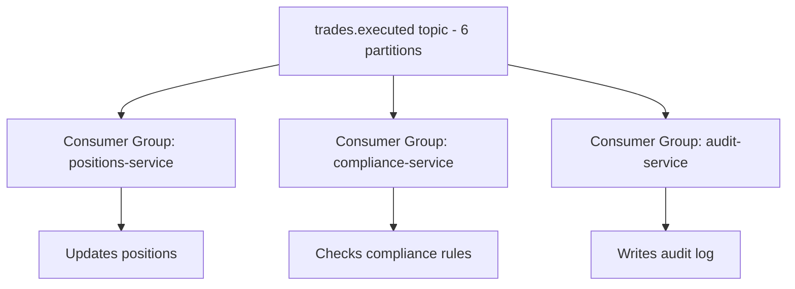

# Kafka Topology

## Context & Problem

Apache Kafka is an event streaming platform — a distributed, ordered, replayable log. In an event-driven architecture, Kafka serves as the central nervous system: producers publish events, consumers react to them, and the log retains history for replay and reprocessing.

Designing the Kafka topology — topics, partitions, consumer groups, and data flow — determines the system's throughput, ordering guarantees, and operational characteristics.

## Design Decisions

### Topic Design

**One topic per event type** is the default strategy:

```
trades.executed          — trade execution events
prices.updated           — market data price updates
positions.changed        — position state changes
compliance.violations    — compliance rule violations
audit.events             — immutable audit log
```

**Naming convention:** `<domain>.<event>` in lowercase with dots.

Avoid a single "events" topic for everything — it makes consumer filtering expensive and prevents per-topic configuration (retention, partitions, compaction).

### Partitioning Strategy

Partitions enable parallelism and determine ordering guarantees. Kafka guarantees order **within a partition**, not across partitions.

**Partition key selection:**

| Topic | Partition Key | Rationale |
|---|---|---|
| `trades.executed` | `portfolio_id` | All trades for a portfolio are ordered |
| `prices.updated` | `instrument_id` | All prices for an instrument are ordered |
| `positions.changed` | `portfolio_id:instrument_id` | Position updates for the same holding are ordered |
| `audit.events` | `entity_id` | All audit events for an entity are ordered |

**Partition count:**

- Start with 2x the expected peak consumer parallelism
- Partitions can be increased later but **never decreased**
- More partitions = more parallelism but more overhead (memory, file handles, rebalance time)
- Typical starting point: 6-12 partitions for moderate throughput

### Consumer Groups

Each consumer group independently tracks its position in the log. Multiple groups can consume the same topic:



Each consumer in a group is assigned a subset of partitions. Adding consumers (up to the partition count) increases parallelism.

### Retention and Compaction

| Strategy | Behavior | Use Case |
|---|---|---|
| **Time-based retention** | Delete events older than N days | Most event topics (7-30 days) |
| **Size-based retention** | Delete oldest events when topic exceeds N bytes | When storage is the constraint |
| **Compaction** | Keep only the latest value per key | Changelog topics (latest state per entity) |
| **Infinite retention** | Never delete | Event sourcing, audit logs |

```properties
# Topic configuration examples

# Trade events: keep 30 days
trades.executed.retention.ms=2592000000

# Price snapshots: compacted (latest per instrument)
prices.snapshot.cleanup.policy=compact

# Audit log: infinite retention
audit.events.retention.ms=-1
```

## Code Skeleton

### Producer

```python
# infrastructure/kafka_producer.py

from confluent_kafka import Producer
from confluent_kafka.serialization import SerializationContext, MessageField
from confluent_kafka.schema_registry.avro import AvroSerializer


class KafkaEventPublisher:
    def __init__(
        self,
        bootstrap_servers: str,
        schema_registry_url: str,
    ) -> None:
        self._producer = Producer({
            "bootstrap.servers": bootstrap_servers,
            "acks": "all",                    # wait for all replicas
            "enable.idempotence": True,       # exactly-once producer
            "retries": 5,
            "max.in.flight.requests.per.connection": 5,
        })

    async def publish(
        self,
        topic: str,
        key: str,
        value: dict,
    ) -> None:
        # Note: produce() is non-blocking (buffers locally), flush() is blocking.
        # This async method is safe because produce() only enqueues to an internal buffer.
        self._producer.produce(
            topic=topic,
            key=key.encode("utf-8"),
            value=json.dumps(value).encode("utf-8"),
            callback=self._delivery_callback,
        )
        self._producer.poll(0)  # trigger callbacks

    def _delivery_callback(self, err, msg):
        if err:
            logger.error(f"Delivery failed: {err}")
        else:
            logger.debug(f"Delivered to {msg.topic()}[{msg.partition()}]@{msg.offset()}")

    def flush(self) -> None:
        self._producer.flush()
```

### Consumer

```python
# infrastructure/kafka_consumer.py

from confluent_kafka import Consumer, KafkaError


class KafkaEventConsumer:
    def __init__(
        self,
        bootstrap_servers: str,
        group_id: str,
        topics: list[str],
    ) -> None:
        self._consumer = Consumer({
            "bootstrap.servers": bootstrap_servers,
            "group.id": group_id,
            "auto.offset.reset": "earliest",
            "enable.auto.commit": False,      # manual commit for at-least-once
            "max.poll.interval.ms": 300000,
        })
        self._consumer.subscribe(topics)

    async def consume(self, handler) -> None:
        """Main consumption loop."""
        while True:
            # Note: poll() is a synchronous call from confluent-kafka's C library.
            # With timeout=1.0 it blocks the event loop for up to 1 second.
            # For high-throughput async applications, consider running poll() in
            # a thread executor via asyncio.to_thread() or loop.run_in_executor().
            msg = self._consumer.poll(timeout=1.0)
            if msg is None:
                continue
            if msg.error():
                if msg.error().code() == KafkaError._PARTITION_EOF:
                    continue
                logger.error(f"Consumer error: {msg.error()}")
                continue

            try:
                event = json.loads(msg.value().decode("utf-8"))
                await handler(event)
                self._consumer.commit(msg)
            except Exception:
                logger.exception(f"Failed to process message at offset {msg.offset()}")
                # Send to DLQ after N retries (see dead-letter-queues.md)

    def close(self) -> None:
        self._consumer.close()
```

## Performance Profile

| Metric | Typical Value |
|---|---|
| Producer throughput (per partition) | 10-100 MB/s |
| Consumer throughput (per partition) | 10-50 MB/s |
| End-to-end latency (producer → consumer) | 2-10ms (same DC) |
| Partition rebalance time | 1-30 seconds |

## Failure Modes

| Failure | Cause | Mitigation |
|---|---|---|
| Consumer lag | Slow processing, consumer crash | Monitor lag, auto-scale consumers, alert on growing lag |
| Partition rebalance storm | Frequent consumer restarts | Increase `session.timeout.ms`, use static group membership |
| Message ordering violation | Wrong partition key, partition rebalance | Choose partition key carefully, use idempotent consumers |
| Broker failure | Disk, network, OOM | Replication factor ≥ 3, `min.insync.replicas = 2` |
| Producer backpressure | Buffer full, broker slow | Monitor `buffer.memory`, increase or slow producer |

## Local Development

```yaml
services:
  kafka:
    image: confluentinc/cp-kafka:7.6.0
    ports: ["9092:9092"]
    environment:
      KAFKA_NODE_ID: 1
      KAFKA_PROCESS_ROLES: broker,controller
      KAFKA_LISTENERS: PLAINTEXT://0.0.0.0:9092,CONTROLLER://0.0.0.0:9093
      KAFKA_ADVERTISED_LISTENERS: PLAINTEXT://localhost:9092
      KAFKA_CONTROLLER_QUORUM_VOTERS: 1@kafka:9093
      KAFKA_CONTROLLER_LISTENER_NAMES: CONTROLLER
      KAFKA_LISTENER_SECURITY_PROTOCOL_MAP: CONTROLLER:PLAINTEXT,PLAINTEXT:PLAINTEXT
      KAFKA_OFFSETS_TOPIC_REPLICATION_FACTOR: 1
      CLUSTER_ID: "local-dev-cluster"
```

KRaft mode (no ZooKeeper) — single broker for local development.

## Related Documents

- [Event-Driven Architecture](../../principles/event-driven-architecture.md) — the principle this implements
- [Schema Registry](schema-registry.md) — schema governance for events
- [Dead Letter Queues](dead-letter-queues.md) — handling poison messages
- [Exactly-Once Semantics](exactly-once-semantics.md) — transactional processing
- [Kafka Connect](kafka-connect.md) — source and sink connectors
