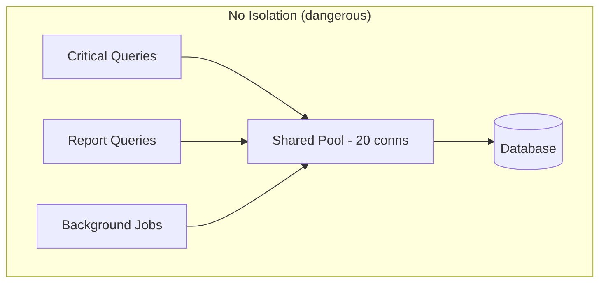
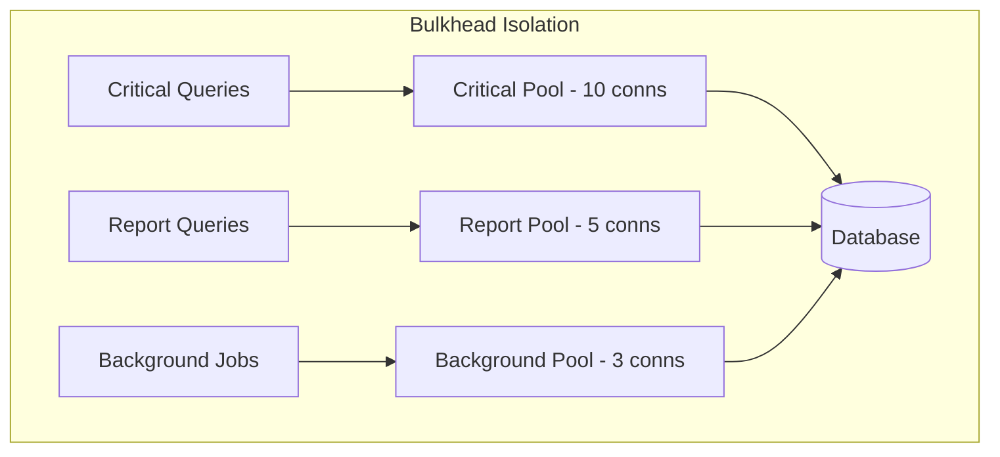
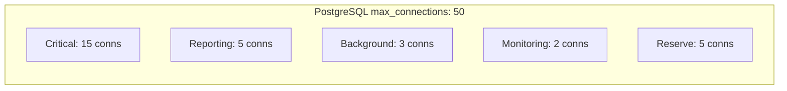

# Bulkhead Isolation

## Context & Problem

A ship's hull is divided into watertight compartments — bulkheads — so that a breach in one does not sink the entire vessel. Software systems need the same principle.

Without isolation, a slow or failing dependency consumes shared resources (threads, connections, memory) and degrades everything else. A non-critical background report query that triggers a full table scan exhausts the connection pool, and now the critical order execution path cannot get a database connection. One bad dependency takes down the entire system.

Bulkhead isolation partitions resources so that failures in one component are contained. Each component gets its own resource pool, and when that pool is exhausted, only that component is affected.

## Design Decisions

### Isolation Strategies





There are three levels of bulkhead isolation, each with increasing strength:

| Level | Mechanism | Isolation Strength | Overhead |
|---|---|---|---|
| **Semaphore** | Concurrency limit via semaphore | Limits concurrent calls, shared process | Low |
| **Connection Pool** | Separate pools per workload | Separate connections, shared process | Medium |
| **Process** | Separate OS processes or containers | Full memory/CPU isolation | High |

### Pattern 1: Asyncio Semaphore Bulkheads

The lightest-weight approach. Use `asyncio.Semaphore` to limit concurrency per workload category. No separate pools — just concurrency caps.

```python
# bulkhead.py
# Python 3.12+
import asyncio
import logging
from typing import TypeVar, ParamSpec
from collections.abc import Callable, Awaitable
from functools import wraps

logger = logging.getLogger(__name__)

P = ParamSpec("P")
T = TypeVar("T")


class BulkheadFullError(Exception):
    """Raised when a bulkhead has no available capacity."""

    def __init__(self, name: str, max_concurrent: int) -> None:
        self.name = name
        self.max_concurrent = max_concurrent
        super().__init__(
            f"Bulkhead '{name}' is full ({max_concurrent} concurrent calls)"
        )


class Bulkhead:
    """Limits concurrent execution of a workload category."""

    def __init__(self, name: str, max_concurrent: int, timeout: float = 30.0) -> None:
        self.name = name
        self.max_concurrent = max_concurrent
        self.timeout = timeout
        self._semaphore = asyncio.Semaphore(max_concurrent)
        self._active = 0
        self._rejected = 0

    @property
    def active_count(self) -> int:
        return self._active

    @property
    def rejected_count(self) -> int:
        return self._rejected

    @property
    def available(self) -> int:
        return self.max_concurrent - self._active

    async def execute(self, func: Callable[..., Awaitable[T]], *args, **kwargs) -> T:
        """Execute a function within the bulkhead's concurrency limit."""
        try:
            acquired = await asyncio.wait_for(
                self._semaphore.acquire(), timeout=self.timeout
            )
        except asyncio.TimeoutError:
            self._rejected += 1
            raise BulkheadFullError(self.name, self.max_concurrent)

        self._active += 1
        try:
            return await func(*args, **kwargs)
        finally:
            self._active -= 1
            self._semaphore.release()

    def __call__(
        self, func: Callable[P, Awaitable[T]]
    ) -> Callable[P, Awaitable[T]]:
        """Use as a decorator."""

        @wraps(func)
        async def wrapper(*args: P.args, **kwargs: P.kwargs) -> T:
            return await self.execute(func, *args, **kwargs)

        return wrapper


# Define bulkheads per workload category
critical_bulkhead = Bulkhead(name="critical", max_concurrent=20, timeout=5.0)
reporting_bulkhead = Bulkhead(name="reporting", max_concurrent=5, timeout=30.0)
background_bulkhead = Bulkhead(name="background", max_concurrent=3, timeout=60.0)
```

#### Usage

```python
# order_service.py

@critical_bulkhead
async def execute_order(session: AsyncSession, order: Order) -> Trade:
    """Critical path — gets priority access."""
    ...


@reporting_bulkhead
async def generate_daily_report(session: AsyncSession, date: date) -> Report:
    """Non-critical — limited to 5 concurrent, won't starve order execution."""
    ...


@background_bulkhead
async def reconcile_positions(session: AsyncSession) -> None:
    """Background work — limited to 3 concurrent."""
    ...
```

### Pattern 2: Connection Pool Isolation

Stronger isolation for database access. Each workload category gets its own SQLAlchemy engine with its own connection pool. A report query that exhausts its pool cannot touch connections reserved for critical operations.

```python
# database.py
from sqlalchemy.ext.asyncio import create_async_engine, async_sessionmaker, AsyncSession


def create_isolated_pools(
    database_url: str,
) -> dict[str, async_sessionmaker[AsyncSession]]:
    """Create separate connection pools for different workload categories."""

    critical_engine = create_async_engine(
        database_url,
        pool_size=10,
        max_overflow=5,
        pool_timeout=5,          # fail fast if pool exhausted
        pool_pre_ping=True,
        connect_args={"options": "-c statement_timeout=5000"},  # 5s query timeout
    )

    reporting_engine = create_async_engine(
        database_url,
        pool_size=3,
        max_overflow=2,
        pool_timeout=30,         # reports can wait longer
        pool_pre_ping=True,
        connect_args={"options": "-c statement_timeout=120000"},  # 2min query timeout
    )

    background_engine = create_async_engine(
        database_url,
        pool_size=2,
        max_overflow=1,
        pool_timeout=60,
        pool_pre_ping=True,
        connect_args={"options": "-c statement_timeout=300000"},  # 5min query timeout
    )

    return {
        "critical": async_sessionmaker(critical_engine, expire_on_commit=False),
        "reporting": async_sessionmaker(reporting_engine, expire_on_commit=False),
        "background": async_sessionmaker(background_engine, expire_on_commit=False),
    }
```

Note how each pool also sets different `statement_timeout` values. Critical queries that run longer than 5 seconds are likely stuck and should be killed. Report queries legitimately run longer.

#### Using the Isolated Pools

```python
# dependencies.py (FastAPI dependency injection)
from fastapi import Depends, Request


async def get_critical_session(request: Request):
    pools = request.app.state.pools
    async with pools["critical"]() as session:
        yield session


async def get_reporting_session(request: Request):
    pools = request.app.state.pools
    async with pools["reporting"]() as session:
        yield session


# routes/orders.py
@router.post("/orders")
async def create_order(
    order: OrderCreate,
    session: AsyncSession = Depends(get_critical_session),  # critical pool
):
    ...


# routes/reports.py
@router.get("/reports/daily")
async def daily_report(
    date: date,
    session: AsyncSession = Depends(get_reporting_session),  # reporting pool
):
    ...
```

### Pattern 3: External Service Bulkheads

When calling multiple external services, isolate them so a slow service does not consume all outbound connections:

```python
# external_bulkheads.py
import httpx


class ExternalServiceClients:
    """Isolated HTTP clients for each external dependency."""

    def __init__(self) -> None:
        # Each service gets its own connection pool and timeout config
        self.bloomberg = httpx.AsyncClient(
            base_url="https://api.bloomberg.com",
            limits=httpx.Limits(
                max_connections=20,
                max_keepalive_connections=10,
            ),
            timeout=httpx.Timeout(10.0, connect=5.0),
        )

        self.reuters = httpx.AsyncClient(
            base_url="https://api.reuters.com",
            limits=httpx.Limits(
                max_connections=10,
                max_keepalive_connections=5,
            ),
            timeout=httpx.Timeout(15.0, connect=5.0),
        )

        self.email_service = httpx.AsyncClient(
            base_url="https://api.sendgrid.com",
            limits=httpx.Limits(
                max_connections=5,       # non-critical, limited
                max_keepalive_connections=2,
            ),
            timeout=httpx.Timeout(30.0, connect=10.0),
        )

    async def close(self) -> None:
        await asyncio.gather(
            self.bloomberg.aclose(),
            self.reuters.aclose(),
            self.email_service.aclose(),
        )
```

If Bloomberg becomes slow and all 20 of its connections are waiting on responses, Reuters and the email service are completely unaffected — they have their own connections.

### Sizing Bulkheads

The total resources across all bulkheads must not exceed the system's capacity:



**Sizing heuristic:**
- **Critical path:** Gets the largest share. Size for peak expected concurrency.
- **Non-critical:** Size for acceptable throughput, not peak demand. Reports can queue.
- **Reserve:** Always keep headroom for admin connections and monitoring.
- **Total:** Sum of all bulkheads + reserve must be less than the dependency's capacity.

### Monitoring

```python
# metrics.py
import logging

logger = logging.getLogger(__name__)


def log_bulkhead_metrics(bulkheads: dict[str, Bulkhead]) -> None:
    """Emit bulkhead utilization metrics. Call periodically."""
    for name, bh in bulkheads.items():
        utilization = bh.active_count / bh.max_concurrent
        logger.info(
            "bulkhead_metrics",
            extra={
                "bulkhead": name,
                "active": bh.active_count,
                "available": bh.available,
                "max_concurrent": bh.max_concurrent,
                "utilization_pct": round(utilization * 100, 1),
                "rejected_total": bh.rejected_count,
            },
        )
```

Key alerts:
- **Utilization > 80% sustained** — bulkhead is near capacity, consider increasing
- **Rejected count increasing** — workload exceeds capacity, either increase bulkhead or reduce load
- **Critical bulkhead at 0 available** — immediate concern, critical operations are being delayed

## Failure Modes

| Failure | Cause | Mitigation |
|---|---|---|
| Bulkhead too small | Undersized for normal traffic, not just failure scenarios | Load test each workload category independently, size for peak |
| Bulkhead too large | Oversized bulkhead defeats the purpose of isolation | Total across bulkheads must stay under dependency limits |
| Wrong workload classification | Critical query routed through non-critical bulkhead | Clear naming, enforce via dependency injection, not runtime choice |
| All bulkheads full simultaneously | System-wide overload, not a single-component failure | Combine with load shedding at the edge (return 503) |
| Deadlock across bulkheads | Operation needs connections from two bulkheads simultaneously | Avoid cross-bulkhead transactions, acquire in consistent order |
| Semaphore leak | Exception path does not release the semaphore | Always use try/finally (the `Bulkhead` class above handles this) |

## Related Documents

- [Circuit Breakers](circuit-breakers.md) — circuit breakers detect failure, bulkheads contain it
- [Connection Pooling](../data-access/connection-pooling.md) — the pools that bulkheads partition
- [Graceful Degradation](graceful-degradation.md) — what to do when a bulkhead rejects requests
- [External API Adapters](../api/external-api-adapters.md) — isolated HTTP clients per vendor
- [Retry Strategies](retry-strategies.md) — retries within a bulkhead consume capacity
