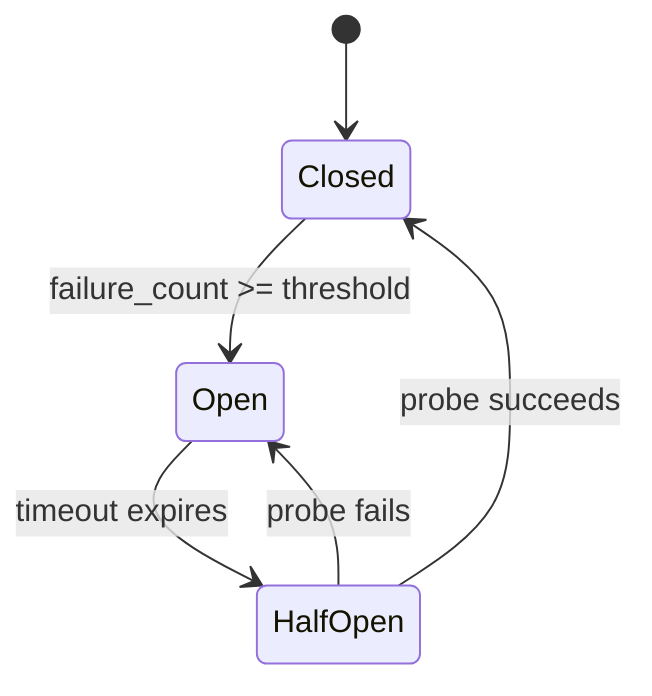
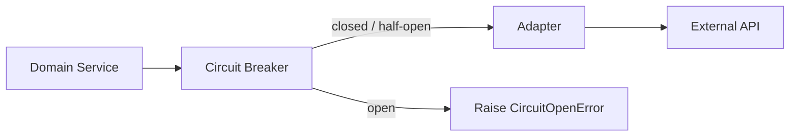

# Circuit Breakers

## Context & Problem

When a dependency is degraded — slow responses, elevated error rates, complete outage — continuing to send requests makes things worse. The caller wastes threads and connections waiting for responses that will never arrive (or arrive too late). Timeouts pile up, latency spikes cascade, and the caller itself becomes degraded.

A circuit breaker sits between the caller and the dependency. It monitors failures and, when a threshold is crossed, stops sending requests entirely. The dependency gets breathing room to recover, and the caller fails fast instead of waiting.

## Design Decisions

### State Machine

The circuit breaker has three states:



**Closed** — normal operation. Requests pass through. Failures are counted. When the failure count within a time window exceeds the threshold, the circuit opens.

**Open** — all requests are rejected immediately (fail fast). No traffic reaches the dependency. After a configurable timeout, the circuit transitions to half-open.

**Half-Open** — a single probe request is allowed through. If it succeeds, the circuit closes and normal traffic resumes. If it fails, the circuit reopens and the timeout resets.

### Failure Counting Strategy

Count failures within a sliding time window, not as a running total. A dependency that failed 5 times over 24 hours is not degraded. A dependency that failed 5 times in 30 seconds is.

Two common approaches:
- **Count-based:** Open after N failures in a window (simple, good default)
- **Rate-based:** Open when failure rate exceeds X% over a minimum sample size (better for high-throughput calls)

This document uses count-based for clarity. Switch to rate-based when the call volume is high enough that raw counts are misleading.

### What Counts as a Failure

Not all errors should trip the circuit:

| Error Type | Trips Circuit? | Reasoning |
|---|---|---|
| HTTP 500, 502, 503 | Yes | Server-side failure, likely systemic |
| HTTP 429 (rate limited) | Yes | Continuing will make it worse |
| Connection timeout | Yes | Dependency unreachable |
| HTTP 400, 404, 422 | No | Client error — the dependency is healthy |
| Deserialization error | No | Data issue, not a dependency issue |

### Where to Place the Circuit Breaker

The circuit breaker wraps the adapter, not the domain service. The domain should not know whether a dependency is circuit-broken — it receives an exception and decides what to do (fallback, degrade, propagate).



### Implementation

```python
# circuit_breaker.py
import time
import enum
import threading
import logging
from typing import TypeVar, ParamSpec
from collections.abc import Callable, Awaitable
from functools import wraps

logger = logging.getLogger(__name__)

P = ParamSpec("P")
T = TypeVar("T")


class CircuitState(enum.Enum):
    CLOSED = "closed"
    OPEN = "open"
    HALF_OPEN = "half_open"


class CircuitOpenError(Exception):
    """Raised when a call is attempted while the circuit is open."""

    def __init__(self, circuit_name: str, remaining_seconds: float) -> None:
        self.circuit_name = circuit_name
        self.remaining_seconds = remaining_seconds
        super().__init__(
            f"Circuit '{circuit_name}' is open. "
            f"Retry after {remaining_seconds:.1f}s."
        )


class CircuitBreaker:
    """Thread-safe circuit breaker with count-based failure detection."""

    def __init__(
        self,
        name: str,
        failure_threshold: int = 5,
        recovery_timeout: float = 30.0,
        window_size: float = 60.0,
        expected_exceptions: tuple[type[Exception], ...] = (Exception,),
    ) -> None:
        self.name = name
        self.failure_threshold = failure_threshold
        self.recovery_timeout = recovery_timeout
        self.window_size = window_size
        self.expected_exceptions = expected_exceptions

        self._state = CircuitState.CLOSED
        self._failures: list[float] = []  # timestamps of recent failures
        self._last_failure_time: float = 0.0
        self._lock = threading.Lock()

    @property
    def state(self) -> CircuitState:
        with self._lock:
            if self._state == CircuitState.OPEN:
                if time.monotonic() - self._last_failure_time >= self.recovery_timeout:
                    self._state = CircuitState.HALF_OPEN
                    logger.info(f"Circuit '{self.name}' -> HALF_OPEN (timeout expired)")
            return self._state

    def record_success(self) -> None:
        with self._lock:
            if self._state == CircuitState.HALF_OPEN:
                self._state = CircuitState.CLOSED
                self._failures.clear()
                logger.info(f"Circuit '{self.name}' -> CLOSED (probe succeeded)")

    def record_failure(self) -> None:
        with self._lock:
            now = time.monotonic()
            self._last_failure_time = now

            # Prune failures outside the window
            cutoff = now - self.window_size
            self._failures = [t for t in self._failures if t > cutoff]
            self._failures.append(now)

            if self._state == CircuitState.HALF_OPEN:
                self._state = CircuitState.OPEN
                logger.warning(f"Circuit '{self.name}' -> OPEN (probe failed)")
            elif len(self._failures) >= self.failure_threshold:
                self._state = CircuitState.OPEN
                logger.warning(
                    f"Circuit '{self.name}' -> OPEN "
                    f"({len(self._failures)} failures in {self.window_size}s)"
                )

    def __call__(
        self, func: Callable[P, Awaitable[T]]
    ) -> Callable[P, Awaitable[T]]:
        """Use as a decorator on async functions."""

        @wraps(func)
        async def wrapper(*args: P.args, **kwargs: P.kwargs) -> T:
            current_state = self.state

            if current_state == CircuitState.OPEN:
                remaining = self.recovery_timeout - (
                    time.monotonic() - self._last_failure_time
                )
                raise CircuitOpenError(self.name, max(0, remaining))

            try:
                result = await func(*args, **kwargs)
                self.record_success()
                return result
            except self.expected_exceptions:
                self.record_failure()
                raise

        return wrapper
```

### Usage with an Adapter

```python
# adapters/bloomberg.py
import httpx

from circuit_breaker import CircuitBreaker, CircuitOpenError


# One circuit breaker per external dependency
bloomberg_circuit = CircuitBreaker(
    name="bloomberg-api",
    failure_threshold=5,
    recovery_timeout=30.0,
    window_size=60.0,
    expected_exceptions=(httpx.HTTPStatusError, httpx.ConnectTimeout),
)


class BloombergAdapter:
    def __init__(self, base_url: str, api_key: str) -> None:
        self._client = httpx.AsyncClient(
            base_url=base_url,
            headers={"Authorization": f"Bearer {api_key}"},
            timeout=httpx.Timeout(10.0, connect=5.0),
        )

    @bloomberg_circuit
    async def get_quote(self, instrument_id: str) -> PriceQuote:
        response = await self._client.get(
            f"/market/securities/{instrument_id}/quote"
        )
        response.raise_for_status()
        return self._to_quote(response.json())
```

### Configuration Guidelines

| Parameter | Default | Guidance |
|---|---|---|
| `failure_threshold` | 5 | Lower (2-3) for critical paths, higher (10+) for noisy dependencies |
| `recovery_timeout` | 30s | Match the dependency's typical recovery time |
| `window_size` | 60s | Longer windows are more tolerant of sporadic errors |
| `expected_exceptions` | Depends | Only count exceptions that indicate dependency health issues |

### Monitoring the Circuit

Emit metrics on every state transition and on every rejected call:

```python
# Structured logging for circuit state changes
logger.info(
    "circuit_state_change",
    extra={
        "circuit_name": self.name,
        "from_state": previous.value,
        "to_state": self._state.value,
        "failure_count": len(self._failures),
    },
)
```

Key metrics:
- **Circuit open events** — how often each circuit trips
- **Rejected call count** — requests that failed fast
- **Time in open state** — how long dependencies stay degraded
- **Half-open probe results** — success/failure rate of recovery probes

## Failure Modes

| Failure | Cause | Mitigation |
|---|---|---|
| Circuit never opens | Threshold too high, wrong exceptions counted | Tune threshold, ensure `expected_exceptions` covers actual failure types |
| Circuit flaps (open/close rapidly) | Threshold too low, dependency partially degraded | Increase threshold, increase recovery timeout, use rate-based counting |
| Circuit stays open after recovery | Recovery timeout too long | Tune recovery timeout, add manual reset capability |
| Half-open probe overloads recovering service | Multiple circuit breakers probe simultaneously | Add jitter to recovery timeout, limit probe rate |
| Cascading circuit opens | One circuit opens, redirected traffic overloads another dependency | Combine with bulkhead isolation, shed load at the edge |

## Related Documents

- [External API Adapters](../api/external-api-adapters.md) — where circuit breakers are applied
- [Retry Strategies](retry-strategies.md) — retries happen inside the circuit; circuit breaker wraps retries
- [Graceful Degradation](graceful-degradation.md) — what to do when the circuit is open
- [Bulkhead Isolation](bulkhead-isolation.md) — preventing cascading failures across circuits
