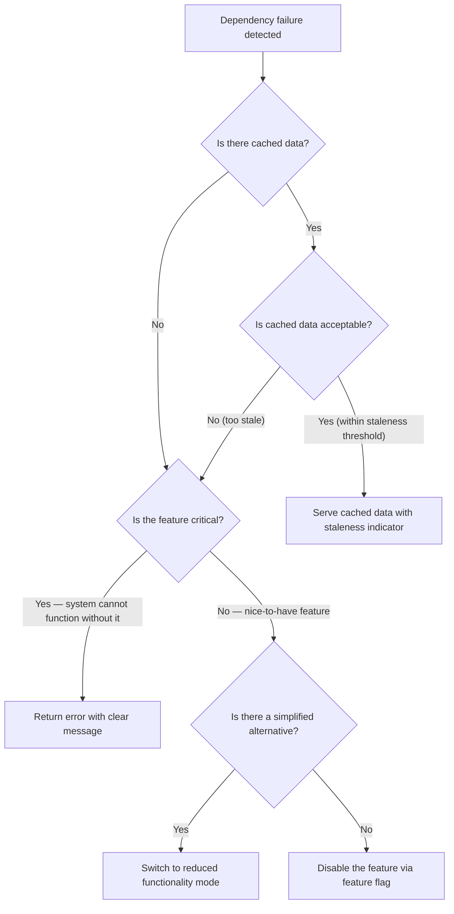
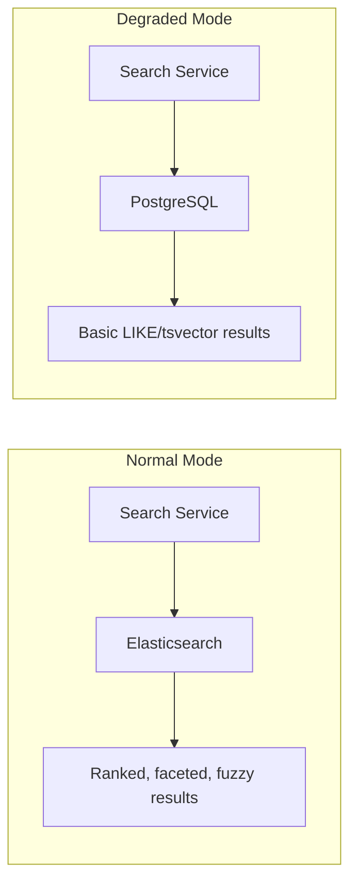

# Graceful Degradation

## Context & Problem

Systems have dependencies that fail. A market data feed goes down, a third-party API returns errors, a database replica lags. The question is not whether dependencies will fail, but what the system does when they do.

Without a degradation strategy, any dependency failure becomes a system-wide outage. With one, the system continues to serve users — with reduced functionality, stale data, or limited features — instead of returning errors across the board.

## Design Decisions

### Degradation Decision Tree

When a dependency fails, the system must decide what to do. This decision tree captures the evaluation order:



### Strategy 1: Fallback to Cached Data

The most common degradation pattern. When a dependency is unavailable, serve the last known good response.

**Example: Market data feed goes down**

When the Bloomberg market data feed fails, the system falls back to the last known prices. These stale prices are clearly marked with their age, and the system restricts operations that depend on fresh pricing (e.g., blocking new limit orders if prices are older than 5 minutes).

```python
# market_data_service.py
import time
import logging
from datetime import datetime, timedelta
from decimal import Decimal

from pydantic import BaseModel

logger = logging.getLogger(__name__)


class PriceQuote(BaseModel):
    instrument_id: str
    bid: Decimal
    ask: Decimal
    mid: Decimal
    timestamp: datetime
    source: str
    is_stale: bool = False
    staleness_seconds: float = 0.0


class StalenessPolicy(BaseModel):
    """Defines acceptable staleness thresholds for cached data."""
    warn_after: timedelta = timedelta(minutes=1)
    reject_after: timedelta = timedelta(minutes=5)
    restrict_trading_after: timedelta = timedelta(minutes=2)


class MarketDataService:
    """Market data with automatic fallback to cache on provider failure."""

    def __init__(
        self,
        provider,  # MarketDataProvider protocol
        cache,     # async cache (Redis, in-memory, etc.)
        staleness_policy: StalenessPolicy | None = None,
    ) -> None:
        self._provider = provider
        self._cache = cache
        self._policy = staleness_policy or StalenessPolicy()
        self._degraded = False

    async def get_quote(self, instrument_id: str) -> PriceQuote:
        try:
            quote = await self._provider.get_quote(instrument_id)
            # Update cache on success
            await self._cache.set(
                f"quote:{instrument_id}",
                quote.model_dump_json(),
            )
            if self._degraded:
                logger.info("Market data provider recovered, exiting degraded mode")
                self._degraded = False
            return quote

        except Exception as e:
            logger.warning(f"Provider failed for {instrument_id}: {e}")
            return await self._fallback_to_cache(instrument_id)

    async def _fallback_to_cache(self, instrument_id: str) -> PriceQuote:
        cached = await self._cache.get(f"quote:{instrument_id}")
        if cached is None:
            raise LookupError(
                f"No cached data for {instrument_id} and provider is unavailable"
            )

        quote = PriceQuote.model_validate_json(cached)
        age = datetime.utcnow() - quote.timestamp

        if age > self._policy.reject_after:
            raise LookupError(
                f"Cached data for {instrument_id} is {age.total_seconds():.0f}s old "
                f"(max: {self._policy.reject_after.total_seconds():.0f}s)"
            )

        if not self._degraded:
            logger.warning("Entering degraded mode — serving cached market data")
            self._degraded = True

        quote.is_stale = True
        quote.staleness_seconds = age.total_seconds()
        return quote

    def is_trading_allowed(self, quote: PriceQuote) -> bool:
        """Check if the quote is fresh enough for trading operations."""
        if not quote.is_stale:
            return True
        return quote.staleness_seconds < self._policy.restrict_trading_after.total_seconds()
```

### Strategy 2: Reduced Functionality Mode

When a dependency is down, switch to a simpler version of the feature that does not require the dependency.



```python
# search_service.py
from enum import Enum


class SearchMode(Enum):
    FULL = "full"          # Elasticsearch — full-text, ranked, faceted
    BASIC = "basic"        # PostgreSQL — simple text search, no facets


class SearchService:
    def __init__(self, es_client, db_session, feature_flags) -> None:
        self._es = es_client
        self._db = db_session
        self._flags = feature_flags

    async def search(self, query: str, limit: int = 20) -> SearchResult:
        mode = await self._resolve_mode()

        if mode == SearchMode.FULL:
            try:
                return await self._search_elasticsearch(query, limit)
            except Exception:
                logger.warning("Elasticsearch unavailable, falling back to basic search")
                return await self._search_postgres(query, limit)
        else:
            return await self._search_postgres(query, limit)

    async def _resolve_mode(self) -> SearchMode:
        # Feature flag can force basic mode (e.g., during ES maintenance)
        if not await self._flags.is_enabled("search.elasticsearch"):
            return SearchMode.BASIC
        return SearchMode.FULL

    async def _search_elasticsearch(self, query: str, limit: int) -> SearchResult:
        results = await self._es.search(
            index="instruments",
            body={"query": {"multi_match": {"query": query, "fields": ["name", "ticker", "isin"]}}},
            size=limit,
        )
        return SearchResult(
            items=[self._es_hit_to_item(h) for h in results["hits"]["hits"]],
            mode=SearchMode.FULL,
        )

    async def _search_postgres(self, query: str, limit: int) -> SearchResult:
        stmt = text(
            "SELECT * FROM instruments "
            "WHERE to_tsvector('english', name || ' ' || ticker) @@ plainto_tsquery(:q) "
            "LIMIT :lim"
        )
        rows = await self._db.execute(stmt, {"q": query, "lim": limit})
        return SearchResult(
            items=[self._row_to_item(r) for r in rows],
            mode=SearchMode.BASIC,
        )
```

### Strategy 3: Feature Flags for Graceful Shutdown

Non-critical features can be disabled entirely when their dependencies fail, preserving resources for critical functionality.

```python
# feature_flags.py
from pydantic import BaseModel


class DegradationConfig(BaseModel):
    """Configuration for which features to disable under degradation."""
    features: dict[str, bool]

    # Example config:
    # features:
    #   analytics_dashboard: true       # can be disabled
    #   real_time_notifications: true    # can be disabled
    #   order_execution: false           # never disable
    #   account_balance: false           # never disable


class FeatureFlagService:
    """Feature flags with support for degradation-driven overrides."""

    def __init__(self, config: DegradationConfig, flag_store) -> None:
        self._config = config
        self._store = flag_store
        self._overrides: dict[str, bool] = {}

    async def is_enabled(self, feature: str) -> bool:
        # Manual overrides take priority (set during incidents)
        if feature in self._overrides:
            return self._overrides[feature]
        # Check the flag store (LaunchDarkly, database, etc.)
        return await self._store.get(feature, default=True)

    def disable_non_critical(self) -> list[str]:
        """Disable all features marked as degradable. Returns list of disabled features."""
        disabled = []
        for feature, can_degrade in self._config.features.items():
            if can_degrade:
                self._overrides[feature] = False
                disabled.append(feature)
        logger.warning(f"Degradation mode: disabled features {disabled}")
        return disabled

    def restore_all(self) -> None:
        """Remove all degradation overrides."""
        self._overrides.clear()
        logger.info("Degradation mode: all features restored")
```

### Communicating Degradation

Users and downstream systems must know when they are receiving degraded responses:

```python
# response.py
from pydantic import BaseModel


class DegradationInfo(BaseModel):
    """Included in API responses when serving degraded data."""
    is_degraded: bool = False
    reason: str | None = None
    data_age_seconds: float | None = None
    disabled_features: list[str] = []


# In API responses:
# {
#   "data": { ... },
#   "degradation": {
#     "is_degraded": true,
#     "reason": "Market data provider unavailable",
#     "data_age_seconds": 45.2,
#     "disabled_features": ["real_time_streaming"]
#   }
# }
```

### Degradation Priority Matrix

Not all dependencies are equal. Define priority tiers to decide what to protect:

| Tier | Examples | Degradation Strategy |
|---|---|---|
| **Critical** — system cannot function | Database (primary), authentication | No degradation — if this fails, the system is down. Focus on HA/failover |
| **Important** — core features need it | Market data feed, payment processor | Fallback to cache, restrict operations on stale data |
| **Supporting** — enhances experience | Search, analytics, notifications | Reduced functionality or disable entirely |
| **Optional** — nice to have | Recommendations, A/B testing | Disable via feature flag, no user-visible error |

## Failure Modes

| Failure | Cause | Mitigation |
|---|---|---|
| Serving dangerously stale data | No staleness threshold, cache never expires | Staleness policy with hard reject threshold |
| Users unaware of degradation | No degradation indicator in response | Always include degradation metadata in responses |
| Degraded mode becomes permanent | Dependency recovers but system stays in fallback | Health checks that automatically restore normal mode |
| Fallback overloads alternative | All traffic shifts to PostgreSQL when Elasticsearch fails | Capacity plan the fallback path, rate limit in degraded mode |
| Feature flag stuck off | Manual override forgotten after incident | Time-limited overrides, automated restoration, alert on prolonged degradation |
| Cascading degradation | Disabling one feature increases load on others | Test degradation scenarios, understand feature interdependencies |

## Related Documents

- [Circuit Breakers](circuit-breakers.md) — detecting when to enter degraded mode
- [External API Adapters](../api/external-api-adapters.md) — caching layer in adapters
- [Bulkhead Isolation](bulkhead-isolation.md) — isolating failures to prevent system-wide degradation
- [Event-Driven Architecture](../../principles/event-driven-architecture.md) — async fallbacks when sync calls fail
- [Connection Pooling](../data-access/connection-pooling.md) — fallback path capacity for database queries
