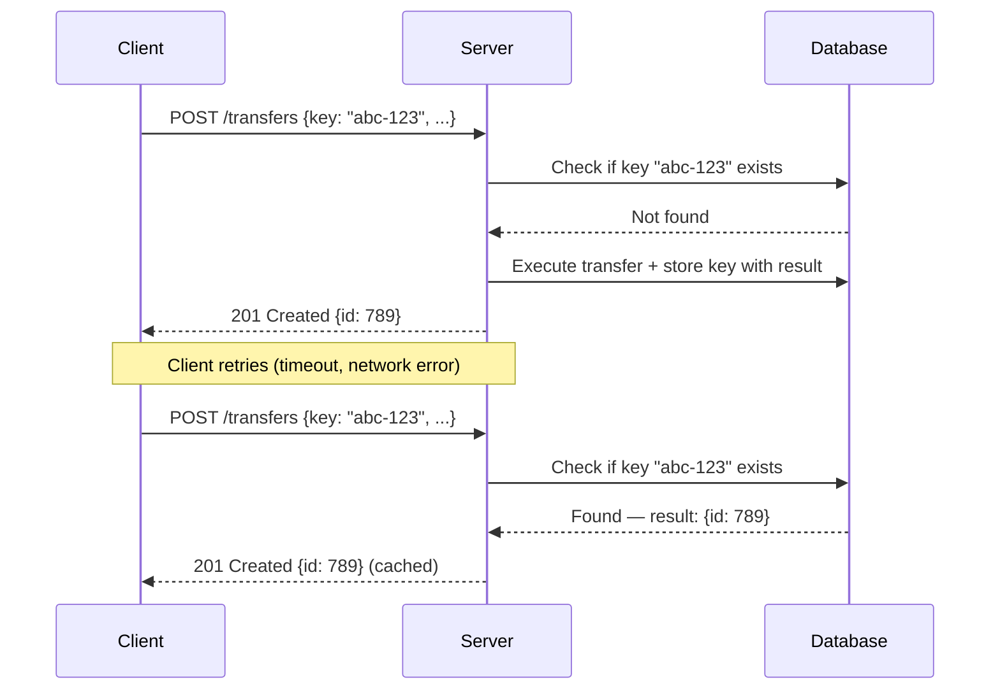

# Idempotency

## Context & Problem

In distributed systems, operations get executed more than once. A client retries after a timeout (not knowing the first request succeeded). A message consumer reprocesses after a rebalance. A network partition causes a duplicate delivery.

For read operations, this is harmless. For writes — especially financial operations like transfers, trades, or payments — duplicate execution causes real harm: double charges, duplicate orders, incorrect balances.

Idempotency means an operation produces the same result whether executed once or multiple times. Some operations are naturally idempotent (PUT, DELETE). Others require explicit design to make them safe to retry.

## Design Decisions

### Natural vs. Explicit Idempotency

| Operation Type | Naturally Idempotent? | Example |
|---|---|---|
| PUT (full replace) | Yes | `PUT /accounts/123 {balance: 500}` — always sets to 500 |
| DELETE | Yes | `DELETE /orders/456` — deleting twice is the same as once |
| GET | Yes | Reads don't change state |
| POST (create) | No | `POST /orders` — two calls create two orders |
| PATCH (increment) | No | `PATCH /accounts/123 {credit: 100}` — two calls credit 200 |

For naturally non-idempotent operations, there are two main patterns: idempotency keys and deduplication tables.

### Pattern 1: Idempotency Keys in APIs

The client generates a unique key (UUID) and sends it with the request. The server stores the key alongside the result. If the same key arrives again, the server returns the stored result without re-executing.



#### Implementation: FastAPI Middleware

```python
# idempotency.py
# fastapi >= 0.115, sqlalchemy >= 2.0, pydantic >= 2.0
import hashlib
import json
from datetime import datetime, timedelta, timezone

from fastapi import Request, Response, HTTPException
from starlette.middleware.base import BaseHTTPMiddleware
from sqlalchemy import select
from sqlalchemy.ext.asyncio import AsyncSession
from sqlalchemy.orm import Mapped, mapped_column, DeclarativeBase


class Base(DeclarativeBase):
    pass


class IdempotencyRecord(Base):
    __tablename__ = "idempotency_keys"

    key: Mapped[str] = mapped_column(primary_key=True)
    request_hash: Mapped[str] = mapped_column(index=False)
    status_code: Mapped[int]
    response_body: Mapped[str]
    created_at: Mapped[datetime] = mapped_column(default=lambda: datetime.now(timezone.utc))
    expires_at: Mapped[datetime]


IDEMPOTENCY_HEADER = "Idempotency-Key"
IDEMPOTENCY_TTL = timedelta(hours=24)


class IdempotencyMiddleware(BaseHTTPMiddleware):
    """Middleware that enforces idempotency for POST/PATCH requests."""

    def __init__(self, app, session_factory) -> None:
        super().__init__(app)
        self.session_factory = session_factory

    async def dispatch(self, request: Request, call_next) -> Response:
        # Only apply to non-idempotent methods
        if request.method not in {"POST", "PATCH"}:
            return await call_next(request)

        idempotency_key = request.headers.get(IDEMPOTENCY_HEADER)
        if not idempotency_key:
            return await call_next(request)

        # Hash the request body to detect misuse (same key, different body)
        body = await request.body()
        request_hash = hashlib.sha256(body).hexdigest()

        async with self.session_factory() as session:
            record = await session.get(IdempotencyRecord, idempotency_key)

            if record is not None:
                # Key exists — check for misuse
                if record.request_hash != request_hash:
                    raise HTTPException(
                        status_code=422,
                        detail="Idempotency key reused with different request body",
                    )
                # Return cached response
                return Response(
                    content=record.response_body,
                    status_code=record.status_code,
                    media_type="application/json",
                )

            # Execute the actual request
            response = await call_next(request)

            # Store the result
            response_body = b""
            async for chunk in response.body_iterator:
                if isinstance(chunk, str):
                    response_body += chunk.encode()
                else:
                    response_body += chunk

            new_record = IdempotencyRecord(
                key=idempotency_key,
                request_hash=request_hash,
                status_code=response.status_code,
                response_body=response_body.decode(),
                expires_at=datetime.now(timezone.utc) + IDEMPOTENCY_TTL,
            )
            session.add(new_record)
            await session.commit()

            return Response(
                content=response_body,
                status_code=response.status_code,
                media_type="application/json",
                headers=dict(response.headers),
            )
```

#### Registering the Middleware

```python
# main.py
from fastapi import FastAPI
from sqlalchemy.ext.asyncio import create_async_engine, async_sessionmaker

engine = create_async_engine("postgresql+asyncpg://...")
session_factory = async_sessionmaker(engine, expire_on_commit=False)

app = FastAPI()
app.add_middleware(IdempotencyMiddleware, session_factory=session_factory)
```

### Pattern 2: Deduplication Table in Database

For event-driven systems where there is no HTTP request/response, use a deduplication table. The consumer records each processed event ID. Before processing, it checks if the event has already been handled.

```python
# deduplication.py
from datetime import datetime, timezone

from sqlalchemy import select, text
from sqlalchemy.ext.asyncio import AsyncSession
from sqlalchemy.orm import Mapped, mapped_column


class ProcessedEvent(Base):
    """Deduplication table — one row per successfully processed event."""
    __tablename__ = "processed_events"

    event_id: Mapped[str] = mapped_column(primary_key=True)
    event_type: Mapped[str]
    processed_at: Mapped[datetime] = mapped_column(default=lambda: datetime.now(timezone.utc))


async def process_event_idempotently(
    session: AsyncSession,
    event_id: str,
    event_type: str,
    handler,
    event_data: dict,
) -> bool:
    """Process an event exactly once using a deduplication table.

    Returns True if the event was processed, False if it was a duplicate.
    """
    # Check + insert + handle in one transaction
    existing = await session.get(ProcessedEvent, event_id)
    if existing is not None:
        return False  # already processed

    # Process the event
    await handler(event_data)

    # Record that we processed it
    session.add(ProcessedEvent(
        event_id=event_id,
        event_type=event_type,
    ))
    await session.commit()
    return True
```

The check-and-insert must happen within the same transaction as the business logic. Otherwise, two concurrent consumers could both pass the check and both process the event.

### Pattern 3: Database Constraints as Safety Net

Even with idempotency keys, add database-level constraints as a final safeguard:

```sql
-- Prevent duplicate transfers at the database level
CREATE UNIQUE INDEX idx_transfers_external_ref
    ON transfers (external_reference_id)
    WHERE external_reference_id IS NOT NULL;

-- Prevent duplicate trade executions
CREATE UNIQUE INDEX idx_trades_order_venue
    ON trades (order_id, venue_execution_id);
```

If the application-level idempotency check fails (race condition, bug), the database constraint catches the duplicate. The application handles the `IntegrityError` gracefully:

```python
from sqlalchemy.exc import IntegrityError


async def create_transfer(session: AsyncSession, transfer: TransferRequest) -> Transfer:
    try:
        new_transfer = Transfer(**transfer.model_dump())
        session.add(new_transfer)
        await session.commit()
        return new_transfer
    except IntegrityError:
        await session.rollback()
        # Duplicate — return the existing record
        existing = await session.execute(
            select(Transfer).where(
                Transfer.external_reference_id == transfer.external_reference_id
            )
        )
        return existing.scalar_one()
```

### Idempotency Key Lifecycle

Keys should not live forever. Expired keys can be cleaned up:

```sql
-- Periodic cleanup (run via pg_cron or application scheduler)
DELETE FROM idempotency_keys WHERE expires_at < NOW();
DELETE FROM processed_events WHERE processed_at < NOW() - INTERVAL '7 days';
```

Choose TTL based on how long a client might retry:
- **API idempotency keys:** 24 hours (covers client retries and manual replays)
- **Event deduplication:** 7 days (covers Kafka consumer rebalances and replay)

### Client-Side Responsibilities

The idempotency contract requires cooperation from the client:

1. **Generate a unique key per logical operation** — UUIDv4 is standard
2. **Reuse the same key for retries** of the same operation
3. **Never reuse a key for a different operation** — the server will reject it or return stale data
4. **Include the key in every retry** — not just the first attempt

```python
# client.py
import uuid
from decimal import Decimal

import httpx


async def transfer_funds(
    client: httpx.AsyncClient,
    from_account: str,
    to_account: str,
    amount: Decimal,
) -> dict:
    idempotency_key = str(uuid.uuid4())

    for attempt in range(3):
        try:
            response = await client.post(
                "/transfers",
                json={
                    "from_account": from_account,
                    "to_account": to_account,
                    "amount": str(amount),
                },
                headers={"Idempotency-Key": idempotency_key},
            )
            response.raise_for_status()
            return response.json()
        except httpx.HTTPStatusError as e:
            if e.response.status_code < 500:
                raise  # permanent error, don't retry
            continue  # transient, retry with same key
```

## Failure Modes

| Failure | Cause | Mitigation |
|---|---|---|
| Duplicate execution despite idempotency key | Race condition: two requests with same key arrive before first completes | Use database advisory locks or `SELECT ... FOR UPDATE` on the key |
| Stale cached response | Idempotency record returns outdated result | TTL on idempotency records, clear records on related state changes |
| Key reuse across different operations | Client bug: same UUID used for different transfers | Hash the request body and reject mismatches |
| Deduplication table grows unbounded | No cleanup job | Scheduled cleanup of expired records |
| Lost idempotency record | Database failure between processing and recording | Database constraints as safety net, transactional writes |
| Clock skew in TTL | Server clocks disagree on expiry | Use database server time (`NOW()`), not application time |

## Related Documents

- [Retry Strategies](retry-strategies.md) — retries are only safe when operations are idempotent
- [Exactly-Once Semantics](../messaging/exactly-once-semantics.md) — idempotency in event processing
- [Dead Letter Queues](../messaging/dead-letter-queues.md) — replayed messages must be idempotent
- [Event-Driven Architecture](../../principles/event-driven-architecture.md) — idempotent consumers
- [External API Adapters](../api/external-api-adapters.md) — idempotency keys in outbound calls
