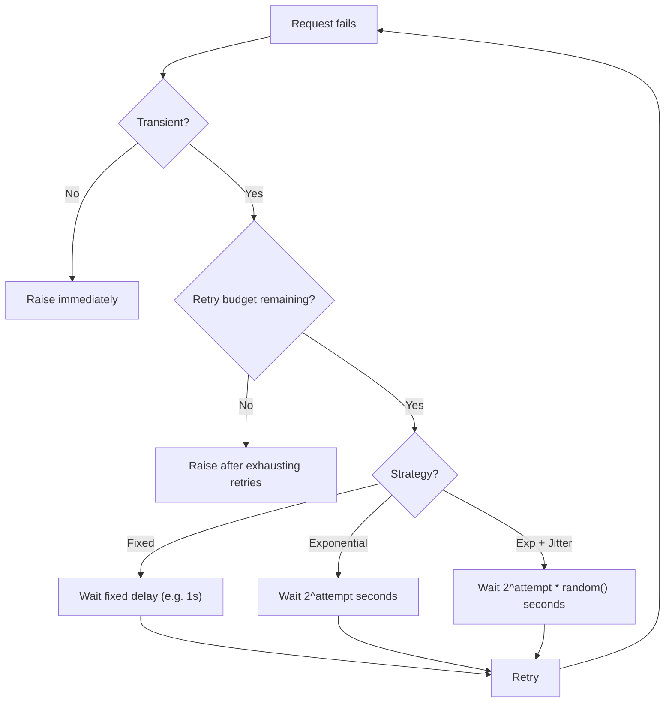

# Retry Strategies

## Context & Problem

Transient failures are inevitable in distributed systems — network blips, brief database failovers, momentary service overload. Many of these resolve within seconds. Failing immediately on the first error wastes the work that led to the call and forces the burden of retrying onto the user or upstream system.

But retrying blindly is dangerous. Retrying a permanent error wastes time. Retrying without backoff creates a thundering herd that makes an overloaded dependency worse. Retrying non-idempotent operations risks duplicate execution.

The goal is to retry when it is likely to help, back off to avoid amplifying failures, and stop when retrying is futile.

## Design Decisions

### Transient vs. Permanent Errors

The first decision is whether to retry at all. Only transient errors should be retried.

| Error Type | Examples | Retry? |
|---|---|---|
| Transient | Connection timeout, HTTP 503, TCP reset, brief deadlock | Yes |
| Permanent | HTTP 400, HTTP 404, validation error, authentication failure | No |
| Ambiguous | HTTP 500, unknown exception | Retry with low limit, then stop |

```python
# errors.py
class TransientError(Exception):
    """Base for retryable errors."""
    pass

class PermanentError(Exception):
    """Base for non-retryable errors. Do not retry."""
    pass

def classify_http_error(status_code: int) -> type[Exception]:
    """Classify HTTP status codes into retryable/non-retryable."""
    if status_code in {429, 502, 503, 504}:
        return TransientError
    if 400 <= status_code < 500:
        return PermanentError
    if status_code >= 500:
        return TransientError  # most 5xx are transient
    return PermanentError
```

### Backoff Strategies



#### Fixed Delay

Wait a constant time between retries. Simple, predictable, but all callers retry at the same time.

```
Attempt 1: wait 1s
Attempt 2: wait 1s
Attempt 3: wait 1s
```

Use when: retrying a local resource (file lock, local cache refresh) where thundering herd is not a concern.

#### Exponential Backoff

Wait exponentially longer between retries. Gives the dependency more time to recover on each attempt.

```
Attempt 1: wait 1s
Attempt 2: wait 2s
Attempt 3: wait 4s
Attempt 4: wait 8s
```

Use when: retrying a remote service where you want to reduce load during recovery.

#### Exponential Backoff with Jitter (Recommended Default)

Add randomness to exponential backoff. Without jitter, all callers that started failing at the same time will retry at the same time — synchronized retries that hammer the recovering service.

```
Attempt 1: wait random(0, 1s)
Attempt 2: wait random(0, 2s)
Attempt 3: wait random(0, 4s)
Attempt 4: wait random(0, 8s)
```

Use when: retrying any shared remote dependency (this should be the default).

### Implementation with tenacity

[tenacity](https://github.com/jd/tenacity) (v9.0+) is the standard retry library for Python. It handles backoff, jitter, retry conditions, and stop conditions with composable building blocks.

```python
# retry.py
# tenacity >= 9.0
from tenacity import (
    retry,
    retry_if_exception_type,
    retry_if_not_exception_type,
    stop_after_attempt,
    stop_after_delay,
    wait_exponential_jitter,
    wait_fixed,
    before_sleep_log,
    after_log,
)
import logging

logger = logging.getLogger(__name__)


# --- Strategy 1: Fixed delay ---
@retry(
    retry=retry_if_exception_type(TransientError),
    stop=stop_after_attempt(3),
    wait=wait_fixed(1),
    reraise=True,
)
async def fetch_with_fixed_delay(client, url: str) -> dict:
    response = await client.get(url)
    if response.status_code >= 500:
        raise TransientError(f"Server error: {response.status_code}")
    response.raise_for_status()
    return response.json()


# --- Strategy 2: Exponential backoff with jitter (recommended) ---
@retry(
    retry=retry_if_exception_type(TransientError),
    stop=stop_after_attempt(4) | stop_after_delay(30),  # whichever comes first
    wait=wait_exponential_jitter(
        initial=1,       # first wait: ~1s
        max=10,           # cap wait at 10s
        jitter=2,         # add up to 2s of random jitter
    ),
    before_sleep=before_sleep_log(logger, logging.WARNING),
    reraise=True,
)
async def fetch_with_backoff(client, url: str) -> dict:
    response = await client.get(url)
    if response.status_code >= 500:
        raise TransientError(f"Server error: {response.status_code}")
    response.raise_for_status()
    return response.json()


# --- Strategy 3: Never retry permanent errors ---
@retry(
    retry=(
        retry_if_exception_type(TransientError)
        & retry_if_not_exception_type(PermanentError)
    ),
    stop=stop_after_attempt(3),
    wait=wait_exponential_jitter(initial=1, max=10),
    reraise=True,
)
async def fetch_safe(client, url: str) -> dict:
    response = await client.get(url)
    exc_type = classify_http_error(response.status_code)
    if exc_type == PermanentError:
        raise PermanentError(f"Permanent error: {response.status_code}")
    if response.status_code >= 500:
        raise TransientError(f"Transient error: {response.status_code}")
    response.raise_for_status()
    return response.json()
```

### Retry Budgets

Individual retry limits (e.g., 3 retries per call) do not account for system-wide load. If 1000 callers each retry 3 times, the dependency receives 4000 requests instead of 1000.

A retry budget limits the total proportion of retries across all callers:

```python
# retry_budget.py
import time
import threading


class RetryBudget:
    """Limits retries to a percentage of total requests within a time window."""

    def __init__(
        self,
        max_retry_ratio: float = 0.1,  # max 10% of requests can be retries
        window_seconds: float = 60.0,
        min_retries_per_second: int = 3,  # always allow at least 3/s
    ) -> None:
        self.max_retry_ratio = max_retry_ratio
        self.window_seconds = window_seconds
        self.min_retries_per_second = min_retries_per_second
        self._requests: list[float] = []
        self._retries: list[float] = []
        self._lock = threading.Lock()

    def _prune(self, timestamps: list[float], now: float) -> list[float]:
        cutoff = now - self.window_seconds
        return [t for t in timestamps if t > cutoff]

    def record_request(self) -> None:
        with self._lock:
            now = time.monotonic()
            self._requests = self._prune(self._requests, now)
            self._requests.append(now)

    def can_retry(self) -> bool:
        with self._lock:
            now = time.monotonic()
            self._requests = self._prune(self._requests, now)
            self._retries = self._prune(self._retries, now)

            # Always allow minimum retries
            min_allowed = self.min_retries_per_second * self.window_seconds
            if len(self._retries) < min_allowed:
                return True

            # Check ratio
            total = len(self._requests)
            if total == 0:
                return True
            return len(self._retries) / total < self.max_retry_ratio

    def record_retry(self) -> None:
        with self._lock:
            self._retries.append(time.monotonic())
```

### Retry + Circuit Breaker Interaction

Retries happen inside the circuit breaker. The circuit breaker wraps the retry logic, not the other way around:


If the circuit is open, retries never execute — the caller gets `CircuitOpenError` immediately. If the circuit is closed, the retry logic attempts up to N times before giving up. Each failure within the retry loop is counted by the circuit breaker.

```python
# Combined usage
from circuit_breaker import CircuitBreaker

bloomberg_circuit = CircuitBreaker(name="bloomberg", failure_threshold=5)

@bloomberg_circuit
@retry(
    retry=retry_if_exception_type(TransientError),
    stop=stop_after_attempt(3),
    wait=wait_exponential_jitter(initial=1, max=10),
    reraise=True,
)
async def get_quote(client, instrument_id: str) -> dict:
    response = await client.get(f"/quote/{instrument_id}")
    response.raise_for_status()
    return response.json()
```

### When Not to Retry

- **Non-idempotent operations** without idempotency keys — retrying a POST that creates a resource may create duplicates
- **User-facing latency-sensitive paths** — 3 retries with backoff adds seconds of latency
- **Permanent errors** — retrying HTTP 400 will never succeed
- **Circuit is open** — the dependency is known to be down

## Failure Modes

| Failure | Cause | Mitigation |
|---|---|---|
| Retry storm | Many callers retry simultaneously, amplifying load | Jitter, retry budgets, circuit breakers |
| Retrying permanent errors | Wrong error classification | Explicitly classify errors, fail fast on 4xx |
| Excessive latency from retries | High retry count with long backoff | Cap total retry time with `stop_after_delay`, use short `max` wait |
| Duplicate side effects | Retrying non-idempotent operations | Idempotency keys, only retry read operations or idempotent writes |
| Cascading retries | Service A retries calling B, which retries calling C | Retry only at one layer, propagate errors at other layers |

## Related Documents

- [Circuit Breakers](circuit-breakers.md) — fail fast when retries are futile
- [Idempotency](idempotency.md) — making operations safe to retry
- [Dead Letter Queues](../messaging/dead-letter-queues.md) — handling messages that exhaust retries
- [External API Adapters](../api/external-api-adapters.md) — retry configuration in adapters
- [Exactly-Once Semantics](../messaging/exactly-once-semantics.md) — retries in event processing
