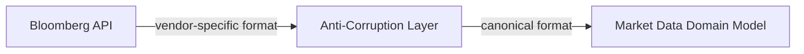
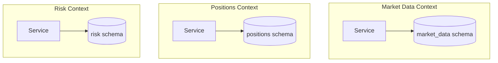

# Bounded Contexts

## Context & Problem

The hardest problem in software architecture is not choosing technologies — it is drawing boundaries. A boundary drawn in the wrong place creates coupling that resists every future change. A boundary drawn correctly makes the system feel obvious.

Bounded contexts come from Domain-Driven Design. The core idea: different parts of a system have different models of the same real-world concept, and that is fine. An "Order" in the trading module is not the same as an "Order" in the compliance module. Forcing them into a single shared model creates a god object that couples everything.

Each bounded context:

- Owns its own domain model (entities, value objects, aggregates)
- Owns its own data (no shared tables between contexts)
- Has an explicit public interface that other contexts use
- Translates between its internal model and external representations at the boundary

## Design Decisions

### How to Identify Bounded Contexts

Boundaries should align with **business capabilities**, not technical layers. A common mistake is splitting by technology (API layer, data layer, processing layer). This creates boundaries that every feature must cross.

**Good boundaries** (by capability):

```
market-data/     — acquiring, normalizing, storing market data
positions/       — tracking what we hold and what it's worth
risk/            — measuring portfolio risk
compliance/      — enforcing rules on what we can and cannot do
```

**Bad boundaries** (by layer):

```
api/             — all API routes for everything
services/        — all business logic for everything
repositories/    — all data access for everything
models/          — all domain models for everything
```

The litmus test: can a team work on this module for a week without coordinating with another module's team? If yes, the boundary is probably right.

### Heuristics for Finding Boundaries

1. **Language boundaries** — when domain experts use different words or the same word with different meanings, that is a boundary. A "position" in trading (current holdings) is different from a "position" in HR (job role).

2. **Rate of change** — things that change together belong together. Market data ingestion changes when vendors change their APIs. Position calculation changes when accounting rules change. These are different rates of change — different modules.

3. **Data ownership** — if two capabilities need to write to the same data, either they are the same context or the boundary is wrong. Readers can be many; writers should be one.

4. **Organizational alignment** — Conway's Law is real. If a separate team will own this capability, it should be a separate context.

5. **Consistency requirements** — operations that must be atomically consistent belong in the same context. Operations that can tolerate eventual consistency can span contexts via events.

## Architecture

### Context Mapping

Bounded contexts do not exist in isolation. They interact through well-defined relationships:

```mermaid
graph TD
    MD[Market Data] -->|"publishes prices"| POS[Positions]
    MD -->|"publishes prices"| RISK[Risk]
    POS -->|"publishes position changes"| RISK
    POS -->|"publishes position changes"| COMP[Compliance]
    COMP -->|"blocks/allows"| OMS[Order Management]
    OMS -->|"publishes fills"| POS
    
    style MD fill:#1a3a5c,stroke:#333
    style POS fill:#1a3a5c,stroke:#333
    style RISK fill:#1a3a5c,stroke:#333
    style COMP fill:#1a3a5c,stroke:#333
    style OMS fill:#1a3a5c,stroke:#333
```



### Relationship Patterns Between Contexts

| Pattern | Description | When to Use |
|---|---|---|
| **Published Language** | Shared schema (events, API contracts) defined by the upstream context | Default for most inter-context communication |
| **Anti-Corruption Layer** | Downstream context translates upstream data into its own model | When integrating with external systems or legacy modules |
| **Shared Kernel** | Small, jointly-owned set of types used by multiple contexts | Only for truly universal concepts (Money, Timestamp, EntityId) |
| **Customer-Supplier** | Downstream context has influence over upstream's API | When one team's output is another team's input and they coordinate |
| **Conformist** | Downstream context adopts upstream's model as-is | When fighting the upstream model is more expensive than conforming |

### Anti-Corruption Layer Example

When integrating with an external market data vendor, the market data context does not let vendor-specific types leak into its domain model:



The ACL translates vendor-specific representations (Bloomberg's `LAST_PRICE` field, Reuters' `MID` field) into the market data context's canonical `Price` value object. If you switch vendors, only the ACL changes.

### Each Context Owns Its Data



Contexts do not share database tables. They may share a database server (PostgreSQL schemas provide isolation within a single instance), but each context has exclusive write access to its own schema. Cross-context data access happens through published interfaces or events, never through shared tables.

## Dealing With Ambiguity

Boundaries are not always obvious at the start. The approach:

1. **Start coarse** — begin with fewer, larger contexts. It is easier to split a context later than to merge two contexts that have diverged.
2. **Watch for pain** — when a change in one module frequently forces changes in another, the boundary may be wrong.
3. **Refactor boundaries early** — in a modular monolith, moving code between modules is a refactor, not a rewrite. Do it before the wrong boundary calcifies.
4. **Accept that boundaries evolve** — a system's bounded contexts at month 6 will not be identical to month 18. The architecture should make boundary changes cheap.

## Failure Modes

| Failure | Cause | Mitigation |
|---|---|---|
| Shared database tables | Two contexts write to the same table | One writer per table, others consume via events |
| Leaky abstractions | Internal model details exposed through the public interface | Review interfaces — they should expose behavior, not structure |
| Anemic contexts | Context has models but no behavior — just a data pass-through | A context should own decisions about its domain, not just data |
| Over-splitting | Too many tiny contexts with excessive inter-context communication | Start coarse, split when pain is concrete |
| God context | One context grows to own everything | Periodic boundary review, watch for divergent rates of change |

## Related Documents

- [Modular Monolith](modular-monolith.md) — the architecture that hosts bounded contexts
- [Event-Driven Architecture](event-driven-architecture.md) — how contexts communicate asynchronously
- [Module Interfaces](../patterns/modularity/module-interfaces.md) — implementing context boundaries in Python
