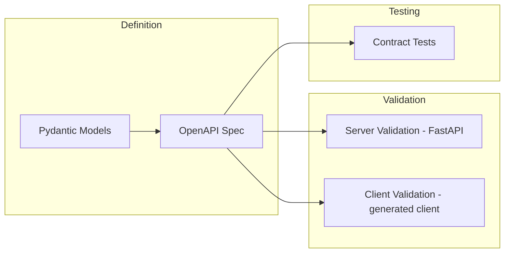

# Contract-First Design

## Context & Problem

When systems grow, integration points become the primary source of friction. Module A's developer changes a response field from `total` to `totalAmount`. Module B's developer does not know. The system breaks at runtime, not at build time.

Contract-first design inverts the development flow: define the interface before writing the implementation. The contract — whether it is an API schema, an event schema, or a Python Protocol — is the artifact that both sides agree on. Implementation follows.

This applies at every integration boundary:

- HTTP APIs between services or between frontend and backend
- Event schemas on Kafka topics
- Module interfaces within a modular monolith
- External API integrations (the vendor's contract, adapted through an anti-corruption layer)

## Design Decisions

### Contracts at Every Boundary

| Boundary | Contract Format | Enforcement |
|---|---|---|
| HTTP API | OpenAPI 3.1 spec | Code generation, request/response validation |
| Kafka events | Avro / Protobuf schema in Schema Registry | Producer serialization fails if schema is incompatible |
| Module interface | Python Protocol + Pydantic models | Type checker (mypy/pyright), Tach |
| External API | Adapter wrapping vendor SDK | Anti-corruption layer translates to internal contract |
| Database schema | Alembic migrations | Migration CI, no raw DDL |

### Schema-First vs. Code-First

**Schema-first**: write the OpenAPI spec (or Avro schema) in YAML/JSON, then generate server stubs and client code.

**Code-first**: write the Python code (FastAPI routes, Pydantic models), then generate the schema.

Both are valid. The important thing is that the **schema is versioned, reviewed, and treated as a first-class artifact** — not a side effect of implementation.

For this repository's patterns:

- **HTTP APIs** — code-first with FastAPI (Pydantic models produce OpenAPI automatically), but the generated spec is committed and reviewed
- **Kafka events** — schema-first with Avro or Protobuf in Schema Registry (the schema must exist before a producer can publish)
- **Module interfaces** — code-first with Python Protocols (the Protocol is the contract)

### Compatibility Rules

Changing a contract is like changing an API — consumers depend on it. The rules:

**Backward compatible (safe):**
- Adding an optional field with a default
- Adding a new endpoint
- Adding a new event type
- Widening a type (int → float)

**Breaking (requires coordination):**
- Removing a field
- Renaming a field
- Changing a field's type (string → int)
- Changing the meaning of a value
- Removing an endpoint

**Strategy for breaking changes:**
1. Add the new version alongside the old (v1 + v2)
2. Migrate consumers to v2
3. Deprecate v1 with a timeline
4. Remove v1 after all consumers have migrated

## Architecture

### API Contract Flow



### Module Interface Contract

Within the modular monolith, Python Protocols define the contract between modules:

```python
# modules/market_data/interface.py
from datetime import datetime
from decimal import Decimal
from typing import Protocol

from pydantic import BaseModel

from shared.types import InstrumentId


class PriceSnapshot(BaseModel):
    instrument_id: InstrumentId
    bid: Decimal
    ask: Decimal
    mid: Decimal
    timestamp: datetime


class MarketDataReader(Protocol):
    """Contract for reading market data. Other modules depend on this, not the implementation."""

    async def get_latest_price(self, instrument_id: InstrumentId) -> PriceSnapshot: ...

    async def get_price_at(self, instrument_id: InstrumentId, timestamp: datetime) -> PriceSnapshot: ...

    async def get_price_history(
        self,
        instrument_id: InstrumentId,
        start: datetime,
        end: datetime,
    ) -> list[PriceSnapshot]: ...
```

The consuming module imports and depends on `MarketDataReader` — never on the implementation class. This is checked by Tach and the type checker.

### Event Schema Contract

```python
# Event schema registered in Schema Registry
# Avro schema example for trade events

TRADE_EXECUTED_SCHEMA = {
    "type": "record",
    "name": "TradeExecuted",
    "namespace": "com.platform.trades",
    "fields": [
        {"name": "event_id", "type": "string"},
        {"name": "event_version", "type": "int", "default": 1},
        {"name": "timestamp", "type": {"type": "long", "logicalType": "timestamp-millis"}},
        {"name": "trade_id", "type": "string"},
        {"name": "portfolio_id", "type": "string"},
        {"name": "instrument_id", "type": "string"},
        {"name": "side", "type": {"type": "enum", "name": "Side", "symbols": ["BUY", "SELL"]}},
        {"name": "quantity", "type": {"type": "bytes", "logicalType": "decimal", "precision": 18, "scale": 8}},
        {"name": "price", "type": {"type": "bytes", "logicalType": "decimal", "precision": 18, "scale": 8}},
        {"name": "currency", "type": "string"},
    ],
}
```

Schema Registry enforces that any change to this schema is backward-compatible. A producer attempting to register an incompatible schema change will be rejected.

## Validation at Boundaries

Validate data when it crosses a boundary. Trust data within a boundary.

```python
# At the API boundary — validate everything
@router.post("/trades", response_model=TradeResponse)
async def create_trade(request: TradeRequest) -> TradeResponse:
    # FastAPI + Pydantic validate the request automatically
    # Inside the service, data is trusted
    return await trade_service.execute(request)


# Inside the module — no redundant validation
class TradeService:
    async def execute(self, request: TradeRequest) -> TradeResponse:
        # request is already validated — no need to re-check types or ranges
        # focus on business rules only
        ...
```

This avoids defensive programming that litters the codebase with redundant checks while still catching invalid data where it enters the system.

## Failure Modes

| Failure | Cause | Mitigation |
|---|---|---|
| Schema drift | Implementation diverges from spec | CI generates spec from code and diffs against committed spec |
| Silent breaking change | Field renamed without updating consumers | Schema Registry compatibility checks, contract tests |
| Over-validation | Redundant validation deep in call stack | Validate at boundary only, trust internally |
| Under-specification | Contract is too vague (e.g., `data: dict`) | Review contracts as carefully as code — reject `Any` and `dict` in interfaces |
| Version proliferation | Too many active API versions | Deprecation policy with hard deadlines, max 2 active versions |

## Related Documents

- [OpenAPI Contracts](../patterns/api/openapi-contracts.md) — HTTP API contracts with FastAPI
- [Schema Registry](../patterns/messaging/schema-registry.md) — Kafka event contracts
- [Module Interfaces](../patterns/modularity/module-interfaces.md) — Protocol-based contracts
- [External API Adapters](../patterns/api/external-api-adapters.md) — wrapping third-party contracts
- [API Versioning](../patterns/api/api-versioning.md) — managing breaking changes
