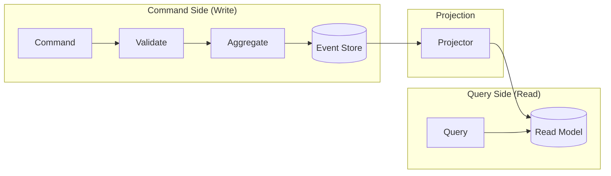

# CQRS & Event Sourcing

## Context & Problem

Traditional systems store current state. When you update a position from 1,000 shares to 1,500 shares, the old value is gone. You know *what* the state is, but not *how it got there*.

In financial systems, this is unacceptable. Regulators want to know every state change. Risk teams need to replay the day's events to understand what happened. Debugging requires reconstructing the exact sequence of operations that led to a bug.

CQRS (Command Query Responsibility Segregation) and Event Sourcing are two distinct patterns that work well together:

- **CQRS** — separate the models used for writing (commands) from the models used for reading (queries). Writes go through domain logic and validation. Reads are optimized projections.
- **Event Sourcing** — instead of storing current state, store the sequence of events that produced it. Current state is derived by replaying events.

These patterns are not always used together, and neither is appropriate everywhere. Apply them to modules where auditability, temporal queries, or complex domain logic justify the added complexity.

## Design Decisions

### When to Use Event Sourcing

**Use it when:**

- Audit trail is a hard requirement (regulatory, financial)
- You need temporal queries ("what was the portfolio's state at 2pm?")
- The domain is naturally event-driven (trades, orders, state machines)
- You need to support "what-if" analysis by replaying events with different parameters
- Multiple read models need to be derived from the same write stream

**Do not use it when:**

- Simple CRUD with no audit requirements
- The domain does not have meaningful events (config tables, user preferences)
- The team is not prepared for the operational complexity (snapshots, schema evolution, replay)

### When to Use CQRS Without Event Sourcing

CQRS alone (separate read/write models backed by the same database) is useful when:

- Read and write patterns are significantly different (e.g., writes are normalized, reads need denormalized aggregations)
- Read-heavy workloads that benefit from optimized query models
- You want to scale reads and writes independently

You can use CQRS with a traditional database — the write model updates rows, and the read model is a materialized view or a separate denormalized table updated by triggers or change events.

## Architecture

### CQRS Flow



The command side enforces all business rules. The query side is a denormalized projection optimized for reads. They can use different databases, different schemas, and different scaling strategies.

### Event Sourcing: Position as Sum of Events

Instead of storing `position = 1500 shares`, store the events that produced it:

```
Event 1: TradeExecuted { instrument: AAPL, side: buy,  quantity: 1000, price: 150.00 }
Event 2: TradeExecuted { instrument: AAPL, side: buy,  quantity: 500,  price: 152.00 }
Event 3: TradeExecuted { instrument: AAPL, side: sell, quantity: 200,  price: 155.00 }
```

Current position = replay all events = 1000 + 500 - 200 = **1,300 shares**.

Position at any point in time = replay events up to that timestamp.

### Event Store Design

```python
from datetime import datetime
from decimal import Decimal
from uuid import UUID

from sqlalchemy import Index
from sqlalchemy.orm import Mapped, mapped_column, DeclarativeBase
from sqlalchemy.dialects.postgresql import JSONB


class Base(DeclarativeBase):
    pass


class EventRecord(Base):
    """Immutable append-only event store."""
    __tablename__ = "events"

    id: Mapped[UUID] = mapped_column(primary_key=True)
    aggregate_type: Mapped[str]       # e.g., "Position", "Order"
    aggregate_id: Mapped[str]         # e.g., "portfolio-A:AAPL"
    event_type: Mapped[str]           # e.g., "trade.executed"
    event_version: Mapped[int]        # schema version
    sequence_number: Mapped[int]      # ordering within aggregate
    timestamp: Mapped[datetime]
    data: Mapped[dict] = mapped_column(JSONB)
    metadata: Mapped[dict] = mapped_column(JSONB, default=dict)

    __table_args__ = (
        # Uniqueness constraint prevents duplicate events
        Index(
            "uq_aggregate_sequence",
            "aggregate_type", "aggregate_id", "sequence_number",
            unique=True,
        ),
        # Fast lookup by aggregate
        Index("ix_aggregate", "aggregate_type", "aggregate_id"),
    )
```

Key properties of the event store:

- **Append-only** — events are never updated or deleted
- **Ordered per aggregate** — `sequence_number` ensures correct replay order
- **Uniqueness constraint** — prevents duplicate events (optimistic concurrency)
- **JSONB data** — flexible event payloads with indexable fields

### Aggregate Reconstruction

```python
from typing import Protocol


class DomainEvent(Protocol):
    event_id: str
    timestamp: datetime


class Position:
    """Aggregate rebuilt from events."""

    def __init__(self, portfolio_id: str, instrument_id: str) -> None:
        self.portfolio_id = portfolio_id
        self.instrument_id = instrument_id
        self.quantity = Decimal(0)
        self.cost_basis = Decimal(0)
        self.version = 0

    def apply(self, event: dict) -> None:
        match event["event_type"]:
            case "trade.executed":
                side_multiplier = Decimal(1) if event["data"]["side"] == "buy" else Decimal(-1)
                qty = Decimal(str(event["data"]["quantity"]))
                price = Decimal(str(event["data"]["price"]))
                self.quantity += side_multiplier * qty
                self.cost_basis += side_multiplier * qty * price
            case "corporate_action.split":
                ratio = Decimal(str(event["data"]["ratio"]))
                self.quantity *= ratio
                self.cost_basis = self.cost_basis  # cost basis unchanged
        self.version += 1

    @classmethod
    def from_events(cls, portfolio_id: str, instrument_id: str, events: list[dict]) -> "Position":
        position = cls(portfolio_id, instrument_id)
        for event in events:
            position.apply(event)
        return position
```

### Projections (Read Models)

Projections consume events and build denormalized read models:

```python
class PortfolioDashboardProjection:
    """Builds a read-optimized view for the PM cockpit."""

    async def handle(self, event: dict) -> None:
        match event["event_type"]:
            case "trade.executed":
                await self._update_position_row(event)
                await self._update_daily_pnl(event)
                await self._update_exposure(event)
            case "price.updated":
                await self._mark_to_market(event)

    async def _update_position_row(self, event: dict) -> None:
        """Upsert into positions_read_model table — denormalized for fast queries."""
        ...
```

Multiple projections can consume the same event stream to build different read models:

- **PM Dashboard** — current positions, P&L, exposures (optimized for real-time display)
- **Risk View** — positions with factor exposures (optimized for risk calculations)
- **Compliance View** — positions with rule evaluations (optimized for compliance checks)
- **Audit Trail** — raw event log (optimized for temporal queries)

### Snapshots

Replaying thousands of events for every query is expensive. Snapshots periodically capture the aggregate state so replay starts from the snapshot instead of the beginning:

```
Events:  [1] [2] [3] [4] [5] [SNAPSHOT @ 5] [6] [7] [8]
                                                        ↑
Rebuild from snapshot:  load snapshot(5) → apply [6] [7] [8]
```

Snapshot frequency is a tuning parameter. Too frequent = storage overhead. Too infrequent = slow rebuilds. Start with snapshotting every 100-1000 events per aggregate and adjust based on observed replay times.

## Consistency Boundaries

### Within an Aggregate — Strong Consistency

All events for a single aggregate are stored atomically. The `sequence_number` uniqueness constraint provides optimistic concurrency: if two concurrent commands try to append event #5 to the same aggregate, one will fail and must retry.

### Across Aggregates — Eventual Consistency

Different aggregates (e.g., positions in different portfolios, or positions vs. risk calculations) are eventually consistent. A trade execution event is committed to the positions aggregate's event stream, and the risk module processes it asynchronously.

This is the correct model for most financial systems: within a single position, consistency is mandatory. Across the portfolio's risk view, a few milliseconds of staleness is acceptable.

## Failure Modes

| Failure | Cause | Mitigation |
|---|---|---|
| Projection lag | Consumer falls behind event stream | Monitor lag, alert if read model is stale |
| Projection corruption | Bug in projection logic | Rebuild projection from event stream (the source of truth) |
| Event schema change | New event version breaks projection | Versioned events, upcasters that transform old events to new schema |
| Snapshot staleness | Snapshot taken with buggy logic | Rebuild from events (snapshots are an optimization, not source of truth) |
| Concurrency conflict | Two commands target same aggregate simultaneously | Optimistic concurrency via sequence_number, retry with backoff |
| Event store growth | Unbounded append-only storage | Archival strategy, partition by time, compress old events |

## Related Documents

- [Event-Driven Architecture](event-driven-architecture.md) — the broader event-driven pattern
- [Modular Monolith](modular-monolith.md) — where CQRS modules live
- [SQLAlchemy Repository](../patterns/data-access/sqlalchemy-repository.md) — implementing the event store
- [Kafka Topology](../patterns/messaging/kafka-topology.md) — event distribution beyond the monolith
