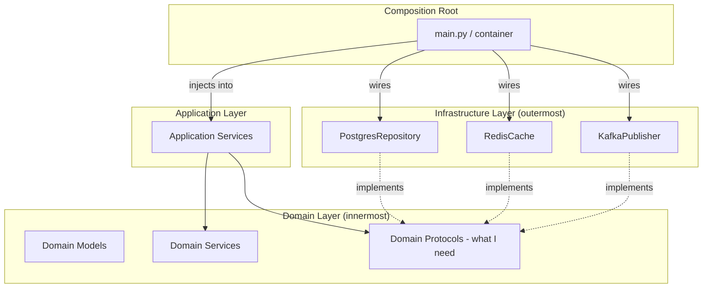

# Dependency Inversion

## Context & Problem

In a naive codebase, high-level business logic depends directly on low-level infrastructure: the trade service imports the PostgreSQL session factory, the risk engine imports the Redis client, the compliance module imports the email sender.

This creates two problems:

1. **Testing is painful** — to test business logic, you must set up databases, caches, and external services (or mock them extensively)
2. **Change is expensive** — switching from PostgreSQL to another store, or from Redis to Memcached, requires changing business logic code

Dependency inversion flips this: high-level modules define the interfaces they need (as abstractions), and low-level modules implement those interfaces. The business logic never knows which concrete implementation it is using.

This is not about dependency injection frameworks. It is about the direction of source code dependencies. Business logic defines what it needs. Infrastructure satisfies those needs.

## Design Decisions

### The Dependency Rule

```
Business Logic → defines → Interface (Protocol)
Infrastructure → implements → Interface (Protocol)
Composition Root → wires → Implementation into Business Logic
```

Source code dependencies point **inward** — from infrastructure toward domain. The domain never imports infrastructure.

### Python Protocols Over Abstract Base Classes

Python Protocols (structural subtyping) are preferred over ABCs (nominal subtyping) because:

- No inheritance required — any class with the right methods satisfies the Protocol
- Better for third-party integration — you can write a Protocol that an existing library class already satisfies
- Checked by mypy/pyright at type-check time
- More Pythonic — duck typing with static verification

```python
from typing import Protocol
from datetime import datetime
from decimal import Decimal

from sqlalchemy import select
from sqlalchemy.ext.asyncio import async_sessionmaker


# The domain defines what it needs
class PriceRepository(Protocol):
    async def get_latest(self, instrument_id: str) -> Decimal: ...
    async def get_at(self, instrument_id: str, timestamp: datetime) -> Decimal: ...


# The infrastructure satisfies the need
class PostgresPriceRepository:
    """Implements PriceRepository without inheriting from it."""

    def __init__(self, session_factory: async_sessionmaker) -> None:
        self._session_factory = session_factory

    async def get_latest(self, instrument_id: str) -> Decimal:
        async with self._session_factory() as session:
            result = await session.execute(
                select(PriceRecord.mid)
                .where(PriceRecord.instrument_id == instrument_id)
                .order_by(PriceRecord.timestamp.desc())
                .limit(1)
            )
            return result.scalar_one()

    async def get_at(self, instrument_id: str, timestamp: datetime) -> Decimal:
        ...
```

`PostgresPriceRepository` satisfies `PriceRepository` without inheriting from it, without registering with it, and without the domain knowing PostgreSQL exists.

## Architecture

### Layer Structure



Dependencies in source code always point **inward**: Infrastructure → Domain. At runtime, the composition root wires concrete implementations into the application.

### The Composition Root

The composition root is the single place where concrete implementations are chosen and wired together. In a FastAPI application, this is typically `main.py` or a dedicated `container.py`:

```python
# container.py — the composition root

from sqlalchemy.ext.asyncio import create_async_engine, async_sessionmaker

from modules.market_data.service import MarketDataService
from modules.market_data.repository import PostgresPriceRepository
from modules.positions.service import PositionService
from modules.positions.repository import PostgresPositionRepository
from modules.risk.service import RiskService
from infrastructure.cache import RedisCache
from infrastructure.events import KafkaEventPublisher


def create_container(settings: Settings) -> Container:
    engine = create_async_engine(settings.database_url)
    session_factory = async_sessionmaker(engine)

    # Wire concrete implementations
    price_repo = PostgresPriceRepository(session_factory)
    position_repo = PostgresPositionRepository(session_factory)
    cache = RedisCache(settings.redis_url)
    events = KafkaEventPublisher(settings.kafka_bootstrap_servers)

    # Inject into services
    market_data_service = MarketDataService(price_repo=price_repo)
    position_service = PositionService(
        position_repo=position_repo,
        price_reader=market_data_service,
        event_publisher=events,
    )
    risk_service = RiskService(
        position_reader=position_service,
        price_reader=market_data_service,
        cache=cache,
    )

    return Container(
        market_data=market_data_service,
        positions=position_service,
        risk=risk_service,
    )
```

No dependency injection framework needed. Constructor injection with plain Python is explicit, debuggable, and has zero magic.

### Testing Benefit

Because the domain depends on Protocols, not implementations, testing is straightforward:

```python
from datetime import datetime
from decimal import Decimal


class FakePriceRepository:
    """In-memory implementation for testing."""

    def __init__(self) -> None:
        self._prices: dict[str, Decimal] = {}

    async def get_latest(self, instrument_id: str) -> Decimal:
        return self._prices[instrument_id]

    async def get_at(self, instrument_id: str, timestamp: datetime) -> Decimal:
        return self._prices[instrument_id]  # simplified for tests


async def test_position_valuation():
    prices = FakePriceRepository()
    prices._prices["AAPL"] = Decimal("150.00")

    service = PositionService(
        position_repo=FakePositionRepository(),
        price_reader=MarketDataService(price_repo=prices),
        event_publisher=FakeEventPublisher(),
    )

    # Test business logic without any infrastructure
    valuation = await service.get_valuation("portfolio-1", "AAPL")
    assert valuation == Decimal("150000.00")
```

No mocking libraries, no patching, no database setup. The fake satisfies the Protocol and the test runs in microseconds.

## When Not to Invert

Not every dependency needs inversion. The rule of thumb:

**Invert** when the dependency is:
- Infrastructure (databases, caches, message brokers, HTTP clients)
- External services (third-party APIs, email providers)
- Anything that makes tests slow or flaky

**Do not invert** when the dependency is:
- A standard library module (`datetime`, `decimal`, `json`)
- A domain model within the same bounded context
- A pure utility with no side effects
- Something that will never have an alternative implementation

Over-abstracting creates indirection without benefit. If there is only one implementation and there will only ever be one, a direct import is fine.

## Failure Modes

| Failure | Cause | Mitigation |
|---|---|---|
| Over-abstraction | Protocol for everything, even trivial utilities | Only abstract infrastructure and external dependencies |
| Leaky abstraction | Protocol exposes infrastructure details (e.g., `session` parameter) | Protocol should use domain language, not infrastructure language |
| God composition root | Single file wires 200 services | Group wiring by module, each module can have a `wire()` function |
| Runtime type error | Implementation does not actually satisfy Protocol | Run mypy/pyright in CI, use `runtime_checkable` Protocol for critical paths |
| Hidden dependencies | Service creates its own DB connection instead of receiving it | Code review, enforce constructor injection as convention |

## Related Documents

- [Module Interfaces](../patterns/modularity/module-interfaces.md) — Protocol-based contracts between modules
- [Modular Monolith](modular-monolith.md) — the architecture where dependency inversion is enforced
- [Contract-First Design](contract-first-design.md) — contracts as the primary artifact
