# Error Handling Strategy

## Context & Problem

Without a consistent error handling philosophy, each module invents its own approach. Some modules use exceptions, some return `None` to signal failure, some swallow errors into log files where nobody looks. The result: a position-keeping error crashes the market data ingestion pipeline because an uncaught `SQLAlchemyError` propagates across module boundaries. A compliance check failure is silently ignored because someone wrapped it in a bare `except: pass`.

In a modular monolith, error handling is especially critical because modules run in the same process. A badly handled error in one module can corrupt shared state, starve the thread pool, or crash the entire application. The boundaries between modules must also be error boundaries.

The question is not "how do we handle errors" — it is "what should each layer of the system do when something goes wrong, and how do errors flow across boundaries without coupling modules to each other's internals?"

## Design Decisions

### Error Classification

Not all errors deserve the same response. The first decision is classifying errors into categories that dictate how they are handled:

| Category | Examples | Correct Response |
|---|---|---|
| **Domain errors** | Insufficient funds, compliance violation, position limit exceeded | Return to caller as a typed error. The caller has business logic to handle this. |
| **Infrastructure errors** | Database timeout, Kafka unavailable, Redis connection refused | Retry with backoff, degrade gracefully, alert operations. |
| **Programming errors** | `NoneType` has no attribute, index out of bounds, type mismatch | Crash immediately. Fix the bug. Do not retry, do not degrade. |

The danger of treating all errors the same: retrying a compliance violation makes no sense, and gracefully degrading past a null pointer dereference masks a bug that will resurface worse later.

### Error Propagation Across Module Boundaries

A module's public interface must never expose implementation details through its errors. If the positions module uses SQLAlchemy internally, callers should never see `sqlalchemy.exc.IntegrityError`. They should see `PositionError`.

```mermaid
graph LR
    A[Order Management] -->|"calls"| B[Positions Module Interface]
    B -->|"PositionError"| A
    B -->|"internally catches"| C[SQLAlchemyError]
    B -->|"internally catches"| D[KafkaError]
    
    style A fill:#1a3a5c,stroke:#333
    style B fill:#1a3a5c,stroke:#333
    style C fill:#5c1a1a,stroke:#333
    style D fill:#5c1a1a,stroke:#333
```



Each module defines its own error hierarchy rooted in a single base exception:

```python
# positions/errors.py
class PositionError(Exception):
    """Base error for the positions module."""

class PositionNotFoundError(PositionError):
    """Raised when a position lookup finds no matching record."""

class InsufficientHoldingsError(PositionError):
    """Raised when a sell order exceeds current holdings."""

class PositionStaleError(PositionError):
    """Raised when a position update conflicts with a concurrent modification."""
```

At the module boundary (the service layer), infrastructure exceptions are caught and translated:

```python
# positions/service.py
async def get_position(self, portfolio_id: str, instrument_id: str) -> Position:
    try:
        return await self.repository.find(portfolio_id, instrument_id)
    except SQLAlchemyError as e:
        raise PositionError(f"Failed to retrieve position: {e}") from e
```

The `from e` preserves the chain for debugging while the public-facing type stays module-scoped.

### Error Handling at System Boundaries

System boundaries — where the application meets the outside world — are where errors get their final translation:

**API layer**: Domain errors become HTTP status codes. Infrastructure errors become 503s.

| Error Type | HTTP Status | Example |
|---|---|---|
| `NotFoundError` | 404 | Position not found |
| `InsufficientHoldingsError` | 422 | Cannot sell more than you hold |
| `ComplianceViolationError` | 403 | Trade exceeds sector concentration limit |
| Infrastructure errors | 503 | Database unavailable |
| Programming errors | 500 | Unexpected — triggers alert |

**Kafka consumers**: Unprocessable events go to a dead-letter queue with the original event, the error message, and a timestamp. The consumer does not block retrying a fundamentally broken event.

**Scheduled jobs**: Failures are logged with structured context, metrics are emitted, and the job run is marked as failed. The next scheduled run proceeds normally — one failed run does not poison the schedule.

### Fail-Fast vs. Fail-Safe

The decision of when to crash versus when to degrade is not a matter of preference — it follows from the error category:

**Fail-fast** (crash, do not retry):
- Programming errors — a `None` where an object was expected means the code is wrong. Retrying will hit the same bug.
- Corrupted state — if an invariant is violated (negative position quantity, mismatched checksums), stop processing before the corruption spreads.
- Configuration errors at startup — missing required environment variables, unreachable database on boot. Crash loudly so deployment fails visibly.

**Fail-safe** (degrade, retry, continue):
- Infrastructure transience — a database timeout is likely temporary. Retry with exponential backoff.
- Optional features — if the market data enrichment service is down, the position can still be calculated with the last known price. Log a warning, use stale data, continue.
- Non-critical side effects — if sending a notification fails, the trade still happened. Queue the notification for retry.

### The Error Kernel Pattern

Borrowed from Erlang's supervision trees: isolate critical processing paths from non-critical ones. A failure in a non-critical path (sending an email notification) must never propagate into a critical path (recording a trade).

```mermaid
graph TD
    subgraph "Critical Path — fail-fast"
        T[Trade Execution] --> P[Position Update]
        P --> R[Risk Recalculation]
    end
    subgraph "Non-Critical Path — fail-safe"
        P -.->|"async, isolated"| N[Notification]
        P -.->|"async, isolated"| A[Audit Log Enrichment]
        P -.->|"async, isolated"| CACHE[Cache Warm]
    end
    
    style T fill:#1a3a5c,stroke:#333
    style P fill:#1a3a5c,stroke:#333
    style R fill:#1a3a5c,stroke:#333
    style N fill:#2d4a2d,stroke:#333
    style A fill:#2d4a2d,stroke:#333
    style CACHE fill:#2d4a2d,stroke:#333
```



The critical path uses synchronous calls with fail-fast semantics. Non-critical side effects are dispatched asynchronously (via events or background tasks) so that their failures are contained.

### Error Context Enrichment

An error message alone is useless in production. Every error must carry structured context that allows an engineer to reconstruct what happened:

- **Correlation ID** — traces the error back to the originating request or event
- **Module and operation** — which module, which function, which step in the operation
- **Entity context** — which portfolio, which instrument, which order triggered the error
- **Timing** — when the error occurred, how long the operation had been running

This context is added at the boundary where the error is caught and logged — not sprinkled throughout the call chain.

### Exceptions vs. Result Types

Python uses exceptions as its primary error mechanism. Some codebases adopt a `Result[T, E]` pattern (via libraries like `returns` or `result`). The tradeoff:

| Approach | Advantage | Disadvantage |
|---|---|---|
| **Exceptions** | Idiomatic Python, works with the entire ecosystem, no wrapper overhead | Invisible in function signatures, easy to forget to catch, control flow is implicit |
| **Result[T, E]** | Errors are visible in the return type, forces callers to handle them, composable | Alien to most Python developers, library dependency, awkward with async/await |

**The pragmatic middle ground for this system**: use exceptions for error propagation, but make them rigorous. Every module defines explicit error types. Module interfaces document which exceptions they raise. Tests assert that the correct exceptions are raised for each failure case. This gives the benefits of visibility without abandoning idiomatic Python.

## Failure Modes

| Failure | Cause | Consequence | Mitigation |
|---|---|---|---|
| **Silent error swallowing** | Bare `except: pass` or `except Exception: log(e)` without re-raising | Errors disappear, system enters inconsistent state | Linting rules that ban bare except, code review enforcement |
| **Exception-driven control flow** | Using exceptions for expected cases (e.g., raising `NotFoundError` instead of returning `None` for a normal "no results" query) | Performance overhead, confusing semantics | Reserve exceptions for exceptional conditions, use `Optional` returns for expected empty results |
| **Error storms** | One infrastructure failure triggers cascading errors across all modules | Log storage fills, alerting becomes useless, operators cannot find the root cause | Circuit breakers, error rate limiting, correlation IDs to group related errors |
| **Leaky abstractions** | `SQLAlchemyError` or `httpx.TimeoutError` escaping a module boundary | Callers become coupled to the module's implementation | Module-scoped exception hierarchies, boundary translation |
| **Over-retrying** | Retrying a domain error (compliance violation) that will never succeed | Wasted resources, delayed failure reporting | Only retry infrastructure errors, fail immediately on domain and programming errors |
| **Missing context** | Error logged as "Something went wrong" with no identifiers | Impossible to debug in production | Structured logging with correlation IDs and entity context |

## Related Documents

- [Circuit Breakers](../patterns/resilience/circuit-breakers.md) — containing infrastructure failures at module boundaries
- [Retry Strategies](../patterns/resilience/retry-strategies.md) — when and how to retry infrastructure errors
- [Graceful Degradation](../patterns/resilience/graceful-degradation.md) — continuing with reduced functionality during partial failures
- [Dead-Letter Queues](../patterns/messaging/dead-letter-queues.md) — handling unprocessable events in Kafka consumers
- [Event-Driven Architecture](event-driven-architecture.md) — asynchronous error isolation between modules
- [Structured Logging](../patterns/observability/structured-logging.md) — the error context enrichment implementation
- [Distributed Tracing](../patterns/observability/distributed-tracing.md) — correlation IDs across module boundaries
- [Module Interfaces](../patterns/modularity/module-interfaces.md) — defining explicit error contracts at module boundaries
