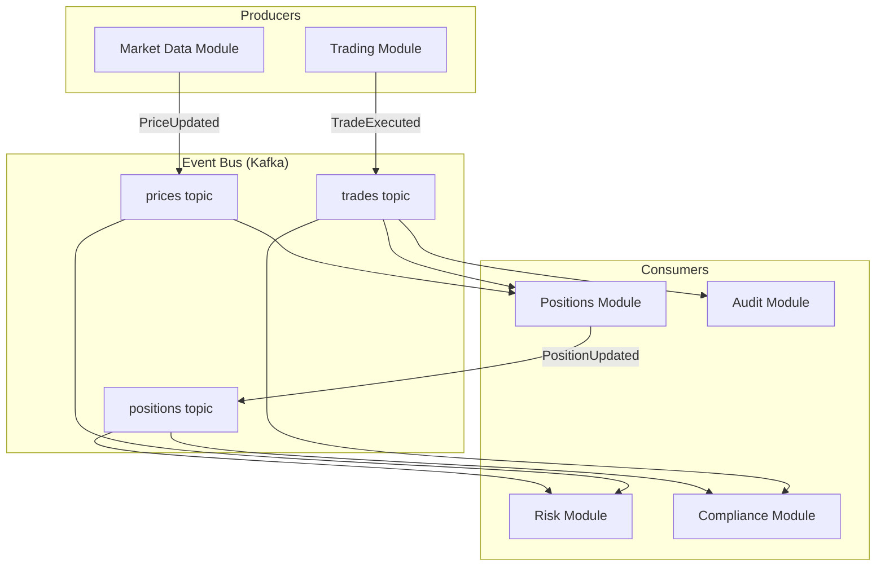

# Event-Driven Architecture

## Context & Problem

In a modular system, modules need to communicate. The naive approach is direct calls: module A calls module B, which calls module C. This creates temporal coupling (A must wait for B and C), knowledge coupling (A must know about B and C), and failure coupling (if C fails, A fails).

Event-driven architecture inverts this. Instead of telling other modules what to do, a module announces what happened. Other modules react to those announcements independently. The producer does not know or care who is listening.

This is especially critical in financial systems where:

- A single trade execution triggers updates across positions, risk, compliance, P&L, cash management, and audit
- These updates have different latency requirements and failure characteristics
- Adding a new consumer (e.g., a new reporting module) should not require changing the producer
- Every state change must be auditable

## Design Decisions

### Events vs. Commands

| | Event | Command |
|---|---|---|
| **Direction** | Broadcast (one-to-many) | Targeted (one-to-one) |
| **Naming** | Past tense: `TradeExecuted`, `PriceUpdated` | Imperative: `ExecuteTrade`, `UpdatePrice` |
| **Coupling** | Producer does not know consumers | Sender knows the receiver |
| **Failure semantics** | Consumer failure does not affect producer | Receiver failure may affect sender |
| **When to use** | State changes that others may care about | Direct requests to a specific module |

**Use events** for cross-module communication about things that happened. **Use commands** (direct calls via interfaces) for same-module operations or when you need a synchronous response.

### Event Types

**Domain Events** — something meaningful happened in the business domain:

```
TradeExecuted { trade_id, instrument, quantity, price, timestamp }
PositionUpdated { portfolio_id, instrument, new_quantity, timestamp }
ComplianceBreached { rule_id, portfolio_id, details, timestamp }
```

**Integration Events** — published to communicate across module boundaries. These may be a projection of domain events, simplified or enriched for external consumption.

**System Events** — infrastructure-level notifications (service started, health check failed). Keep these separate from domain events.

### Delivery Guarantees

| Guarantee | Meaning | Trade-off |
|---|---|---|
| **At-most-once** | Events may be lost, never duplicated | Simplest, lowest latency. Acceptable for non-critical metrics |
| **At-least-once** | Events are never lost, may be duplicated | Requires idempotent consumers. Default choice for most use cases |
| **Exactly-once** | Events are never lost and never duplicated | Highest complexity. Kafka supports this with transactional producers and consumers |

For financial systems, **at-least-once with idempotent consumers** is the pragmatic default. Exactly-once is used for critical paths like trade settlement where duplicates would cause real financial harm.

## Architecture

### The Event Bus as Central Nervous System



Each topic is an ordered, immutable log. Consumers read at their own pace, maintain their own offsets, and can replay from any point in history. Adding a new consumer (say, a new reporting module) requires zero changes to producers.

### In-Process vs. External Event Bus

In a modular monolith, you have a choice:

**In-process event bus** — events dispatched through an in-memory mediator within the same process:

- Zero serialization overhead
- Transactional consistency (event dispatch can be part of the DB transaction)
- No infrastructure dependency
- Cannot survive process restarts; no replay

**External event bus (Kafka)** — events published to an external broker:

- Survives process restarts
- Full replay capability (rebuild state from events)
- Decoupled consumer scaling
- Network overhead, serialization cost, operational complexity

**Recommendation:** Start with an in-process event bus for intra-module communication. Add Kafka when you need durability, replay, or when consumers have different throughput/latency profiles. In the modular monolith, both can coexist — critical events go to Kafka, lightweight internal events stay in-process.

### Event Schema Design

Events are contracts. Once published, changing them is as consequential as changing an API:

```python
# events.py — module's published events

from datetime import datetime
from decimal import Decimal
from pydantic import BaseModel


class TradeExecuted(BaseModel):
    """Immutable record of a trade execution."""
    event_id: str          # Unique, idempotency key
    event_type: str = "trade.executed"
    event_version: int = 1  # Schema version for evolution
    timestamp: datetime

    trade_id: str
    portfolio_id: str
    instrument_id: str
    side: str              # "buy" | "sell"
    quantity: Decimal
    price: Decimal
    currency: str
    venue: str
```

Key design rules:

1. Every event has a unique `event_id` — consumers use this for idempotency
2. Every event has an `event_version` — enables schema evolution without breaking consumers
3. Events carry enough data for consumers to act without calling back to the producer
4. Events are immutable — once published, they are never modified

### Schema Evolution

Schemas change. The rules for evolving event schemas without breaking consumers:

- **Adding a field** — always safe (new field with default value)
- **Removing a field** — dangerous (consumers may depend on it). Deprecate first, remove after all consumers have migrated
- **Renaming a field** — treat as add + remove
- **Changing a field's type** — almost always a breaking change. Create a new event version instead

Use Schema Registry (Avro or Protobuf) for Kafka-based events to enforce compatibility rules automatically.

## Event Handler Error Isolation

A single event topic often has multiple subscribers. A price update triggers both a database write and a mark-to-market recalculation. If the database write fails, should the mark-to-market be cancelled? Almost never — yet naive implementations (`asyncio.gather()` without error handling) do exactly this.

### The Problem

```python
# WRONG — one handler failure cancels all others
await asyncio.gather(*(h(event) for h in handlers))
```

If handler 2 raises, `asyncio.gather()` raises immediately, cancelling any handlers that haven't completed. The event is partially processed — some side effects happened, others didn't.

### The Solution: Isolate Each Handler

Each handler runs independently. A failure in one handler is logged and recorded but does not prevent other handlers from executing:

```python
async def publish(self, topic: str, event: BaseEvent) -> None:
    handlers = self._handlers.get(topic, [])
    results = await asyncio.gather(
        *(self._safe_invoke(h, event) for h in handlers),
        return_exceptions=True,
    )
    for handler, result in zip(handlers, results):
        if isinstance(result, Exception):
            logger.error(
                "event_handler_failed",
                topic=topic,
                handler=handler.__qualname__,
                event_id=event.event_id,
                error=str(result),
            )

async def _safe_invoke(
    self, handler: EventHandler, event: BaseEvent
) -> None:
    try:
        await handler(event)
    except Exception:
        raise  # Let gather collect it via return_exceptions=True
```

### Critical vs. Non-Critical Handlers

Not all handlers are equal. Recording a trade in the event store is critical — if that fails, the trade should not proceed. Updating a cache is not — the cache can be rebuilt.

Apply the [Error Kernel Pattern](error-handling-strategy.md) to event handlers:

| Handler Type | Failure Behavior | Example |
|---|---|---|
| **Critical** | Fail the entire operation, propagate to caller | Event store write, position update |
| **Non-critical** | Log error, continue, retry later | Cache warm, notification, audit enrichment |

The event bus should support handler priority or criticality annotations so that the publish path can distinguish between "this failure means the event was not processed" and "this failure is a degraded side effect."

### Dead Letter Handling (In-Process)

Even before Kafka, the in-process event bus should track failed handler invocations. Failed events should be retryable — either immediately (for transient infrastructure errors) or via a background sweep:

```python
@dataclass
class FailedEvent:
    topic: str
    event: BaseEvent
    handler: str
    error: str
    timestamp: datetime
    retry_count: int = 0
```

This provides observability into handler failures and a path to reprocessing without losing events. When migrating to Kafka, these become dead-letter queue entries.

## Event Ordering

### Within a Partition

Kafka guarantees ordering within a partition. Events for the same entity should go to the same partition:

```
Partition key: portfolio_id
→ All events for portfolio "FUND-A" land in the same partition
→ Consumer sees them in order: TradeExecuted → PositionUpdated → RiskRecalculated
```

### Across Partitions

No ordering guarantee. If event A on partition 0 must happen before event B on partition 1, you need either:

- Same partition key (forces co-location)
- Causal ordering in the consumer (check timestamps or sequence numbers)
- A saga/process manager that coordinates

## Failure Modes

| Failure | Cause | Mitigation |
|---|---|---|
| Consumer falls behind | Slow processing, consumer crash | Monitor consumer lag, auto-scale consumer group |
| Poison message | Malformed event crashes consumer | Dead letter queue, skip after N retries |
| Out-of-order processing | Partition rebalance, multi-partition topics | Idempotent consumers, event versioning |
| Event loss | Producer crash before Kafka ack | Transactional outbox pattern, acks=all |
| Schema mismatch | Producer publishes new schema, consumer expects old | Schema Registry with compatibility enforcement |
| Event storm | Burst of events overwhelms consumers | Backpressure, consumer rate limiting, separate topics by priority |

### The Transactional Outbox

The classic problem: you update the database and publish an event. If the DB commit succeeds but the event publish fails, the system is inconsistent.

The outbox pattern solves this:

1. Write the event to an `outbox` table in the same DB transaction as the state change
2. A separate process (or Kafka Connect with CDC) reads the outbox table and publishes to Kafka
3. The outbox row is marked as published

This guarantees that if the state changed, the event will eventually be published.

## Related Documents

- [CQRS & Event Sourcing](cqrs-event-sourcing.md) — storing state as a sequence of events
- [Kafka Topology](../patterns/messaging/kafka-topology.md) — implementing the event bus with Kafka
- [Dead Letter Queues](../patterns/messaging/dead-letter-queues.md) — handling poison messages
- [Exactly-Once Semantics](../patterns/messaging/exactly-once-semantics.md) — transactional Kafka
- [Idempotency](../patterns/resilience/idempotency.md) — safe event reprocessing
