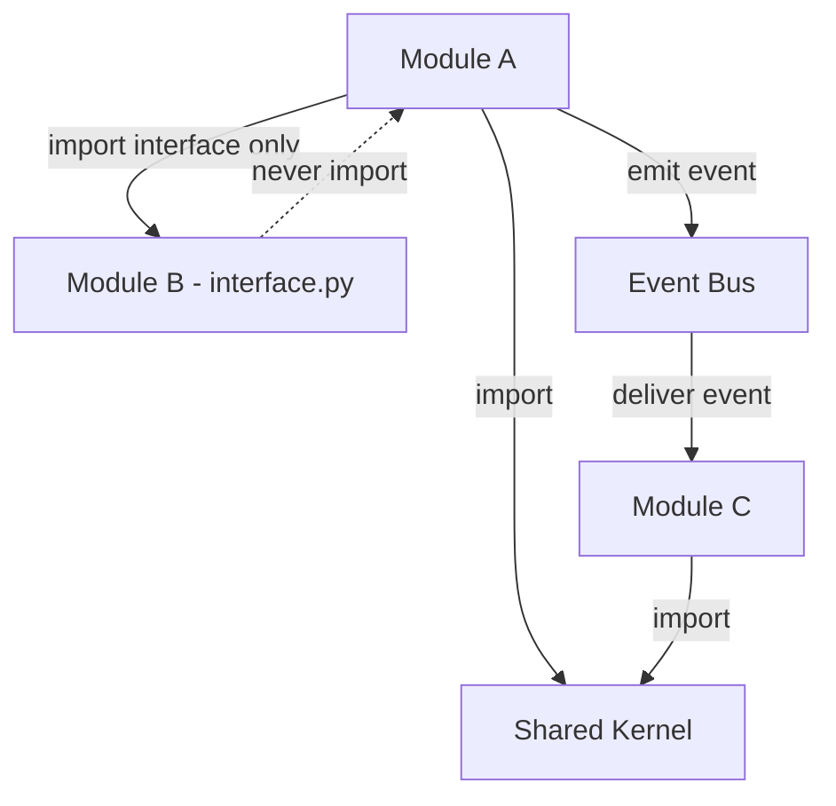

# Modular Monolith

## Context & Problem

Most systems start as monoliths. Most teams that jump straight to microservices regret it — they trade code complexity for operational complexity before they understand their domain well enough to draw service boundaries correctly.

The modular monolith is not a compromise. It is a deliberate architecture that gives you:

- **Single deployment unit** — one binary, one process, one deploy pipeline
- **Strong module boundaries** — enforced at build time, not just by convention
- **In-process communication** — no network serialization overhead between modules
- **An evolutionary path** — extract a module into a service when (and only when) there is a concrete reason to do so

The key insight: the hard part of microservices is not the infrastructure. It is drawing the right boundaries. A modular monolith forces you to get boundaries right first, in an environment where changing them is cheap.

## Design Decisions

### Why Not Microservices From Day One

| Concern | Monolith | Modular Monolith | Microservices |
|---|---|---|---|
| Boundary enforcement | None (convention only) | Static analysis (Tach) | Network + deploy isolation |
| Communication overhead | Function call | Function call | Network hop + serialization |
| Transaction boundaries | Single DB transaction | Single DB transaction | Distributed saga |
| Deployment complexity | Low | Low | High (per-service CI/CD) |
| Refactoring cost | Low | Low | Very high (API contracts) |
| Team scalability | Limited | Good (module ownership) | Best (full autonomy) |
| Operational overhead | Minimal | Minimal | Significant (observability, networking, orchestration) |

The modular monolith occupies the sweet spot for teams that need strong boundaries without the operational tax. You move to microservices when a specific module needs independent scaling, independent deployment cadence, or a different technology stack.

### When to Extract a Module Into a Service

Extract only when you have a concrete, present need — not a speculative future one:

1. **Independent scaling** — this module's resource profile is fundamentally different (e.g., a CPU-bound risk calculation engine vs. an IO-bound API layer)
2. **Independent deployment** — this module changes at a different cadence and its deploys should not require redeploying everything else
3. **Technology mismatch** — this module genuinely needs a different language or runtime (e.g., C++ for low-latency FIX engine)
4. **Fault isolation** — a crash in this module must not bring down the rest of the system
5. **Team autonomy** — a separate team owns this module and needs full control over its release cycle

If none of these apply, keep it in the monolith.

## Architecture

### Module Structure

Each module in the monolith is a self-contained package with explicit public and private boundaries:

```
app/
├── modules/
│   ├── market_data/
│   │   ├── __init__.py          # Public interface only
│   │   ├── interface.py         # Protocol definitions (the contract)
│   │   ├── service.py           # Implementation (private)
│   │   ├── models.py            # Domain models (private)
│   │   ├── repository.py        # Data access (private)
│   │   ├── events.py            # Events this module emits
│   │   └── routes.py            # API routes (if exposed)
│   ├── positions/
│   │   ├── __init__.py
│   │   ├── interface.py
│   │   ├── ...
│   └── risk/
│       ├── __init__.py
│       ├── interface.py
│       ├── ...
├── shared/
│   ├── events.py                # Base event types
│   ├── types.py                 # Shared value objects (Money, Quantity)
│   └── database.py              # Session factory, engine config
└── main.py                      # Composition root
```

### Module Communication Rules



**Rules:**

1. A module may only import another module's `interface.py` — never its internals
2. Circular dependencies between modules are forbidden
3. Modules communicate through direct calls (via interfaces) for queries and through events for state changes
4. The shared kernel is small and stable — it contains only types and utilities that genuinely belong to no single module (e.g., `Money`, `Timestamp`, base event classes)

### Dependency Direction

Dependencies flow inward toward the domain, never outward:

```
Routes → Service → Domain Models
                 → Repository (interface)
                 → Events (emitted)
```

Infrastructure (database sessions, Kafka producers, HTTP clients) is injected, never imported directly by the service layer.

## Boundary Enforcement

Convention-based boundaries erode over time. Enforcement must be automated and part of CI.

**Tach** is a Python tool that enforces module boundaries through static analysis. It reads a `tach.toml` configuration that declares what each module is allowed to depend on:

```toml
# tach.toml

[tool.tach]
root = "app"

[[tool.tach.modules]]
path = "modules.market_data"
depends_on = ["shared"]

[[tool.tach.modules]]
path = "modules.positions"
depends_on = ["shared", "modules.market_data"]

[[tool.tach.modules]]
path = "modules.risk"
depends_on = ["shared", "modules.positions", "modules.market_data"]

[[tool.tach.modules]]
path = "modules.compliance"
depends_on = ["shared", "modules.positions"]
```

Running `tach check` in CI will fail the build if any module imports something it is not allowed to depend on. This makes boundary violations visible and blocks them before they merge.

## The Evolutionary Path


The modular monolith is not a waypoint — it is a valid destination. Many systems never need to move beyond it. The architecture is successful if you *can* extract a module but *choose not to* because there is no reason to.

## Failure Modes

| Failure | Cause | Mitigation |
|---|---|---|
| Boundary erosion | Developers bypass module interfaces | Tach in CI, code review discipline |
| Shared kernel bloat | Convenience imports added to shared | Strict review, shared kernel must be small and stable |
| God module | One module grows to own too much | Periodic review of module size and cohesion |
| Premature extraction | Extracting a service before boundaries are stable | Require concrete justification for every extraction |
| Circular dependencies | Module A needs B needs A | Event-based decoupling, re-examine bounded contexts |

## Related Documents

- [Bounded Contexts](bounded-contexts.md) — how to draw module boundaries
- [Tach Enforcement](../patterns/modularity/tach-enforcement.md) — implementation details
- [Module Interfaces](../patterns/modularity/module-interfaces.md) — Protocol-based contracts
- [Shared Kernel](../patterns/modularity/shared-kernel.md) — what belongs in shared
