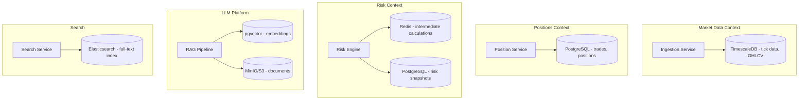

# Polyglot Persistence

## Context & Problem

No single database is optimal for all access patterns. A relational database that excels at transactional integrity is the wrong tool for storing millions of time-series data points per second. A time-series database optimized for append-heavy workloads is the wrong tool for enforcing complex business rules with foreign key constraints.

Polyglot persistence means choosing the right storage technology for each bounded context based on its actual data characteristics — not defaulting to one database for everything.

This is not about using many databases for the sake of variety. It is about recognizing that different modules have fundamentally different data profiles and picking storage accordingly.

## Design Decisions

### Storage Selection by Access Pattern

| Access Pattern | Characteristics | Good Fit | Bad Fit |
|---|---|---|---|
| **Transactional** | ACID, relationships, complex queries | PostgreSQL | Redis, S3 |
| **Time-series** | Append-heavy, range queries by time, downsampling | TimescaleDB, InfluxDB | Plain PostgreSQL (at scale) |
| **Document** | Schema-flexible, nested structures, read-heavy | MongoDB, PostgreSQL JSONB | Normalized relational |
| **Key-value** | High throughput, simple lookups, caching | Redis, DynamoDB | PostgreSQL |
| **Search** | Full-text, faceted, fuzzy matching | Elasticsearch, OpenSearch | PostgreSQL (at scale) |
| **Vector** | Similarity search, embeddings | pgvector, Pinecone, Qdrant | Any non-vector store |
| **Event log** | Append-only, ordered, replayable | Kafka (as storage), EventStoreDB | Any mutable store |
| **Blob/file** | Large objects, unstructured | S3, MinIO | Any database |

### Pragmatic Minimalism

More databases = more operational burden. The decision framework:

1. **Start with PostgreSQL** — it handles transactional data, JSONB documents, full-text search (good enough for most), and even time-series (via TimescaleDB extension) in one process
2. **Add a specialized store only when PostgreSQL measurably cannot meet the requirement** — "we expect 100K inserts/sec of tick data" is a concrete reason. "NoSQL is webscale" is not
3. **Each bounded context owns its storage choice** — the positions module uses PostgreSQL. The market data module uses TimescaleDB. They do not need to agree

### Where Different Stores Apply (Example)



## Data Consistency Across Stores

The fundamental tradeoff: if data lives in multiple stores, how do you keep them consistent?

### Approaches

**1. Single writer, event-driven propagation (preferred)**

Each piece of data has one authoritative source. Changes are published as events. Other stores consume events and update their local copy.

```
PostgreSQL (source of truth: trades)
  → publishes TradeExecuted event
    → TimescaleDB consumer updates time-series view
    → Elasticsearch consumer updates search index
    → Redis consumer updates cache
```

If a downstream store fails, it replays events to catch up. The source of truth is never ambiguous.

**2. Change Data Capture (CDC)**

Use Debezium or similar to capture row-level changes from the source database's write-ahead log and stream them to other stores. This avoids modifying application code — the database change is the event.

Best for: keeping a search index in sync with a relational database, or feeding a data lake from operational databases.

**3. Dual writes (avoid)**

Writing to two stores in application code (e.g., write to PostgreSQL then write to Redis) is fragile. If the second write fails, the stores diverge. If you add retry logic, you risk duplicates. This approach is almost always wrong.

### Consistency Expectations

| Relationship | Consistency | Acceptable Lag |
|---|---|---|
| Write model → Read model (same context) | Eventual | Milliseconds to low seconds |
| Source DB → Search index | Eventual | Seconds |
| Source DB → Cache | Eventual | Milliseconds (TTL-based) |
| Source DB → Analytics/warehouse | Eventual | Minutes to hours |
| Source DB → Audit log | Eventual but durable | Seconds, with guaranteed delivery |

## Local Development

Polyglot persistence should not make local development painful. Docker Compose provides all stores in a single command:

```yaml
# docker-compose.yml (excerpt)
services:
  postgres:
    image: timescale/timescaledb:latest-pg16
    # TimescaleDB extends PostgreSQL — one image covers both
    ports: ["5432:5432"]
    environment:
      POSTGRES_DB: app
      POSTGRES_USER: app
      POSTGRES_PASSWORD: dev

  redis:
    image: redis:7-alpine
    ports: ["6379:6379"]

  kafka:
    image: confluentinc/cp-kafka:7.6.0
    ports: ["9092:9092"]
    # ... broker config

  minio:
    image: minio/minio:latest
    ports: ["9000:9000"]
    command: server /data

  elasticsearch:
    image: elasticsearch:8.13.0
    ports: ["9200:9200"]
    environment:
      - discovery.type=single-node
      - xpack.security.enabled=false
```

Using TimescaleDB's image for PostgreSQL is a practical choice: it is a superset of PostgreSQL, so modules that need plain relational storage use the same instance. Modules that need time-series features enable the extension on their schema.

## Failure Modes

| Failure | Cause | Mitigation |
|---|---|---|
| Store unavailable | Network issue, resource exhaustion | Circuit breaker per store, graceful degradation |
| Replication lag | Consumer behind, slow downstream store | Monitor lag per store, alert on thresholds |
| Data divergence | Bug in event consumer, missed events | Reconciliation jobs, periodic full sync |
| Operational overload | Too many different databases to manage | Minimize store count, use managed services in production |
| Schema drift | Stores evolve independently | Schema registry for events, migration tooling per store |
| Local dev complexity | Too many containers to run | Docker Compose profiles, only start what you need |

## Related Documents

- [Bounded Contexts](bounded-contexts.md) — each context owns its storage choice
- [Event-Driven Architecture](event-driven-architecture.md) — propagating data between stores
- [TimescaleDB Hypertables](../patterns/data-access/timescaledb-hypertables.md) — time-series storage
- [SQLAlchemy Repository](../patterns/data-access/sqlalchemy-repository.md) — PostgreSQL access patterns
- [Change Data Capture](../patterns/data-processing/change-data-capture.md) — CDC with Debezium
