# Security-First Design

## Context & Problem

Security is not a feature you add after the system works. For financial systems, a security breach is existential — regulatory fines, loss of client assets, reputational destruction. Yet security is consistently treated as an afterthought: "we'll add authentication later," "we'll encrypt that field before launch," "we'll run a pen test before go-live."

The result is security that is bolted on rather than built in. Bolted-on security has gaps. An API endpoint that was "temporarily" left unauthenticated during development. A database column that stores PII in plaintext because encryption was deferred. A module that trusts input from another internal module because "it's all the same process."

A modular monolith adds a specific challenge: modules share a process, a runtime, and often a database server. The temptation is to treat inter-module communication as inherently trusted. But the internal boundary between "market data" and "order management" is still a trust boundary — a bug or compromise in one module should not automatically grant access to another module's data.

The question is: how do you design a system where security is a structural property of the architecture, not a checklist item applied at the end?

## Design Decisions

### Defense in Depth

No single security control is sufficient. Every layer assumes the layers above it have been compromised:

```mermaid
graph TD
    subgraph "Layer 1: Network"
        FW[Firewall / VPC] --> LB[Load Balancer + TLS Termination]
    end
    subgraph "Layer 2: Application"
        LB --> AUTH[Authentication + Authorization]
        AUTH --> VAL[Input Validation]
        VAL --> BL[Business Logic]
    end
    subgraph "Layer 3: Data"
        BL --> ENC[Encryption at Rest]
        ENC --> AUDIT[Audit Logging]
        AUDIT --> DB[(Database with Row-Level Security)]
    end
    
    style FW fill:#1a3a5c,stroke:#333
    style LB fill:#1a3a5c,stroke:#333
    style AUTH fill:#1a3a5c,stroke:#333
    style VAL fill:#1a3a5c,stroke:#333
    style BL fill:#1a3a5c,stroke:#333
    style ENC fill:#1a3a5c,stroke:#333
    style AUDIT fill:#1a3a5c,stroke:#333
    style DB fill:#1a3a5c,stroke:#333
```

If an attacker bypasses authentication (layer 2), they still face input validation, encrypted data at rest, and audit logs that record their actions. Each layer independently reduces the blast radius.

### Least Privilege

Every module, service account, and user gets the minimum access necessary to perform its function. No more.

- **Database access**: The market data module's service account can read and write to the `market_data` schema. It cannot access the `positions` or `compliance` schemas. This is enforced at the PostgreSQL role level, not just in application code.
- **API access**: A read-only API key for a reporting dashboard cannot trigger trades. This is enforced by the authorization layer, not by hoping the UI doesn't expose write endpoints.
- **Infrastructure access**: The application's AWS IAM role can read from its S3 bucket and write to its SQS queue. It cannot access other services' resources.
- **Secrets access**: Each module's deployment has access to only its own secrets in the vault. The market data module cannot read the order management module's API keys.

The principle extends to code: a module's public interface exposes only the operations that external callers need. Internal implementation details — repository methods, internal event handlers, helper functions — are not accessible from outside the module.

### Zero Trust Within the Monolith

Running in the same process does not mean trusting implicitly. When the risk module calls the positions module, the positions module should validate:

- **Who is calling** — the request context carries an authenticated identity (user or system actor), passed through the shared kernel. The positions module checks that this identity has permission to read positions for the requested portfolio.
- **What they are asking for** — even if the caller is authorized in general, they may not be authorized for this specific resource. A portfolio manager can read their own portfolio's positions, not another manager's.
- **That the input is well-formed** — defensive validation at every module boundary, even for internal calls.

This does not mean full OAuth between modules. It means the shared kernel provides a `RequestContext` that carries identity and authorization claims, and every module boundary checks them.

### Input Validation at Every Boundary

Every point where data enters the system — or crosses a module boundary — is a validation point:

| Boundary | What Enters | Validation |
|---|---|---|
| **API endpoint** | User-supplied JSON | Pydantic model with strict types, field constraints, regex patterns |
| **Kafka consumer** | Event payload | Schema Registry validation + application-level domain validation |
| **Database read** | Data from shared infrastructure | Defensive checks — data may have been corrupted by a bug, a migration, or a direct database edit |
| **Module interface** | Arguments from another module | Type checking via Protocols, Pydantic validation on DTOs |
| **Environment/config** | Configuration values | Validated at startup — fail fast if required config is missing or malformed |

The principle: never trust data you did not create in this exact code path. Data from a database is not inherently safe — it may have been written by an older version of the code with different validation rules.

### Secrets Management

Secrets have a lifecycle and a hierarchy of trust:

| Environment | Secrets Source | Acceptable |
|---|---|---|
| Local development | `.env` file (gitignored) or environment variables | Yes |
| CI/CD | Pipeline secrets (GitHub Actions secrets, GitLab CI variables) | Yes |
| Staging/Production | HashiCorp Vault, AWS Secrets Manager, or equivalent | Yes |
| Source code | Hardcoded in any file | Never |
| Docker images | Baked into the image | Never |

Secrets are rotated on a schedule. When a secret is rotated, the application must handle the transition gracefully — either by supporting multiple active secrets during rotation or by restarting cleanly when secrets change.

Pre-commit hooks (e.g., `detect-secrets`, `gitleaks`) scan for accidentally committed secrets. This is a safety net, not the primary control — the primary control is that secrets never exist in code to begin with.

### Audit Everything

Every state change, access decision, and authentication event produces an audit record. Audit records are immutable — once written, they cannot be modified or deleted by application code.

What to audit:

- **Authentication events**: login, logout, failed login, token refresh, MFA challenge
- **Authorization decisions**: access granted, access denied, privilege escalation
- **Data access**: who read what, when (especially for PII and financial data)
- **State changes**: every create, update, delete on domain entities — who, what, when, previous value
- **Administrative actions**: configuration changes, user management, role assignments

Audit logs are stored separately from application logs. They have a longer retention period (typically driven by regulatory requirements — 7 years for financial data in many jurisdictions) and stricter access controls.

### Data Classification

Not all data requires the same protection. Over-protecting everything is expensive and slows development. Under-protecting sensitive data is a breach waiting to happen.

| Classification | Examples | Storage | Access | Retention |
|---|---|---|---|---|
| **Public** | Market data (delayed), product descriptions | Standard | No restrictions | Standard |
| **Internal** | System metrics, application logs, configuration | Standard | Authenticated employees | 1-2 years |
| **Confidential** | Portfolio holdings, trade history, risk reports | Encrypted at rest | Role-based access, audit logged | 7+ years |
| **Restricted** | PII (names, addresses, SSNs), credentials, API keys | Encrypted at rest + application-level encryption | Need-to-know, audit logged, masked in logs | Regulatory-driven |

Application-level encryption for restricted data means the database administrator cannot read PII even with direct database access. The encryption keys are managed separately from the database credentials.

### Encryption

**In transit**: TLS 1.3 for all network communication. No exceptions, including internal service-to-service calls and database connections. Self-signed certificates are acceptable in development; production uses certificates from a trusted CA.

**At rest**: Database-level encryption (PostgreSQL's `pgcrypto` or cloud provider's encryption) for all data. Application-level encryption (using a KMS-backed key) for restricted fields — the database stores ciphertext that only the application can decrypt.

**Key management**: Encryption keys are never stored alongside the data they protect. AWS KMS, HashiCorp Vault's transit backend, or an equivalent service manages keys. Key rotation is automated.

### Dependency Security

Third-party dependencies are an attack surface. Every `pip install` is a trust decision.

- **Minimal dependencies**: prefer the standard library where it suffices. Every additional dependency is code you did not write, do not review, and must trust.
- **Pinned versions**: all dependencies are version-pinned in `requirements.txt` or `pyproject.toml`. No `>=` or `~=` in production.
- **Vulnerability scanning**: automated scanning (e.g., `safety`, `pip-audit`, Dependabot, Snyk) runs in CI. Known vulnerabilities block deployment.
- **Supply chain verification**: use hash-verified installs (`pip install --require-hashes`). Consider a private PyPI mirror for production dependencies.
- **License compliance**: automated license checking — some licenses are incompatible with proprietary financial software.

## Tradeoffs

| Tradeoff | Tension | Guidance |
|---|---|---|
| **Security vs. developer experience** | Vault-managed secrets, strict input validation, and zero-trust module boundaries slow down local development | Provide a streamlined local dev setup (`.env` files, relaxed validation in dev mode) but never let dev shortcuts reach production |
| **Security vs. performance** | Application-level encryption adds latency to every read/write of restricted fields. TLS adds overhead. Audit logging adds I/O. | Encrypt only what needs encrypting (data classification). Batch audit writes. Accept TLS overhead as non-negotiable. |
| **Security vs. simplicity** | Defense in depth means multiple layers doing overlapping checks | Each layer should be simple individually. The complexity is in the layering, not in any single layer. |
| **Dependency minimalism vs. productivity** | Fewer dependencies means more code written in-house | Accept well-maintained, widely-used libraries (FastAPI, SQLAlchemy, Pydantic). Be strict about niche or poorly-maintained packages. |

## Failure Modes

| Failure | Cause | Consequence | Mitigation |
|---|---|---|---|
| **Implicit trust between modules** | "It's all internal, we don't need auth checks" | A vulnerability in one module gives access to all modules' data | Zero-trust boundaries, RequestContext validation at every module interface |
| **Secrets in source control** | Developer commits `.env` or hardcoded key | Credential exposed in git history permanently | Pre-commit hooks (`detect-secrets`), git history scanning, immediate rotation if detected |
| **Stale dependencies** | Vulnerabilities discovered in pinned versions are never patched | Known CVE exploitable in production | Automated vulnerability scanning in CI, regular dependency update cadence |
| **Audit gaps** | Some state changes bypass the audit layer | Regulatory non-compliance, inability to investigate incidents | Audit logging in the domain layer (not the API layer), so all paths through the domain are captured |
| **Over-classification** | All data treated as restricted | Performance overhead, developer friction, encryption key management complexity | Data classification review — only classify as restricted what genuinely requires it |
| **Security theater** | Checks that look secure but don't actually prevent attacks (e.g., client-side validation only) | False confidence, actual vulnerabilities remain | Server-side enforcement for all security controls, penetration testing |

## Related Documents

- [Authentication MFA](../patterns/api/authentication-mfa.md) — multi-factor authentication implementation
- [Authorization RBAC](../patterns/api/authorization-rbac.md) — role-based access control at the API layer
- [OpenFGA Modeling](../patterns/authorization/openfga-modeling.md) — fine-grained authorization modeling
- [Policy as Code](../patterns/authorization/policy-as-code.md) — externalizing authorization decisions
- [Structured Logging](../patterns/observability/structured-logging.md) — audit trail implementation
- [Module Interfaces](../patterns/modularity/module-interfaces.md) — enforcing boundaries where security checks live
- [Bounded Contexts](bounded-contexts.md) — the architectural boundaries that security controls follow
