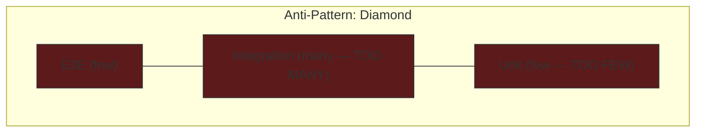

# Testing Philosophy

## Context & Problem

A modular monolith creates a testing paradox. Module boundaries give you natural test seams — you can test the positions module in isolation from the risk module. But the system's value comes from modules working together, and isolated tests cannot catch integration failures. A test suite that only tests modules individually will miss the bug where the positions module publishes an event with a field the risk module does not expect.

The opposite extreme is equally dangerous. A test suite dominated by end-to-end tests — spinning up the full application, hitting the API, and checking database state — is slow, flaky, and painful to maintain. When an end-to-end test fails, you spend more time debugging the test than the code.

The question is: what should you test at each level of the system, and how do you balance isolation (fast, deterministic, easy to debug) against realism (catches the bugs that actually happen in production)?

## Design Decisions

### The Testing Pyramid for a Modular Monolith

The classic testing pyramid applies, but with a twist: contract tests fill the gap between unit and integration tests that is especially wide in modular systems.

```mermaid
graph TD
    subgraph "Testing Pyramid"
        E2E["End-to-End Tests\n(few — 5-10% of suite)\nFull API through database"]
        CONTRACT["Contract Tests\n(moderate — 15-20%)\nModule interfaces, event schemas"]
        INTEGRATION["Integration Tests\n(moderate — 20-30%)\nModule + real infrastructure"]
        UNIT["Unit Tests\n(many — 50-60%)\nPure domain logic, no I/O"]
    end
    
    E2E --- CONTRACT
    CONTRACT --- INTEGRATION
    INTEGRATION --- UNIT
    
    style E2E fill:#5c1a1a,stroke:#333
    style CONTRACT fill:#4a3a1a,stroke:#333
    style INTEGRATION fill:#2d4a2d,stroke:#333
    style UNIT fill:#1a3a5c,stroke:#333
```



The width of each layer represents both quantity and speed. Unit tests are many and fast (milliseconds each). End-to-end tests are few and slow (seconds each). A healthy suite runs the full pyramid in under five minutes locally and under fifteen minutes in CI.

### What to Test at Each Level

#### Unit Tests: Pure Domain Logic

Unit tests cover the domain layer — aggregates, value objects, domain services, and calculation logic. No database, no Kafka, no HTTP, no filesystem.

**What belongs here:**
- Position aggregate: applying a trade updates quantity and average cost correctly
- VaR calculation: given a set of positions and a covariance matrix, produces the correct risk number
- Compliance rules: a trade that exceeds a concentration limit is rejected
- Value objects: Money arithmetic, date range overlap detection

**What does not belong here:**
- Repository implementations (those need a real database)
- Kafka consumers (those need real message deserialization)
- API request/response mapping (those need the HTTP framework)

The litmus test: if the test requires any `import` from `sqlalchemy`, `kafka`, `httpx`, or `fastapi`, it is not a unit test.

#### Integration Tests: Module + Real Infrastructure

Integration tests verify that a module works with its actual infrastructure dependencies. The key: use real infrastructure, not mocks.

**What belongs here:**
- Repository + real PostgreSQL (via testcontainers): does `save()` followed by `find()` return the same entity?
- Kafka consumer + real Kafka (via testcontainers): does consuming a serialized event produce the correct domain command?
- API endpoint + TestClient + real database: does `POST /trades` with valid input create a trade and return 201?

**Why real infrastructure matters:** a mock of `psycopg`'s connection pool cannot tell you that your SQL has a syntax error, that your index does not cover the query, or that a concurrent write causes a deadlock. A real PostgreSQL instance can.

#### Contract Tests: Module Interface Verification

Contract tests are the unique testing need of a modular system. They verify that modules honor their public interfaces — both the synchronous interfaces (Protocols) and the asynchronous ones (event schemas).

**Protocol compliance:**
- Every class that claims to implement `PositionRepository` (Protocol) actually has all the required methods with correct signatures
- The in-memory fake (`FakePositionRepository`) and the real implementation (`SQLAlchemyPositionRepository`) both pass the same contract test suite

**Event schema compatibility:**
- An event published by the positions module can be deserialized by the risk module's consumer
- Schema evolution (adding a field) does not break existing consumers

Contract tests are fast (no infrastructure required for Protocol checks) and catch the most insidious modular monolith bugs: interface drift between modules.

#### End-to-End Tests: Full System Verification

End-to-end tests run the complete application stack. They are expensive, slow, and valuable only for verifying that the full chain works — not for testing individual behaviors.

**Good end-to-end tests:**
- Submit a trade via the API, verify that the position updates, risk recalculates, and compliance checks run
- Ingest market data via a simulated feed, verify that positions are revalued

**Bad end-to-end tests:**
- Testing every validation error message through the API (use unit tests)
- Testing every query path through the API (use integration tests)

Keep end-to-end tests to critical user journeys — the 5-10 paths that, if broken, mean the system is fundamentally not working.

### Test Isolation

Every test must be independent. Running test A before test B should produce the same result as running test B alone. In practice:

**Database isolation**: Each test runs within a transaction that is rolled back after the test completes. The test sees its own data, and no residue is left for other tests. For tests that require committed transactions (testing concurrency, triggers, or event listeners), use a fresh database schema per test or test session.

**Kafka isolation**: Each test that touches Kafka uses a unique topic name (generated per test run). After the test, the topic is either deleted or abandoned (short retention). Tests never share topics.

**Time isolation**: Tests that depend on the current time inject a clock. `datetime.now()` in production code is a code smell — it makes tests non-deterministic. Instead:

```python
# domain/ports.py
class Clock(Protocol):
    def now(self) -> datetime: ...

# In production
class SystemClock:
    def now(self) -> datetime:
        return datetime.now(UTC)

# In tests
class FixedClock:
    def __init__(self, fixed_time: datetime):
        self._time = fixed_time
    
    def now(self) -> datetime:
        return self._time
```

### Fakes vs. Mocks

This is the single most impactful testing decision for a modular monolith.

**Mocks** (e.g., `unittest.mock.Mock(spec=PriceRepository)`) verify that specific methods were called with specific arguments. They test interaction — "did the service call `repository.save()` with this entity?"

**Fakes** (e.g., `FakePositionRepository` with an in-memory dictionary) implement the interface with real behavior. They test outcomes — "after calling the service, does the repository contain the expected position?"

```mermaid
graph LR
    subgraph "Mock-Based Test"
        SVC1[Service] -->|"calls"| M[Mock Repository]
        M -->|"assert_called_with(...)"| V1[Verify Interaction]
    end
    subgraph "Fake-Based Test"
        SVC2[Service] -->|"calls"| F[Fake Repository]
        F -->|"query state"| V2[Verify Outcome]
    end
    
    style SVC1 fill:#5c1a1a,stroke:#333
    style M fill:#5c1a1a,stroke:#333
    style V1 fill:#5c1a1a,stroke:#333
    style SVC2 fill:#1a3a5c,stroke:#333
    style F fill:#1a3a5c,stroke:#333
    style V2 fill:#1a3a5c,stroke:#333
```



**Prefer fakes.** Mock-based tests are tightly coupled to implementation. If the service refactors to call `repository.save_batch()` instead of `repository.save()`, every mock-based test breaks even though the behavior is identical. Fake-based tests survive this refactor because they verify the end state, not the call sequence.

Fakes also catch bugs that mocks cannot. A `FakePositionRepository` that enforces uniqueness constraints will catch a bug where the service accidentally creates duplicate positions. A mock will happily accept any call.

The cost: you must maintain fakes alongside real implementations. This cost is offset by contract tests — the same test suite runs against both the fake and the real implementation, ensuring they behave identically.

### Test Data: Factories Over Fixtures

Static fixtures (JSON files, YAML files, pre-populated database dumps) are brittle. They have implicit dependencies between tests ("this test assumes the fixture has exactly 3 positions"), and they rot as the schema evolves.

Fixture factories generate test data programmatically with sensible defaults and targeted overrides:

```python
# tests/factories.py
from positions.domain import Position
from decimal import Decimal
from datetime import datetime, UTC

def make_position(
    portfolio_id: str = "port-001",
    instrument_id: str = "AAPL",
    quantity: Decimal = Decimal("100"),
    average_cost: Decimal = Decimal("150.00"),
    as_of: datetime | None = None,
) -> Position:
    return Position(
        portfolio_id=portfolio_id,
        instrument_id=instrument_id,
        quantity=quantity,
        average_cost=average_cost,
        as_of=as_of or datetime.now(UTC),
    )
```

Each test specifies only the fields that matter to its scenario. A test about quantity calculations sets `quantity` and ignores `portfolio_id`. A test about multi-portfolio aggregation sets `portfolio_id` and uses the default quantity. The defaults are valid, consistent, and require no external files.

### The Testing Diamond Anti-Pattern

A common failure mode in modular systems: too many integration tests, not enough unit tests.



This happens when domain logic is entangled with infrastructure. If calculating a position's P&L requires a database query (because the calculation lives in the repository instead of the domain), you cannot unit test it — you need an integration test with a real database.

The fix is architectural, not testing: move logic into the domain layer where it can be unit tested. The repository fetches data; the domain model makes decisions. If your unit test count is low, your domain model is probably anemic.

## Failure Modes

| Failure | Cause | Consequence | Mitigation |
|---|---|---|---|
| **Slow test suite** | Too many integration/E2E tests, too few unit tests | Developers skip tests locally, CI becomes a bottleneck | Enforce the pyramid — track test counts per level, review new integration tests for unit-testable logic |
| **Flaky tests** | Shared state between tests, time-dependent logic, non-deterministic ordering | Tests pass locally, fail in CI (or vice versa), trust in the suite erodes | Transaction rollback isolation, fixed clocks, unique Kafka topics, no `ORDER BY` without assertion on order |
| **False confidence from mocks** | Mocking away the behavior you should be testing | Tests pass but production breaks because the mock doesn't match real behavior | Prefer fakes, run contract tests against both fakes and real implementations |
| **Interface drift** | Module A changes its Protocol, module B's tests still use the old interface | Tests pass for both modules independently, system breaks when integrated | Contract tests that verify all implementations of a Protocol, event schema compatibility tests |
| **Test data coupling** | Tests depend on specific rows in a shared fixture file | Adding a row for one test breaks another test's assertions | Fixture factories, each test creates its own data |
| **Testing implementation, not behavior** | Asserting on internal method calls rather than observable outcomes | Every refactor breaks tests, developers fear changing code | Review test assertions — they should check return values, state changes, and side effects, not call sequences |

## Related Documents

- [Integration Testing](../patterns/testing/integration-testing.md) — patterns for testing with real infrastructure
- [Contract Testing](../patterns/testing/contract-testing.md) — verifying module interface compliance
- [Fixture Factories](../patterns/testing/fixture-factories.md) — generating test data programmatically
- [Test Containers](../patterns/testing/test-containers.md) — real PostgreSQL and Kafka in tests
- [Dependency Inversion](dependency-inversion.md) — the architectural principle that enables testing with fakes
- [Module Interfaces](../patterns/modularity/module-interfaces.md) — the Protocol-based interfaces that contract tests verify
- [Bounded Contexts](bounded-contexts.md) — the module boundaries that define test seams
