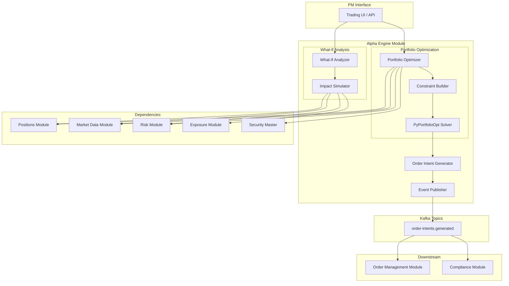
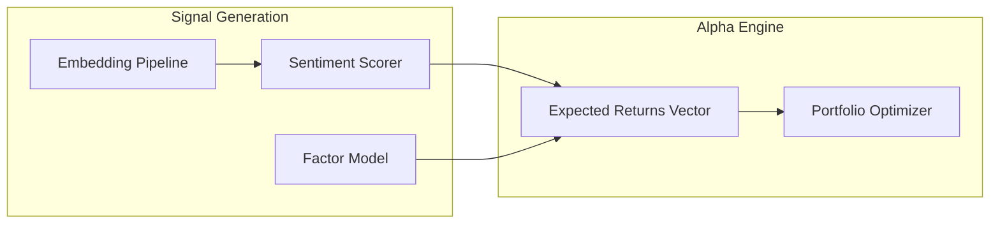

# Alpha Engine Module

## Context & Problem

A portfolio manager's job is two loops: generate ideas, then size them. The first loop asks "what if I bought X?" — simulate the impact on risk, exposure, and P&L before committing real capital. The second loop asks "given these ideas and constraints, what are the optimal weights?" — solve for a portfolio that maximizes expected return per unit of risk while respecting hard limits on position size, sector concentration, and target beta.

Today these loops are manual. PMs use spreadsheets to model what-if scenarios and argue with risk teams about constraint satisfaction. This module automates both: a what-if analyzer that projects the impact of hypothetical trades, and a portfolio optimizer that solves for optimal weights given constraints. The output is not trades — it is order intents that flow to the order management module for execution.

The separation matters. The alpha engine suggests; the OMS executes. This keeps the decision boundary clean and auditable.

## Domain Concepts

| Concept | Definition |
|---|---|
| **What-If Scenario** | A hypothetical set of position changes (add, remove, resize) evaluated against the current portfolio |
| **Scenario Impact** | The projected change in exposure, risk metrics, and P&L from a what-if scenario |
| **Portfolio Optimization** | Finding the set of position weights that maximizes a risk-adjusted return objective subject to constraints |
| **Constraint** | A hard or soft limit on the portfolio: max position size, sector cap, target beta, min/max exposure |
| **Order Intent** | A suggested trade generated by optimization — not yet an order, pending PM approval and compliance check |
| **Expected Return** | Forward-looking return estimate per instrument, provided by the PM or a quantitative model |
| **Risk Budget** | The amount of portfolio risk (variance, VaR) allocated to a position or sector |

## Architecture



## Design Decisions

### What-If as a Pure Function

The what-if analyzer does not mutate any state. It takes the current portfolio, applies hypothetical changes, and returns projected metrics. This makes it safe to call repeatedly, concurrently, and from automated systems. The PM can run 50 scenarios without any side effects.

### Optimization as a Constrained Solve, Not a Black Box

We use PyPortfolioOpt for the numerical optimization but wrap it with explicit constraint building. Constraints are first-class objects that the PM can inspect, modify, and understand. The optimizer is not a recommendation engine — it solves a well-defined mathematical problem with inputs the PM controls.

### Order Intents, Not Orders

The optimizer outputs order intents — suggestions that require PM approval before becoming real orders. This keeps humans in the loop and gives compliance a pre-trade check point. An intent becomes an order only after the PM confirms and compliance approves.

## Interface Contract

```python
# interface.py

from typing import Protocol
from datetime import datetime
from decimal import Decimal
from enum import StrEnum
from uuid import UUID

from pydantic import BaseModel, ConfigDict


# --- What-If Models ---

class ScenarioAction(StrEnum):
    ADD = "add"
    REMOVE = "remove"
    RESIZE = "resize"


class ScenarioPosition(BaseModel):
    model_config = ConfigDict(frozen=True)

    instrument_id: str
    action: ScenarioAction
    target_quantity: Decimal | None = None   # for ADD/RESIZE
    target_weight: Decimal | None = None     # alternative: specify as % of NAV


class ScenarioRequest(BaseModel):
    model_config = ConfigDict(frozen=True)

    portfolio_id: UUID
    positions: list[ScenarioPosition]
    label: str | None = None                 # PM's description of the scenario


class ExposureImpact(BaseModel):
    model_config = ConfigDict(frozen=True)

    gross_before: Decimal
    gross_after: Decimal
    gross_delta: Decimal
    net_before: Decimal
    net_after: Decimal
    net_delta: Decimal
    sector_shifts: dict[str, Decimal]        # sector → change in net exposure
    country_shifts: dict[str, Decimal]


class RiskImpact(BaseModel):
    model_config = ConfigDict(frozen=True)

    portfolio_beta_before: Decimal
    portfolio_beta_after: Decimal
    portfolio_volatility_before: Decimal
    portfolio_volatility_after: Decimal
    var_95_before: Decimal
    var_95_after: Decimal
    marginal_var_contribution: dict[str, Decimal]  # instrument_id → marginal VaR


class PnlImpact(BaseModel):
    model_config = ConfigDict(frozen=True)

    estimated_trade_cost: Decimal             # spread + commission estimate
    estimated_market_impact: Decimal           # slippage from trade size
    break_even_move: Decimal                   # price move needed to cover costs


class ScenarioResult(BaseModel):
    model_config = ConfigDict(frozen=True)

    request: ScenarioRequest
    exposure_impact: ExposureImpact
    risk_impact: RiskImpact
    pnl_impact: PnlImpact
    warnings: list[str]                       # e.g., "Exceeds 5% sector limit in Technology"
    timestamp: datetime


# --- Optimization Models ---

class OptimizationObjective(StrEnum):
    MAX_SHARPE = "max_sharpe"
    MIN_VOLATILITY = "min_volatility"
    MAX_RETURN = "max_return"
    RISK_PARITY = "risk_parity"


class PortfolioConstraints(BaseModel):
    model_config = ConfigDict(frozen=True)

    max_position_weight: Decimal = Decimal("0.10")       # 10% max in single name
    min_position_weight: Decimal = Decimal("0.005")      # 0.5% minimum if held
    max_sector_weight: Decimal = Decimal("0.30")         # 30% max in one sector
    max_country_weight: Decimal = Decimal("0.40")        # 40% max in one country
    target_beta: Decimal | None = None                    # e.g., 0.5 for low-beta
    beta_tolerance: Decimal = Decimal("0.05")
    max_gross_exposure: Decimal | None = None
    max_turnover: Decimal | None = None                   # limit trading as % of NAV
    long_only: bool = False


class OptimizationRequest(BaseModel):
    model_config = ConfigDict(frozen=True)

    portfolio_id: UUID
    universe: list[str]                                   # instrument_ids eligible
    expected_returns: dict[str, Decimal]                  # instrument_id → expected return
    objective: OptimizationObjective
    constraints: PortfolioConstraints


class OptimizedWeight(BaseModel):
    model_config = ConfigDict(frozen=True)

    instrument_id: str
    current_weight: Decimal
    target_weight: Decimal
    delta_weight: Decimal
    delta_shares: Decimal
    estimated_trade_value: Decimal


class OptimizationResult(BaseModel):
    model_config = ConfigDict(frozen=True)

    request_id: UUID
    portfolio_id: UUID
    objective: OptimizationObjective
    weights: list[OptimizedWeight]
    expected_return: Decimal
    expected_volatility: Decimal
    sharpe_ratio: Decimal
    timestamp: datetime


# --- Order Intent ---

class OrderSide(StrEnum):
    BUY = "buy"
    SELL = "sell"


class OrderIntent(BaseModel):
    model_config = ConfigDict(frozen=True)

    id: UUID
    portfolio_id: UUID
    instrument_id: str
    side: OrderSide
    quantity: Decimal
    estimated_price: Decimal
    estimated_value: Decimal
    source: str                               # "optimization" or "manual"
    optimization_request_id: UUID | None = None
    created_at: datetime


# --- Protocols ---

class WhatIfAnalyzer(Protocol):
    """Simulates hypothetical portfolio changes."""

    async def analyze(self, scenario: ScenarioRequest) -> ScenarioResult:
        """Run a what-if scenario against the current portfolio."""
        ...

    async def compare(
        self, scenarios: list[ScenarioRequest],
    ) -> list[ScenarioResult]:
        """Run multiple scenarios and return results for comparison."""
        ...


class PortfolioOptimizer(Protocol):
    """Solves for optimal portfolio weights given constraints."""

    async def optimize(self, request: OptimizationRequest) -> OptimizationResult:
        """Find optimal weights and return the result."""
        ...

    async def generate_intents(
        self, result: OptimizationResult,
    ) -> list[OrderIntent]:
        """Convert optimization result into order intents."""
        ...
```

## Code Skeleton

### What-If Analyzer

```python
# what_if.py

import asyncio
from datetime import datetime, timezone
from decimal import Decimal
from uuid import UUID

import structlog

from .interface import (
    ExposureImpact,
    PnlImpact,
    RiskImpact,
    ScenarioAction,
    ScenarioRequest,
    ScenarioResult,
)

logger = structlog.get_logger()


class WhatIfAnalyzerService:
    """Simulates portfolio changes without mutating state."""

    def __init__(
        self,
        position_reader: "PositionReader",
        market_data_reader: "MarketDataReader",
        exposure_reader: "ExposureReader",
        risk_reader: "RiskReader",
        cost_model: "TradeCostModel",
    ) -> None:
        self._positions = position_reader
        self._market_data = market_data_reader
        self._exposure = exposure_reader
        self._risk = risk_reader
        self._cost_model = cost_model

    async def analyze(self, scenario: ScenarioRequest) -> ScenarioResult:
        """Run a single what-if scenario."""
        # Fetch current state in parallel
        current_positions, current_exposure, current_risk = await asyncio.gather(
            self._positions.get_positions(scenario.portfolio_id),
            self._exposure.get_current_exposure(scenario.portfolio_id),
            self._risk.get_current_risk(scenario.portfolio_id),
        )

        # Build hypothetical position set
        hypothetical = {p.instrument_id: p.quantity for p in current_positions}
        trades: dict[str, Decimal] = {}

        for sp in scenario.positions:
            current_qty = hypothetical.get(sp.instrument_id, Decimal("0"))

            if sp.action == ScenarioAction.REMOVE:
                trades[sp.instrument_id] = -current_qty
                hypothetical.pop(sp.instrument_id, None)
            elif sp.action == ScenarioAction.ADD and sp.target_quantity is not None:
                trades[sp.instrument_id] = sp.target_quantity - current_qty
                hypothetical[sp.instrument_id] = sp.target_quantity
            elif sp.action == ScenarioAction.RESIZE and sp.target_quantity is not None:
                trades[sp.instrument_id] = sp.target_quantity - current_qty
                hypothetical[sp.instrument_id] = sp.target_quantity

        # Price hypothetical positions
        prices = {}
        for inst_id in hypothetical:
            snapshot = await self._market_data.get_latest_price(inst_id)
            prices[inst_id] = snapshot.mid

        # Calculate hypothetical exposure
        hyp_gross = sum(abs(qty * prices.get(iid, Decimal("0"))) for iid, qty in hypothetical.items())
        hyp_net = sum(qty * prices.get(iid, Decimal("0")) for iid, qty in hypothetical.items())

        exposure_impact = ExposureImpact(
            gross_before=current_exposure.total_gross,
            gross_after=hyp_gross,
            gross_delta=hyp_gross - current_exposure.total_gross,
            net_before=current_exposure.total_net,
            net_after=hyp_net,
            net_delta=hyp_net - current_exposure.total_net,
            sector_shifts={},   # populated by dimensional analysis
            country_shifts={},
        )

        # Estimate trade costs
        total_trade_value = sum(
            abs(qty * prices.get(iid, Decimal("0")))
            for iid, qty in trades.items()
        )
        pnl_impact = self._cost_model.estimate(trades, prices)

        # Generate warnings
        warnings = self._check_warnings(hypothetical, prices, hyp_gross)

        return ScenarioResult(
            request=scenario,
            exposure_impact=exposure_impact,
            risk_impact=await self._estimate_risk_impact(current_risk, hypothetical, prices),
            pnl_impact=pnl_impact,
            warnings=warnings,
            timestamp=datetime.now(timezone.utc),
        )

    async def compare(self, scenarios: list[ScenarioRequest]) -> list[ScenarioResult]:
        """Run multiple scenarios concurrently for comparison."""
        return list(await asyncio.gather(*[self.analyze(s) for s in scenarios]))

    def _check_warnings(
        self,
        positions: dict[str, Decimal],
        prices: dict[str, Decimal],
        total_gross: Decimal,
    ) -> list[str]:
        warnings = []
        if total_gross == Decimal("0"):
            return warnings

        for inst_id, qty in positions.items():
            weight = abs(qty * prices.get(inst_id, Decimal("0"))) / total_gross
            if weight > Decimal("0.10"):
                warnings.append(
                    f"Position {inst_id} would be {weight:.1%} of gross — exceeds 10% concentration"
                )
        return warnings

    async def _estimate_risk_impact(
        self,
        current_risk: "PortfolioRisk",
        hypothetical: dict[str, Decimal],
        prices: dict[str, Decimal],
    ) -> RiskImpact:
        """Estimate risk changes. Delegates to risk module for heavy computation."""
        projected = await self._risk.project_risk(hypothetical, prices)
        return RiskImpact(
            portfolio_beta_before=current_risk.beta,
            portfolio_beta_after=projected.beta,
            portfolio_volatility_before=current_risk.volatility,
            portfolio_volatility_after=projected.volatility,
            var_95_before=current_risk.var_95,
            var_95_after=projected.var_95,
            marginal_var_contribution=projected.marginal_var,
        )
```

### Portfolio Optimizer

```python
# optimizer.py

from datetime import datetime, timezone
from decimal import Decimal
from uuid import UUID, uuid4

import numpy as np
import structlog
from pypfopt import EfficientFrontier, risk_models, expected_returns

from .interface import (
    OptimizationObjective,
    OptimizationRequest,
    OptimizationResult,
    OptimizedWeight,
    OrderIntent,
    OrderSide,
)

logger = structlog.get_logger()


class PortfolioOptimizerService:
    """Wraps PyPortfolioOpt with domain-specific constraint building."""

    def __init__(
        self,
        position_reader: "PositionReader",
        market_data_reader: "MarketDataReader",
        event_publisher: "EventPublisher",
    ) -> None:
        self._positions = position_reader
        self._market_data = market_data_reader
        self._publisher = event_publisher

    async def optimize(self, request: OptimizationRequest) -> OptimizationResult:
        """Solve for optimal portfolio weights."""
        # Fetch historical prices for covariance estimation
        price_history = await self._fetch_price_matrix(request.universe)

        # Build expected returns vector from PM inputs
        mu = np.array([
            float(request.expected_returns.get(inst, Decimal("0")))
            for inst in request.universe
        ])

        # Estimate covariance matrix from historical prices
        cov_matrix = risk_models.sample_cov(price_history)

        # Build optimizer with constraints
        ef = EfficientFrontier(
            expected_returns=mu,
            cov_matrix=cov_matrix,
            weight_bounds=(
                float(request.constraints.min_position_weight) if not request.constraints.long_only else 0.0,
                float(request.constraints.max_position_weight),
            ),
        )

        # Apply sector constraints if instrument metadata is available
        # (sector mapper would group instruments by sector)

        # Solve based on objective
        if request.objective == OptimizationObjective.MAX_SHARPE:
            weights = ef.max_sharpe()
        elif request.objective == OptimizationObjective.MIN_VOLATILITY:
            weights = ef.min_volatility()
        elif request.objective == OptimizationObjective.MAX_RETURN:
            weights = ef.max_sharpe()  # constrained max return
        elif request.objective == OptimizationObjective.RISK_PARITY:
            # PyPortfolioOpt doesn't have built-in risk parity on EfficientFrontier
            # Use HRPOpt or custom implementation
            from pypfopt import HRPOpt
            hrp = HRPOpt(returns=price_history.pct_change().dropna())
            weights = hrp.optimize()
        else:
            raise ValueError(f"Unknown objective: {request.objective}")

        cleaned_weights = ef.clean_weights() if request.objective != OptimizationObjective.RISK_PARITY else weights
        perf = ef.portfolio_performance() if request.objective != OptimizationObjective.RISK_PARITY else (0, 0, 0)

        # Get current weights for delta calculation
        current_positions = await self._positions.get_positions(request.portfolio_id)
        current_weights = {p.instrument_id: p.weight for p in current_positions}

        optimized_weights = []
        for i, inst_id in enumerate(request.universe):
            target_w = Decimal(str(cleaned_weights.get(inst_id, cleaned_weights.get(i, 0))))
            current_w = current_weights.get(inst_id, Decimal("0"))
            delta_w = target_w - current_w

            latest_price = await self._market_data.get_latest_price(inst_id)
            nav = await self._positions.get_nav(request.portfolio_id)
            delta_value = delta_w * nav
            delta_shares = (delta_value / latest_price.mid).quantize(Decimal("1"))

            optimized_weights.append(OptimizedWeight(
                instrument_id=inst_id,
                current_weight=current_w,
                target_weight=target_w,
                delta_weight=delta_w,
                delta_shares=delta_shares,
                estimated_trade_value=abs(delta_value),
            ))

        return OptimizationResult(
            request_id=uuid4(),
            portfolio_id=request.portfolio_id,
            objective=request.objective,
            weights=optimized_weights,
            expected_return=Decimal(str(perf[0])),
            expected_volatility=Decimal(str(perf[1])),
            sharpe_ratio=Decimal(str(perf[2])),
            timestamp=datetime.now(timezone.utc),
        )

    async def generate_intents(
        self, result: OptimizationResult,
    ) -> list[OrderIntent]:
        """Convert optimization result into order intents and publish them."""
        intents = []

        for w in result.weights:
            if w.delta_shares == Decimal("0"):
                continue

            intent = OrderIntent(
                id=uuid4(),
                portfolio_id=result.portfolio_id,
                instrument_id=w.instrument_id,
                side=OrderSide.BUY if w.delta_shares > 0 else OrderSide.SELL,
                quantity=abs(w.delta_shares),
                estimated_price=(w.estimated_trade_value / abs(w.delta_shares)
                                 if w.delta_shares != Decimal("0") else Decimal("0")),
                estimated_value=w.estimated_trade_value,
                source="optimization",
                optimization_request_id=result.request_id,
                created_at=datetime.now(timezone.utc),
            )
            intents.append(intent)

        # Publish all intents as a batch event
        if intents:
            await self._publisher.publish(
                topic="order-intents.generated",
                key=str(result.portfolio_id),
                event={
                    "event_type": "order_intents.generated",
                    "portfolio_id": str(result.portfolio_id),
                    "optimization_request_id": str(result.request_id),
                    "objective": result.objective,
                    "intent_count": len(intents),
                    "intents": [intent.model_dump(mode="json") for intent in intents],
                    "timestamp": datetime.now(timezone.utc).isoformat(),
                },
            )

            logger.info(
                "order_intents_generated",
                portfolio_id=str(result.portfolio_id),
                count=len(intents),
                objective=result.objective,
            )

        return intents

    async def _fetch_price_matrix(self, instrument_ids: list[str]) -> "pd.DataFrame":
        """Fetch historical closing prices and return as a DataFrame for covariance estimation."""
        import pandas as pd
        from datetime import timedelta

        end = datetime.now(timezone.utc)
        start = end - timedelta(days=252)  # 1 year of trading days

        frames = {}
        for inst_id in instrument_ids:
            bars = await self._market_data.get_ohlcv(inst_id, "1d", start, end)
            frames[inst_id] = {bar.timestamp: float(bar.close) for bar in bars}

        return pd.DataFrame(frames).sort_index().ffill().dropna()
```

### Trade Cost Model

```python
# cost_model.py

from decimal import Decimal

from .interface import PnlImpact


class TradeCostModel:
    """Estimates transaction costs for hypothetical trades."""

    def __init__(
        self,
        commission_bps: Decimal = Decimal("5"),        # 5bps commission
        spread_bps: Decimal = Decimal("3"),             # 3bps half-spread
        impact_coefficient: Decimal = Decimal("0.1"),   # market impact scaling
    ) -> None:
        self._commission_bps = commission_bps
        self._spread_bps = spread_bps
        self._impact_coefficient = impact_coefficient

    def estimate(
        self,
        trades: dict[str, Decimal],   # instrument_id → signed quantity
        prices: dict[str, Decimal],
    ) -> PnlImpact:
        total_value = Decimal("0")
        total_commission = Decimal("0")
        total_impact = Decimal("0")

        for inst_id, qty in trades.items():
            price = prices.get(inst_id, Decimal("0"))
            trade_value = abs(qty * price)
            total_value += trade_value

            # Commission: flat bps on notional
            total_commission += trade_value * self._commission_bps / Decimal("10000")

            # Spread cost: half-spread on notional
            spread_cost = trade_value * self._spread_bps / Decimal("10000")

            # Market impact: sqrt model — impact proportional to sqrt(participation rate)
            # Simplified: impact_coefficient * sqrt(trade_value / 1_000_000)
            if trade_value > 0:
                import math
                participation = float(trade_value) / 1_000_000
                impact = self._impact_coefficient * Decimal(str(math.sqrt(participation)))
                total_impact += trade_value * impact / Decimal("100")

            total_commission += spread_cost

        total_cost = total_commission + total_impact
        break_even = (total_cost / total_value * Decimal("100")) if total_value > 0 else Decimal("0")

        return PnlImpact(
            estimated_trade_cost=total_commission,
            estimated_market_impact=total_impact,
            break_even_move=break_even,
        )
```

## Data Model

```sql
CREATE SCHEMA IF NOT EXISTS alpha;

-- What-if scenario runs (audit trail)
CREATE TABLE alpha.scenario_runs (
    id              UUID PRIMARY KEY DEFAULT gen_random_uuid(),
    portfolio_id    UUID            NOT NULL,
    label           VARCHAR(255),
    request_json    JSONB           NOT NULL,
    result_json     JSONB           NOT NULL,
    created_by      VARCHAR(64)     NOT NULL,
    created_at      TIMESTAMPTZ     NOT NULL DEFAULT NOW()
);

CREATE INDEX ix_scenario_runs_portfolio ON alpha.scenario_runs (portfolio_id, created_at DESC);

-- Optimization runs
CREATE TABLE alpha.optimization_runs (
    id                  UUID PRIMARY KEY DEFAULT gen_random_uuid(),
    portfolio_id        UUID            NOT NULL,
    objective           VARCHAR(32)     NOT NULL,
    constraints_json    JSONB           NOT NULL,
    universe            TEXT[]          NOT NULL,
    expected_return     NUMERIC(10,6),
    expected_volatility NUMERIC(10,6),
    sharpe_ratio        NUMERIC(10,6),
    weight_count        INTEGER         NOT NULL,
    created_by          VARCHAR(64)     NOT NULL,
    created_at          TIMESTAMPTZ     NOT NULL DEFAULT NOW()
);

CREATE INDEX ix_optimization_runs_portfolio ON alpha.optimization_runs (portfolio_id, created_at DESC);

-- Optimized weights per run
CREATE TABLE alpha.optimization_weights (
    id                  UUID PRIMARY KEY DEFAULT gen_random_uuid(),
    optimization_run_id UUID            NOT NULL REFERENCES alpha.optimization_runs(id) ON DELETE CASCADE,
    instrument_id       VARCHAR(32)     NOT NULL,
    current_weight      NUMERIC(10,6)   NOT NULL,
    target_weight       NUMERIC(10,6)   NOT NULL,
    delta_weight        NUMERIC(10,6)   NOT NULL,
    delta_shares        NUMERIC(18,2)   NOT NULL,
    estimated_trade_value NUMERIC(18,2) NOT NULL
);

CREATE INDEX ix_opt_weights_run ON alpha.optimization_weights (optimization_run_id);

-- Order intents generated
CREATE TABLE alpha.order_intents (
    id                      UUID PRIMARY KEY DEFAULT gen_random_uuid(),
    portfolio_id            UUID            NOT NULL,
    instrument_id           VARCHAR(32)     NOT NULL,
    side                    VARCHAR(4)      NOT NULL,  -- 'buy' or 'sell'
    quantity                NUMERIC(18,6)   NOT NULL,
    estimated_price         NUMERIC(18,8)   NOT NULL,
    estimated_value         NUMERIC(18,2)   NOT NULL,
    source                  VARCHAR(32)     NOT NULL,  -- 'optimization' or 'manual'
    optimization_request_id UUID,
    status                  VARCHAR(16)     NOT NULL DEFAULT 'pending',  -- pending, approved, rejected, expired
    created_at              TIMESTAMPTZ     NOT NULL DEFAULT NOW(),
    resolved_at             TIMESTAMPTZ
);

CREATE INDEX ix_order_intents_portfolio ON alpha.order_intents (portfolio_id, created_at DESC);
CREATE INDEX ix_order_intents_status ON alpha.order_intents (status) WHERE status = 'pending';
```

## Kafka Events Published

| Topic | Key | Event | Payload | Consumers |
|---|---|---|---|---|
| `order-intents.generated` | `portfolio_id` | `order_intents.generated` | List of order intents with quantities, sides, estimated prices | Order Management, Compliance |

## Patterns Used

| Pattern | Document |
|---|---|
| Protocol-based module interfaces | [Module Interfaces](../../patterns/modularity/module-interfaces.md) |
| CQRS — read models for what-if, write side for intents | [CQRS & Event Sourcing](../../principles/cqrs-event-sourcing.md) |
| Dependency inversion on external modules | [Dependency Inversion](../../principles/dependency-inversion.md) |
| Event publishing for downstream flow | [Event-Driven Architecture](../../principles/event-driven-architecture.md) |
| Idempotent intent generation | [Idempotency](../../patterns/resilience/idempotency.md) |
| Structured logging for audit | [Structured Logging](../../patterns/observability/structured-logging.md) |
| Contract-first API design | [Contract-First Design](../../principles/contract-first-design.md) |

## Failure Modes

| Failure | Cause | Impact | Mitigation |
|---|---|---|---|
| Stale prices during optimization | Market data feed lag | Optimization produces weights based on outdated prices, leading to suboptimal trades | Check price staleness before optimization, reject if any price > 5 min old |
| Covariance estimation fails | Insufficient historical data for new instruments | Optimizer cannot solve | Fall back to sector-average covariance, warn PM, exclude instrument from universe |
| Infeasible optimization | Constraints are contradictory (e.g., target beta + sector limits impossible) | No solution returned | Return infeasibility report with binding constraints, suggest relaxations |
| Large delta between current and optimal | Optimizer suggests massive rebalance | Excessive trading costs, market impact | Apply turnover constraint, present cost estimate before PM confirms |
| Intent duplication | PM runs optimizer twice before first batch executes | Double order intents sent to OMS | Idempotency key on (portfolio_id, optimization_request_id, instrument_id), OMS deduplicates |
| Risk module unavailable | Network or service failure | What-if analysis returns without risk impact | Graceful degradation — return exposure and P&L impact, mark risk as unavailable |

## Performance Profile

| Metric | Target |
|---|---|
| What-if analysis (single scenario, 200 positions) | < 500ms |
| What-if comparison (5 scenarios in parallel) | < 1s |
| Portfolio optimization (100 instruments) | < 2s |
| Portfolio optimization (500 instruments) | < 10s |
| Order intent generation + publish | < 200ms |
| Historical price matrix fetch (1 year, 100 instruments) | < 3s (cached: < 200ms) |

## Dependencies

```
alpha-engine
  ├── depends on: positions (current holdings, NAV, weights)
  ├── depends on: market-data-ingestion (prices, historical OHLCV for covariance)
  ├── depends on: risk (current risk metrics, projected risk for what-if)
  ├── depends on: exposure-calculation (current exposure for what-if)
  ├── depends on: security-master (instrument metadata for constraints)
  ├── depends on: shared kernel (types, events)
  ├── publishes: order-intents.generated
  └── consumed by: order-management, compliance
```

## AI/ML Integration Path (Phase 5)

The alpha engine is the natural integration point for ML-driven investment signals. The architecture intentionally separates "expected returns" from "optimization" — the optimizer takes return estimates as input, regardless of whether a human PM or an ML model produced them.

### Signal Sources

| Signal Type | Pattern | Integration Point |
|---|---|---|
| **Sentiment scoring** | [Embedding Pipelines](../../patterns/ai-ml/embedding-pipelines.md) | News/filing embeddings → sentiment score per instrument → expected return adjustment |
| **Return prediction** | [Model Serving](../../patterns/ai-ml/model-serving.md) | ML model (gradient boosting, LSTM) predicts forward returns → feeds into optimizer as `expected_returns` vector |
| **Research summarization** | [RAG Architecture](../../patterns/ai-ml/rag-architecture.md) | PM asks "what's the bull case for AAPL?" → retrieval over earnings transcripts, analyst reports → LLM synthesis |
| **Constraint suggestion** | [LLM Gateway](../../patterns/ai-ml/llm-gateway.md) | PM describes intent in natural language → LLM maps to formal constraints (sector limits, beta targets) |

### Architecture Extension



### Design Principles for ML Integration

1. **Models are advisory, not authoritative.** ML-generated expected returns feed into the same optimizer as PM-supplied views. The PM always has override authority. Order intents still require approval before execution.

2. **Model outputs are logged as events.** Every signal (sentiment score, predicted return) is published as an event with a model version, input features hash, and confidence interval. This enables backtesting and audit ("why did the system suggest buying TSLA on March 5th?").

3. **Feature store separation.** Raw features (price history, fundamentals, embeddings) live in a [Feature Store](../../data-strategies/feature-stores.md) — a read-optimized store separate from the transactional database. The alpha engine reads features; it does not own them.

4. **Graceful absence.** The alpha engine must function without any ML models deployed. ML integration is additive — the optimizer works with PM-supplied return estimates, model-generated estimates, or a blend. No ML dependency on the critical path.

## Related Documents

- [Market Data Ingestion](market-data-ingestion.md) — source of prices and historical data for covariance estimation
- [Exposure Calculation](exposure-calculation.md) — current exposure used in what-if analysis
- [Compliance Guardian](compliance-guardian.md) — pre-trade checks on order intents before execution
- [Security Master](security-master.md) — instrument metadata for sector/country constraints
- [Embedding Pipelines](../../patterns/ai-ml/embedding-pipelines.md) — text-to-vector for sentiment and research
- [Model Serving](../../patterns/ai-ml/model-serving.md) — inference infrastructure for return prediction models
- [RAG Architecture](../../patterns/ai-ml/rag-architecture.md) — retrieval-augmented generation for PM research queries
- [LLM Gateway](../../patterns/ai-ml/llm-gateway.md) — structured access to LLMs for natural-language constraint mapping
- [Feature Stores](../../data-strategies/feature-stores.md) — read-optimized feature storage for model training and inference
